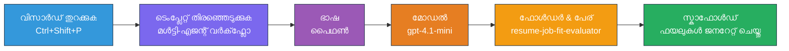
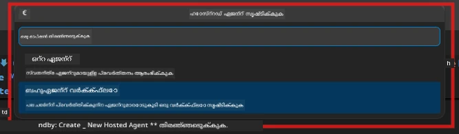

# Module 2 - ബഹുഎജന്റ് പ്രോജക്റ്റ് സ്കാഫോൾഡ് ചെയ്യുക

ഈ മോഡ്യൂളിൽ, നിങ്ങൾ [Microsoft Foundry എൻ‌സ്റ്റഷൻ](https://marketplace.visualstudio.com/items?itemName=TeamsDevApp.vscode-ai-foundry) ഉപയോഗിച്ച് **ബഹുഎജന്റ് വർക്ക്‌ഫ്ലോ പ്രോജക്റ്റ് സ്കാഫോൾഡ് ചെയ്യുന്നു**. ഈ എൻ‌സ്റ്റഷൻ പൂർണ്ണമായ പ്രോജക്റ്റ് ഘടന രൂപപ്പെടുത്തും - `agent.yaml`, `main.py`, `Dockerfile`, `requirements.txt`, `.env`, ഡിബഗ് കോൺഫിഗറേഷൻ എന്നിവ. തുടർന്ന്, മോഡ്യൂളുകൾ 3, 4-ൽ ഈ ഫയലുകൾ ക്രമീകരിക്കും.

> **കുറിപ്പ്:** ഈ ലാബിലെ `PersonalCareerCopilot/` ഫോൾഡർ ഒരു പൂർത്തിയായ, കസ്റ്റമൈസ് ചെയ്ത ബഹുഎജന്റ് പ്രോജക്റ്റിന്റെ പ്രവർത്തിക്കുന്ന ഉദാഹരണമാണ്. നിങ്ങളെ പഠനത്തിനായി പുതിയ പ്രോജക്റ്റ് സ്കാഫോൾഡ് ചെയ്യാം (അറിയുന്നതിനായി ശുപാർശചെയ്യുന്നു) അല്ലെങ്കിൽ നിലവിലുള്ള കോഡ് നേരിട്ട് പഠിക്കാം.

---

## ഘട്ടം 1: Create Hosted Agent വിസാർഡ് തുറക്കുക


1. `Ctrl+Shift+P` അമർത്തി **Command Palette** തുറക്കുക.
2. ടൈപ്പ് ചെയ്യുക: **Microsoft Foundry: Create a New Hosted Agent** തിരഞ്ഞെടുക്കുക.
3. ഹോസ്റ്റഡ് ഏജന്റ് സൃഷ്ടി വിസാർഡ് തുറക്കും.

> **പകരം:** Activity Bar-ൽ **Microsoft Foundry** ഐക്കൺ ക്ലിക്ക് ചെയ്ത് → **Agents** ഓടെ + ഐക്കൺ ക്ലിക്ക് ചെയ്ത് → **Create New Hosted Agent** തിരഞ്ഞെടുക്കുക.

---

## ഘട്ടം 2: Multi-Agent Workflow ടെംപ്ലേറ്റ് തിരഞ്ഞെടുക്കുക

വിസാർഡ് നിങ്ങൾക്ക് ഒരു ടെംപ്ലേറ്റ് തിരഞ്ഞെടുക്കാൻ പറയുന്നു:

| ടെംപ്ലേറ്റ് | വിവരണം | ഉപയോഗിക്കേണ്ടപ്പോൾ |
|----------|-------------|-------------|
| സിംഗിൾ ഏജന്റ് | നിർദ്ദേശങ്ങളോടുകൂടിയ ഒറ്റ ഏജന്റ് കൂടാതെ നിർമ്മിത ഉപകരണങ്ങൾ | ലാബ് 01 |
| **ബഹുഎജന്റ് വർക്ക്‌ഫ്ലോ** | WorkflowBuilder വഴി പ്രവർത്തിക്കുന്ന ബഹുനിര രൂപത്തിലുള്ള ഏജന്റുകൾ | **ഈ ലാബ് (ലാബ് 02)** |

1. **ബഹുഎജന്റ് വർക്ക്‌ഫ്ലോ** തിരഞ്ഞെടുക്കുക.
2. **Next** ക്ലിക്ക് ചെയ്യുക.



---

## ഘട്ടം 3: പ്രോഗ്രാമിംഗ് ഭാഷ തിരഞ്ഞെടുക്കുക

1. **Python** തിരഞ്ഞെടുക്കുക.
2. **Next** ക്ലിക്ക് ചെയ്യുക.

---

## ഘട്ടം 4: നിങ്ങളുടെ മോഡൽ തിരഞ്ഞെടുക്കുക

1. വിസാർഡ് നിങ്ങളുടെ Foundry പ്രോജക്റ്റിൽ ഡിപ്ലോയ് ചെയ്ത മോഡലുകൾ കാണിക്കും.
2. ലാബ് 01-ൽ ഉപയോഗിച്ചിരുന്നതുപോലെ മോഡൽ തിരഞ്ഞെടുക്കുക (ഉദാ: **gpt-4.1-mini**).
3. **Next** ക്ലിക്ക് ചെയ്യുക.

> **ടിപ്പ്:** [`gpt-4.1-mini`](https://learn.microsoft.com/azure/foundry/foundry-models/concepts/models-sold-directly-by-azure#gpt-41-series) വികസനത്തിനായി ശുപാർശചെയ്തവയാണ് - ഇത് വേഗമേറിയതും വില കുറഞ്ഞതും ബഹുഎജന്റ് വർക്ക്‌ഫ്ലോകൾ പൂർത്തിയാക്കുന്നതിൽ നല്ല പ്രകടനമുണ്ടാക്കും. ഉയർന്ന നിലവാരമുള്ള ഔട്ട്പുട്ടിനായി അവസാന പ്രൊഡക്ഷൻ ഡിപ്ലോയ്‌മെന്റിന് `gpt-4.1` ഉപയോഗിക്കുക.

---

## ഘട്ടം 5: ഫോൾഡർ സ്ഥലം തിരഞ്ഞെടുക്കുകയും ഏജന്റ് നാമം നൽകുകയും ചെയ്യുക

1. ഒരു ഫയൽ ഡയലോഗ് തുറക്കും. ലക്ഷ്യ ഫോൾഡർ തിരഞ്ഞെടുക്കുക:
   - വർക്ക്‌ഷോപ്പ് റീപ്പോയുമായി ചേർന്ന് പ്രവൃത്തിക്കുന്നെങ്കിൽ: `workshop/lab02-multi-agent/`-ൽ പോയി ഒരു പുതിയ സബ്‌ഫോൾഡർ സൃഷ്‌ടിക്കുക
   - പുതിയതായി തുടങ്ങുമ്പോൾ: ഏതെങ്കിലും ഫോൾഡർ തിരഞ്ഞെടുക്കാം
2. ഹോസ്റ്റുചെയ്ത ഏജന്റിന് ഒരു **പേര്** നൽകുക (ഉദാ: `resume-job-fit-evaluator`).
3. **Create** ക്ലിക്ക് ചെയ്യുക.

---

## ഘട്ടം 6: സ്കാഫോൾഡ് പൂർത്തിയാകുന്നത് കാത്തിരിക്കുക

1. VS Code ഒരു പുതിയ വിൻഡോ (അല്ലെങ്കിൽ നിലവിലുള്ള വിൻഡോ അപ്ഡേറ്റ് ചെയ്യും) തുറക്കും സ്കാഫോൾഡ് ചെയ്ത പ്രോജക്റ്റ് കാണിക്കാൻ.
2. ഈ ഫയൽ ഘടന കാണണം:

```
resume-job-fit-evaluator/
├── .env                ← Environment variables (placeholders)
├── .vscode/
│   └── launch.json     ← Debug configuration
├── agent.yaml          ← Agent definition (kind: hosted)
├── Dockerfile          ← Container configuration
├── main.py             ← Multi-agent workflow code (scaffold)
└── requirements.txt    ← Python dependencies
```

> **വർക്ക്‌ഷോപ്പ് കുറിപ്പ്:** വർക്ക്‌ഷോപ്പ് റീപ്പോയിൽ `.vscode/` ഫോൾഡർ **വർക്കസ്‌പേസ് റൂട്ടിൽ** ആണ്, പങ്കിട്ട `launch.json` & `tasks.json` ഉൾക്കൊള്ളുന്നു. ലാബ് 01 & ലാബ് 02-ഉം ഡിബഗ് കോൺഫിഗറേഷൻ ഉൾപ്പെടുത്തിയിട്ടുണ്ട്. F5 അമർത്തുമ്പോൾ, ഡ്രോപ്ഡൗണിൽ നിന്നു **"Lab02 - Multi-Agent"** തിരഞ്ഞെടുക്കുക.

---

## ഘട്ടം 7: സ്കാഫോൾഡ് ചെയ്ത ഫയലുകൾ മനസിലാക്കുക (ബഹുഎജന്റ് പ്രത്യേകതകൾ)

ബഹുഎജന്റ് സ്കാഫോൾഡ് ഒറ്റ ഏജന്റ് സ്കാഫോൾഡിൽ നിന്നു ചില പ്രധാന വ്യത്യാസങ്ങൾ ഉണ്ട്:

### 7.1 `agent.yaml` - ഏജന്റ് നിർവചനങ്ങൾ

```yaml
kind: hosted
name: resume-job-fit-evaluator
description: >
  A multi-agent workflow that evaluates resume-to-job fit.
metadata:
  authors:
    - Microsoft
  tags:
    - Multi-Agent Workflow
    - Resume Evaluator
protocols:
  - protocol: responses
    version: v1
environment_variables:
  - name: PROJECT_ENDPOINT
    value: ${PROJECT_ENDPOINT}
  - name: MODEL_DEPLOYMENT_NAME
    value: ${MODEL_DEPLOYMENT_NAME}
```

**ലാബ് 01-ൽ നിന്നുള്ള പ്രധാന വ്യത്യാസം:** `environment_variables` സെക്ഷൻ MCP എൻഡ്‌പോയിന്റുകൾക്കോ മറ്റ് ഉപകരണ കോൺഫിഗറേഷൻക്കോ വേണ്ട അധിക ചൊല്ലുകൾ ഉൾക്കൊള്ളാം. `name` & `description` ബഹുഎജന്റ് ഉപയോഗ കേസിനെ പ്രതിഫലിപ്പിക്കുന്നു.

### 7.2 `main.py` - ബഹുഎജന്റ് workflow കോഡ്

സ്കാഫോൾഡിൽ ഉൾപ്പെടുത്തിയത്:
- **വിവിധ ഏജന്റുകൾക്കായി ഒരു ഒരു ഇൻസ്ട്രക്ഷൻ സ്ട്രിങ്** (ഓരോ ഏജന്റിനും ഒറ്റ ഒറ്റ കോൺസ്‌റ്റന്റ്)
- **[AzureAIAgentClient.as_agent()](https://learn.microsoft.com/python/api/overview/azure/ai-agents-readme) സാന്ദർഭ മാനേജർമാരുടെ എണ്ണം** (ഓരോ ഏജന്റിനും ഒന്ന്)
- **[WorkflowBuilder](https://learn.microsoft.com/agent-framework/workflows/agents-in-workflows)** ഏജന്റുകളെ കോർക്കുവാൻ
- **from_agent_framework()** workflow HTTP എൻഡ്‌പോയിന്റായി സർവ് ചെയ്യാൻ

```python
from agent_framework import WorkflowBuilder, tool
from agent_framework.azure import AzureAIAgentClient
from azure.ai.agentserver.agentframework import from_agent_framework
```

കൂടുതൽ ഇറക്കുമതി `[WorkflowBuilder](https://learn.microsoft.com/agent-framework/workflows/agents-in-workflows)` ലാബ് 01-ൻറെ തുലനയിൽ പുതിയതാണ്.

### 7.3 `requirements.txt` - അധിക ആശ്രിത പാക്കേജുകൾ

ബഹുഎജന്റ് പ്രോജക്റ്റ് ലാബ് 01-ലെ അടിസ്ഥാന പാക്കേജുകൾക്കൊപ്പം MCP ബന്ധപ്പെട്ട പാക്കേജുകളും ഉപയോഗിക്കുന്നു:

```
agent-framework-azure-ai==1.0.0rc3
agent-framework-core==1.0.0rc3
azure-ai-agentserver-agentframework==1.0.0b16
azure-ai-agentserver-core==1.0.0b16
debugpy
agent-dev-cli --pre
```

> **പ്രധാനമായ പതിപ്പു കുറിപ്പ്:** `agent-dev-cli` പാക്കേജ് ഏറ്റവും പുതിയ പ്രിവ്യൂ പതിപ്പ് ഇൻസ്റ്റാൾ ചെയ്യാൻ `requirements.txt`-ൽ `--pre` ഫ്ലാഗ് ആവശ്യമാണ്. ഇത് Agent Inspector-ന്റെ `agent-framework-core==1.0.0rc3`-ഉം അനുയോജ്യമായിരിക്കാൻ ആവശ്യമാണ്. പതിപ്പ് വിശദീകരണങ്ങൾക്ക് [Module 8 - Troubleshooting](08-troubleshooting.md) കാണുക.

| പാക്കേജ് | പതിപ്പ് | ദൈർഘ്യം |
|---------|---------|---------|
| [`agent-framework-azure-ai`](https://learn.microsoft.com/agent-framework/overview/) | `1.0.0rc3` | [Microsoft Agent Framework](https://github.com/microsoft/agent-framework) ക്രമീകരണത്തിനുള്ള Azure AI ഇന്റഗ്രേഷൻ |
| [`agent-framework-core`](https://learn.microsoft.com/agent-framework/overview/) | `1.0.0rc3` | കോർ റൺടൈം (WorkflowBuilder ഉൾപ്പെടുന്നു) |
| `azure-ai-agentserver-agentframework` | `1.0.0b16` | ഹോസ്റ്റഡ് ഏജന്റ് സെർവർ റൺടൈം |
| `azure-ai-agentserver-core` | `1.0.0b16` | കോർ ഏജന്റ് സെർവർ അപ്‌സ്ട്രാക്ഷനുകൾ |
| `debugpy` | أحدث  | Python ഡിബഗിങ്ങ് (VS Code-ൽ F5) |
| `agent-dev-cli` | `--pre` | ലോക്കൽ ഡെവ് CLI + Agent Inspector ബാക്ക്എന്‍ഡ് |

### 7.4 `Dockerfile` - ലാബ് 01-നുള്ളതു പോലെ തന്നെ

Dockerfile ലാബ് 01-ന്റെ പോലെ തന്നെയാണ് - ഫയലുകൾ കോപ്പി ചെയ്യുകയും `requirements.txt`-ലുള്ള ആശ്രിതങ്ങൾ ഇൻസ്റ്റാൾ ചെയ്യുകയും, പോർട്ട് 8088 എക്സ്പോസ് ചെയുകയും, `python main.py` റൺ ചെയ്യുകയും ചെയ്യുന്നു.

```dockerfile
FROM python:3.14-slim
WORKDIR /app
COPY ./ .
RUN pip install --upgrade pip && \
    if [ -f requirements.txt ]; then \
        pip install -r requirements.txt; \
    else \
      echo "No requirements.txt found" >&2; exit 1; \
    fi
EXPOSE 8088
CMD ["python", "main.py"]
```

---

### ചെക് പോയിന്റ്

- [ ] സ്കാഫോൾഡ് വിസാർഡ് പൂർത്തിയായി → പുതിയ പ്രോജക്റ്റ് ഘടന കാണിക്കുന്നു
- [ ] എല്ലാ ഫയലുകളും ലഭ്യമാണ്: `agent.yaml`, `main.py`, `Dockerfile`, `requirements.txt`, `.env`
- [ ] `main.py`-ൽ `WorkflowBuilder` ഇറക്കുമതി ഉണ്ട് (ബഹുഎജന്റ് ടെംപ്ലേറ്റ് തിരഞ്ഞെടുക്കപ്പെട്ടത് സ്ഥിരീകരിക്കുന്നു)
- [ ] `requirements.txt`-ൽ `agent-framework-core` & `agent-framework-azure-ai` ഇരുപുതും ഉൾപ്പെടുന്നു
- [ ] ബഹുഎജന്റ് സ്കാഫോൾഡ് ഒറ്റ ഏജന്റ് സ്കാഫോൾഡിൽ നിന്നുള്ള വ്യത്യാസങ്ങൾ മനസിലാക്കുക (പല ഏജന്റുമാർ, WorkflowBuilder, MCP ഉപകരണങ്ങൾ)

---

**മുമ്പത്തെ:** [01 - ബഹുഎജന്റ് വാസ്തുവിദ്യ അറിയുക](01-understand-multi-agent.md) · **അടുത്തത്:** [03 - ഏജന്റുകളും പരിസ്ഥിതിയും ക്രമീകരിക്കുക →](03-configure-agents.md)

---

<!-- CO-OP TRANSLATOR DISCLAIMER START -->
**ഡിസ്ക്ലെയിമർ**:  
ഈ പ്രമാണം AI പരിഭാഷ സേവനമായ [Co-op Translator](https://github.com/Azure/co-op-translator) ഉപയോഗിച്ചാണ് പരിഭാഷപ്പെടുത്തിയിരിക്കുന്നത്. നാം കൃത്യതക്കായി പരിശ്രമിച്ചിരുന്നെങ്കിലും, യാന്ത്രിക പരിഭാഷകളിൽ പിശകുകൾ അല്ലെങ്കിൽ തെറ്റായ വിവരങ്ങൾ ഉണ്ടാകാവും. പരmaatമുള്ള ഭാഷയിൽ ഉള്ള പ്രമാണം മാത്രമേ അതിന്റെ അധികാര സമ്പന്നമായ സ്രോതസ്സായി കണക്കാക്കേണ്ടതുണ്ടുള്ളൂ. നിർണ്ണായക വിവരങ്ങൾക്ക്, പ്രൊഫഷണൽ മനുഷ്യ പരിഭാഷ ശുപാർശ ചെയ്യുന്നു. ഈ പരിഭാഷയുടെ ഉപയോഗത്തിൽ നിന്നു ഉണ്ടാകുന്ന ഏതെങ്കിലും തെറ്റായ ധാരണകൾക്കും അതിന്റെ വ്യത്യാഖ്യാനങ്ങൾക്കുമാണ് ഞങ്ങൾ ഉത്തരവാദികളല്ല.
<!-- CO-OP TRANSLATOR DISCLAIMER END -->