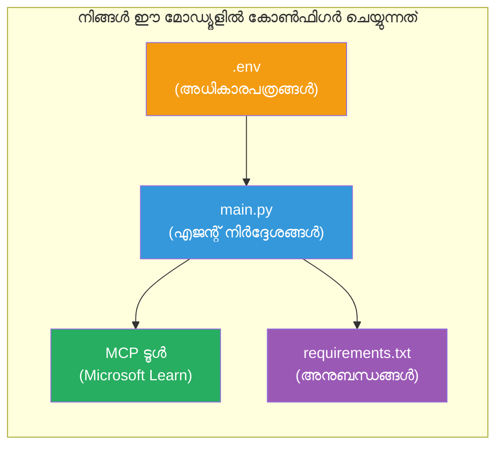

# Module 3 - ഏജന്റുകൾ, MCP ടൂൾ & പരിസ്ഥിതി കോൺഫിഗർ ചെയ്യുക

ഈ മോഡ്യൂളിൽ, നിങ്ങൾ സ്കാഫോൾഡഡ് മൾട്ടി-ഏജന്റ് പ്രോജക്ട് കസ്റ്റമൈസ് ചെയ്യും. നിങ്ങൾ എല്ലാ മൂന്ന് ഏജന്റുകൾക്കും നിർദ്ദേശങ്ങൾ എഴുതുകയും, Microsoft Learn-നുള്ള MCP ടൂൾ സജ്ജമാക്കുകയും, പരിസ്ഥിതി ചാരങ്ങൾ കോൺഫിഗർ ചെയ്യുകയും, ആശ്രിതങ്ങൾ ഇൻസ്റ്റാൾ ചെയ്യുകയും ചെയ്യും.


> **റഫറൻസ്:** പൂർണ്ണ പ്രവർത്തന കോഡ് [`PersonalCareerCopilot/main.py`](../../../../../workshop/lab02-multi-agent/PersonalCareerCopilot/main.py) -ൽ ഉണ്ട്. നിങ്ങളുടെ സ്വന്തം പ്രോജക്ട് നിർമ്മിക്കുമ്പോൾ ഇത് റഫറൻസായി ഉപയോഗിക്കുക.

---

## ഘട്ടം 1: പരിസ്ഥിതി ചാരങ്ങൾ കോൺഫിഗർ ചെയ്യുക

1. പ്രോജക്ടിന്റെ റൂട്ടിൽ ഉള്ള **`.env`** ഫയൽ തുറക്കുക.
2. നിങ്ങളുടെ Foundry പ്രോജക്ട് വിശദാംശങ്ങൾ പൂരിപ്പിക്കുക:

   ```env
   PROJECT_ENDPOINT=https://<your-account>.services.ai.azure.com/api/projects/<your-project>
   MODEL_DEPLOYMENT_NAME=gpt-4.1-mini
   ```

3. ഫയൽ സംരക്ഷിക്കുക.

### ഈ മൂല്യങ്ങൾ എവിടെ കണ്ടെത്താം

| മൂല്യം | എങ്ങനെ കണ്ടെത്താം |
|-------|---------------|
| **പ്രോജക്ട് എന്റ്പോയിൻറ്റ്** | Microsoft Foundry സൈഡ്ബാർ → നിങ്ങളുടെ പ്രോജക്ട് ക്ലിക്ക് ചെയ്യുക → വിശദാംശ വ്യൂവിൽ എൻഡ്‌പോയിന്റ് URL |
| **മോഡൽ ഡിപ്പ്ലോയ്മെന്റ് നാമം** | Foundry സൈഡ്ബാർ → പ്രോജക്ട് വിപുലീകരിക്കുക → **Models + endpoints** → ഡിപ്പ്ലോയുചെയ്‌ത മോഡലിന്റെ പക്കൽ നാമം |

> **സുരക്ഷ:** `.env` ഫയൽ വേഴ്സൻ കഠവ്രോളിൽ ഒരിക്കലും കമിറ്റ്ചെയ്ത് പോകരുത്. `.gitignore`-ലേക്ക് ചേർക്കുക.

### പരിസ്ഥിതി ചാരങ്ങളുടെ മാപ്പിംഗ്

മൾട്ടി-ഏജന്റ് `main.py` സ്റ്റാൻഡേർഡ് കൂടാതെ വർക്‌ഷോപ്പ്-സവിശേഷ env വേരിയബിൾ നാമങ്ങളും വായിക്കുന്നു:

```python
PROJECT_ENDPOINT = os.getenv("AZURE_AI_PROJECT_ENDPOINT") or os.getenv("PROJECT_ENDPOINT")
MODEL_DEPLOYMENT_NAME = os.getenv(
    "AZURE_AI_MODEL_DEPLOYMENT_NAME",
    os.getenv("MODEL_DEPLOYMENT_NAME", "gpt-4.1-mini"),
)
MICROSOFT_LEARN_MCP_ENDPOINT = os.getenv(
    "MICROSOFT_LEARN_MCP_ENDPOINT", "https://learn.microsoft.com/api/mcp"
)
```

MCP എൻഡ്‌പോയിൻറ്റ് സമർത്ഥമായ ഒരു ഡിഫോൾട് വക്കാണ് - നിങ്ങൾക്ക് `.env`-ൽ വെക്കേണ്ടതില്ല, അതിനെ അത് ഓവർറൈഡ് ചെയ്യലിന് മാത്രം ആണ്.

---

## ഘട്ടം 2: ഏജന്റ് നിർദ്ദേശങ്ങൾ എഴുതുക

ഇതാണ് ഏറ്റവും പ്രധാനപ്പെട്ട ഘട്ടം. ഓരോ ഏജന്റിനും അതിന്റെ പങ്ക്, ഔട്ട്പുട്ട് ഫോർമാറ്റ്, നിയമങ്ങൾ എന്നിവ നിർവ്വചിക്കുന്ന സൂക്ഷ്മമായി രൂപകൽപ്പന ചെയ്ത നിർദ്ദേശങ്ങൾ ആവശ്യമുണ്ട്. `main.py` തുറന്ന് നിർദ്ദേശങ്ങളുള്ള നിലനിൽപ്പുകൾ സൃഷ്ടിക്കുക (അഥവാ മാറ്റങ്ങൾ വരുത്തുക).

### 2.1 റിസ്യൂം പാർസർ ഏജന്റ്

```python
RESUME_PARSER_INSTRUCTIONS = """\
You are the Resume Parser.
Extract resume text into a compact, structured profile for downstream matching.

Output exactly these sections:
1) Candidate Profile
2) Technical Skills (grouped categories)
3) Soft Skills
4) Certifications & Awards
5) Domain Experience
6) Notable Achievements

Rules:
- Use only explicit or strongly implied evidence.
- Do not invent skills, titles, or experience.
- Keep concise bullets; no long paragraphs.
- If input is not a resume, return a short warning and request resume text.
"""
```

**ഈ വിഭാഗങ്ങൾ എന്തുകൊണ്ട്?** MatchingAgent നിർവ്വചിക്കാനായി ഘടിതമായ ഡാറ്റ ആവശ്യമുണ്ട്. സ്ഥിരം വിഭാഗങ്ങൾ ഏജന്റുകൾക്കിടയിൽ വിശ്വാസപ്രദമായ കൈമാറ്റം ഉറപ്പ് വയ്ക്കും.

### 2.2 ജോബ് ഡിസ്ക്രിപ്ഷൻ ഏജന്റ്

```python
JOB_DESCRIPTION_INSTRUCTIONS = """\
You are the Job Description Analyst.
Extract a structured requirement profile from a JD.

Output exactly these sections:
1) Role Overview
2) Required Skills
3) Preferred Skills
4) Experience Required
5) Certifications Required
6) Education
7) Domain / Industry
8) Key Responsibilities

Rules:
- Keep required vs preferred clearly separated.
- Only use what the JD states; do not invent hidden requirements.
- Flag vague requirements briefly.
- If input is not a JD, return a short warning and request JD text.
"""
```

**ആവശ്യമായവയും ഇഷ്ടാനുസൃതവയും വ്യത്യസ്തമാകാൻ എന്തുകൊണ്ട്?** MatchingAgent ഓരോന്നിനും വ്യത്യസ്ത ഭാരങ്ങൾ നൽകുന്നു (ആവശ്യമായ കഴിവുകൾ = 40 പോയിന്റ്, ഇഷ്ടാനുസൃത കഴിവുകൾ = 10 പോയിന്റ്).

### 2.3 മാച്ചിംഗ് ഏജന്റ്

```python
MATCHING_AGENT_INSTRUCTIONS = """\
You are the Matching Agent.
Compare parsed resume output vs JD output and produce an evidence-based fit report.

Scoring (100 total):
- Required Skills 40
- Experience 25
- Certifications 15
- Preferred Skills 10
- Domain Alignment 10

Output exactly these sections:
1) Fit Score (with breakdown math)
2) Matched Skills
3) Missing Skills
4) Partially Matched
5) Experience Alignment
6) Certification Gaps
7) Overall Assessment

Rules:
- Be objective and evidence-only.
- Keep partial vs missing separate.
- Keep Missing Skills precise; it feeds roadmap planning.
"""
```

**വ്യക്തമായ സ്കോറിംഗ് എന്തിന്?** പുനരുപയോഗയോഗ്യമായ സ്കോറിംഗ് ഓടുന്നതും പ്രശ്നപരിഹാരം ചെയ്യുന്നതിനും ഉപകാരപ്രദമാണ്. 100 പോയിന്റ് സ്കെയിൽ അവസാനം ഉപഭോക്താക്കൾക്ക് മനസിലാക്കാനും എളുപ്പമാണ്.

### 2.4 ഗ്യാപ് അനലൈസർ ഏജന്റ്

```python
GAP_ANALYZER_INSTRUCTIONS = """\
You are the Gap Analyzer and Roadmap Planner.
Create a practical upskilling plan from the matching report.

Microsoft Learn MCP usage (required):
- For EVERY High and Medium priority gap, call tool `search_microsoft_learn_for_plan`.
- Use returned Learn links in Suggested Resources.
- Prefer Microsoft Learn for free resources.

CRITICAL: You MUST produce a SEPARATE detailed gap card for EVERY skill listed in
the Missing Skills and Certification Gaps sections of the matching report. Do NOT
skip or combine gaps. Do NOT summarize multiple gaps into one card.

Output format:
1) Personalized Learning Roadmap for [Role Title]
2) One DETAILED card per gap (produce ALL cards, not just the first):
   - Skill
   - Priority (High/Medium/Low)
   - Current Level
   - Target Level
   - Suggested Resources (include Learn URL from tool results)
   - Estimated Time
   - Quick Win Project
3) Recommended Learning Order (numbered list)
4) Timeline Summary (week-by-week)
5) Motivational Note

Rules:
- Produce every gap card before writing the summary sections.
- Keep it specific, realistic, and actionable.
- Tailor to candidate's existing stack.
- If fit >= 80, focus on polish/interview readiness.
- If fit < 40, be honest and provide a staged path.
"""
```

**"CRITICAL" നിർദ്ദേശം എന്തിന്?** എല്ലാ ഗ്യാപ് കാർഡുകളും നിർമാണം നടത്താൻ വ്യക്തമായ നിർദ്ദേശം ഇല്ലെങ്കില്‍ മോഡൽ സാധാരണയായി 1-2 കാർഡുകൾ മാത്രമേ സൃഷ്ടിക്കുകയുള്ളൂ, ബാക്കി സംഗ്രഹിക്കുന്നു. "CRITICAL" ബ്ലോക്ക് ഈ കൃത്രിമം തടയുന്നു.

---

## ഘട്ടം 3: MCP ടൂൾ നിർവചിക്കുക

ഗ്യാപ് അനലൈസർ ഒരു ടൂൾ ഉപയോഗിക്കുന്നു, ഇത് [Microsoft Learn MCP സെർവർ](https://learn.microsoft.com/azure/foundry/agents/how-to/tools/model-context-protocol) പ്രവേശിപ്പിക്കുന്നു. ഇത് `main.py`-യിൽ ചേർക്കുക:

```python
import json
from agent_framework import tool
from mcp.client.session import ClientSession
from mcp.client.streamable_http import streamable_http_client

@tool
async def search_microsoft_learn_for_plan(
    skill: str, role: str = "", max_results: int = 5
) -> str:
    """Search Microsoft Learn MCP and return curated official links for roadmap planning."""
    query = " ".join(part for part in [skill, role, "learning path module"] if part).strip()
    query = query or "job skills learning path"

    try:
        async with streamable_http_client(MICROSOFT_LEARN_MCP_ENDPOINT) as (
            read_stream, write_stream, _,
        ):
            async with ClientSession(read_stream, write_stream) as session:
                await session.initialize()
                result = await session.call_tool(
                    "microsoft_docs_search", {"query": query}
                )

        if not result.content:
            return (
                "No results returned from Microsoft Learn MCP. "
                "Fallback: https://learn.microsoft.com/training/support/catalog-api"
            )

        payload_text = getattr(result.content[0], "text", "")
        data = json.loads(payload_text) if payload_text else {}
        items = data.get("results", [])[:max(1, min(max_results, 10))]

        if not items:
            return f"No direct Microsoft Learn results found for '{skill}'."

        lines = [f"Microsoft Learn resources for '{skill}':"]
        for i, item in enumerate(items, start=1):
            title = item.get("title") or item.get("url") or "Microsoft Learn Resource"
            url = item.get("url") or item.get("link") or ""
            lines.append(f"{i}. {title} - {url}".rstrip(" -"))
        return "\n".join(lines)
    except Exception as ex:
        return (
            f"Microsoft Learn MCP lookup unavailable. Reason: {ex}. "
            "Fallbacks: https://learn.microsoft.com/api/mcp"
        )
```

### ടൂൾ പ്രവർത്തിക്കുമ്പോൾ

| ഘട്ടം | എന്താണ് സംഭവിക്കുന്നത് |
|------|-------------|
| 1 | GapAnalyzer ഒരു കഴിവിന് (ഉദാ., "Kubernetes") അതിദിന ദ്രവ്യശേഷികൾ വേണമെന്നും തീരുമാനിക്കുന്നു |
| 2 | ഫ്രെയിംവർക്ക് `search_microsoft_learn_for_plan(skill="Kubernetes")` വിളിക്കുന്നു |
| 3 | ഫംഗ്ഷൻ [Streamable HTTP](https://learn.microsoft.com/agent-framework/agents/tools/hosted-mcp-tools) കണക്ഷൻ തുറക്കുന്നു - `https://learn.microsoft.com/api/mcp` |
| 4 | [MCP സെർവർ](https://learn.microsoft.com/azure/foundry/agents/how-to/tools/model-context-protocol)യിൽ `microsoft_docs_search` വിളിക്കുന്നു |
| 5 | MCP സർവർ തിരഞ്ഞെടുത്ത ഫലങ്ങൾ (ശീർഷകം + URL) തിരികെ നൽകുന്നു |
| 6 | ഫംഗ്ഷൻ ഫലങ്ങൾ നമ്പർ ചെയ്ത പട്ടികയായി രൂപകല്പന ചെയ്യുന്നു |
| 7 | GapAnalyzer URLs ഗ്യാപ് കാർഡിൽ ഉൾപ്പെടുത്തുന്നു |

### MCP ആശ്രിതങ്ങൾ

MCP ക്ലയന്റ് ലൈബ്രറികൾ [`agent-framework-core`](https://learn.microsoft.com/agent-framework/overview/) വഴി സ്വയം ഉൾപ്പെടുന്നു. അവ `requirements.txt`-ൽ പ്രത്യേകം ചേർക്കേണ്ടതില്ല. ഇറക്കുമതി പിശകുകളുണ്ടെങ്കിൽ, താഴെ പരിശോധിക്കുക:

```powershell
pip list | Select-String "mcp"
```

മുമ്പിൽ നിശ്ചയിച്ചത്: `mcp` പാക്കേജ് ഇൻസ്റ്റാൾ ചെയ്തിരിക്കണം (പതിപ്പ് 1.x അല്ലെങ്കിൽ അതിനു മുകളിൽ).

---

## ഘട്ടം 4: ഏജന്റുകളും പ്രവൃത്തി പ്രവാഹവും ബന്ധിപ്പിക്കുക

### 4.1 കോൺടെക്‌സ്‌റ്റ് മാനേജർമാരോടെ ഏജന്റുകൾ സൃഷ്ടിക്കുക

```python
from contextlib import asynccontextmanager

@asynccontextmanager
async def create_agents():
    async with (
        get_credential() as credential,
        AzureAIAgentClient(
            project_endpoint=PROJECT_ENDPOINT,
            model_deployment_name=MODEL_DEPLOYMENT_NAME,
            credential=credential,
        ).as_agent(
            name="ResumeParser",
            instructions=RESUME_PARSER_INSTRUCTIONS,
        ) as resume_parser,
        AzureAIAgentClient(
            project_endpoint=PROJECT_ENDPOINT,
            model_deployment_name=MODEL_DEPLOYMENT_NAME,
            credential=credential,
        ).as_agent(
            name="JobDescriptionAgent",
            instructions=JOB_DESCRIPTION_INSTRUCTIONS,
        ) as jd_agent,
        AzureAIAgentClient(
            project_endpoint=PROJECT_ENDPOINT,
            model_deployment_name=MODEL_DEPLOYMENT_NAME,
            credential=credential,
        ).as_agent(
            name="MatchingAgent",
            instructions=MATCHING_AGENT_INSTRUCTIONS,
        ) as matching_agent,
        AzureAIAgentClient(
            project_endpoint=PROJECT_ENDPOINT,
            model_deployment_name=MODEL_DEPLOYMENT_NAME,
            credential=credential,
        ).as_agent(
            name="GapAnalyzer",
            instructions=GAP_ANALYZER_INSTRUCTIONS,
            tools=[search_microsoft_learn_for_plan],
        ) as gap_analyzer,
    ):
        yield resume_parser, jd_agent, matching_agent, gap_analyzer
```

**മੁੱਖ കാര്യങ്ങൾ:**
- ഓരോ ഏജന്റിനും അതിന്റെ സ്വന്തം `AzureAIAgentClient` ഇൻസ്റ്റൻസ് ഉണ്ട്
- മിമ്മതി ഗ്യാപ് അനലൈസർ മാത്രമാണ് `tools=[search_microsoft_learn_for_plan]` ഉപയോഗിക്കുന്നത്
- `get_credential()` Azure-ൽ [`ManagedIdentityCredential`](https://learn.microsoft.com/python/api/overview/azure/identity-readme#managed-identity-support), ലോക്കലായി [`DefaultAzureCredential`](https://learn.microsoft.com/azure/developer/python/sdk/authentication/credential-chains#defaultazurecredential-overview) നൽകുന്നു

### 4.2 പ്രവൃത്തി പ്രവാഹ ഗ്രാഫ് നിർമ്മിക്കുക

```python
def create_workflow(resume_parser, jd_agent, matching_agent, gap_analyzer):
    workflow = (
        WorkflowBuilder(
            name="ResumeJobFitEvaluator",
            start_executor=resume_parser,
            output_executors=[gap_analyzer],
        )
        .add_edge(resume_parser, jd_agent)
        .add_edge(resume_parser, matching_agent)
        .add_edge(jd_agent, matching_agent)
        .add_edge(matching_agent, gap_analyzer)
        .build()
    )
    return workflow.as_agent()
```

> `.as_agent()` പാറ്റേൺ മനസിലാക്കാൻ [Workflows as Agents](https://learn.microsoft.com/agent-framework/workflows/as-agents) കാണുക.

### 4.3 സെർവർ സ്റ്റാർട്ട് ചെയ്യുക

```python
async def main() -> None:
    validate_configuration()
    async with create_agents() as (resume_parser, jd_agent, matching_agent, gap_analyzer):
        agent = create_workflow(resume_parser, jd_agent, matching_agent, gap_analyzer)
        from azure.ai.agentserver.agentframework import from_agent_framework
        await from_agent_framework(agent).run_async()

if __name__ == "__main__":
    asyncio.run(main())
```

---

## ഘട്ടം 5: വിർച്വൽ പരിസ്ഥിതി സൃഷ്ടിക്കുകയും സജീവമാക്കുകയും ചെയ്യുക

### 5.1 പരിസ്ഥിതി സൃഷ്ടിക്കുക

```powershell
cd workshop\lab02-multi-agent\PersonalCareerCopilot
python -m venv .venv
```

### 5.2 സജീവമാക്കുക

**PowerShell (Windows):**
```powershell
.\.venv\Scripts\Activate.ps1
```

**macOS/Linux:**
```bash
source .venv/bin/activate
```

### 5.3 ആശ്രിതങ്ങൾ ഇൻസ്റ്റാൾ ചെയ്യുക

```powershell
pip install -r requirements.txt
```

> **കുറിപ്പ്:** `requirements.txt`-ൽ ഉള്ള `agent-dev-cli --pre` വരി ഏറ്റവും പുതിയ പ്രിവ്യൂ പതിപ്പ് ഇൻസ്റ്റാൾ ചെയ്യാൻ ഉറപ്പാക്കുന്നു. ഇത് `agent-framework-core==1.0.0rc3`-നുമായുള്ള അനുഭൂമയ്ക്ക് ആവശ്യമാണ്.

### 5.4 ഇൻസ്റ്റലേഷൻ പരിശോധന

```powershell
pip list | Select-String "agent-framework|agentserver|agent-dev"
```

പ്രതീക്ഷിക്കുന്ന ഔട്ട്‌പുട്ട്:
```
agent-dev-cli                  0.0.1b260316
agent-framework-azure-ai       1.0.0rc3
agent-framework-core            1.0.0rc3
azure-ai-agentserver-agentframework 1.0.0b16
azure-ai-agentserver-core      1.0.0b16
```

> **`agent-dev-cli` പഴയ പതിപ്പായുണ്ടെങ്കിൽ** (ഉദാ: `0.0.1b260119`), ഏജന്റ് ഇൻസ്പക്ടർ 403/404 പിശകുകളോടെ പരാജയപ്പെടും. അപ്ഗ്രേഡ് ചെയ്യുക: `pip install agent-dev-cli --pre --upgrade`

---

## ഘട്ടം 6: പ്രാമാണീകരണം പരിശോധിക്കുക

ലാബ് 01-ലെ അഥവാ അതേ Auth പരിശോധന നടത്തുക:

```powershell
az account show --query "{name:name, id:id}" --output table
```

തക്രിയയിൽ പരാജയപ്പെട്ടാൽ [`az login`](https://learn.microsoft.com/cli/azure/authenticate-azure-cli-interactively) നടത്തുക.

മൾട്ടി-ഏജന്റ് പ്രവർത്തനങ്ങളിൽ എല്ലാ നാലു ഏജന്റുകളും ഒരേ ക്രെഡൻഷ്യൽ പങ്കിടുന്നു. ഒരൊൾക്ക് ശരിയെങ്കിൽ എല്ലാവർക്കും ശരിയാകും.

---

### ചെക്പോയിന്റ്

- [ ] `.env`-ൽ സാധുവായ `PROJECT_ENDPOINT` മെയും `MODEL_DEPLOYMENT_NAME` മെയും ഉണ്ട്
- [ ] നാലു ഏജന്റ് നിർദ്ദേശങ്ങൾ എല്ലാം `main.py`-ൽ നിർവചിക്കപ്പെട്ടിട്ടുണ്ട് (ResumeParser, JD Agent, MatchingAgent, GapAnalyzer)
- [ ] `search_microsoft_learn_for_plan` MCP ടൂൾ നിർവചിച്ച് GapAnalyzer-ലേക്ക് റജിസ്റ്റർ ചെയ്തു
- [ ] `create_agents()` ഓരോയെജന്റിനും വേറെ `AzureAIAgentClient` ഇൻസ്റ്റൻസുകൾ സൃഷ്ടിക്കുന്നു
- [ ] `create_workflow()` ശരിയായ ഗ്രാഫ് `WorkflowBuilder` ഉപയോഗിച്ച് നിർമ്മിക്കുന്നു
- [ ] വിർച്വൽ പരിസ്ഥിതി സൃഷ്ടിച്ച് സജീവമാക്കി (`(.venv)` കാണാം)
- [ ] `pip install -r requirements.txt` പിശകുകളില്ലാതെ പൂർത്തീകരിക്കുന്നു
- [ ] `pip list` മുഴുവൻ പ്രതീക്ഷിച്ച പാക്കേജുകൾ ശരിയായ പതിപ്പുകളിൽ കാണിക്കുന്നു (rc3 / b16)
- [ ] `az account show` നിങ്ങളുടെ സബ്സ്ക്രിപ്ഷൻ തിരിച്ചറിയുന്നു

---

**മുമ്പിലുള്ളത്:** [02 - Scaffold Multi-Agent Project](02-scaffold-multi-agent.md) · **അടുത്തത്:** [04 - Orchestration Patterns →](04-orchestration-patterns.md)

---

<!-- CO-OP TRANSLATOR DISCLAIMER START -->
**തള്ളി പറയുന്നത്**:  
ഈ രേഖ AI പരിഭാഷ സേവനം [Co-op Translator](https://github.com/Azure/co-op-translator) ഉപയോഗിച്ച് പരിഭാഷ ചെയ്തതാണ്. തിരുത്തലുകൾക്കായി ഞങ്ങൾ ശ്രമിക്കുന്നുവെങ്കിലും, സ്വയം പ്രവർത്തിക്കുന്ന പരിഭാഷകൾ തെറ്റുകൾ അല്ലെങ്കിൽ അസാധുതകൾ ഉൾക്കൊള്ളുന്നതായിരിക്കാം. ഉറവിടഭാഷയിൽ ഉള്ള മൗലികരേഖ സംബദ്ധമായ ഏറ്റവും വിശ്വസനീയമായ ഉറവിടമായി കരുതപ്പെടണം. നിർണായകമായ വിവരങ്ങൾക്കായി, പ്രൊഫഷണൽ മനുഷ്യ പരിഭാഷ ഉണ്ടാക്കുന്നത് ശിപാർശ ചെയ്യപ്പെടുന്നു. ഈ പരിഭാഷ ഉപയോഗിച്ചതിലൂടെ ഉണ്ടാകുന്ന ഏതെങ്കിലും തെറ്റായ ധാരണകൾ അല്ലെങ്കിൽ വ്യാഖ്യാനങ്ങൾക്കായി ഞങ്ങൾ ഉത്തരവാദികളല്ല.
<!-- CO-OP TRANSLATOR DISCLAIMER END -->