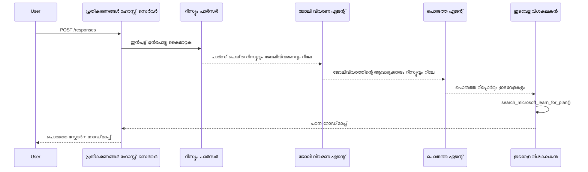

# മോഡ്യൂൾ 3 - നിർദ്ദേശങ്ങൾ, പരിതസ്ഥിതി ക്രമീകരിക്കുക & ആശ്രിതത്വങ്ങൾ ഇൻസ്റ്റാൾ ചെയ്യുക

⏱️ ~15 മിനിറ്റ്

ഈ മോഡ്യൂളിൽ, സ്‌കാഫോൾഡഡ് സ്റ്റബ് **നിങ്ങളുടെ** മൾട്ടി-ഏജന്റ് വർക്‌ഫ്ലോ ആയി പരിവർത്തനം ചെയ്യുക - പരിതസ്ഥിതി ചാരങ്ങൾ സജ്ജീകരിച്ച്, ഏജന്റ് നിർദ്ദേശങ്ങൾ എഴുതിയും, MCP ടൂൾ ചേർത്ത്, വർക്‌ഫ്ലോ ഗ്രാഫ് വയർ ചെയ്ത്, ആശ്രിതത്വങ്ങൾ ഇൻസ്റ്റാൾ ചെയ്യുക.

> **റഫറൻസ്:** സമ്പൂർണ്ണ പ്രവർത്തന കോഡ് [`PersonalCareerCopilot/main.py`](../../../../../workshop/lab02-multi-agent/PersonalCareerCopilot/main.py) ൽ ഉണ്ട്. നിങ്ങളുടെ സ്വന്തം വർക്‌ഫ്ലോ ഗ്രാഫും പ്രോംപ്റ്റ് ബ്ലോക്കുകളും നിർമ്മിക്കുമ്പോൾ ഇത് റഫറൻസായി ഉപയോഗിക്കുക.

---

## നാല് ഏജന്റുകൾ എങ്ങനെ ചേർന്നു പ്രവർത്തിക്കുന്നു


```mermaid
sequenceDiagram
    participant User
    participant Server as പ്രതികരണങ്ങൾ ഹോസ്റ്റ് സെർവർ
    participant RP as റിസ്യൂം പാർസർ
    participant JD as ജോലി വിവരണ ഏജന്റ്
    participant MA as പൊരുത്ത ഏജന്റ്
    participant GA as ഇടവേള വിശകലകൻ

    User->>Server: POST /responses
    Server->>RP: ഇൻപുട്ട് മുൻപോട്ടു കൈമാറുക
    RP-->>JD: പാർസ് ചെയ്‌ത റിസ്യൂവും ജോലിവിവരണവും റീലേ
    JD-->>MA: ജോലിവിവരത്തിന്റെ ആവശ്യക്കാരും റിസ്യൂവും റീലേ
    MA-->>GA: പൊരുത്ത റിപ്പോർറും ഇടവേളകളും
    GA->>GA: search_microsoft_learn_for_plan()
    GA-->>Server: പഠന റോഡ്‌മാപ്പ്
    Server-->>User: പൊരുത്ത സ്കോർ + റോഡ്‌മാപ്പ്
```

---

## પગൽ 1: പരിതസ്ഥിതി ചാരങ്ങൾ ക്രമീകരിക്കുക

1. നിങ്ങളുടെ പ്രോജക്ട് റൂട്ട് (സ്‌കാഫോൾഡ് വിസാർഡ് നിർമ്മിച്ച) ൽ ഉള്ള **`.env`** ഫയൽ തുറക്കുക.
2. പ്ലേസ്ഹോൾഡറുകൾ നിങ്ങളുടെ ലാബ് 01 യിലെ യഥാർത്ഥ മൂല്യങ്ങളാൽแทറ് PLACEHOLDER LANGUAGE NOT TRANSLATED

<details open>
<summary><strong>🅰️ പാത A - ഫൗണ്ട്രി സബ്സ്ക്രിപ്ഷൻ</strong></summary>

```env
FOUNDRY_PROJECT_ENDPOINT=https://<your-account>.services.ai.azure.com/api/projects/<your-project>
AZURE_AI_MODEL_DEPLOYMENT_NAME=gpt-4.1-mini
```

> **എവിടെ മൂല്യങ്ങൾ കണ്ടെത്താം:** [ലാബ് 01, മോഡ്യൂൾ 1](../../lab01-single-agent/docs/01-setup.md#deploy-a-model--assign-rbac) കാണുക.

</details>

<details open>
<summary><strong>🅱️ പാത B - ഫൗണ്ട്രി ലോക്കൽ</strong></summary>

```env
FOUNDRY_PROJECT_ENDPOINT=http://localhost:5273/v1
AZURE_AI_MODEL_DEPLOYMENT_NAME=phi-4-mini
```

> നിങ്ങളുടെ യന്ത്രത്തിൽ എല്ലാ ഇൻഫറൻസ് പ്രവർത്തനങ്ങളും - നിങ്ങളുടെ ഉപകരണത്തിൽ ഡാറ്റ പുറത്തേക്ക് പോകില്ല. കൃത്യമായ മോഡൽ ആലയസ് ഉറപ്പാക്കാൻ `foundry model list` ഓടിക്കുക. ഒറ്റ ഔട്ട്‌ബൗണ്ട് അഭ്യർത്ഥന MCP ടൂളിന്റെ `https://learn.microsoft.com/api/mcp` വിളിയാണ്.

> **എവിടെ മൂല്യങ്ങൾ കണ്ടെത്താം:** [ലാബ് 01, മോഡ്യൂൾ 1 - ലോക്കൽ പാത](../../lab01-single-agent/docs/01-setup.md#step-2-set-up-based-on-your-access) കാണുക.

</details>

> **സുരക്ഷ:** `.env` വേഴ്സൻ കൺട്രോളിൽ commit ചെയ്യരുത്. ഇത് `.gitignore` ൽ ഇതിനകം തന്നെ ഉൾപ്പെടുന്നു.

---

## ഘട്ടം 2: ഏജന്റ് നിർദ്ദേശങ്ങൾ എഴുതുക

ഓരോ ഏജന്റിന്റെ വേഷം, ഔട്ട്‌പുട്ട് ഫോർമാറ്റ്, നിയമങ്ങൾ നിർവചിക്കുന്ന നിർദ്ദേശങ്ങൾ. `main.py` തുറന്ന് നാലു നിർദ്ദേശ സ്ഥിരാംശങ്ങളും നിർവചിക്കുകയോ (അല്ലെങ്കിൽ മാറ്റുകയോ) ചെയ്യുക - സമ്പൂർണ്ണ രചനകൾ [`PersonalCareerCopilot/main.py`](../../../../../workshop/lab02-multi-agent/PersonalCareerCopilot/main.py) ൽ ഉണ്ട്.

### 2.1 `RESUME_PARSER_INSTRUCTIONS`
റിസൂം സ്ട്രക്ച്ചർ ചെയ്ത കാൻഡിഡേറ്റ് പ്രൊഫൈലായി പാർസ് ചെയ്യുകയും ജോബ് വിവരണം യഥാസ്ഥിതിയിൽ `[JOB DESCRIPTION PASS-THROUGH]` ല്‍ പ്രതിപാദിക്കുകയും ചെയ്യുന്നു. ഇരുപക്ഷത്തരം ടാഗ് ചെയ്ത സെക്ഷനുകളും ഔട്ട്‌പുട്ടിൽ കാണണം.

> **പാസ്-ത്രൂവിന് കാരണം?** `context_mode="last_agent"` ഉള്ളപ്പോൾ, ResumeParser ആണ് യഥാർത്ഥ ഉപയോക്തൃ സന്ദേശം കാണുന്ന **ഏകദേശം** ഏജന്റ്. അത് ജേഡി പുറം പോകാതെ പോസ്റ്റ് ചെയ്‌തില്ലെങ്കിലെ, അടിയന്തര ഏജന്റുകൾ അത് കാണാറില്ല.

### 2.2 `JOB_DESCRIPTION_INSTRUCTIONS`
ResumeParser ഔട്ട്‌പുട്ടിൽ നിന്ന് `[PARSED RESUME]` അഥവാ `[JOB DESCRIPTION PASS-THROUGH]` വായിച്ച് `[JD REQUIREMENTS]` (ഘടനാപരമായ ആവശ്യങ്ങൾ) നൽകുന്നു; കൂടാതെ `[PARSED RESUME PASS-THROUGH]` (MatchingAgent നായി റിസൂം verbatim കോപ്പി).

### 2.3 `MATCHING_AGENT_INSTRUCTIONS`
`[JD REQUIREMENTS]` ഉം `[PARSED RESUME PASS-THROUGH]` ഉം വായിക്കുന്നു. 0–100 സ്കോർ ചെയ്ത ഫിറ്റ് റിപ്പോർട്ട്, പിരിച്ചുപറയൽ ഗണിതശാസ്ത്രം, മതിച്ചുമായ കരുത്തുകൾ, നഷ്ടമായ കരുത്തുകൾ, അനുഭവം സാദൃശ്യവുമുള്ള റിപ്പോർട്ട് നൽകുന്നു.

### 2.4 `GAP_ANALYZER_INSTRUCTIONS`
ഫിറ്റ് റിപ്പോർട്ട് വായിക്കുന്നു. **ഒരു** പോലും നഷ്ടപ്പെട്ട കരുത്തിനും, Microsoft Learn റിസോഴ്‌സുകൾ ലഭിക്കുന്നതിന് `search_microsoft_learn_for_plan` വിളിക്കുന്നു. ഓരോ സാംപത്തികം നിറഞ്ഞ ഒരു ഗ്യാപ് കാർഡ് നൽകി ആഴത്തിലുള്ള പഠന പാത നിരൂപണം നൽകുന്നു.

---

## ഘട്ടം 3: MCP ടൂൾ ചേർക്കുക

GapAnalyzer [Microsoft Learn MCP സെർവർ](https://learn.microsoft.com/azure/foundry/agents/how-to/tools/model-context-protocol)ക്ക് skill gap ന് യഥാർത്ഥ പഠന വിഭവങ്ങൾ തേടാൻ വിളിക്കുന്നു. പൂർണ്ണ `search_microsoft_learn_for_plan` ഫംഗ്ഷൻ [`PersonalCareerCopilot/main.py`](../../../../../workshop/lab02-multi-agent/PersonalCareerCopilot/main.py) ൽ കാണാം.

ഏജന്റ് സൃഷ്ടിക്കുമ്പോൾ GapAnalyzer-യിൽ ടൂൾ രജിസ്റ്റർ ചെയ്യുക:

```python
gap_analyzer = Agent(
    client=client,
    instructions=GAP_ANALYZER_INSTRUCTIONS,
    name="GapAnalyzer",
    tools=[search_microsoft_learn_for_plan],
)
```

> `WorkflowBuilder` ഗ്രാഫും `FoundryChatClient`, `AgentExecutor`, എല്ലാ `add_edge()` വിളികളും വേണ്ടി സമ്പൂർണ്ണം [`PersonalCareerCopilot/main.py`](../../../../../workshop/lab02-multi-agent/PersonalCareerCopilot/main.py)യിൽ കാണുക.

---

## ഘട്ടം 4: വെർച്വൽ പരിതസ്ഥിതി സൃഷ്ടിച്ചു ആശ്രിതത്വങ്ങൾ ഇൻസ്റ്റാൾ ചെയ്യുക

> ⚠️ **ഈ ഘട്ടം വിട്ടുവീഴ്‌ച ചെയ്യരുത്.** ആശ്രിതത്വങ്ങൾ ഇൻസ്റ്റാൾ ചെയ്യാത്ത പക്ഷം, F5 ഡിബഗ്ഗ് പരാജയപ്പെടും.

### 4.1 വെർച്വൽ പരിതസ്ഥിതി സൃഷ്ടിക്കുക

```powershell
python -m venv .venv
```

### 4.2 അത് സജീവമാക്കുക

| ഓപ്പറേറ്റിങ് സിസ്റ്റം | കമാൻഡ് |
|----|---------|
| **Windows (PowerShell)** | `.\.venv\Scripts\Activate.ps1` |
| **Windows (CMD)** | `.venv\Scripts\activate.bat` |
| **macOS / Linux** | `source .venv/bin/activate` |

ടെർമിനൽ പ്രോംപ്റ്റിൽ `(.venv)` കാണണം.

### 4.3 ആശ്രിതത്വങ്ങൾ ഇൻസ്റ്റാൾ ചെയ്യുക

```powershell
pip install -r requirements.txt
```

### 4.4 പരിശോധന നടത്തുക

```powershell
pip list | Select-String "agent-framework|mcp|debugpy"
```

പ്രതീക്ഷിക്കപ്പെടുന്നത്: `agent-framework-foundry`, `agent-framework-foundry-hosting`, `mcp`, `debugpy` ലിസ്റ്റ് ചെയ്തിരിക്കണം.

---

## ഘട്ടം 5: പ്രമാണീകരണം സ്ഥിരീകരിക്കുക

<details open>
<summary><strong>🅰️ പാത A - Azure ക്രെഡൻഷ്യൽ</strong></summary>

```powershell
az account show --query "{name:name, id:id}" --output table
```

ഇത് പരാജയപ്പെട്ടാൽ, [`az login`](https://learn.microsoft.com/cli/azure/authenticate-azure-cli-interactively) ഓടിക്കുക.

എല്ലാ നാല് ഏജന്റുകളും ഒരു `FoundryChatClient` ഉം ഒരു `DefaultAzureCredential` ഉം പങ്കുവെക്കുന്നു. ഒരു തന്നെ പ്രവർത്തിച്ചാൽ, എല്ലാം പ്രവർത്തിക്കും.

</details>

<details open>
<summary><strong>🅱️ പാത B - ഫൗണ്ട്രി ലോക്കൽ</strong></summary>

ലോക്കൽ ടെസ്റ്റിംഗിനായി പ്രമാണീകരണം ആവശ്യമില്ല.

</details>

---

### ✅ അച്ചടക്കമിടിപ്പ്

> **മോഡ്യൂൾ 04ിലേക്ക് മുന്നോട്ട് കൊണ്ടുപോകരുത്:** **(1)** `(.venv)` നിങ്ങളുടെ പ്രോംപ്റ്റിൽ കാണാം എന്നും **(2)** `pip install -r requirements.txt` വിജയകരമായി പൂർത്തിയായി എന്നും.

- [ ] `.env` യഥാർത്ഥ endpoint ആയും മോഡൽ ഡെപ്രോയ്മെന്റ് നാമം (പ്ലേസ്ഹോൾഡറുകൾ അല്ല) സൂക്ഷിച്ചു
- [ ] എല്ലാ 4 ഏജന്റ് നിർദ്ദേശ സ്ഥിരാംശങ്ങളും `main.py` ൽ നിർവചിച്ചു (ResumeParser, JD Agent, MatchingAgent, GapAnalyzer)
- [ ] `search_microsoft_learn_for_plan` MCP ടൂൾ GapAnalyzer-ൽ നിർവചിച്ച് രജിസ്റ്റർ ചെയ്തു
- [ ] `FoundryChatClient` + 4 `Agent` + 4 `AgentExecutor` ഒബ്ജക്റ്റുകൾ `main()` ൽ സൃഷ്ടിച്ചു
- [ ] `WorkflowBuilder` ശരിയായ സീക്വൻഷ്യൽ ഗ്രാഫ് നിർമ്മിച്ചു എല്ലാ 3 `add_edge()` വിളികളും ഉൾപ്പെടുത്തി
- [ ] വെർച്വൽ പരിതസ്ഥിതി സൃഷ്ടിച്ചു സജീവമാക്കി (`(.venv)` പ്രോംപ്റ്റിൽ കാണാം)
- [ ] `pip install -r requirements.txt` പിശകുകളില്ലാതെ പൂർത്തിയായി
- [ ] **പാത A:** `az account show` വിജയം അഥവാ VS Code അക്കൗണ്ട് ഐക്കൺ സൈൻ-ഇൻ അക്കിൿ കാണിക്കുന്നു

---

**പൂർവ്വം:** [02 - Scaffold Multi-Agent Project](02-scaffold-multi-agent.md) · **അടുത്തത്:** [04 - Orchestration Patterns →](04-orchestration-patterns.md)

---

<!-- CO-OP TRANSLATOR DISCLAIMER START -->
**അറിയിപ്പ്**:
ഈ രേഖ AI പരിഭാഷാ സേവനം [Co-op Translator](https://github.com/Azure/co-op-translator) ഉപയോഗിച്ച് പരിഭാഷപ്പെടുത്തിയതാണ്. ഞങ്ങൾ കൃത്യതയ്ക്കായി ശ്രമിക്കുന്നുവെങ്കിലും, ഓട്ടോമേറ്റഡ് പരിഭാഷകളിൽ പിഴവുകൾ അല്ലെങ്കിൽ തെറ്റായ വിവരങ്ങൾ ഉണ്ടാകാൻ സാധ്യതയുണ്ട്. അതിന്റെ സ്വാഭാവിക ഭാഷയിലുള്ള അസൽ രേഖയാണ് പ്രാമാണികമായ ഉറവിടമായി പരിഗണിക്കേണ്ടത്. നിർണായകമായ വിവരങ്ങൾക്ക്, പ്രൊഫഷണൽ മനുഷ്യ പരിഭാഷ ശുപാർശ ചെയ്യുന്നു. ഈ പരിഭാഷ ഉപയോഗിച്ച് ഉണ്ടാകുന്ന തെറ്റിദ്ധാരണകൾ അല്ലെങ്കിൽ തെറ്റായ വ്യാഖ്യാനങ്ങൾക്കായി ഞങ്ങൾ ഉത്തരവാദികളല്ല.
<!-- CO-OP TRANSLATOR DISCLAIMER END -->