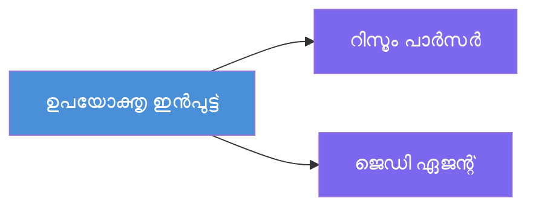
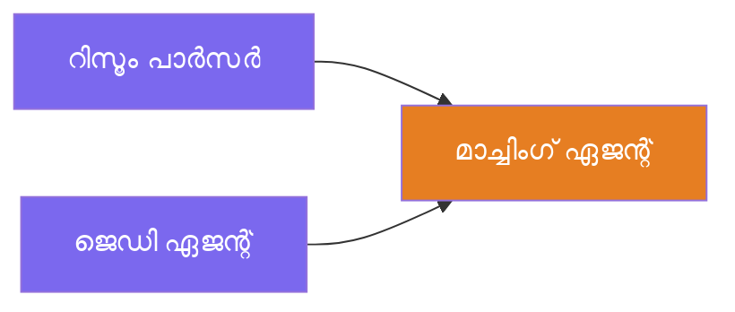
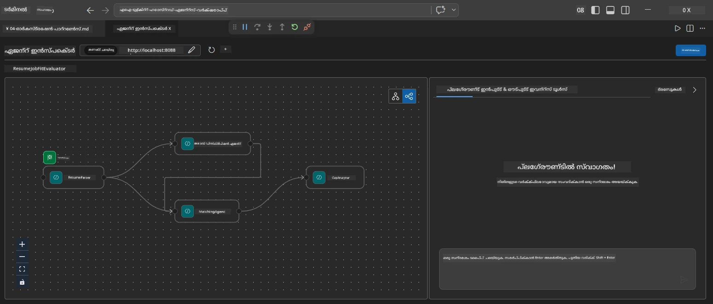
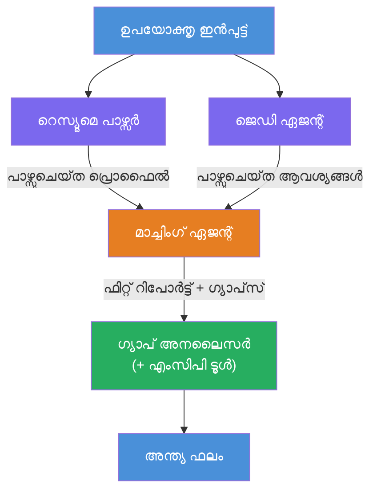
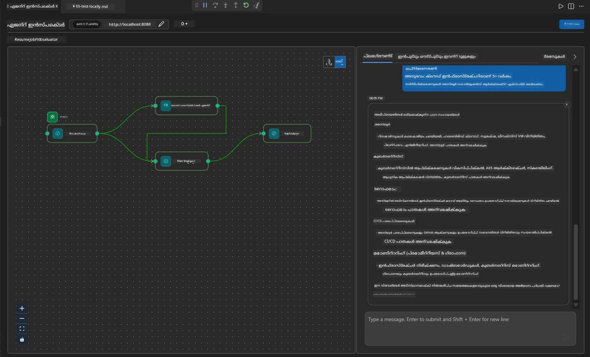

# Module 4 - ഓർക്കസ്ട്രേഷൻ പാറ്റേൺസ്

ഈ മോഡ്യൂളിൽ, റിസ്യൂം ജോബ് ഫിറ്റ് ഇവാലുവേറ്ററിൽ ഉപയോഗിക്കുന്ന ഓർക്കസ്ട്രേഷൻ പാറ്റേണുകൾ നിങ്ങൾ അന്വേഷിച്ച്, വർക്ക്‌ഫ്ലോ ഗ്രാഫ് എങ്ങനെ വായിക്കണം, മാറ്റം വരുത്തണം, വിപുലീകരിക്കണം എന്നറിയുന്നു. ഡാറ്റാ ഫ്ലോ പ്രശ്‌നങ്ങൾ ഡീബഗ് ചെയ്യുന്നതിന്‌ ഈ പാറ്റേണുകൾ മനസിലാക്കുന്നത് അനിവാര്യമാണ്, കൂടാതെ നിങ്ങളുടെ സ്വന്തം [മൾട്ടി-ഏജന്റ് വർക്ക്‌ഫ്ലോകൾ](https://learn.microsoft.com/agent-framework/workflows/) നിർമ്മിക്കുന്നതിനും.

---

## പാറ്റേൺ 1: ഫാൻ-ഔട്ട് (സമാന്തര വിഭജനം)

വർക്ക്‌ഫ്ലോയിലെ ആദ്യത്തെ പാറ്റേൺ **ഫാൻ-ഔട്ട്** ആണ് - ഒറ്റ ഇൻപുട്ട് ഒന്നിച്ച്‌ പല ഏജൻറുകൾക്കും അയയ്ക്കും.


കോഡിൽ, ഇത് സംഭവിക്കുന്നത് `resume_parser` ആണ് `start_executor` ആയതിനാൽ - അത് ആദ്യം ഉപയോഗകർത്തൃ സന്ദേശം സ്വീകരിക്കുന്നു. തുടർന്ന്, `jd_agent`വും `matching_agent` ഉം `resume_parser`ശേഷമുള്ള എഡ്ജുകൾ ഉള്ളതിനാൽ, ഫ്രെയിംവർക്ക് `resume_parser`യുടെ ഔട്ട്പുട്ട് രണ്ട് ഏജൻറുകൾക്കും റൂട്ടുചെയ്യുന്നു:

```python
.add_edge(resume_parser, jd_agent)         # ResumeParser ഔട്ട്പുട്ട് → JD ഏജന്റ്
.add_edge(resume_parser, matching_agent)   # ResumeParser ഔട്ട്പുട്ട് → മാച്ചിംഗ് ഏജന്റ്
```

**ഇത് എങ്ങനെ പ്രവർത്തിക്കുന്നു:** ResumeParser-നും JD Agent-നും ഒരേ ഇൻപുട്ടിന്റെ വ്യത്യസ്ത പാർശ്വങ്ങൾ പ്രോസസ് ചെയ്യുന്നു. അവയെ സമാന്തരമായി പ്രവർത്തിപ്പിക്കുന്നത് നിരന്തരമായി പ്രവർത്തിപ്പിക്കുന്നതോട് താരതമ്യം ചെയ്താൽ മൊത്തം വൈകിപ്പിക്കൽ കുറയ്‌ക്കുന്നു.

### ഫാൻ-ഔട്ട് എപ്പോൾ ഉപയോഗിക്കാം

| ഉപയോഗസന്ദർഭം | ഉദാഹരണം |
|----------|---------|
| സ്വതന്ത്ര ഉപപ്രവർത്തനങ്ങൾ | റിസ്യൂം പാഴ്‌സിംഗ് vs JD പാഴ്‌സിംഗ് |
| പകർപ്പിരക്ഷ / വോട്ടിംഗ് | രണ്ട് ഏജൻറുകൾ ഒരേ ഡാറ്റ വിശകലനം ചെയ്യുന്നു, മൂന്നാമത്തേത് മികച്ച മറുപടി തെരഞ്ഞെടുക്കുന്നു |
| ബഹു-ഫോർമാറ്റ് ഔട്ട്പുട്ട് | ഒരു ഏജന്റ് ടെക്സ്റ്റ് സൃഷ്ടിക്കുന്നു, മറ്റൊന്ന് ഘടനയുള്ള JSON സൃഷ്ടിക്കുന്നു |

---

## പാറ്റേൺ 2: ഫാൻ-ഇൻ (സംഗ്രഹം)

രണ്ടാം പാറ്റേൺ **ഫാൻ-ഇൻ** ആണ് - നിരവധി ഏജന്റുകളുടെ ഔട്ട്പുട്ട് ശേഖരിച്ച് ഒരു ഡൗൺസ്റ്റ്രീം ഏജന്റിലേക്ക് അയയ്ക്കുന്നു.


കോഡിൽ:

```python
.add_edge(resume_parser, matching_agent)   # ResumeParser output → MatchingAgent
.add_edge(jd_agent, matching_agent)        # JD Agent output → MatchingAgent
```

**മுக்கிய പെരുമാറ്റം:** ഏജентിന് **രണ്ടോ അതിലധികമോ ഇൻകമ്മിംഗ് എഡ്ജുകൾ** ഉണ്ടെങ്കിൽ, ഡൗൺസ്റ്റ്രീം ഏജന്റ് പ്രവർത്തിപ്പിക്കാൻ മുമ്പ് ഫ്രെയിംവർക്ക് **എല്ലാ** അപ്പ്സ്റ്റ്രീം ഏജന്റുകളും പൂർത്തിയാക്കാൻ കാത്തിരിക്കും. MatchingAgent, ResumeParser-ും JD Agent-ഉം പൂർത്തിയാകുന്നത് വരെ ആരംഭിക്കുന്നില്ല.

### MatchingAgent സ്വീകരിക്കുന്നത്

ഫ്രെയിംവർക്ക് എല്ലാ അപ്പ്സ്റ്റ്രീം ഏജന്റുകളുടെ ഔട്ട്പുട്ട് ഒരുമിച്ച് ജോഡിച്ചാണ് നൽകുന്നത്. MatchingAgent-ന്റെ ഇൻപുട്ട് ഇങ്ങനെ കാണപ്പെടുന്നു:

```
[ResumeParser output]
---
Candidate Profile:
  Name: Jane Doe
  Technical Skills: Python, Azure, Kubernetes, ...
  ...

[JobDescriptionAgent output]
---
Role Overview: Senior Cloud Engineer
Required Skills: Python, Azure, Terraform, ...
...
```

> **കുറിപ്പ്:** കൃത്യമായ ജോഡിക്കൽ ഫോർമാറ്റ് ഫ്രെയിംവർക്ക് വേർഷനിൽ ആശ്രിതമാണ്. ഏജന്റിന്റെ നിർദ്ദേശങ്ങൾ ഘടനയുള്ളവയും ഘടനരഹിതവുമായ അപ്പ്സ്റ്റ്രീം ഔട്ട്പുട്ട് കൈകാര്യം ചെയ്യാൻ എഴുതണം.



---

## പാറ്റേൺ 3: അനുക്രമ ചেনിംഗ്

മൂന്നാമത് പാറ്റേൺ **അനുക്രമ ചെയിനിംഗ്** ആണ് - ഒരു ഏജന്റിന്റെ ഔട്ട്പുട്ട് തികച്ചും അടുത്ത ഏജന്റിലേക്ക് പോകരുത്.


കോഡിൽ:

```python
.add_edge(matching_agent, gap_analyzer)    # MatchingAgent ഔട്ട്പുട്ട് → GapAnalyzer
```

ഇത് ഏറ്റവും ലളിതമായ പാറ്റേൺ ആണ്. GapAnalyzer MatchingAgent-ന്റെ ഫിറ്റ് സ്കോർ, പൊരുത്തപ്പെട്ട/കഴഞ്ഞു പോയ സ്കിലുകൾ, ഗാപ്പുകൾ സ്വീകരിക്കുന്നു. പിന്വഴി ഓരോ ഗാപ്പിനും Microsoft Learn വിഭവങ്ങൾ പിഴുതെടുക്കുന്നതിന് [MCP ടൂൾ](https://learn.microsoft.com/azure/foundry/agents/how-to/tools/model-context-protocol) വിളിക്കുന്നു.

---

## സമ്പൂർണ്ണ ഗ്രാഫ്

മൂന്നു പാറ്റേണുകളും ചേർത്താൽ മുഴുവൻ വർക്ക്‌ഫ്ലോ ലഭിക്കുന്നു:


### എക്സിക്യൂഷൻ ടൈംലൈൻ

```mermaid
gantt
    title ഏജന്റ് പ്രവർത്തന സമയം രേഖ
    dateFormat X
    axisFormat %s

    section സമാന്തര
    Resume Parser       :rp, 0, 3
    JD Agent            :jd, 0, 2

    section പരമ്പരാഗതം
    Matching Agent      :ma, 3, 5
    Gap Analyzer        :ga, 5, 9
```


> മൊത്തം വാൾ-ക്ലോക്ക് സമയം ഏകദേശം `max(ResumeParser, JD Agent) + MatchingAgent + GapAnalyzer` ആണ്. GapAnalyzer സാധാരണയായി ഏറ്റവും നീളമുള്ളത് ആണ് കാരണം അത് പല MCP ടൂൾ കോളുകൾ നടത്തുന്നു (ഓരോ ഗാപിനും ഒരു കോളും).

---

## WorkflowBuilder കോഡ് വായിക്കുക

`main.py`യിൽ നിന്നും പൂര്‍ണമായ `create_workflow()` ഫങ്ഷൻ ഇതാ, വിശദീകരണങ്ങളോടുകൂടി:

```python
def create_workflow(resume_parser, jd_agent, matching_agent, gap_analyzer):
    workflow = (
        WorkflowBuilder(
            name="ResumeJobFitEvaluator",

            # ഉപയോക്തൃ ഇൻപുട്ട് സ്വീകരിക്കുന്ന ആദ്യ ഏജന്റ്
            start_executor=resume_parser,

            # ഔട്ട്പുട്ട് അന്തിമ പ്രതികരണമായി മാറുന്ന ഏജന്റ്(കൾ)
            output_executors=[gap_analyzer],
        )
        # ഫാൻ-ഔട്ട്: ResumeParser ഔട്ട്പുട്ട് JD ഏജന്റിനും MatchingAgent നും പോകുന്നു
        .add_edge(resume_parser, jd_agent)
        .add_edge(resume_parser, matching_agent)

        # ഫാൻ-ഇൻ: MatchingAgent ResumeParser നും JD ഏജന്റിനും രണ്ട് ഔട്ട്പുട്ടുകളും വരേം കാത്തിരിക്കുന്നു
        .add_edge(jd_agent, matching_agent)

        # അനുക്രമം: MatchingAgent ഔട്ട്പുട്ട് GapAnalyzer ക്ക് ഫീഡ് ചെയ്യുന്നു
        .add_edge(matching_agent, gap_analyzer)

        .build()
    )
    return workflow.as_agent()
```

### എഡ്ജ് സംഗ്രഹ പട്ടിക

| # | എഡ്ജ് | പാറ്റേൺ | ഫലപ്രാപ്തി |
|---|------|---------|--------|
| 1 | `resume_parser → jd_agent` | ഫാൻ-ഔട്ട് | JD Agent ResumeParser-ന്റെ ഔട്ട്പുട്ടും (മൂല ഉപയോക്തൃ ഇൻപുട്ടും) സ്വീകരിക്കുന്നു |
| 2 | `resume_parser → matching_agent` | ഫാൻ-ഔട്ട് | MatchingAgent ResumeParser-ന്റെ ഔട്ട്പുട്ട് സ്വീകരിക്കുന്നു |
| 3 | `jd_agent → matching_agent` | ഫാൻ-ഇൻ | MatchingAgent JD Agent-ന്റെ ഔട്ട്പുട്ടും സ്വീകരിക്കുന്നു (രണ്ടും കാത്തിരിക്കുന്നു) |
| 4 | `matching_agent → gap_analyzer` | അനുക്രമം | GapAnalyzer ഫിറ്റ് റിപ്പോർട്ടും ഗ്യാപ് ലിസ്റ്റും സ്വീകരിക്കുന്നു |

---

## ഗ്രാഫ് മാറ്റം വരുത്തൽ

### പുതിയ ഏജന്റ് ചേർക്കൽ

അഞ്ചാം ഏജന്റ് (ഉദാ: ഗ്യാപ് വിശകലനത്തിന് അടിസ്ഥാനമാക്കി അഭിമുഖ ചോദ്യങ്ങൾ സൃഷ്ടിക്കുന്ന **InterviewPrepAgent**) ചേർക്കാൻ:

```python
# 1. നിർദ്ദേശങ്ങൾ നിർവചിക്കുക
INTERVIEW_PREP_INSTRUCTIONS = """\
You are the Interview Prep Agent.
Given a gap analysis and fit report, generate 10 targeted interview questions
the candidate should prepare for.
"""

# 2. ഏജന്റ് സൃഷ്ടിക്കുക (async with ബ്ലോത്തിനുള്ളിൽ)
AzureAIAgentClient(
    project_endpoint=PROJECT_ENDPOINT,
    model_deployment_name=MODEL_DEPLOYMENT_NAME,
    credential=credential,
).as_agent(
    name="InterviewPrepAgent",
    instructions=INTERVIEW_PREP_INSTRUCTIONS,
) as interview_prep,

# 3. create_workflow() ൽ എഡ്ജുകൾ ചേർക്കുക
.add_edge(matching_agent, interview_prep)   # ഫിറ്റ് റിപ്പോർട്ട് സ്വീകരിക്കുന്നു
.add_edge(gap_analyzer, interview_prep)     # ഗ്യാപ് കാർഡുകളും സ്വീകരിക്കുന്നു

# 4. output_executors അപ്ഡേറ്റ് ചെയ്യുക
output_executors=[interview_prep],  # ഇപ്പോൾ അന്തിമ ഏജന്റ്
```

### എക്സിക്യൂഷൻ ഓർഡർ മാറ്റം

ResumeParser-ന് ശേഷം JD Agent പ്രവർത്തിപ്പിക്കാൻ (സമാന്തരമല്ല അനുക്രമം):

```python
# ഒഴിവാക്കുക: .add_edge(resume_parser, jd_agent) ← ഇതിനകം തന്നെ ഉണ്ട്, അതിനെ തുടരണം
# jd_agent നേരിട്ട് ഉപയോക്തൃ ഇൻപുട്ട് സ്വീകരിക്കാതിരിക്കുകയും അതിനാൽ അധോരേഖാ സമാന്തരത ഒഴിവാക്കുകയും ചെയ്യുക
# start_executor ആദ്യം resume_parser-ന് അയച്ചുതരുകയും, jd_agent only gets
# resume_parserയുടെ output എഡ്ജിലൂടെ മാത്രമാണ് ഇത് അവരെ പരമ്പരാഗതമാക്കുന്നത്.
```

> **പ്രധാന്യം:** `start_executor` മാത്രമാണ് കാർയ്യനിർവഹണത്തിൽ മൂല ഉപയോക്തൃ ഇൻപുട്ട് സ്വീകരിക്കുന്നത്. മറ്റു ഏജന്റുകൾക്ക് അവയുടെ അപ്പ്സ്റ്റ്രീം എഡ്ജുകളിൽ നിന്നുള്ള ഔട്ട്പുട്ട് ലഭിക്കും. ഒരു ഏജന്റിന് മൂല ഇൻപുട്ടും ലഭിക്കണമെങ്കിൽ, എന്ന ലിങ്ക് `start_executor`-ൽ നിന്നുള്ള എഡ്ജ് വേണം.

---

## സാധാരണ ഗ്രാഫ് പിഴവുകൾ

| പിഴവ് | ലക്ഷണം | പരിഹാരം |
|---------|---------|-----|
| `output_executors`-ൻറെ എഡ്ജ് നഷ്ടം | ഏജന്റ് പ്രവർത്തിക്കുന്നു, പക്ഷേ ഔട്ട്പുട്ട് ശൂന്യമാണ് | `start_executor`-ൽ നിന്ന് എല്ലാ `output_executors`-ലേയ്ക്കും പാത ഉറപ്പാക്കുക |
| ചുറ്റുപാട് ആശ്രിതം | അനന്തം ലൂപ്പ് അല്ലെങ്കിൽ ടൈംഔട്ട് | ഏജന്റ് ഒരു അപ്പ്സ്റ്റ്രീം ഏജന്റിലേക്കു മടങ്ങിയുള്ള ഫീഡ് ബാക്ക് ചെയ്യാത്തതാകുമെന്നും പരിശോധിക്കുക |
| `output_executors`യിൽ എഡ്ജില്ലാത്ത ഏജന്റ് | ശൂന്യമായ ഔട്ട്പുട്ട് | കുറഞ്ഞത് ഒരു `add_edge(source, that_agent)` ചേർക്കുക |
| ഫാൻ-ഇൻ ഇല്ലാതെ ബഹുഭൂരിപക്ഷ `output_executors` | ഔട്ട്പുട്ടിൽ ഒരു ഏജന്റിന്റെ മറുപടി മാത്രം | ഒറ്റ ഔട്ട്പുട്ട് ഏജന്റ് ഉപയോഗിക്കുക, അല്ലെങ്കിൽ ബഹുവിഭിന്ന ഔട്ട്പുട്ടുകൾ അംഗീകരിക്കുക |
| `start_executor` നഷ്ടം | ബിൽഡ് സമയത്ത് `ValueError` | ഞൊടിയിടയിൽ `WorkflowBuilder()`-ൽ എപ്പോഴും `start_executor` നിശ്ചയിക്കുക |

---

## ഗ്രാഫ് ഡീബഗ്ഗിംഗ്

### ഏജന്റ് ഇൻസ്പെക്ടർ ഉപയോഗിച്ച്

1. ഏജന്റ് ലൊക്കലിൽ ചാലൂകരിക്കുക (F5 അല്ലെങ്കിൽ ടെർമിനൽ - [Module 5](05-test-locally.md) കാണുക).
2. ഏജന്റ് ഇൻസ്പെക്ടർ തുറക്കുക (`Ctrl+Shift+P` → **Foundry Toolkit: Open Agent Inspector**).
3. ടെസ്റ്റ് സന്ദേശം അയയ്ക്കുക.
4. ഇൻസ്പെക്ടർയുടെ പ്രതികരണം പാനലിൽ, **സ്റ്റ്രീമിംഗ് ഔട്ട്പുട്ട്** കാണുക - ഇത് ഓരോ ഏജന്റിന്റെ സംഭാവന അനുക്രമത്തിൽ കാണിക്കുന്നു.



### ലോഗിംഗ് ഉപയോഗിച്ച്

ഡാറ്റ ഫ്ലോ ട്രേസ് ചെയ്യാൻ `main.py`-യിൽ ലോഗിംഗ് ചേർക്കുക:

```python
import logging
logger = logging.getLogger("resume-job-fit")

# create_workflow()-യിൽ, നിർമ്മിച്ചതിനു ശേഷം:
logger.info("Workflow graph built with edges: RP→JD, RP→MA, JD→MA, MA→GA")
```

സെർവർ ലോഗുകൾ ഏജന്റ് പ്രവർത്തനക്രമം, MCP ടൂൾ കോളുകൾ കാണിക്കുന്നു:

```
INFO:resume-job-fit:Starting Resume -> Job Fit Evaluator HTTP server...
INFO:resume-job-fit:Server running on http://localhost:8088
INFO:agent_framework:Executing agent: ResumeParser
INFO:agent_framework:Executing agent: JobDescriptionAgent
INFO:agent_framework:Waiting for upstream agents: ResumeParser, JobDescriptionAgent
INFO:agent_framework:Executing agent: MatchingAgent
INFO:agent_framework:Executing agent: GapAnalyzer
INFO:agent_framework:Tool call: search_microsoft_learn_for_plan(skill="Kubernetes")
POST https://learn.microsoft.com/api/mcp → 200
INFO:agent_framework:Tool call: search_microsoft_learn_for_plan(skill="Terraform")
POST https://learn.microsoft.com/api/mcp → 200
```

---

### ചെക്‌പോയിന്റ്

- [ ] നിങ്ങൾ വർക്ക്‌ഫ്ലോയിലുള്ള മൂന്ന് ഓർക്കസ്ട്രേഷൻ പാറ്റേണുകളും തിരിച്ചറിയാൻ കഴിയും: ഫാൻ-ഔട്ട്, ഫാൻ-ഇൻ, അനുക്രമം
- [ ] പല ഇൻകമ്മിംഗ് എഡ്ജുകൾ ഉള്ള ഏജന്റുകൾ എല്ലാ അപ്പ്സ്റ്റ്രീം ഏജന്റുകളും പൂർത്തിയാക്കാൻ കാത്തിരിക്കുന്നു എന്ന് മനസിലാക്കുന്നു
- [ ] `WorkflowBuilder` കോഡ് വായിച്ച് ഓരോ `add_edge()` വിളിയും ദൃശ്യമ ഇൻപുട്ടുമായി ബന്ധിപ്പിക്കാൻ കഴിയും
- [ ] എക്സിക്യൂഷൻ ടൈംലൈൻ മനസ്സിലാക്കുന്നു: ആദ്യം സമാന്തര ഏജന്റുകൾ, ശേഷം സംഗ്രഹം, പിന്നെ അനുക്രമം
- [ ] ഗ്രാഫിൽ പുതിയ ഏജന്റ് ചേർക്കുന്നത് എങ്ങനെ ചെയ്യാമെന്ന് (നിർദ്ദേശങ്ങൾ നിർവചിക്കുക, ഏജന്റ് സൃഷ്ടിക്കുക, എഡ്ജുകൾ ചേർക്കുക, ഔട്ട്പുട്ട് അപ്ഡേറ്റ് ചെയ്യുക) അറിയുന്നു
- [ ] സാധാരണ ഗ്രാഫ് പിഴവുകളും അവയുടെ ലക്ഷണങ്ങളും തിരിച്ചറിയാൻ കഴിയും

---

**മുന്‍:** [03 - Configure Agents & Environment](03-configure-agents.md) · **അടുത്തത്:** [05 - Test Locally →](05-test-locally.md)

---

<!-- CO-OP TRANSLATOR DISCLAIMER START -->
**തള്ളി പറയൽ**:  
ഈ ഡോക്യുമെന്റ് AI തർജ്ജമ സേവനമായ [Co-op Translator](https://github.com/Azure/co-op-translator) ഉപയോഗിച്ച് തർജ്ജമ ചെയ്തു. കൃത്യതയ്ക്കായി ഞങ്ങൾ ശ്രമിക്കുന്നുവെങ്കിലും, സ്വയമാറ്റം ചെയ്ത തർജ്ജമയിൽ പിഴവുകൾ അല്ലെങ്കിൽ അസത്യതകൾ ഉണ്ടായിരിക്കാം. സ്വന്തം ഭാഷയിലുള്ള പൂർണ ഡോക്യുമെന്റിനെ അധികാരപരമായ ഉറവിടമായി കാണേണ്ടതാണ്. പ്രധാനപ്പെട്ട വിവരങ്ങൾക്കായി, വിദഗ്ധ മനുഷ്യ തർജ്ജമ നിർബന്ധമാണ്. ഈ തർജ്ജമ ഉപയോഗിച്ചതിൽ നിന്നുണ്ടാകുന്ന തെറ്റു ബോധ്യങ്ങൾക്കോ തെറ്റിദ്ധാരണകൾക്കോ ഞങ്ങൾ ഉത്തരവാദിത്വം വഹിക്കുന്നില്ല.
<!-- CO-OP TRANSLATOR DISCLAIMER END -->