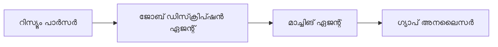
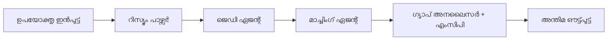

# Module 4 - ഓർക്കസ്ട്രേഷൻ പാറ്റേൺസ്

⏱️ ~10 മിനിറ്റ്

ഈ മോഡ്യൂളിൽ, നിങ്ങൾ Resume Job Fit Evaluator-ൽ ഉപയോഗിക്കുന്ന ഓർക്കസ്ട്രേഷൻ പാറ്റേൺസുകൾ പഠിക്കുകയും workflow ഗ്രാഫ് വായിക്കൽ, മാറ്റം വരുത്തൽ, വിപുലീകരിക്കൽ എങ്ങനെ ചെയ്യാമെന്ന് മനസ്സിലാക്കുകയും ചെയ്യുന്നു. ഡാറ്റാ ഫ്ലോ പ്രശ്നങ്ങൾ ഡീബഗ് ചെയ്യുന്നതിനും [മൾട്ടി-എജന്റ് വർക്‌ഫ്ലോകൾ](https://learn.microsoft.com/agent-framework/workflows/) നിർമ്മിക്കുന്നതിനും ഈ പാറ്റേൺസുകൾ മനസ്സിലാക്കുന്നത് അത്യുത്തമമാണ്.

---

## പാറ്റേൺ 1: സീക്വൻഷ്യൽ ചെയിൻ

workflow-യിലെ അടിസ്ഥാന പാറ്റേൺ **സീക്വൻഷ്യൽ ചെയിൻ** ആണ് - ഓരോ ഏജന്റിന്റെയും ഔട്ട്പുട്ട് നേരിട്ട് അടുത്തതിനായി ഫീഡ് ചെയ്യുന്നു.


```mermaid
flowchart LR
    RP[റിസ്യൂം പാർസർ] --> JD[ജോബ് ഡിസ്‌ക്രിപ്ഷൻ ഏജന്റ്]
    JD --> MA[മാച്ചിങ് ഏജന്റ്]
    MA --> GA[ഗ്യാപ് അനലൈസർ]
```

കോഡിൽ, ഓരോ `add_edge()` കോൾ ചെയിനിൽ ഒരു സ്റ്റെപ്പ് സൃഷ്‌ടിക്കുന്നു:

```python
.add_edge(resume_executor, jd_executor)       # റിസ്യൂംപാഴ്സർ ഔട്ട്പുട്ട് → ജെഡി ഏജന്റ്
.add_edge(jd_executor, matching_executor)     # ജെഡി ഏജന്റ് ഔട്ട്പുട്ട് → മാച്ചിങ് ഏജന്റ്
.add_edge(matching_executor, gap_executor)    # മാച്ചിങ് ഏജന്റ് ഔട്ട്പുട്ട് → ഗ്യാപ് അനലിസർ
```

> **എന്തിനാണ് സീക്വൻഷ്യൽ, ഫാൻ-ഔട്ട്/ഫാൻ-ഇൻ അല്ലെങ്കിൽ?** `WorkflowBuilder` വരുമ്പോൾ ഉള്ള എഡ്ജുകളിൽ **OR-സെമാന്റെക്സ്സ്** ഉപയോഗിക്കുന്നു: ഒരു ഡൗൺസ്റ്റ്രീം എക്സിക്യൂട്ടറിന് ഏതെങ്കിലും മുൻഗാമി പൂർത്തിയാകുമ്പോൾ ഉടൻ ഫയർ ചെയ്യും. `matching_executor`-ന് രണ്ട് ഇൻകമിംഗ് എഡ്ജുകൾ ഉണ്ടായിരുന്നെങ്കിൽ (`resume_executor`-നും `jd_executor`-നും നിന്നും), അത് രണ്ടുതവണ ട്രിഗർ ചെയ്യും - ഒന്ന് ResumeParser പൂർത്തിയാക്കിയപ്പോൾ, മറ്റൊന്ന് JD Agent പൂർത്തിയാക്കിയപ്പോൾ - ഇതിന്റെ ഫലമായി GapAnalyzer രണ്ടുതവണ പ്രവർത്തിച്ച് ഔട്ട്പുട്ട് രണ്ടുതവണ കാണിക്കും. സീക്വൻഷ്യൽ പൈപ്പ്ലൈൻ ഇത് പൂർണമായും ഒഴിവാക്കുന്നു.

## പാറ്റേൺ 2: കൺടെന്റ് റീലേ

`context_mode="last_agent"` എന്നതിനർഥം ഓരോ എക്സിക്യൂട്ടറും ഈ മുൻഗാമിയുടെ ഔട്ട്പുട്ട് മാത്രം കാണുകയും ചെയ്യുന്നതാണ്, അതുകൊണ്ടു് സീക്വൻഷ്യൽ ചെയിനിൽ ഏജന്റുകൾ ഡൗൺസ്റ്റ്രീം ഏജന്റുകൾക്ക് വേണ്ട എല്ലാ ഡാറ്റയും മുൻപോട്ട് വ്യക്തമായി പാസ്സു് ചെയ്യണം.

ഈ workflow-ലിൽ:
- **ResumeParser** JDയു് കൊപ്പി ചെയ്യുന്നു `[JOB DESCRIPTION PASS-THROUGH]`-ലിൽ (അതുവഴി JD Agent അത് കണ്ടെത്തും).
- **JD Agent** `[PARSED RESUME]` സർവ്വസ്വരൂപം `[PARSED RESUME PASS-THROUGH]`-ലിൽ കോപ്പി ചെയ്യുന്നു (അതുവഴി MatchingAgent രണ്ട് പ്രൊഫൈലുകളും താരതമ്യം ചെയ്യും).

```
ResumeParser output
└─ [PARSED RESUME]               ← extracted by JD Agent
└─ [JOB DESCRIPTION PASS-THROUGH] ← extracted by JD Agent

JD Agent output
└─ [JD REQUIREMENTS]             ← extracted by MatchingAgent
└─ [PARSED RESUME PASS-THROUGH]  ← extracted by MatchingAgent
```

ഓരോ റീലേ വിഭാഗവും **സർവ്വസ്വരൂപം** കോപ്പ് ചെയ്യണം - സംഗ്രഹം ചെയ്യുകയോ മാറ്റി പറയുകയോ ചെയ്താൽ അത് ആശ്രയിക്കുന്ന ഡൗൺസ്റ്റ്രീം ഏജൻറ് തെറ്റും.

---

## പൂര്‍ണ ഗ്രാഫ്

സീക്വൻഷ്യൽ ചെയിൻ മുകളിലും കൺടെന്റ് റീലേ പാറ്റേണുകളുടെയും സംയോജനം സമ്പൂർണ്ണ workflow സൃഷ്‌ടിക്കുന്നു:


```mermaid
flowchart LR
    U[ഉപയോക്തൃ ഇൻപുട്ട്] --> RP[റിസ്യൂം പാഴ്സർ]
    RP --> JD[ജെഡി ഏജന്റ്]
    JD --> MA[മാച്ചിംഗ് ഏജന്റ്]
    MA --> GA[ഗ്യാപ് അനലൈസർ + എംസിപി]
    GA --> O[അന്തിമ ഔട്ട്പുട്ട്]
```

ഏജന്റ് ഇന്‍സ്‌പക്ടർ ഏജന്റ് ലോക്കലായി പ്രവർത്തിക്കുമ്പോൾ ഈ ഗ്രാഫ് ഘടന കാണിക്കുന്നു. സ്ക്രീൻഷോട്ടുകൾക്ക് [Module 5 - Test Locally](05-test-locally.md) കാണുക.

---

## WorkflowBuilder കോഡ് വായിക്കൽ

പൂർണ്ണ `create_workflow()` ഫംഗ്ഷൻ [`PersonalCareerCopilot/main.py`](../../../../../workshop/lab02-multi-agent/PersonalCareerCopilot/main.py)-ൽ ഉണ്ട്. മൂന്ന് `add_edge()` കോൾസുകൾ സീക്വൻഷ്യൽ പൈപ്പ്ലൈൻ നിർമ്മിക്കുന്നു:

| # | എഡ്ജ് | ഫലങ്ങൾ |
|---|-------|----------|
| 1 | `resume_executor → jd_executor` | JD Agent получает `[PARSED RESUME]` + `[JOB DESCRIPTION PASS-THROUGH]` |
| 2 | `jd_executor → matching_executor` | MatchingAgent получает `[JD REQUIREMENTS]` + `[PARSED RESUME PASS-THROUGH]` |
| 3 | `matching_executor → gap_executor` | GapAnalyzer получает fit report + gap list |

---

## ഗ്രാഫ് മാറ്റം വരുത്തൽ

### പുതിയ ഏജന്റ് ചേർക്കൽ

അഞ്ചാമത്തെ ഏജന്റ് (ഉദാ: GapAnalyzer കഴിഞ്ഞ് **InterviewPrepAgent**) ചേർക്കാൻ:

1. `INTERVIEW_PREP_INSTRUCTIONS` എന്ന കൺസ്റ്റന്റ് നിർവചിക്കുക.
2. `Agent` + `AgentExecutor` ഒബ്ജക്ട്‌സ് സൃഷ്ടിക്കുക (ഇപ്പഴത്തെ നാലിൽ പോലെ).
3. `WorkflowBuilder`-ൽ `.add_edge(gap_executor, interview_exec)` ചേർക്കുക.
4. `output_executors=[interview_exec]` അപ്ഡേറ്റ് ചെയ്യുക.

> **മഹത്ത്വം:** `start_executor` മാത്രം റാ യു‌സർ ഇൻപുട്ട് സ്വീകരിക്കുന്ന ഏക ഏജന്റാണ്. മറ്റ് ഏജന്റുകൾ എല്ലാവരും അവരുടെ അപ്പ്സ്ട്രീം എഡ്ജിൽ നിന്ന് ഔട്ട്പുട്ട് സ്വീകരിക്കുന്നു.

---

## പൊതുവായ ഗ്രാഫ് പിഴവുകൾ

| പിഴവ് | ലക്ഷണം | പരിഹാരം |
|---------|---------|--------|
| `output_executors`-ലേക്ക് എഡ്ജ് ഇല്ല | ഏജന്റ് പ്രവർത്തിക്കുന്നുണ്ട് പക്ഷേ ഔട്ട്പുട്ട് ശൂന്യമാണ് | `start_executor`-നു് `output_executors`-ലെ ഓരോ ഏജന്റിലേക്കും പാത ഉറപ്പാക്കുക |
| വൃത്താകൃതിയായ ആശ്രയം | അനന്ത ലൂപ് അല്ലെങ്കിൽ ടൈമൗട്ട് | ഏജന്റ് ഒരിക്കൽക്കുമുതൽ അപ്പ്സ്ട്രീം ഏജന്റിലേക്ക് ഫീഡ് ചെയ്യുകയില്ല എന്ന് പരിശോധിക്കുക |
| `output_executors`-ലെ ഏജന്റിന് ഇൻകമിംഗ് എഡ്ജ് ഇല്ല | ഔട്ട്പുട്ട് ശൂന്യമാണ് | കുറഞ്ഞത് ഒരു `add_edge(source, that_agent)` ചേർക്കുക |
| ഫാൻ-ഇൻ ഇല്ലാത്ത ഒട്ടേറെ `output_executors` | ഔട്ട്പുട്ട് ഒരേ ഏജന്റിന്റെ മറുപടി മാത്രം അടങ്ങിയിരിക്കുന്നു | സമാഹാരം ചെയ്യുന്ന ഒരേ output ഏജന്റ് ഉപയോഗിക്കുക, അല്ലെങ്കിൽ പല ഔട്ട്പുട്ടുകളും സ്വീകരിക്കുക |
| `start_executor` ഇല്ല | നിർമ്മാണ സമയത്ത് `ValueError` | എല്ലായ്പ്പോഴും `WorkflowBuilder()`-ൽ `start_executor` നിർവചിക്കുക |

---

## ഗ്രാഫ് ഡീബഗ്ഗിംഗ്

### Agent Inspector ഉപയോഗിച്ച്

1. F5 അമർത്തി ഏജന്റ് ലോക്കലായി ആരംഭിക്കുക.
2. Agent Inspector തുറക്കുക (`Ctrl+Shift+P` → **Foundry Toolkit: Open Agent Inspector**).
3. ഒരു ടെസ്റ്റ് മെസേജ് അയയ്ക്കുക.
4. ഇൻസ്പക്ടറിന്റെ റസ്പോൺസ് പാനലിൽ **സ്റ്റ്രീമിംഗ് ഔട്ട്പുട്ട്** നോക്കുക - ഓരോ ഏജന്റിന്റെ സംഭാവനയും ക്രമമായി കാണാം.


### ലോഗിംഗ് ഉപയോഗിച്ച്

ഡാറ്റാ ഫ്ലോ ട്രേസിനായി `main.py`-യിലേക്ക് ലോഗിംഗ് ചേർക്കുക:

```python
import logging
logger = logging.getLogger("resume-job-fit")

# main()-ൽ, workflow നിർമ്മിച്ചതിന് ശേഷം:
logger.info("Workflow graph built with edges: RP→JD, JD→MA, MA→GA")
```

സർവർ ലോഗുകൾ ഏജന്റ് എക്സിക്യൂഷൻ ഓർഡർയും MCP ടൂൾ കോൾസും കാണിക്കുന്നു:

```
INFO:agent_framework:Executing agent: ResumeParser
INFO:agent_framework:Executing agent: JobDescriptionAgent
INFO:agent_framework:Executing agent: MatchingAgent
INFO:agent_framework:Executing agent: GapAnalyzer
INFO:agent_framework:Tool call: search_microsoft_learn_for_plan(skill="Kubernetes")
POST https://learn.microsoft.com/api/mcp → 200
INFO:agent_framework:Tool call: search_microsoft_learn_for_plan(skill="Terraform")
POST https://learn.microsoft.com/api/mcp → 200
```

---

### ചെക്ക്പോയിന്‍റ്

- [ ] workflow-ലിലെ രണ്ട് ഓർക്കസ്ട്രേഷൻ പാറ്റേണുകളും, സീക്വൻഷ്യൽ ചെയിൻ, കൺടെന്റ് റീലേ തിരിച്ചറിയാൻ കഴിയും
- [ ] `context_mode="last_agent"` എങ്ങനെ ഏജന്റുകൾക്കിടയിലെ ഡാറ്റാ റീലേ ആവശ്യമാണ് എന്ന് മനസ്സിലാക്കുന്നു
- [ ] `WorkflowBuilder` കോഡ് വായിച്ച് ഓരോ `add_edge()` കോൾ ഭ്രമണ ഗ്രാഫുമായി മാപ്പ് ചെയ്യാൻ കഴിയും
- [ ] പൈപ്പ്ലൈനിന്റെ അവസാനം ഒരു പുതിയ ഏജന്റ് എങ്ങിനെയാണ് ചേർക്കുന്നത് അറിയുന്നു
- [ ] പൊതുവായ ഗ്രാഫ് പിഴവുകളും അവയുടെ ലക്ഷണങ്ങളും തിരിച്ചറിയാൻ കഴിയും

---

**മുൻപത്തെ:** [03 - Configure Agents & Environment](03-configure-agents.md) · **അടുത്തത്:** [05 - Test Locally →](05-test-locally.md)

---

<!-- CO-OP TRANSLATOR DISCLAIMER START -->
**അറിയിപ്പ്**:
ഈ രേഖ AI പരിഭാഷാ സേവനം [Co-op Translator](https://github.com/Azure/co-op-translator) ഉപയോഗിച്ച് പരിഭാഷപ്പെടുത്തിയതാണ്. ഞങ്ങൾ കൃത്യതയ്ക്കായി ശ്രമിക്കുന്നുവെങ്കിലും, ഓട്ടോമേറ്റഡ് പരിഭാഷകളിൽ പിഴവുകൾ അല്ലെങ്കിൽ തെറ്റായ വിവരങ്ങൾ ഉണ്ടാകാൻ സാധ്യതയുണ്ട്. അതിന്റെ സ്വാഭാവിക ഭാഷയിലുള്ള അസൽ രേഖയാണ് പ്രാമാണികമായ ഉറവിടമായി പരിഗണിക്കേണ്ടത്. നിർണായകമായ വിവരങ്ങൾക്ക്, പ്രൊഫഷണൽ മനുഷ്യ പരിഭാഷ ശുപാർശ ചെയ്യുന്നു. ഈ പരിഭാഷ ഉപയോഗിച്ച് ഉണ്ടാകുന്ന തെറ്റിദ്ധാരണകൾ അല്ലെങ്കിൽ തെറ്റായ വ്യാഖ്യാനങ്ങൾക്കായി ഞങ്ങൾ ഉത്തരവാദികളല്ല.
<!-- CO-OP TRANSLATOR DISCLAIMER END -->