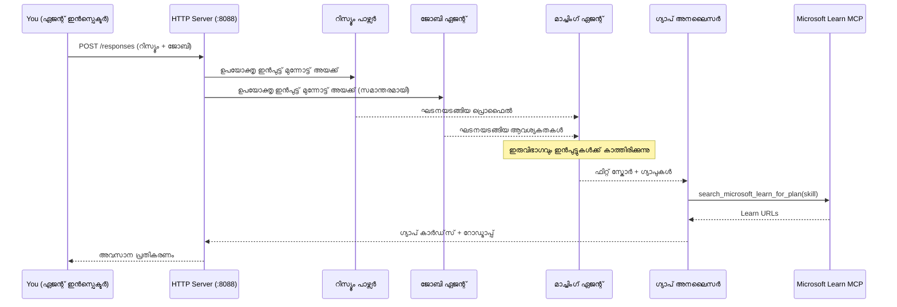
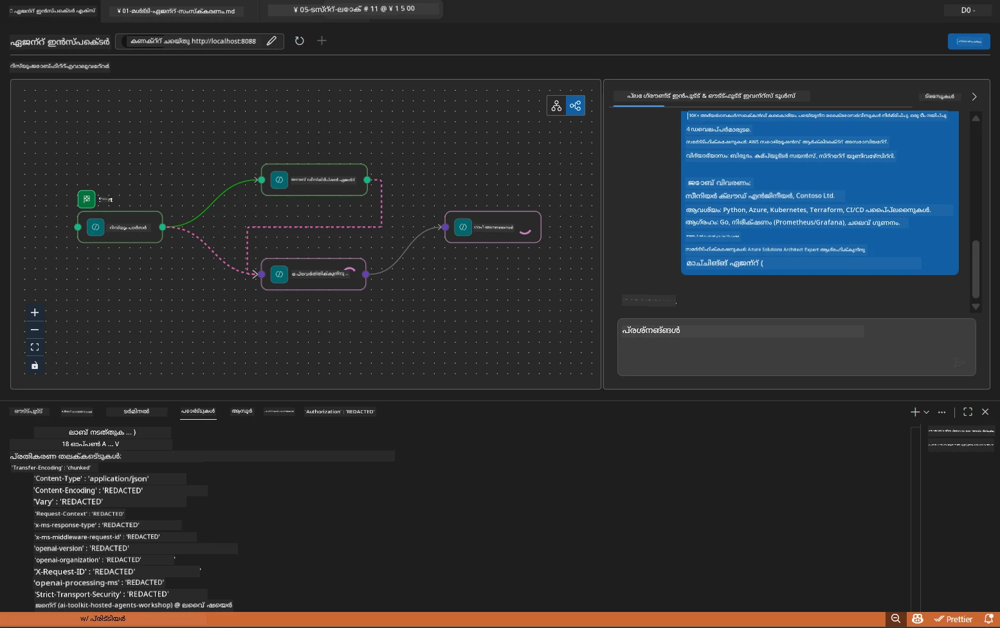

# Module 5 - പ്രാദേശികമായി ടെസ്റ്റ് ചെയ്യുക (മൾട്ടി-ഏജന്റ്)

ഈ മോഡ്യൂളിൽ, നിങ്ങൾ മൾട്ടി-ഏജന്റ് വർക്‌ഫ്ലോ പ്രാദേശികമായി പ്രവർത്തിപ്പിച്ച്, Agent Inspector ഉപയോഗിച്ച് പരിശോധിച്ച്, ആറ്റം നാലു ഏജന്റുകളും MCP ഉപകരണം ശരിയായി പ്രവർത്തിക്കുന്നുവെന്ന് സ്ഥിരീകരിച്ച് Foundry-യിൽ വിറയ്ക്കും മുമ്പ് ടെസ്റ്റ് ചെയ്യും.

### പ്രാദേശിക ടെസ്റ്റ് റണ്ണിംഗിനിടയിൽ സംഭവിക്കുന്നതെന്ത്


---

## ഘട്ടം 1: ഏജന്റ് സർവർ ആരംഭിക്കുക

### ഓപ്ഷൻ A: VS Code ടാസ്ക് ഉപയോഗിച്ച് (പരാമർശനീയമായത്)

1. `Ctrl+Shift+P` അമർത്തുക → **Tasks: Run Task** ടൈപ്പ് ചെയ്യുക → **Run Lab02 HTTP Server** തിരഞ്ഞെടുക്കുക.
2. ടാസ്‌ക് debugpy ബന്ധിപ്പിച്ച് `5679` പോർട്ടിൽ സർവർ ആരംഭിക്കുന്നു, ഏജന്റ് `8088` പോർട്ടിൽ പ്രവർത്തിക്കുന്നു.
3. ഔട്ട്‌പുട്ട് താഴെ കാണുമ്പോളവരെ കാത്തിരിക്കൂ:

```
INFO:resume-job-fit:Starting Resume -> Job Fit Evaluator HTTP server...
INFO:resume-job-fit:Server running on http://localhost:8088
```

### ഓപ്ഷൻ B: ടെർമിനൽ വഴി മാനുവലായി

```powershell
cd workshop\lab02-multi-agent\PersonalCareerCopilot
```

വിൻച് സ്ഥലാന്തരങ്ങൾ സജീവമാക്കുക:

**PowerShell (Windows):**
```powershell
.\.venv\Scripts\Activate.ps1
```

**macOS/Linux:**
```bash
source .venv/bin/activate
```

സർവർ ആരംഭിക്കുക:

```powershell
python -m debugpy --listen 127.0.0.1:5679 -m agentdev run main.py --verbose --port 8088
```

### ഓപ്ഷൻ C: F5 ഉപയോഗിച്ച് (ഡീബഗ് മോഡ്)

1. `F5` അമർത്തുക അല്ലെങ്കിൽ **Run and Debug** (`Ctrl+Shift+D`) സന്ദർശിക്കുക.
2. ഡ്രോപ്പ് ഡൗണിൽ നിന്നു **Lab02 - Multi-Agent** ലോഞ്ച് കൺഫിഗറേഷൻ തിരഞ്ഞെടുക്കുക.
3. സർവർ പൂര്‍ണമായ ബ്രേക്ക്പോയിന്റ് സഹായത്തോടെ ആരംഭിക്കും.

> **ടിപ്:** ഡീബഗ് മോഡ് നിങ്ങളെ `search_microsoft_learn_for_plan()`-ല് ബ്രേക്ക്പോയിന്റുകൾ ചേർക്കുന്നതിനും MCP പ്രതികരണങ്ങൾ പരിശോധിക്കുന്നതിനും, ഏജന്റ് നിർദ്ദേശസ്ട്രിംഗിൽ ബ്രേക്ക്പോയിന്റുകൾ കണ്ടെത്തുന്നതിനും സഹായിക്കുന്നു, ഏജന്റ് ഓരോന്നും ലഭിക്കുന്ന വിവരങ്ങൾ കാണാൻ.

---

## ഘട്ടം 2: Agent Inspector തുറക്കുക

1. `Ctrl+Shift+P` അമർത്തുക → **Foundry Toolkit: Open Agent Inspector** ജില്ലാ എഴുതുക.
2. Agent Inspector ബ്രൗസർ ടാബിൽ `http://localhost:5679`-ൽ തുറക്കും.
3. നിങ്ങൾക്ക് ഏജന്റ് ഇന്റർഫേസ് സന്ദേശങ്ങൾ സ്വീകരിക്കാൻ സജ്ജമെന്ന് കാണണം.

> **Agent Inspector തുറക്കുന്നില്ലെങ്കിൽ:** സർവർ മുഴുവനായി ആരംഭിച്ചതായിരിക്കുമെന്ന് ഉറപ്പാക്കുക ("Server running" ലോഗ് കാണുന്നു). `5679` പോർട്ട് തിരക്കിലാണ് എങ്കിൽ, [Module 8 - Troubleshooting](08-troubleshooting.md) സന്ദർശിക്കുക.

---

## ഘട്ടം 3: സ്മോക്ക് ടെസ്റ്റുകൾ പ്രവർത്തിപ്പിക്കുക

ക്രമത്തിൽ താഴെപ്പറയുന്ന മൂന്ന് ടെസ്റ്റുകളും പ്രവർത്തിപ്പിക്കുക. ഓരോ ടെസ്റ്റും വർക്ക്‌ഫ്ലോയുടെ കൂടുതൽ ഭാഗം പരിശോധിക്കുന്നു.

### ടെസ്റ്റ് 1: അടിസ്ഥാന റിസ്യൂം + ജോബ് വിവരണം

താഴെ ഇതനി പകർത്തി Agent Inspector-ൽ പേസ്റ്റ് ചെയ്യുക:

```
Resume:
Jane Doe
Senior Software Engineer with 5 years of experience in Python, Django, and AWS.
Built microservices handling 10K+ requests/second. Led a team of 4 developers.
Certifications: AWS Solutions Architect Associate.
Education: B.S. Computer Science, State University.

Job Description:
Senior Cloud Engineer at Contoso Ltd.
Required: Python, Azure, Kubernetes, Terraform, CI/CD pipelines.
Preferred: Go, monitoring (Prometheus/Grafana), cost optimization.
Experience: 5+ years in cloud infrastructure.
Certifications: Azure Solutions Architect Expert preferred.
```

**പ്രതീക്ഷയുള്ള ഔട്ട്‌പുട്ട് ഘടന:**

രണ്ട് ഏജന്റുകൾറേയും ഒരുമിച്ച് നാലിൽ നിന്ന് എല്ലാ ഏജന്റുകളും തുടർച്ചയായി ഔട്ട്‌പുട്ട് നൽകണം:

1. **റിസ്യൂം പാർസർ ഔട്ട്‌പുട്ട്** - കഴിവുകൾ വിഭാഗം പ്രകാരം കൂട്ടിച്ചേർത്ത സജ്ജീകരിച്ച സ്ഥാനാർത്ഥി പ്രൊഫൈൽ
2. **ജെഡി ഏജന്റ് ഔട്ട്‌പുട്ട്** - ആവശ്യമായ കഴിവുകളും ഔപചാരികവും വ്യത്യസ്തമായി സജ്ജീകരിച്ച ആവശ്യങ്ങൾ
3. **മാച്ചിംഗ് ഏജന്റ് ഔട്ട്‌പുട്ട്** - ഇൻകമ്പ്രീഹെൻസീവ് സ്‌കോർ (0-100) വിഭാഗീകരണം, പൊരുത്തപ്പെടുന്ന കഴിവുകൾ, കാണാത്ത കഴിവുകൾ, ഇടവേളകൾ
4. **ഗാപ് അനലൈസർ ഔട്ട്‌പുട്ട്** - ഓരോ ഇല്ലായ്മയ്ക്കും വ്യക്തിഗത ഗാപ് കാർഡുകൾ, ഓരോന്നിനും Microsoft Learn URLs എന്നിവ



### ടെസ്റ്റ് 1-ൽ പരിശോധിക്കേണ്ടത്

| പരിശോധിക്കുക | പ്രതീക്ഷിക്കുന്നത് | പാസ്സായി? |
|---------------|-----------------|------------|
| ഫിറ്റ് സ്‌കോർ അടങ്ങിയിരിക്കുന്നു | 0-100 സംഖ്യ വിഭാഗമുണ്ട് | |
| പൊരുത്തപ്പെട്ട കഴിവുകൾ പട്ടികപ്പെടുത്തിയിരിക്കുന്നു | Python, CI/CD (പാർഷ്യൽ), തുടങ്ങിയവ | |
| കാണാത്ത കഴിവുകൾ പട്ടികപ്പെടുത്തിയിരിക്കുന്നു | Azure, Kubernetes, Terraform, തുടങ്ങിയവ | |
| ഓരോ കാണാത്ത കഴിവിനും ഗാപ് കാർഡുകൾ ഉണ്ട് | ഓരോ കഴിവിനും ഒരെണ്ണം | |
| Microsoft Learn URLs ഉണ്ട് | യഥാർത്ഥ `learn.microsoft.com` ലിങ്കുകൾ | |
| പ്രതികരണത്തിൽ പിഴവ് സന്ദേശങ്ങൾ ഇല്ല | ശുചിത്വമുള്ള ഘടനാപരമായ ഔട്ട്‌പുട്ട് | |

### ടെസ്റ്റ് 2: MCP ഉപകരണം പ്രവർത്തനം പരിശോധിക്കുക

ടെസ്റ്റ് 1 പ്രവർത്തിക്കുമ്പോൾ, **സർവർ ടെർമിനൽ** MCP ലോഗ് എൻട്രികൾ പരിശോധിക്കുക:

```
GET https://learn.microsoft.com/api/mcp → 405 (Method Not Allowed)
POST https://learn.microsoft.com/api/mcp → 200
DELETE https://learn.microsoft.com/api/mcp → 405 (Method Not Allowed)
```

| ലോഗ് എൻട്രി | അർത്ഥം | പ്രതീക്ഷിക്കുന്നതോ? |
|--------------|----------|-------------------|
| `GET ... → 405` | MCP ക്ലയന്റ് ഇൻഷിയലൈസേഷനിൽ GET ഉപയോഗിച്ച് പരിശോധന നടത്തുന്നു | അതെ - സാധാരണ |
| `POST ... → 200` | Microsoft Learn MCP സർവറിലേക്ക് യഥാർത്ഥ ടൂൾ കേൾവിപ്രവൃത്തി | അതെ - ഇത് യഥാർത്ഥ കോൾ ആണ് |
| `DELETE ... → 405` | ക്ലീൻഅപ്പ് സമയത്ത് MCP ക്ലയന്റ് DELETE ഉപയോഗിച്ച് പരിശോധന നടത്തുന്നു | അതെ - സാധാരണ |
| `POST ... → 4xx/5xx` | ടൂൾ കോളുകൾ പരാജയപ്പെട്ടു | ഇല്ല - [Troubleshooting](08-troubleshooting.md) കാണുക |

> **പ്രധാന കാര്യങ്ങൾ:** `GET 405`യും `DELETE 405`യും **പ്രതീക്ഷിക്കുന്ന പെരുമാറ്റമാണ്**. `POST` കോളുകൾ 200-അല്ലാത്ത സ്റ്റാറ്റസ് കോഡുകൾ നൽകിയാൽ മാത്രമേ പ്രധാനം ആകൂ.

### ടെസ്റ്റ് 3: അതിവേഗം പൊരുത്തപ്പെടുന്ന സ്ഥാനാർത്ഥി

ജോബ് വിവരണത്തിന് ഏറ്റവും ഓരായിരിക്കണ റിസ്യൂം പേസ്റ്റ് ചെയ്ത് GapAnalyzer ഉയർന്ന ഫിറ്റ് കേസുകൾ കൈകാര്യം ചെയ്യുന്നതെന്താണെന്ന് ഉറപ്പാക്കുക:

```
Resume:
Alex Chen
Senior Cloud Engineer with 7 years of experience.
Skills: Python, Azure (AKS, Functions, DevOps), Kubernetes, Terraform, CI/CD (GitHub Actions, Azure Pipelines), Go, Prometheus, Grafana, cost optimization.
Certifications: Azure Solutions Architect Expert, Azure DevOps Engineer Expert.
Led infrastructure migration to Azure for 3 enterprise clients.
Education: M.S. Computer Science, Tech University.

Job Description:
Senior Cloud Engineer at Contoso Ltd.
Required: Python, Azure, Kubernetes, Terraform, CI/CD pipelines.
Preferred: Go, monitoring (Prometheus/Grafana), cost optimization.
Experience: 5+ years in cloud infrastructure.
Certifications: Azure Solutions Architect Expert preferred.
```

**പ്രതീക്ഷിക്കുന്ന പെരുമാറ്റം:**
- ഫിറ്റ് സ്കോർ **80+** ആയിരിക്കണം (പരമാവധി കഴിവുകൾ പൊരുത്തപ്പെടുന്നു)
- ഗാപ് കാർഡുകൾ അടിസ്ഥാന പഠനത്തിലേക്കുള്ള പകരം പള്ളിഷ്/ഇന്റർവ്യൂ റെഡിനസിൽ കേന്ദ്രീകരിക്കും
- GapAnalyzer നിർദ്ദേശങ്ങൾ പറയുന്നു: "ഫിറ്റ് >= 80 ആയാൽ, പള്ളിഷ്/ഇന്റർവ്യൂ റെഡിനസിൽ ശ്രദ്ധ കേന്ദ്രീകരിക്കുക"

---

## ഘട്ടം 4: ഔട്ട്‌പുട്ടിന്റെ പൂർണ്ണത പരിശോധിക്കുക

ടെസ്റ്റുകൾ പ്രവർത്തിച്ചതിന് ശേഷം, ഔട്ട്‌പുട്ട് താഴെ പറയുന്ന നിബന്ധനകൾ പാലിക്കുന്നുവെന്ന് ഉറപ്പാക്കുക:

### ഔട്ട്‌പുട്ട് ഘടനാ പരിശോധന പട്ടിക

| വിഭാഗം | ഏജന്റ് | നിലവിലുള്ളതോ? |
|--------|---------|-----------------|
| സ്ഥാനാർത്ഥി പ്രൊഫൈൽ | റിസ്യൂം പാർസർ | |
| സാങ്കേതിക കഴിവുകൾ (ഗ്രൂപ്പുചെയ്‌തത്) | റിസ്യൂം പാർസർ | |
| ജോലി അവലോകനം | ജെഡി ഏജന്റ് | |
| ആവശ്യമുള്ള vs. എതിരാളി കഴിവുകൾ | ജെഡി ഏജന്റ് | |
| ഫിറ്റ് സ്കോർ വിഭജനം സഹിതം | മാച്ചിംഗ് ഏജന്റ് | |
| പൊരുത്തപ്പെട്ട / കാണാത്ത / ഭാഗിക കഴിവുകൾ | മാച്ചിംഗ് ഏജന്റ് | |
| കാണാതുടഞ്ഞ കഴിവിനുള്ള ഗാപ് കാർഡ് | ഗാപ് അനലൈസർ | |
| ഗാപ് കാർഡുകളിൽ Microsoft Learn URLs | ഗാപ് അനലൈസർ (MCP) | |
| പഠനക്രമം (നമ്പർ ചേർത്തത്) | ഗാപ് അനലൈസർ | |
| ടൈംലൈൻ സംഗ്രഹം | ഗാപ് അനലൈസർ | |

### സാധാരണ പ്രശ്നങ്ങൾ ഈ ഘട്ടത്തിൽ

| പ്രശ്നം | കാരണം | പരിഹാരം |
|---------|---------|----------|
| ഒരിക്കൽ മാത്രം ഗാപ് കാർഡ് (മറ്റവ ഒഴിവാക്കി) | GapAnalyzer നിർദ്ദേശങ്ങളിൽ CRITICAL ബ്ലോക്ക് കാണാത്തത് | `CRITICAL:` പാരഗ്രാഫ് `GAP_ANALYZER_INSTRUCTIONS`-ലെ ചേർക്കുക - [Module 3](03-configure-agents.md) കാണുക |
| Microsoft Learn URLs ഇല്ല | MCP എണ്ട്പോയിന്റ് എത്തിക്കാനാകുന്നില്ല | ഇന്റർനെറ്റ് കണക്ഷൻ പരിശോധിക്കുക. `.env`-ൽ `MICROSOFT_LEARN_MCP_ENDPOINT` `https://learn.microsoft.com/api/mcp` ആണെന്ന് ഉറപ്പാക്കുക |
| ശൂന്യമായ മറുപടി | `PROJECT_ENDPOINT` അല്ലെങ്കിൽ `MODEL_DEPLOYMENT_NAME` ക്രമീകരിച്ചിട്ടില്ല | `.env` ഫയൽ മൂല്യങ്ങൾ പരിശോധിക്കുക. ടെർമിനലിൽ `echo $env:PROJECT_ENDPOINT` റൺ ചെയ്യുക |
| ഫിറ്റ് സ്‌കോർ 0 അല്ലെങ്കിൽ കാണാനില്ല | MatchingAgent-ന് മുകളിലെ ഡാറ്റ ലഭിച്ചിട്ടില്ല | `create_workflow()`-ൽ `add_edge(resume_parser, matching_agent)` ഒപ്പം `add_edge(jd_agent, matching_agent)` ഉള്ളതായി ഉറപ്പാക്കുക |
| ഏജന്റ് ആരംഭിക്കും, ഉടനെ നിൽക്കും | ഇറക്കുമതി പിശക് അല്ലെങ്കിൽ അതിനാവശ്യമായ ഡിപ്പെൻഡൻസികൾ നഷ്ടം | `pip install -r requirements.txt` വീണ്ടും ഓടിക്കുക. ടെർമിനലിൽ സ്റ്റാക്ക് ട്രേസുകൾ പരിശോധിക്കുക |
| `validate_configuration` പിശക് | ആവശ്യമായ എൻവിയോണ്മെന്റ് വേരിയബിളുകൾ ഇല്ല | `.env` സൃഷ്ടിച്ച് `PROJECT_ENDPOINT=<your-endpoint>`യും `MODEL_DEPLOYMENT_NAME=<your-model>`യും ചേർക്കുക |

---

## ഘട്ടം 5: നിങ്ങളുടെ സ്വന്തം ഡാറ്റ ഉപയോഗിച്ച് ടെസ്റ്റ് ചെയ്യുക (ഐച്ഛികം)

നിങ്ങളുടെ സ്വന്തം റിസ്യൂംയും യഥാർത്ഥ ജോബ് വിവരണവും പേസ്റ്റ് ചെയ്ത് നോക്കുക. ഇത് സഹായിക്കുന്നു മനസ്സിലാക്കാൻ:

- ഏജന്റുകൾ വ്യത്യസ്ത റിസ്യൂം ഫോർമാറ്റുകൾ കൈകാര്യം ചെയ്യുന്നതെങ്ങനെ (ക്രമപരമാകമ്പരമായ, ഫംഗ്ഷണൽ, ഹൈബ്രിഡ്)
- ജെഡി ഏജന്റ് വിവിധ ജോബ് ഡിസ്ക്രിപ്ഷൻ ശൈലികൾ പരിഗണിക്കുന്നു (ബുള്ളറ്റ് പോയിന്റുകൾ, പാരഗ്രാഫ്, ഘടനാപരമായ)
- MCP ഉപകരണം യഥാർത്ഥ കഴിവുകൾക്കായി പ്രസക്തമായ വിഭവങ്ങൾ തിരിച്ചടയ്ക്കുന്നു
- ഗാപ് കാർഡുകൾ നിങ്ങളുടെ വ്യക്തിഗത പശ്ചാത്തലത്തിന് അനുയായിയായി ഉണ്ട്

> **സ്വകാര്യത കുറിപ്പ്:** പ്രാദേശികമായി ടെസ്റ്റുചെയ്യുമ്പോൾ, നിങ്ങളുടെ ഡാറ്റ നിങ്ങളുടെ മെഷീനിൽ മാത്രമേ ഉണ്ടാക്കപ്പെടൂ, അത് മാത്രമേ നിങ്ങളുടെ Azure OpenAI വിന്യാസത്തിലേക്ക് അയക്കപ്പെടൂ. വേണമെങ്കിൽ പ്ലേസ്‌ഹോൾഡർ നാമങ്ങൾ ഉപയോഗിക്കുക (ഉദാഹരണത്തിന്, "ജെയിൻ ഡോ" നിങ്ങളുടെ യഥാർത്ഥ പേരിനുപകരം).

---

### ചെക്ക്പോയിന്റ്

- [ ] `8088` പോർട്ടിൽ സർവർ വിജയകരമായി ആരംഭിച്ചു ("Server running" ലോഗിൽ കാണുന്നു)
- [ ] Agent Inspector തുറന്ന് ഏജന്റുമായി ബന്ധപ്പെട്ടു
- [ ] ടെസ്റ്റ് 1: ഫിറ്റ് സ്‌കോർ, പൊരുത്തപ്പെട്ട/കാണാത്ത കഴിവുകൾ, ഗാപ് കാർഡുകൾ, Microsoft Learn URLs എന്നിവയുളള പൂർണ്ണ പ്രതികരണം
- [ ] ടെസ്റ്റ് 2: MCP ലോഗുകൾ `POST ... → 200` കാണിക്കുന്നു (ടൂൾ കോൾ വിജയകരം)
- [ ] ടെസ്റ്റ് 3: ഉയർന്ന പൊരുത്തപെട്ട സ്ഥാനാർത്ഥിക്ക് 80+ സ്‌കോർ പോളിഷ് കേന്ദ്രീകരിച്ച ശുപാർശകൾসহ
- [ ] എല്ലാ ഗാപ് കാർഡുകളും ഉണ്ടാക്കപ്പെട്ടിരിക്കുന്നു (ഓരോ കാണാത്ത കഴിവിനും ഒന്ന്, യാതൊരു കുറവുമില്ല)
- [ ] സർവർ ടെർമിനലിൽ പിഴവുകളും സ്റ്റാക്ക് ട്രേസുകളും ഇല്ല

---

**മുൻപ്:** [04 - ഓർക്കസ്ട്രേഷൻ പാറ്റേൺസ്](04-orchestration-patterns.md) · **തിരുഗി:** [06 - ഫൗണ്ടറിയിലേക്ക് വിന്യസിക്കുക →](06-deploy-to-foundry.md)

---

<!-- CO-OP TRANSLATOR DISCLAIMER START -->
**സംഭാവന**:  
ഈ രേഖ AI പരിഭാഷ സേവനം [Co-op Translator](https://github.com/Azure/co-op-translator) ഉപയോഗിച്ച് വിവർത്തനം ചെയ്‌തിരിക്കുന്നു. നാം കൃത്യതക്ക് ശ്രമിച്ചെങ്കിലും, സ്വയം പ്രവർത്തിക്കുന്ന വിവർത്തനങ്ങളിൽ പിശകുകളും തെറ്റായ വിവരങ്ങളും ഉണ്ടായേക്കാമെന്ന് ദയവായി ശ്രദ്ധിക്കുക. അതിന്റെ മാതൃഭാഷയിലെ മൗലിക രേഖയാണ് വിശ്വസനീയമായ ഉറവിടം. നിർണായകമായ വിവരങ്ങൾക്ക്, പ്രൊഫഷണൽ മനുഷ്യ വിവർത്തനം ശുപാർശ ചെയ്യുന്നു. ഈ വിവർത്തനം ഉപയോഗിക്കുന്നതിലൂടെ ഉണ്ടാകുന്ന ഏതെങ്കിലും തെറ്റുസമജ്ഞങ്ങളും തെറ്റായ വ്യാഖ്യാനങ്ങൾക്കും ഞങ്ങൾ ഉത്തരവാദിത്വമില്ല.
<!-- CO-OP TRANSLATOR DISCLAIMER END -->