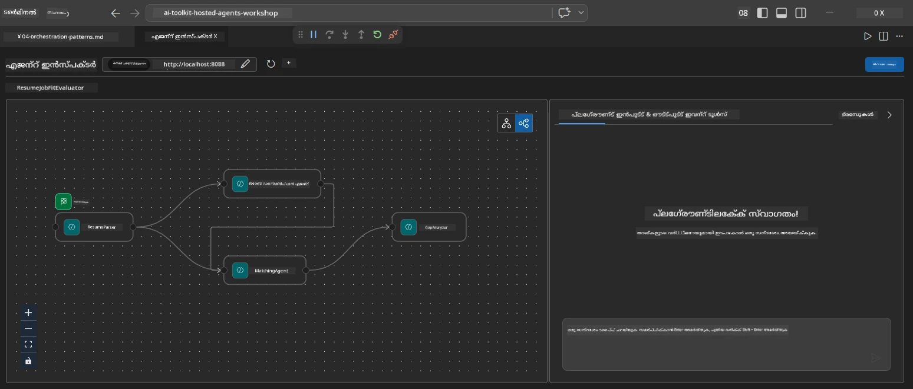
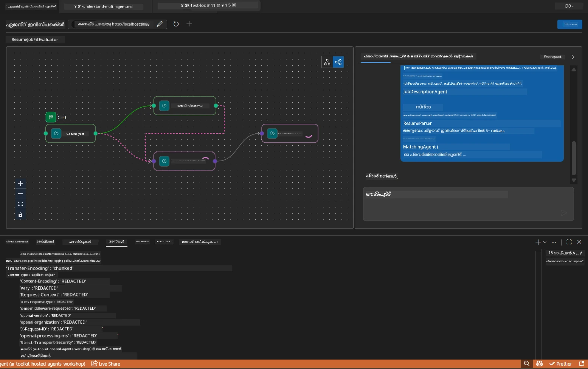
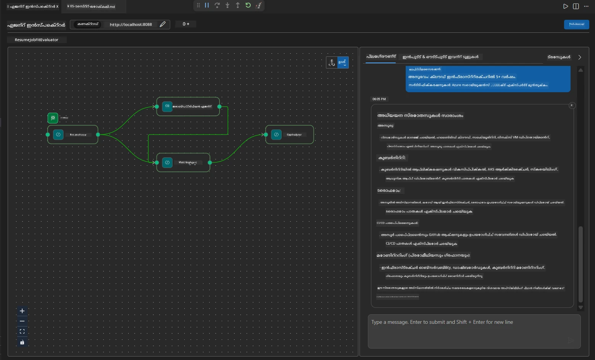

# Module 5 - പ്രാദേശികമായി പരീക്ഷിക്കുക

⏱️ ~15 മിനിറ്റ്

ഈ മോദ്യൂളിൽ, നിങ്ങൾ മൾട്ടി-ഏജന്റ് വർക്‌ഫ്ലോ പ്രാദേശികമായി പ്രവർത്തിപ്പിക്കുകയും, ഏജന്റ് ഇൻസ്പക്ടർ ഉപയോഗിച്ച് പരീക്ഷിക്കുകയും, ഏആർ നാലു ഏജന്റുകളും MCP ടൂൾ ശരിയായി പ്രവർത്തിക്കുന്നുവെന്ന് deploy ചെയ്യുന്നതിനു മുൻപ് സ്ഥിരീകരിക്കുകയും ചെയ്യും.

---

## ഘട്ടം 1: ഏജന്റ് സർവർ ആരംഭിക്കുക

### ഓപ്ഷൻ A: VS കോഡ് ടാസ്‌ക് ഉപയോഗിച്ച് (ശുപാർശ ചെയ്യുന്നു)

1. `workshop/lab02-multi-agent/PersonalCareerCopilot/` നിങ്ങളുടെ VS കോഡ് ഫോൾഡറായി തുറക്കുക.
2. `Ctrl+Shift+P` അമർത്തുക → **Tasks: Run Task** ടൈപ്പ് ചെയ്യുക → **Run Agent HTTP Server** തിരഞ്ഞെടുക്കുക.
3. ടാസ്‌ക് പോർട്ട് `5679` ന് debugpy ചേർത്തും 8088 പോർട്ടിൽ ഏജന്റ് സർവർ ആരംഭിക്കും.
4. ഔട്ട്പുട്ട് താഴെ കാണിച്ചിരിക്കുന്നതുപോലെ വരേന്ന് കാത്തിരിക്കുക:

```
INFO:resume-job-fit:Starting Resume -> Job Fit Evaluator HTTP server...
INFO:resume-job-fit:Server running on http://localhost:8088
```

### ഓപ്ഷൻ B: F5 (ഡീബഗ് മോഡ്) ഉപയോഗിച്ച്

1. `F5` അമർത്തുക → **Debug Local Agent HTTP Server** തിരഞ്ഞെടുക്കുക.
2. സർവർ മുഴുവൻ ബ്രേക്ക്പോയിന്റ് പിന്തുണയോടെ ആരംഭിക്കും - MCP പ്രതികരണങ്ങൾ അല്ലെങ്കിൽ ഏജന്റ് ഔട്ട്പുട്ടുകൾ പരിശോധിക്കാൻ ഉപകാരപ്പെടും.

---

## ഘട്ടം 2: ഏജന്റ് ഇൻസ്പക്ടർ തുറക്കുക

1. `Ctrl+Shift+P` അമർത്തുക → **Foundry Toolkit: Open Agent Inspector** ടൈപ്പുചെയ്യുക.
2. ഏജന്റ് ഇൻസ്പക്ടർ ഒരു VS കോഡ് പാനലായി `http://localhost:8088`-നോടൊപ്പം തുറക്കും.
3. ഏജന്റ് സന്ദേശങ്ങൾ സ്വീകരിക്കാൻ_interface_ തയ്യാറായിരിക്കുന്നതായി കാണണം.



> **ഏജന്റ് ഇൻസ്പക്ടർ തുറക്കാത്തപക്ഷം:** സർവർ പൂർണ്ണമായി തുടങ്ങി ("Server running" ലോഗ് കാണുക) എന്നത് ഉറപ്പാക്കുക. പോർട്ട് 5679 ബിസിയാണെങ്കിൽ, [Module 8 - Troubleshooting](08-troubleshooting.md) കാണുക.

---

## ഘട്ടം 2b: (ഐച്ഛികം) വർക്‌ഫ്ലോ വിസ്വലൈസർ തുറക്കുക

ഫൗണ്ട്രി ടൂൾകിറ്റ് ഒരു റിയൽ-ടൈം **Workflow Visualizer** ഉൾക്കൊള്ളുന്നു, ഇത് ഗ്രാഫ് പ്രവർത്തിക്കുന്നതിനൊപ്പം ഏജന്റുകൾ എങ്ങനെ അപ്രവർത്തിക്കുന്നുവെന്ന് കാണിക്കുന്നു. മൾട്ടി-ഏജന്റ് ഡീബഗിംഗിന് ഇത് പ്രത്യേകിച്ച് ഉപകാരപ്രദമാണ്.

1. `Ctrl+Shift+P` അമർത്തുക → **Foundry Toolkit: Open Visualizer for Hosted Agents** ടൈപ്പ് ചെയ്യുക.
2. ഒരു പുതിയ VS കോഡ് ടാബ് തുറക്കുകയും ലൈവ് എക്സിക്യൂഷൻ ഗ്രാഫ് കാണിക്കുകയും ചെയ്യും.
3. ഏജന്റ് ഇൻസ്പക്ടറിൽ സന്ദേശങ്ങൾ അയക്കുമ്പോൾ, വിസ്വലൈസർ സ്വയം അപ്ഡേറ്റ് ചെയ്യും - പൂർത്തിയായ ഏജന്റുകൾക്ക് പച്ച നിറമുള്ള നോട്ടുകൾ, ഡാറ്റ ഒഴുകുന്ന സജീവ എഡ്ജുകൾ കാണിക്കും.

> **പോർട്ട് തകരാർ:** വിസ്വലൈസർ പോർട്ട് ഉപയോഗത്തിലാണ് എങ്കിൽ, VS കോഡ് സെറ്റിംഗ്സിൽ → **Extensions** → **Microsoft Foundry Configuration** → **Hosted Agents: Visualizer Port**-ൽ മാറ്റുക.

---

## ഘട്ടം 3: സ്മോക്ക് ടെസ്റ്റുകൾ നടത്തുക

ഈ മൂന്ന് ടെസ്റ്റുകളും ക്രമത്തിൽ നടത്തുക. ഓരോ ടെസ്റ്റും വർക്‌ഫ്ലോയുടെ കൂടുതൽ ഭാഗങ്ങൾ പരീക്ഷിക്കുന്നു.

### ടെസ്റ്റ് 1: അടിസ്ഥാന റിസ്യൂം + ജോലി വിവരണം

താഴെ കൊടുത്തത് ഏജന്റ് ഇൻസ്പക്ടറിൽ പേസ്റ്റ് ചെയ്യുക:

```
Resume:
Jane Doe
Senior Software Engineer with 5 years of experience in Python, Django, and AWS.
Built microservices handling 10K+ requests/second. Led a team of 4 developers.
Certifications: AWS Solutions Architect Associate.
Education: B.S. Computer Science, State University.

Job Description:
Senior Cloud Engineer at Contoso Ltd.
Required: Python, Azure, Kubernetes, Terraform, CI/CD pipelines.
Preferred: Go, monitoring (Prometheus/Grafana), cost optimization.
Experience: 5+ years in cloud infrastructure.
Certifications: Azure Solutions Architect Expert preferred.
```

**പ്രതികരണത്തിന്റെ പ്രതീക്ഷിച്ച ഘടന:**

പ്രതികരണത്തിൽ നാല് ഏജന്റുകളുടെ ഔട്ട്പുട്ട് പരമ്പരയായി ഉൾപ്പെടണം:

1. **റിസ്യൂം പാർസർ ഔട്ട്പുട്ട്** - രണ്ടു ലേബൽ ചെയ്ത വിഭാഗങ്ങൾ: `[PARSED RESUME]` (ഗ്രൂപ്പുചെയ്ത നൈപുണ്യങ്ങളോട് സ്ഥാനാർത്ഥി പ്രൊഫൈൽ)യും `[JOB DESCRIPTION PASS-THROUGH]` (കൃത്യമായ ജോബ് വിവരണം, JD ഏജന്റിന്റെ ഇൻപുട്ട്)
2. **JD ഏജന്റ് ഔട്ട്പുട്ട്** - ആവശ്യമായ നൈപുണ്യങ്ങൾ വേർതിരിച്ചുള്ള ഘടനാപരമായ ആവശ്യങ്ങൾ
3. **മാച്ചിംഗ് ഏജന്റ് ഔട്ട്പുട്ട്** - ഫിറ്റ് സ്‌കോർ (0-100), ബ്രേക്ക്ഡൗൺ, പൊരുത്തപ്പെട്ട നൈപുണ്യങ്ങൾ, കാണാത്ത നൈപുണ്യങ്ങൾ, അജകംഖകൾ
4. **ഗ്യാപ് അനലൈസർ ഔട്ട്പുട്ട്** - ഓരോ കാണാത്ത നൈപുണ്യത്തെയും Microsoft Learn URLs ഉൾക്കൊള്ളുന്ന വ്യത്യസ്ത ഗ്യാപ് കാർഡുകൾ





### ടെസ്റ്റ് 1-ൽ എന്ത് പരിശോധിക്കണം

| പരിശോധിക്കുക | പ്രതീക്ഷിക്കപ്പെടുന്നത് | പാസായോ? |
|-------|----------|-------|
| പ്രതികരണത്തിൽ ഫിറ്റ് സ്‌കോർ ഉൾപ്പെടുന്നു | 0-100 വരെയുള്ള സംഖ്യ, ബ്രേക്ക്ഡൗൺ അടങ്ങിയിരിക്കും | |
| പൊരുത്തപ്പെട്ട നൈപുണ്യങ്ങൾ ലിസ്റ്റ് ചെയ്യുന്നു | Python, CI/CD (പാർഷ്യൽ), തുടങ്ങിയവ | |
| കാണാത്ത നൈപുണ്യങ്ങൾ ലിസ്റ്റ് ചെയ്യുന്നു | Azure, Kubernetes, Terraform, മുതലായവ | |
| ഓരോ കാണാത്ത നൈപുണ്യത്തിനും ഗ്യാപ് കാർഡുകൾ ഉണ്ട് | ഓരോ നൈപുണ്യത്തിനും ഒറ്റ കാർഡ് | |
| Microsoft Learn URLs ഉണ്ട് | യഥാർത്ഥ `learn.microsoft.com` ലിങ്കുകൾ | |
| പ്രതികരണത്തിൽ പിഴവ് സന്ദേശങ്ങളില്ല | ശുദ്ധവും ഘടനാപരവുമായ ഔട്ട്പുട്ട് | |

### ടെസ്റ്റ് 2: എഡ്ജ് കേസ് - ഉയർന്ന ഫിറ്റ് സ്ഥാനാർത്ഥി

ജോബ് വിവരണത്തിനു അടുത്ത ഒരു റിസ്യൂം പേസ്റ്റ് ചെയ്ത് ഗ്യാപ് അനലൈസർ ഉയർന്ന ഫിറ്റ് സാഹചര്യങ്ങൾ കൈകാര്യം ചെയ്യുന്നതായി പരിശോധിക്കുക:

```
Resume:
Alex Chen
Senior Cloud Engineer with 7 years of experience.
Skills: Python, Azure (AKS, Functions, DevOps), Kubernetes, Terraform, CI/CD (GitHub Actions, Azure Pipelines), Go, Prometheus, Grafana, cost optimization.
Certifications: Azure Solutions Architect Expert, Azure DevOps Engineer Expert.
Led infrastructure migration to Azure for 3 enterprise clients.
Education: M.S. Computer Science, Tech University.

Job Description:
Senior Cloud Engineer at Contoso Ltd.
Required: Python, Azure, Kubernetes, Terraform, CI/CD pipelines.
Preferred: Go, monitoring (Prometheus/Grafana), cost optimization.
Experience: 5+ years in cloud infrastructure.
Certifications: Azure Solutions Architect Expert preferred.
```

**പ്രതീക്ഷിക്കപ്പെടുന്ന പ്രവൃത്തിതൽപ്പന:**
- ഫിറ്റ് സ്‌കോർ **80+** ആകണം (മിക്ക നൈപുണ്യങ്ങളും പൊരുത്തപ്പെടുന്നു)
- ഗ്യാപ് കാർഡുകൾ അടിസ്ഥാന പഠനത്തിനു പകരം ശൈലി/സാക്ഷাৎസംവാദ തയാറെടുപ്പിൽ ശ്രദ്ധ കേന്ദ്രീകരിക്കണം
- ഗ്യാപ് അനലൈസർ നിർദ്ദേശങ്ങൾ: "ഫിറ്റ് ≥ 80 ആയാൽ, ശൈലി/സാക്ഷാത്കാര തയാറെടുപ്പിൽ ശ്രദ്ധ കേന്ദ്രീകരിക്കുക"

---

## ഘട്ടം 4: നിങ്ങളുടെ സ്വന്തം ഡാറ്റയോടെ പരീക്ഷിക്കുക (ഐച്ഛികം)

നിങ്ങളുടെ സ്വന്തം റിസ്യൂം, യഥാർത്ഥ ജോലി വിവരണം പേസ്റ്റ് ചെയ്യാൻ ശ്രമിക്കുക. ഇത് ഉറപ്പാക്കാൻ സഹായിക്കും:

- ഏജന്റുകൾ വ്യത്യസ്ത റിസ്യൂം ഫോർമാറ്റുകൾ കൈകാര്യം ചെയ്യുന്നു (ക്രമാനുസൃതം, ഫംഗ്ഷണൽ, ഹൈബ്രിഡ്)
- JD ഏജന്റ് വ്യത്യസ്ത ജോബ് വിവരണം ശൈലികൾ കൈകാര്യം ചെയ്യുന്നു (ബുള്ളറ്റ് പോയിന്റുകൾ, പാരഗ്രാഫുകൾ, ഘടനാപരമായ)
- MCP ടൂൾ യഥാർത്ഥ നൈപുണ്യങ്ങൾക്ക് അനുയോജ്യമായ സ്രോതസ്സുകൾ തിരിച്ചു നൽകുന്നു
- ഗ്യാപ് കാർഡുകൾ നിങ്ങളുടെ വ്യക്തിഗത പശ്ചാത്തലത്തിന് അനുയോജ്യമായവയാണ്

> **സ്വകാര്യത - പാത A (Foundry ക്ലൗഡ്):** റിസ്യൂം, ജോബ് വിവരണം ടെക്സ്റ്റ് ഇൻഫറൻസ് നിർവഹണത്തിന് നിങ്ങളുടെ Azure OpenAI ഡെപ്ലോയ്മെന്റിലേക്ക് അയയ്ക്കുന്നു. വേർക്‌ഷോപ്പ് ഇൻഫ്രാസ്ട്രക്ചർ ഇത് ലോഗ് ചെയ്യുകയോ സൂക്ഷിക്കുകയോ ചെയ്യില്ല. നിങ്ങൾക്ക് ആഗ്രഹമുണ്ടെങ്കിൽ പ്ളേസ്ഹോൾഡർ പേരുകൾ (ഉദാ: "ജേൻ ഡോ") ഉപയോഗിക്കുക.
>
> **സ്വകാര്യത - പാത B (Foundry പ്രാദേശികം):** നാല് ഏജന്റുകളുടെ ഇൻഫറൻസുകൾ മുഴുവനായി നിങ്ങളുടെ ഉപകരണത്തിൽ പ്രവർത്തിക്കുന്നു. നിങ്ങളുടെ റിസ്യൂം, ജോബ് വിവരണ ടെക്സ്റ്റ് നിങ്ങളുടെ മെഷീൻ വിട്ട് പുറന്തളയുകയില്ല. മാത്രമ арналған MCP ടൂൾ `https://learn.microsoft.com/api/mcp` നിന്നുള്ള സ്രോതസ്സുകൾ സ്വീക്കാറ്കാനുള്ള പുറം വിളി ആണ്; ആ ക്വറി നൈപുണ്യത്തിന്റെ പേരും, നിങ്ങളുടെ വ്യക്തിഗത വിവരങ്ങളും ഉൾക്കൊള്ളുന്നില്ല.

---

### ചെക്ക്പോയിന്റ്

- [ ] പോർട്ട് `8088`-ൽ സർവർ വിജയകരമായി തുടങ്ങിയിരിക്കുന്നു ("Server running" ലോഗ് കാണുന്നു)
- [ ] ഏജന്റ് ഇൻസ്പക്ടർ തുറന്നു, ഏജന്റുമായി ബന്ധിപ്പിച്ചിരിക്കുന്നു
- [ ] ടെസ്റ്റ് 1: ഫിറ്റ് സ്‌കോർ, പൊരുത്തപ്പെട്ട/കാണാത്ത നൈപുണ്യങ്ങൾ, ഗ്യാപ് കാർഡുകൾ, Microsoft Learn URLs എന്നിവയടങ്ങിയ പൂർത്തിയായ പ്രതികരണം
- [ ] ടെസ്റ്റ് 2: ഉയർന്ന ഫിറ്റ് സ്ഥാനാർത്ഥി 80+ സ്‌കോറോടും ശൈലി കേന്ദ്രീകൃത നിർദ്ദേശങ്ങളോടും സൗകര്യപ്രദം
- [ ] എല്ലാ ഗ്യാപ് കാർഡുകളും (ഓരോ കാണാത്ത നൈപുണ്യത്തിനും ഒറ്റ നൽകപ്പെട്ടത്, തടിപ്പില്ലാതെ) ഉണ്ട്
- [ ] സർവർ ടെർമിനലിൽ പിഴവുകളോ സ്റ്റാക്ക് ട്രേസുകളോ ഇല്ല

---

**മുൻ:** [04 - ഓർക്കസ്ട്രേഷൻ പാട്ടേൺസ്](04-orchestration-patterns.md) · **അടുത്തത്:** [06 - ഫൗണ്ട്രിയിലെക്部署 →](06-deploy-to-foundry.md)

---

<!-- CO-OP TRANSLATOR DISCLAIMER START -->
**അറിയിപ്പ്**:
ഈ രേഖ AI പരിഭാഷാ സേവനം [Co-op Translator](https://github.com/Azure/co-op-translator) ഉപയോഗിച്ച് പരിഭാഷപ്പെടുത്തിയതാണ്. ഞങ്ങൾ കൃത്യതയ്ക്കായി ശ്രമിക്കുന്നുവെങ്കിലും, ഓട്ടോമേറ്റഡ് പരിഭാഷകളിൽ പിഴവുകൾ അല്ലെങ്കിൽ തെറ്റായ വിവരങ്ങൾ ഉണ്ടാകാൻ സാധ്യതയുണ്ട്. അതിന്റെ സ്വാഭാവിക ഭാഷയിലുള്ള അസൽ രേഖയാണ് പ്രാമാണികമായ ഉറവിടമായി പരിഗണിക്കേണ്ടത്. നിർണായകമായ വിവരങ്ങൾക്ക്, പ്രൊഫഷണൽ മനുഷ്യ പരിഭാഷ ശുപാർശ ചെയ്യുന്നു. ഈ പരിഭാഷ ഉപയോഗിച്ച് ഉണ്ടാകുന്ന തെറ്റിദ്ധാരണകൾ അല്ലെങ്കിൽ തെറ്റായ വ്യാഖ്യാനങ്ങൾക്കായി ഞങ്ങൾ ഉത്തരവാദികളല്ല.
<!-- CO-OP TRANSLATOR DISCLAIMER END -->