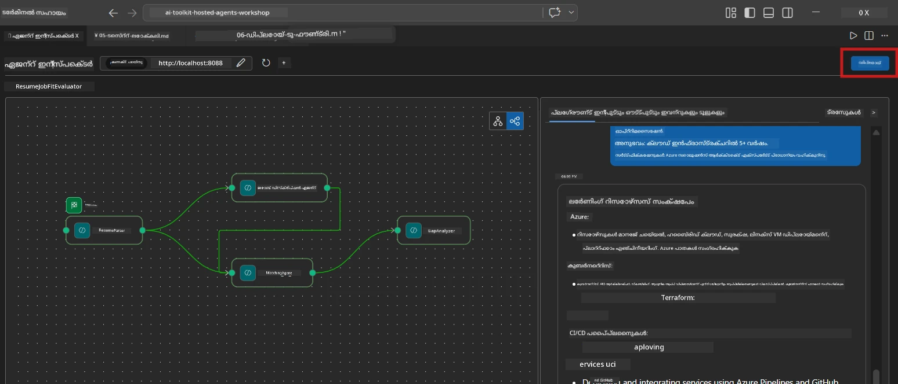
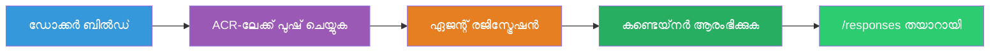
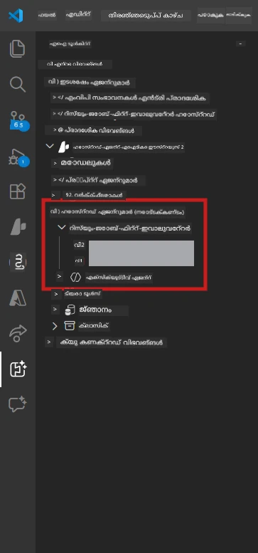

# Module 6 - Foundry ഏജന്റ് സർവീസിലേക്ക് വിന്യസിക്കുക

ഈ മൊഡ്യൂളിൽ, നിങ്ങൾ നിങ്ങളുടെ ലോക്കൽ പരിശോധന ചെയ്ത മൾട്ടി-ഏജന്റ് വർക്ക്ഫ്ലോ [Microsoft Foundry](https://learn.microsoft.com/azure/foundry/agents/concepts/hosted-agents) ൽ **ഹോസ്റ്റഡ് ഏജന്റ്** ആയി വിന്യസിക്കുന്നു. വിന്യാസ പ്രക്രിയ ഒരു Docker കണ്ടെയ്‌നർ ഇമേജ് നിർമ്മിച്ച്, അതിനെ [Azure Container Registry (ACR)](https://learn.microsoft.com/azure/container-registry/container-registry-intro) ലേക്ക് പോസിച്ച്, [Foundry Agent Service](https://learn.microsoft.com/azure/foundry/agents/how-to/publish-agent) ൽ ഹോസ്റ്റഡ് ഏജന്റ് വേഴ്ഷൻ സൃഷ്ടിക്കുന്നു.

> **Lab 01-ലെ പ്രധാന വ്യത്യാസം:** വിന്യാസ പ്രക്രിയ തുല്യമാണ്. Foundry നിങ്ങളുടെ മൾട്ടി-ഏജന്റ് വർക്ക്ഫ്ലോ ഒരു ഏകഹോസ്റ്റഡ് ഏജന്റ് ആയി പരിഗണിക്കുന്നു - സങ്കീർണ്ണത കണ്ടെയ്‌നറിനകം ആണ്, പക്ഷേ വിന്യാസത്തിന്റെ മുകളിൽ ആധികം മാറ്റമില്ല, `/responses` എൻഡ്‌പോയിന്റ് തന്നെയാണ്.

---

## മുൻ‌പരിചയ പരിശോധന

വിന്യാസത്തിന് മുമ്പ്, താഴെയുള്ള ഓരോ വസ്തു പരിശോധിക്കുക:

1. **ഏജന്റ് ലോക്കൽ സ്മോക്ക് ടെസ്റ്റുകൾ പാസ്സായി:**
   - [Module 5](05-test-locally.md) ൽ ഉള്ള എല്ലാ 3 പരീക്ഷണങ്ങളും പൂർത്തിയായി, വർക്ക്ഫ്ലോ മുഴുവൻ ഔട്ട്പുട്ടും ഗ്യാപ് കാർഡുകളും Microsoft Learn URL-ുകളും ഉത്പാദിപ്പിച്ചു.

2. **നിങ്ങൾക്ക് [Azure AI User](https://learn.microsoft.com/azure/foundry/concepts/rbac-foundry) റോളുണ്ട്:**
   - [Lab 01, Module 2](../../lab01-single-agent/docs/02-create-foundry-project.md) ല്‍ നിയോഗിച്ചിരിക്കുന്നു. സ്ഥിരീകരിക്കുക:
   - [Azure Portal](https://portal.azure.com) → നിങ്ങളുടെ Foundry **project** റിസോഴ്‌സ് → **Access control (IAM)** → **Role assignments** → നിങ്ങളുടെ അക്കൗണ്ടിന് **[Azure AI User](https://aka.ms/foundry-ext-project-role)** പട്ടികയിലുള്ളതാണ് ഉറപ്പാക്കുക.

3. **നിങ്ങൾ VS Code-ൽ Azure ലോഗിൻ ആണ്:**
   - VS Code-ന്റെ ബോട്ടം-ഇടതു ഭാഗം Accounts ഐക്കൺ പരിശോധിക്കുക. നിങ്ങളുടെ അക്കൗണ്ട് പേര് ദൃശ്യമായിരിക്കണം.

4. **`agent.yaml`ൽ ശരിയായ മൂല്യങ്ങൾ ഉണ്ട്:**
   - `PersonalCareerCopilot/agent.yaml` തുറന്ന് പരിശോധിക്കുക:
     ```yaml
     environment_variables:
       - name: PROJECT_ENDPOINT
         value: ${PROJECT_ENDPOINT}
       - name: MODEL_DEPLOYMENT_NAME
         value: ${MODEL_DEPLOYMENT_NAME}
     ```
   - ഇത് നിങ്ങളുടെ `main.py` വായിക്കുന്ന environment variables-നോടൊപ്പം പൊരുത്തപ്പെടണം.

5. **`requirements.txt`ൽ ശരിയായ പതിപ്പുകൾ ഉണ്ട്:**
   ```
   agent-framework-azure-ai==1.0.0rc3
   agent-framework-core==1.0.0rc3
   azure-ai-agentserver-agentframework==1.0.0b16
   azure-ai-agentserver-core==1.0.0b16
   debugpy
   agent-dev-cli --pre
   ```

---

## ഘട്ടം 1: വിന്യാസം ആരംഭിക്കുക

### ഓപ്ഷൻ A: ഏജന്റ് ഇൻസ്പെക്ടറിൽ നിന്നു വിന്യസിക്കുക (പരാമർശിക്കപ്പെട്ടത്)

ഏജന്റ് F5 വഴി ഓടുന്നത് കൂടാതെ Agent Inspector തുറന്നിരിക്കുമ്പോൾ:

1. Agent Inspector പാനലിന്റെ **മുകളിൽ-വലത് മുറി** നോക്കുക.
2. **Deploy** ബട്ടൺ (മേഘ ഐക്കൺ ഒരു മുകളിൽ മുതല്‍ കാണുന്ന അമ്പതി അടയാളത്തോടെ ↑) ക്ലിക്ക് ചെയ്യുക.
3. വിന്യാസ വിത്സർഡ് തുറക്കും.



### ഓപ്ഷൻ B: കമാൻഡ് പാളറ്റിൽ നിന്നു വിന്യസിക്കുക

1. `Ctrl+Shift+P` അമർത്തി **Command Palette** തുറക്കുക.
2. ടൈപ്പ് ചെയ്യുക: **Microsoft Foundry: Deploy Hosted Agent** എന്റർ ചെയ്ത് തിരഞ്ഞെടുക്കുക.
3. വിന്യാസ വിത്സർഡ് തുറക്കും.

---

## ഘട്ടം 2: വിന്യാസം ക്രമീകരിക്കുക

### 2.1 ലക്ഷ്യമെത്ത Projeto തിരഞ്ഞെടുക്കുക

1. നിങ്ങളുടെ Foundry പ്രോജക്റ്റുകൾ കാണിക്കുന്ന ഒരു ഡ്രോപ്പ്ഡൗൺ തുറക്കും.
2. വർکشോപ്പിൽ നിങ്ങൾ ഉപയോഗിച്ച Projeto തിരഞ്ഞെടുക്കുക (ഉദാ: `workshop-agents`).

### 2.2 കണ്ടെയ്‌നർ ഏജന്റ് ഫയൽ തിരഞ്ഞെടുക്കുക

1. ഏജന്റ് എൻട്രി പോയിന്റ് തിരഞ്ഞെടുക്കണമെന്ന് ചോദിക്കും.
2. `workshop/lab02-multi-agent/PersonalCareerCopilot/` വഴി പോകുക, അവിടെ നിന്നു **`main.py`** തിരഞ്ഞെടുക്കുക.

### 2.3 റിസോഴ്‌സുകൾ ക്രമീകരിക്കുക

| സജ്ജീകരണം | பராமർശനം മൂല്യം | കുറിപ്പുകൾ |
|---------|------------------|-------|
| **CPU** | `0.25` | പ്രസിദ്ധമായ മൂല്യം. മൾട്ടി-ഏജന്റ് വർക്ക്ഫ്ലോകൾ I/O ബൗണ്ട് മോഡൽ കോൾസ് കാരണം അധിക CPU ആവശ്യമില്ല |
| **മെമ്മറി** | `0.5Gi` | ഉപയോഗ മതിയാണ്. വലിയ ഡാറ്റാ പ്രോസസിംഗ് ഉപകരണങ്ങൾ ചേർക്കുമ്പോൾ `1Gi` ആയി വർധിപ്പിക്കുക |

---

## ഘട്ടം 3: സ്ഥിരീകരിക്കുക, വിന്യസിക്കുക

1. വിത്സർഡ് വിന്യാസ സാരാംശം കാണിക്കും.
2. പരിശോധിച്ച് **Confirm and Deploy** ക്ലിക്ക് ചെയ്യുക.
3. VS Code-ൽ പുരോഗതി مشاهദിക്കുക.

### വിന്യാസ സമയത്ത് സംഭവിക്കുന്നത്

VS Code **Output** പാനൽ ( "Microsoft Foundry" ഡ്രോപ്പ്ഡൗൺ തിരഞ്ഞെടുക്കുക) കാണുക:


1. **Docker build** - നിങ്ങളുടെ `Dockerfile` ഉപയോഗിച്ച് കണ്ടെയ്‌നർ നിർമ്മിക്കുന്നു:
   ```
   Step 1/6 : FROM python:3.14-slim
   Step 2/6 : WORKDIR /app
   ...
   Successfully built abc123def456
   ```

2. **Docker push** - ഇമേജ് ACR-ലേക്ക് അപ്‌ലോഡ് ചെയ്യുന്നു (ആദ്യ വിന്യാസം 1-3 മിനുട്ട്).

3. **ഏജന്റ് രജിസ്ട്രേഷൻ** - Foundry `agent.yaml` മെറ്റാഡാറ്റ ഉപയോഗിച്ച് ഹോസ്റ്റഡ് ഏജന്റ് സൃഷ്ടിക്കുന്നു. ഏജന്റ് നാമം `resume-job-fit-evaluator` ആണ്.

4. **കണ്ടെയ്‌നർ ആരംഭം** - Foundryയുടെ മാനേജ് ചെയ്ത ഇൻഫ്രാസ്ട്രക്ചറിൽ കണ്ടെയ്‌നർ തുടങ്ങിയിരിക്കുന്നു, സിസ്റ്റം മാനേജ്ഡ് ഐഡന്റിറ്റി ഉപയോഗിച്ച്.

> **ആദ്യ വിന്യാസം മന്ദമാണ്** (Docker എല്ലാ ലെയറുകളും പോസ്സ് ചെയ്യുന്നു). പുതിയ വിന്യാസങ്ങൾ കാഷ് ഉള്ള ലെയറുകൾ ഉപയോഗിക്കുന്നതിനാൽ വേഗമാണ്.

### മൾട്ടി-ഏജന്റ് സംബന്ധിച്ച കുറിപ്പുകൾ

- **എല്ലാ നാല് ഏജന്റുകളും ഒരു കണ്ടെയ്‌നറിനുള്ളിലാണ്.** Foundry ഏക ഹോസ്റ്റഡ് ഏജന്റ് എന്ന് കാണുന്നു. WorkflowBuilder ഗ്രാഫ് അകത്തു പ്രവർത്തിക്കുന്നു.
- **MCP കോൾസ് പുറത്ത് പോകുന്നു.** കണ്ടെയ്‌നർ ഇന്റർനെറ്റ് ആക്സസ് ആവശ്യമാണ് `https://learn.microsoft.com/api/mcp` എത്താൻ. Foundryയുടെ മാനേജ് ചെയ്ത ഇൻഫ്രാസ്ട്രക്ചർ ഇത് സ്വാഭാവികം നൽകുന്നു.
- **[Managed Identity](https://learn.microsoft.com/python/api/overview/azure/identity-readme#managed-identity-support).** ഹോസ്റ്റഡ് പരിസരത്ത്, `main.py` ൽ `get_credential()` മുറ്റും `ManagedIdentityCredential()` തന്നെ തിരിച്ചുകindividualരുന്നു (കാരണമാണ് `MSI_ENDPOINT` സജ്ജീകരിച്ചിരിക്കുന്നത്). ഇത് സ്വയം സംഭവിക്കുന്നു.

---

## ഘട്ടം 4: വിന്യാസത്തിന്റെ സ്ഥിതി പരിശോധിക്കുക

1. **Microsoft Foundry** സൈഡ്ബാർ തുറക്കുക (Activity Bar-ൽ Foundry ഐക്കൺ ക്ലിക്ക് ചെയ്യുക).
2. നിങ്ങളുടെ പ്രോജക്റ്റിനഡെ **Hosted Agents (Preview)** വലുതാക്കുക.
3. **resume-job-fit-evaluator** (അല്ലെങ്കിൽ നിങ്ങളുടെ ഏജന്റ് നാമം) കണ്ടെത്തുക.
4. ഏജెంట్ നാമത്തിൽ ക്ലിക്ക് ചെയ്തു വേഴ്ഷനുകൾ വലുതാക്കുക (ഉദാ: `v1`).
5. വേഴ്ഷൻ ക്ലിക്ക് ചെയ്തു **Container Details** → **Status** പരിശോധിക്കുക:



| നില | അർത്ഥം |
|--------|---------|
| **Started** / **Running** | കണ്ടെയ്‌നർ പ്രവർത്തിക്കുന്നു; ഏജന്റ് തയ്യാറാണ് |
| **Pending** | കണ്ടെയ്‌നർ ആരംഭിക്കുന്നു (30-60 സെക്കൻഡു പാത്തുക) |
| **Failed** | കണ്ടെയ്‌നർ ആരംഭിക്കാൻ പരാജയപ്പെട്ടു (ലോഗുകൾ പരിശോധിക്കുക - താഴെ നോക്കുക) |

> **മൾട്ടി-ഏജന്റ് സ്റ്റാർട്ട് നിറവിൽകൂടുതൽ സമയമെടുത്തേക്കും** കാരണം 4 ഏജന്റ് ഇൻസ്റ്റാൻസുകൾ കണ്ടെയ്‌നറിൽ ഉണ്ടാകും. "Pending" 2 മിനുട്ട് വരെ സാധാരണമാണ്.

---

## സാധാരണ വിന്യാസ പിശകുകളും പരിഹാരങ്ങളും

### പിശക് 1: അനുമതി നിഷേധം - `agents/write`

```
Error: lacks the required data action 
Microsoft.CognitiveServices/accounts/AIServices/agents/write
```

**പരിഹാരം:** **[Azure AI User](https://learn.microsoft.com/azure/foundry/concepts/rbac-foundry)** റോളു പ്രോജക്റ്റ് ലെവലിൽ നീക്കം ചെയ്യുക. വിശദമായ നിർദ്ദേശങ്ങൾക്കായി [Module 8 - Troubleshooting](08-troubleshooting.md) കാണുക.

### പിശക് 2: Docker ഓടുന്നില്ല

```
Error: Docker build failed / Cannot connect to Docker daemon
```

**പരിഹാരം:**
1. Docker Desktop ആരംഭിക്കുക.
2. "Docker Desktop is running" വരെ കാത്തിരിക്കുക.
3. പരിശോധന: `docker info`
4. **Windows:** Docker Desktop ക്രമീകരണങ്ങളിൽ WSL 2 ബാക്ക്‌എന്റ് സജ്ജമാക്കുക.
5. വീണ്ടും ശ്രമിക്കുക.

### പിശക് 3: Docker build സമയത്ത് pip install പരാജയം

```
Error: Could not find a version that satisfies the requirement agent-dev-cli
```

**പരിഹാരം:** Docker-ൽ `requirements.txt` ലെ `--pre` ഫോൾഗും വ്യത്യസ്തമാണ്. ഉറപ്പാക്കുക `requirements.txt` ഇതുപോലെ உள்ளது:
```
agent-dev-cli --pre
```

Docker ഇപ്പോഴും പരാജയപ്പെടുകയാണെങ്കിൽ, `pip.conf` സൃഷ്ടിക്കുക അല്ലെങ്കിൽ --pre ബിൽഡ് ആർഗ്യുമെന്റായി കൊടുക്കുക. [Module 8](08-troubleshooting.md) കാണുക.

### പിശക് 4: MCP ഉപകരണം ഹോസ്റ്റഡ് ഏജന്റ്-ൽ പരാജയപ്പെടുന്നു

Deployment ശേഷം Gap Analyzer Microsoft Learn URL ഉത്പാദിപ്പിക്കുന്നത് നിർത്തുകയാണെങ്കിൽ:

**കാരണം:** കണ്ടെയ്‌നറിൽ നിന്നുള്ള ഔട്ട്പുട്ട് HTTPS ബ്ലോക്ക് ചെയുന്നത്.

**പരിഹാരം:**
1. സാധാരണയായി Foundryയുടെ ഡീഫോൾട്ട് ക്രമീകരണത്തിൽ ഇത് പ്രശ്നമല്ല.
2. ഉണ്ടെങ്കിൽ Foundry പ്രോജക്റ്റിന്റെ വിർച്വൽ നെറ്റ്വർക്ക് NSG ഔട്ട്ബൗണ്ട് HTTPS ബ്ലോക്കോ എന്നു പരിശോധിക്കുക.
3. MCP ഉപകരണത്തിന് ഇൻബിൽറ്റ് ഫാൾബാക്ക് URL ഉണ്ട്, അതിനാൽ ഏജന്റ് അതിനപ്പുറം പകർത്തും (ലൈവ് URL ഇല്ലാതെ).

---

### ചെക്ക്‌പോയിന്റ്

- [ ] VS Code-ൽ വിന്യാസ കമ്മാൻഡ് പിശകില്ലാതെ പൂർത്തിയായി
- [ ] Foundry സൈഡ്ബാറിലെ **Hosted Agents (Preview)** ൽ ഏജന്റ് കാണപ്പെടുന്നു
- [ ] ഏജന്റ് നാമം `resume-job-fit-evaluator` (അല്ലെങ്കിൽ നിങ്ങൾ തിരഞ്ഞെടുത്ത നാമം) ആണ്
- [ ] കണ്ടെയ്‌നർ നില **Started** അല്ലെങ്കിൽ **Running** ആണ് കാണിക്കുന്നത്
- [ ] (പിശകുകൾ ഉണ്ടെങ്കിൽ) പിശക് തിരിച്ചറിയുക, പരിഹാരം പ്രയോഗിച്ച് വിജയകരമായി വീണ്ടും വിന്യസിച്ചു

---

**മുൻ:** [05 - Test Locally](05-test-locally.md) · **അടുത്തത്:** [07 - Verify in Playground →](07-verify-in-playground.md)

---

<!-- CO-OP TRANSLATOR DISCLAIMER START -->
**തള്ളിപ്പറയൽ**:  
ഈ രേഖ AI പരിഭാഷ സേവനമായ [Co-op Translator](https://github.com/Azure/co-op-translator) ഉപയോഗിച്ച് പരിഭാഷപ്പെടുത്തിയതാണ്. നാം കൃത്യതയ്ക്കായി പരിശ്രമിക്കുമ്പോഴും, യന്ത്രപരിഭാഷയിൽ പിഴവുകൾ അല്ലെങ്കിൽ തെറ്റുകൾ ഉണ്ടാകാൻ സാധ്യതയുണ്ടെന്ന് ദയവായി ശ്രദ്ധിക്കുക. അതിനാൽ, ഉൽപ്പന്നത്തിന്റെ പ്രാഥമിക ഭാഷയിൽ ഉള്ള ഒറിജിനൽ രേഖയെ ഒന്നാംക്രമസ്ഥതയിലുള്ള ഉറവിടമായി പരിഗണിക്കണം. പ്രധാന വിവരങ്ങൾക്ക്, പ്രൊഫഷണൽ മനുഷ്യ പരിഭാഷ ശുപാർശ ചെയ്യപ്പെടുന്നു. ഈ പരിഭാഷ ഉപയോഗിച്ച് ഉണ്ടായും വരുന്ന误ബോധങ്ങളുടെയും തെറ്റിദ്ധാരണകളുടെയും ഉത്തരവാദിത്വം ഞങ്ങൾക്ക് ഉണ്ടായിരിക്കുക.
<!-- CO-OP TRANSLATOR DISCLAIMER END -->