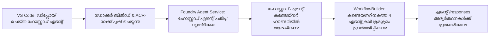
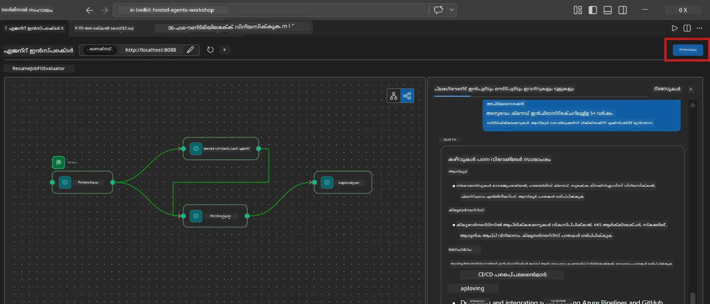
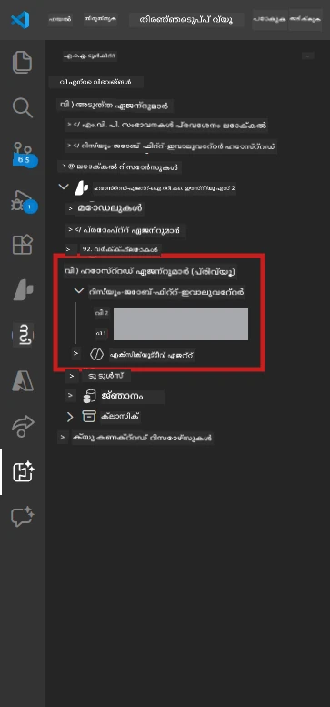

# മോട്യൂൾ 6 - ഫൗണ്ടറി ഏജന്റ് സർവീസിലേക്ക് പ്രയോജനപ്പെടുത്തുക

⏱️ ~10 നിമിഷം

ഈ മോട്യൂളിൽ, നിങ്ങൾ лакെലി-പരിശോധിച്ച മൾട്ടി-ഏജന്റ് വർക്‌ഫ്ലോ [Microsoft Foundry](https://learn.microsoft.com/azure/foundry/agents/concepts/hosted-agents) ലേക്ക് **ഹോസ്റ്റഡ് ഏജന്റ്** എന്ന രൂപത്തിൽ പ്രയോജനപ്പെടുത്തും. പ്രയോജനപ്പെടുത്തൽ പ്രക്രിയ Docker കണ്ടെയ്നർ ഇമേജ് നിർമ്മിച്ച്, അത് [Azure Container Registry (ACR)](https://learn.microsoft.com/azure/container-registry/container-registry-intro) ലേക്ക് പുഷ് ചെയ്യുകയും, [Foundry Agent Service](https://learn.microsoft.com/azure/foundry/agents/how-to/publish-agent) ൽ ഹോസ്റ്റഡ് ഏജന്റ് വേർഷൻ സൃഷ്ടിക്കുകയും ചെയ്യുന്നു.

> **Lab 01 ൽ നിന്നുള്ള പ്രധാന വ്യത്യാസം:** പ്രയോജനപ്പെടുത്തൽ പ്രക്രിയ ഒരുപോലെയാണ്. Foundry നിങ്ങളുടെ മൾട്ടി-ഏജന്റ് വർക്‌ഫ്ലോയെ ഒറ്റ ഹോസ്റ്റഡ് ഏജന്റായി കാണുന്നു - സങ്കീർണത കണ്ടെയ്‌നറിൽ ഉള്ളതാണ്, എന്നാൽ പ്രയോജനപ്പെടുന്ന സാംമുഖ്യം ഒരേ `/responses` എൻഡ്പോയിന്റാണ്.

### പ്രയോജനപ്പെടുത്തൽ പൈപ്പ്ലൈൻ


```mermaid
flowchart LR
    A[VS Code: ഡിപ്ലോയ് ചെയ്‌ത ഹോസ്റ്റഡ് ഏജന്റ്] --> B[ഡോക്കർ ബിൽഡ് & ACR-ലേക്ക് പുഷ് ചെയ്യുന്നു]
    B --> C[Foundry Agent Service: ഹോസ്റ്റഡ് ഏജന്റ് പതിപ്പ് സൃഷ്‌ടിക്കുക]
    C --> D[ഹോസ്റ്റഡ് ഏജന്റ് കണ്ടെയ്‌നർ ഫൗണ്ടറിയിൽ ആരംഭിക്കുന്നു]
    D --> E[WorkflowBuilder കണ്ടെയ്‌നറിനകത്ത് 4 ഏജന്റുകൾ ക്രമക്രമം പ്രവർത്തിപ്പിക്കുന്നു]
    E --> F[ഏജന്റ് /responses അഭ്യർത്ഥനകൾക്ക് പ്രതികരിക്കുന്നു]
```

---

## മുൻ‌കരുതലുകൾ പരിശോധിക്കൽ

പ്രയോജനപ്പെടുത്തുന്നതിനു മുമ്പ് താഴെക്കാണുന്ന എല്ലാ വസ്തുക്കളും പരിശോധിക്കുക:

1. **ഏജന്റ് ലോക്കൽ സ്മോക്ക് ടെസ്റ്റുകൾ മറികടന്നു:**
   - [Module 5](05-test-locally.md) ൽ ഉള്ള മൂന്നു ടെസ്റ്റുകളും പൂർത്തിയാക്കിയിട്ടുണ്ട്, വർക്‌ഫ്ലോ ചെറു കാർഡുകളും Microsoft Learn URLs ഉൾപ്പെടെ പൂർണ്ണമായ ഔട്ട്‌പുട്ട് ഉത്പാദിപ്പിച്ചു.

2. **നിങ്ങൾക്ക് [Foundry User](https://learn.microsoft.com/azure/foundry/concepts/rbac-foundry) റോൾ ഉണ്ട്** (പ്രയോജനപ്പെടുത്തുന്നതിനു കുറഞ്ഞത് **Foundry Project Manager** പ്രോജക്ട് സ്‌കോപ്പിൽ വേണം):

   > **കുറിപ്പ്:** Foundry RBAC റോളുകൾ ഏറ്റവും പുതിയ പേരുകളിൽ മാറ്റപ്പെട്ടു - **Foundry User**, **Foundry Owner**, **Foundry Project Manager** മുൻപ് Azure AI User, Azure AI Owner, Azure AI Project Manager എന്നായിരുന്നു. റോൾ ഐഡികളുമായി അനുമതികളും മാറ്റം വന്നിട്ടില്ല.

   - [Azure Portal](https://portal.azure.com) → നിങ്ങളുടെ Foundry **പദ്ധതി** റെസോഴ്‌സ് → **Access control (IAM)** → **Role assignments** → നിങ്ങളുടെ അക്കൗണ്ടിന് **Foundry User** (അഥവാ അതിനുമുകളിൽ) പട്ടികപ്പെടുത്തപ്പെട്ടിട്ടുണ്ടെന്ന് ഉറപ്പാക്കുക.

3. **നിങ്ങൾ VS Code-ൽ Azure-യിലേക്ക് സൈൻ ഇൻ ചെയ്തിട്ടുണ്ട്:**
   - VS Code ന്റെ മടക്കുവശത്തെയുള്ള അക്കൗണ്ടുകൾ ഐക്കൺ പരിശോധിക്കുക. നിങ്ങളുടെ അക്കൗണ്ട് പേര് കാണിക്കണം.

4. **`agent.yaml`-ൽ ശരിയായ മൂല്യങ്ങൾ അടങ്ങിയിട്ടുണ്ട്:**
   - `PersonalCareerCopilot/agent.yaml` തുറന്ന് പരിശോധിക്കുക:
     ```yaml
     environment_variables:
       - name: AZURE_AI_MODEL_DEPLOYMENT_NAME
         value: ${AZURE_AI_MODEL_DEPLOYMENT_NAME}
     ```
   - `FOUNDRY_PROJECT_ENDPOINT` ഇവിടെ ലിസ്റ്റ് ചെയ്തിരിക്കുന്നില്ല - Foundry സമയത്ത് അംശം ഉൾപ്പെടുത്തുന്നു. വെറും `AZURE_AI_MODEL_DEPLOYMENT_NAME` പ്രഖ്യാപിക്കേണ്ടതാണ്.

5. **`requirements.txt` ലെ പതിപ്പുകൾ ശരിയാണെന്ന് ഉറപ്പാക്കുക:**
   ```
   agent-framework-foundry
   agent-framework-foundry-hosting
   mcp<2,>=1.24.0
   debugpy
   ```

---

## ഘട്ടം 1: പ്രയോജനപ്പെടുത്തൽ ആരംഭിക്കുക

### ഓപ്ഷൻ A: ഏജന്റ് ഇൻസ്പെക്ടറിൽ നിന്നു പ്രയോജനപ്പെടുത്തുക (പ്രശസ്തമായ വഴി)

ഏജന്റ് എഫ്എെഫ്എഫ്എൻ ഓടിക്കുമ്പോൾ ഏജന്റ് ഇൻസ്പെക്ടർ തുറന്നിരിക്കുകയാണെങ്കിൽ:

1. ഏജന്റ് ഇൻസ്പെക്ടർ പാനലിന്റെ **മുകളില്‍ വലതു കോണില്‍** നോക്കുക.
2. **Deploy** ബട്ടണിൽ (ഉയരുന്ന മൂലയുള്ള മേഘം ഐക്കൺ) ക്ലിക്ക് ചെയ്യുക.
3. പ്രയോജനപ്പെടുത്തൽ വർക്ക്ഫ്ലോ ആരംഭിക്കും.



### ഓപ്ഷൻ B: കമാൻഡ് പാലറ്റിൽ നിന്നു പ്രയോജനപ്പെടുത്തുക

1. **Command Palette** തുറക്കാൻ `Ctrl+Shift+P` അമർത്തുക.
2. ടൈപ്പ് ചെയ്യുക: **Foundry Toolkit: Deploy Hosted Agent** തിരഞ്ഞെടുക്കുക.
3. പ്രയോജനപ്പെടുത്തൽ വർക്ക്ഫ്ലോ ആരംഭിക്കും.

---

## ഘട്ടം 2: പ്രയോജനപ്പെടുത്തൽ ക്രമീകരിക്കുക

### 2.1 ലക്ഷ്യ പദ്ധതി തിരഞ്ഞെടുക്കുക

1. നിങ്ങളുടെ Foundry പദ്ധതികൾ കാണിക്കുന്ന ഡ്രോപ്പ്ഡൗൺ കാണാൻ കഴിയും.
2. വർക്ക്ഷോപ്പിൽ ഉപയോഗിച്ച പദ്ധതി തിരഞ്ഞെടുക്കുക (ഉദാ: `workshop-agents`).

### 2.2 കണ്ടെയ്‌നർ ഏജന്റ് ഫയൽ തിരഞ്ഞെടുക്കുക

1. ഏജന്റ് എൻട്രി പോയിന്റ് തിരഞ്ഞെടുക്കാൻ ആവശ്യപ്പെടും.
2. `workshop/lab02-multi-agent/PersonalCareerCopilot/` തുറന്ന് **`main.py`** തിരഞ്ഞെടുക്കുക.

### 2.3 ഉറവിടങ്ങൾ ക്രമീകരിക്കുക

| ക്രമീകരണം | ശുപാർശചെയ്ത മൂല്യം | കുറിപ്പുകൾ |
|---------|------------------|-------|
| **പ്രയോജനപ്പെടുത്തൽ രീതി** | **കണ്ടെയ്‌നർ** (ശുപാർശ) അല്ലെങ്കിൽ **കോഡ്** | കണ്ടെയ്‌നർ Docker ഇമേജ് നിർമ്മിക്കുന്നു; കോഡ് സോഴ്‌സ് ZIP ആയി അപ്‌ലോഡ് ചെയ്യുന്നു (പിൻവാതിൽ) |
| **കണ്ടെയ്‌നർ റജിസ്ട്രി** | **ഡീഫോൾട്ട് ACR** | Foundry ഒന്ന് സൃഷ്ടിച്ച് പരിപാലിക്കുന്നു |
| **CPU** | `0.25` | ഡീഫോൾട്ട്. മൾട്ടി-ഏജന്റ് വർക്‌ഫ്ലോയിലേക്ക് കൂടുതൽ CPU ആവശ്യമില്ല കാരണം മോഡൽ വിളിച്ചലുകൾ I/O-ബാങ്ക് ആണ് |
| **മെമ്മറി** | `0.5Gi` | ഡീഫോൾട്ട്. വലിയ ഡാറ്റ പ്രോസസ്സിങ് ടൂളുകൾ ചേർക്കുമ്പോൾ `1Gi` വരെ ഉയർത്താം |

---

## ഘട്ടം 3: സ്ഥിരീകരിച്ച് പ്രയോജനപ്പെടുത്തുക

1. വർക്ക്ഫ്ലോ പ്രയോജനപ്പെടുത്തൽ സംഗ്രഹം കാണിക്കും.
2. അവലോകനം ചെയ്ത് **Confirm and Deploy** ക്ലിക്ക് ചെയ്യുക.
3. VS Code-ൽ പുരോഗതി നോക്കുക.

### പ്രയോജനപ്പെടുത്തൽ സമയത്ത് എന്ത് സംഭവിക്കുന്നു

VS Code **Output** പാനൽ ശ്രദ്ധിക്കുക ("Microsoft Foundry" ഡ്രോപ്പ്ഡൗൺ തിരഞ്ഞെടുക്കുക):

1. **Docker നിർമ്മാണം** - നിങ്ങളുടെ `Dockerfile` ഉപയോഗിച്ച് കണ്ടെയ്‌നർ നിർമ്മിക്കുന്നു
   ```
   Step 1/6 : FROM python:3.12-slim
   Step 2/6 : WORKDIR /app
   ...
   Successfully built abc123def456
   ```

2. **Docker പുഷ്** - ഇമേജ് ACR ലേക്ക് പുഷ് ചെയ്യുന്നു (ആദ്യ പ്രയോജനപ്പെടുത്തലിൽ 1-3 മിനിറ്റ്).

3. **ഏജന്റ് രജിസ്ട്രേഷൻ** - Foundry `agent.yaml` മെടാഡേറ്റ ഉപയോഗിച്ച് ഹോസ്റ്റഡ് ഏജന്റ് നിർമ്മിക്കുന്നു. ഏജന്റ് നാമം `resume-job-fit-evaluator` ആണ്.

4. **കണ്ടെയ്‌നർ ആരംഭം** - കണ്ടെയ്‌നർ Foundry യുടെ മാനേജ് ചെയ്യപ്പെട്ട സജ്ജീകരണത്തിൽ സിസ്റ്റം മാനേജ് ചെയ്ത ഐഡൻറിറ്റിയോടുകൂടി ആരംഭിക്കുന്നു.

> **ആദ്യ പ്രയോജനപ്പെടുത്തൽ മന്ദമാണ്** (Docker എല്ലാം ലെയറുകളും പുഷ് ചെയ്യുന്നു). പിന്വർത്ത് പ്രയോജനപ്പെടുത്തലുകളിൽ കാഷ് ചെയ്ത ലെയറുകൾ ഉപയോഗിച്ച് വേഗം വർധിക്കും.

### മൾട്ടി-ഏജന്റ് പ്രത്യേക കുറിപ്പുകൾ

- **നാലു ഏജന്റുമാരെല്ലാം ഒരു കണ്ടെയ്‌നർ ഉള്ളിലാണ്.** Foundry ഒറ്റ ഹോസ്റ്റഡ് ഏജന്റായി കാണുന്നു. WorkflowBuilder ഗ്രാഫ് ആകെയുള്ളിൽ പ്രവർത്തിക്കുന്നു.
- **MCP വിളികൾ പുറത്തേക്ക് പോകുന്നു.** കണ്ടെയ്‌നർ `https://learn.microsoft.com/api/mcp` എത്താനായി ഇന്റർനെറ്റ് ആക്‌സസ് വേണം. Foundry യുടെ മാനേജ് ചെയ്ത ഘടന ഇത് സാധാരണ കൗശലമായി നൽകുന്നു.
- **[Managed Identity](https://learn.microsoft.com/azure/foundry/agents/concepts/agent-identity).** Foundry ഓരോ ഹോസ്റ്റഡ് ഏജന്റിനും പ്രത്യേക Entra ഐഡൻറിറ്റി ഡിപ്ലോയ്മെന്റ് സമയത്ത് സജ്ജമാക്കുന്നു. ഹോസ്റ്റഡ് പരിസരത്തിൽ `DefaultAzureCredential` ഈ ഏജന്റ് ഐഡൻറിറ്റി ആയി സ്വയം പരിഹരിക്കുന്നു - മാനുവൽ മാനേജ്ഡ് ഐഡൻറിറ്റി ക്രമീകരണം ആവശ്യമില്ല.

---

## ഘട്ടം 4: പ്രയോജനപ്പെടുത്തൽ നില പരിശോധിക്കുക

1. **Microsoft Foundry** സൈഡ്ബാർ തുറക്കുക (ആക്ടിവിറ്റി ബാറിൽ Foundry ഐക്കൺ ക്ലിക്ക് ചെയ്യുക).
2. നിങ്ങളുടെ പദ്ധതിയിലേറ്റുള്ള **Hosted Agents (Preview)** വിപുലീകരിക്കുക.
3. **resume-job-fit-evaluator** (അഥവാ നിങ്ങളുടെ ഏജന്റ് നാമം) കണ്ടെത്തുക.
4. ഏജന്റ് നാമത്തിൽ ക്ലിക് ചെയ്യുക → വേർഷനുകൾ വിപുലീകരിക്കുക (ഉദാ: `v1`).
5. വേർഷനിൽ ക്ലിക്ക് → **Container Details** → **Status** പരിശോധിക്കുക:



| നില | അർത്ഥം |
|--------|---------|
| **സജീവം (active)** | ഏജന്റ് പ്രവർത്തിച്ച് അഭ്യർത്ഥനകൾ സ്വീകരിക്കാൻ സജ്ജമാണ് |
| **സൃഷ്ടിക്കുന്നു (creating)** | കണ്ടെയ്‌നർ ആരംഭിക്കുന്നു (30-60 സെക്കൻഡ് കാത്തിരിക്കുക) |
| **തെറ്റി (failed)** | കണ്ടെയ്‌നർ ആരംഭിക്കാനാകില്ല (ലോഗുകൾ പരിശോധിക്കുക - താഴെ കാണുക) |

> **കുറിപ്പ്:** VS Code സൈഡ്ബാറിൽ "Running" അല്ലെങ്കിൽ "Started" പോലുള്ള ലേബലുകൾ കാണാം, എന്നാൽ അടിസ്ഥാന API നില `active`/`creating` ആണ്. രണ്ടും ഒരേ സ്ഥിതിയാണ് സൂചിപ്പിക്കുന്നത്.

> **മൾട്ടി-ഏജന്റ് ആരംഭം കൂടുതൽ സമയമെടുക്കും** ഒറ്റ ഏജന്റ് അപേക്ഷിച്ച്, കാരണം കണ്ടെയ്‌നർ ആരംഭത്തിൽ 4 ഏജന്റ് ഉദാഹരണങ്ങൾ സൃഷ്ടിക്കുന്നു. `creating` 2 മിനിറ്റ് വരെ സാധാരണമാണ്.

---

## സാധാരണ പ്രയോജനപ്പെടുത്തൽ പിഴവുകൾയും പരിഹാരങ്ങളും

### പിഴവ് 1: അനുമതി നിഷേധം - `agents/write`

```
Error: lacks the required data action 
Microsoft.CognitiveServices/accounts/AIServices/agents/write
```

**പരിഹാരം:** **[Foundry User](https://learn.microsoft.com/azure/foundry/concepts/rbac-foundry)** റോൾ (മുൻപ് **Azure AI User**) **പദ്ധതി** നിലയിൽ നിയുക്തമാക്കുക. വിശദമായ നിർദ്ദേശങ്ങൾക്കായി [Module 8 - Troubleshooting](08-troubleshooting.md) കാണുക.

### പിഴവ് 2: Docker ഓടുന്നില്ല

```
Error: Docker build failed / Cannot connect to Docker daemon
```

**പരിഹാരം:**
1. Docker Desktop ഘടന ആരംഭിക്കുക.
2. "Docker Desktop is running" എന്ന സന്ദേശം വരാനായി കാത്തിരിക്കുക.
3. ഉറപ്പാക്കുക: `docker info`
4. **Windows:** Docker Desktop സെറ്റിംഗ്സിൽ WSL 2 ബാക്ക്‌എൻഡ് പ്രവർത്തനക്ഷമമാക്കുക.
5. വീണ്ടും ശ്രമിക്കുക.

### പിഴവ് 3: Docker നിർമ്മാണത്തിൽ pip install പരാജയം

```
Error: Could not find a version that satisfies the requirement agent-framework-foundry
```

**പരിഹാരം:** `requirements.txt` താഴെപ്പറയുന്നതുപോലെയാണെന്ന് ഉറപ്പാക്കുക:
```
agent-framework-foundry
agent-framework-foundry-hosting
mcp<2,>=1.24.0
debugpy
```

നിർമ്മാണം ഇപ്പോഴും പരാജയമാകുന്നു എങ്കിൽ, നിങ്ങളുടെ Docker നെറ്റ്‌വർക്ക് PyPI തടയുന്നുണ്ടോ എന്ന് പരിശോധിക്കുക. പ്രോക്സി ക്രമീകരണങ്ങൾ എങ്ങനെ ഉണ്ടെന്ന് `docker info` പരിശോധിക്കുക.

### പിഴവ് 4: MCP ഉപകരണം ഹോസ്റ്റഡ് ഏജന്റിൽ പരാജയപ്പെടുന്നു

പ്രയോജനപ്പെടുത്തലിന് ശേഷം Gap Analyzer Microsoft Learn URLs ഉത്പാദിപ്പിക്കുന്നത് നിർത്തുമ്പോൾ:

**കാരണമെന്നത്:** കണ്ടെയ്‌നറിൽ നിന്നുള്ള ഔട്ട്‌ബൗണ്ട് HTTPS നെറ്റ്‌വർക്ക് നയം തടയുന്നു.

**പരിഹാരം:**
1. ഇത് സാധാരണയായി Foundry ന്റെ ഡീഫോൾട്ട് ക്രമീകരണത്തിൽ പ്രശ്നമല്ല.
2. സംഭവിച്ചെങ്കിൽ, Foundry പദ്ധതിയുടെ വെർച്വൽ നെറ്റ്‌വർക്ക് NSG ഔട്ട്‌ബൗണ്ട് HTTPS തടയുന്നുണ്ടോ എന്ന് പരിശോധിക്കുക.
3. MCP ഉപകരണത്തിന് സവിശേഷമായ ഫാൾബാക്ക് URL-കൾ ഉണ്ട്, അതുകൊണ്ട് ഏജന്റ് ഔട്ട്‌പുട്ട് (ലൈവ് URL ഇല്ലാതെ) സൃഷ്ടിക്കുകയാകും.

---

### പരിശോധനാകേന്ദ്രം

- [ ] VS Code ല്‍ പിഴവുകളില്ലാതെ പ്രയോജനപ്പെടുത്തൽ കമാൻഡ് പൂർത്തിയായി
- [ ] Foundry സൈഡ്ബാറിൽ **Hosted Agents (Preview)** ൽ ഏജന്റ് ഉൾപ്പെട്ടിരിക്കുന്നു
- [ ] ഏജന്റ് നാമം `resume-job-fit-evaluator` (അഥവാ നിങ്ങൾ തിരഞ്ഞെടുക്കുന്ന പേര്) ആണ്
- [ ] കണ്ടെയ്‌നർ നില **Started** അല്ലെങ്കിൽ **Running** ആണ്
- [ ] (പിഴവുണ്ടെങ്കിൽ) നിങ്ങൾ പിഴവ് തിരിച്ചറിഞ്ഞു, പരിഹാരം അപ്ലൈ ചെയ്തു, വീണ്ടും വിജയകരമായി പ്രയോജനപ്പെടുത്തി

---

**മുൻപ്:** [05 - Test Locally](05-test-locally.md) · **അടുത്തത്:** [07 - Verify in Playground →](07-verify-in-playground.md)

---

<!-- CO-OP TRANSLATOR DISCLAIMER START -->
**അറിയിപ്പ്**:
ഈ രേഖ AI പരിഭാഷാ സേവനം [Co-op Translator](https://github.com/Azure/co-op-translator) ഉപയോഗിച്ച് പരിഭാഷപ്പെടുത്തിയതാണ്. ഞങ്ങൾ കൃത്യതയ്ക്കായി ശ്രമിക്കുന്നുവെങ്കിലും, ഓട്ടോമേറ്റഡ് പരിഭാഷകളിൽ പിഴവുകൾ അല്ലെങ്കിൽ തെറ്റായ വിവരങ്ങൾ ഉണ്ടാകാൻ സാധ്യതയുണ്ട്. അതിന്റെ സ്വാഭാവിക ഭാഷയിലുള്ള അസൽ രേഖയാണ് പ്രാമാണികമായ ഉറവിടമായി പരിഗണിക്കേണ്ടത്. നിർണായകമായ വിവരങ്ങൾക്ക്, പ്രൊഫഷണൽ മനുഷ്യ പരിഭാഷ ശുപാർശ ചെയ്യുന്നു. ഈ പരിഭാഷ ഉപയോഗിച്ച് ഉണ്ടാകുന്ന തെറ്റിദ്ധാരണകൾ അല്ലെങ്കിൽ തെറ്റായ വ്യാഖ്യാനങ്ങൾക്കായി ഞങ്ങൾ ഉത്തരവാദികളല്ല.
<!-- CO-OP TRANSLATOR DISCLAIMER END -->