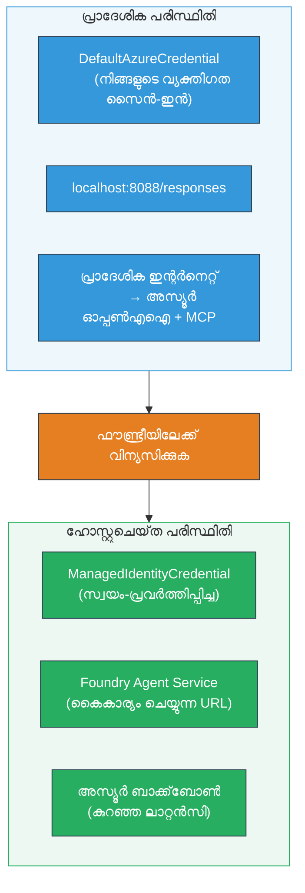

# Module 7 - Playground-ൽ പരിശോധന നടത്തുക

ഈ മോഡ്യൂളിൽ, നിങ്ങൾ പ്രവർത്തനസജ്ജമാക്കിയ മൾട്ടി ഏജന്റ് വർക്ക്‌ഫ്ലോയും **VS Code**-ഉം **[Foundry Portal](https://ai.azure.com)**-ഉം ഇരുവയിൽ പരീക്ഷിക്കുകയും ഏജന്റ് നാട്ടുചിത്ര പരീക്ഷണത്തോടു പൊരുത്തപ്പെടുന്നു എന്ന് ഉറപ്പാക്കുകയും ചെയ്യുന്നു.

---

## വിതരണം ചെയ്തതിന് ശേഷം എന്തിനു പരിശോധിക്കും?

നിങ്ങളുടെ മൾട്ടി ഏജന്റ് വർക്ക്‌ഫ്ലോ നാട്ടിൽ പൂർണ്ണമായും ശരിയായി പ്രവർത്തിച്ചു, എങ്കിലും വീണ്ടും പരീക്ഷിക്കുന്നത് എന്തിനിക്ഷണമാണ്? ഹോസ്റ്റുചെയ്ത അന്തരീക്ഷം പലവിധം വ്യത്യസ്തമാണ്:


| വ്യത്യാസം | നാട്ടിൽ | ഹോസ്റ്റുചെയ്തത് |
|-----------|-------|--------|
| **ഓര്മ** | [`DefaultAzureCredential`](https://learn.microsoft.com/azure/developer/python/sdk/authentication/credential-chains#defaultazurecredential-overview) (നിങ്ങളുടെ വ്യക്തിഗത സൈൻ-ഇൻ) | [`ManagedIdentityCredential`](https://learn.microsoft.com/python/api/overview/azure/identity-readme#managed-identity-support) (സ്വയമേവ പകർന്നൊരുക്കിയതുപോലെ) |
| **എൻഡ്‌പോയിന്റ്** | `http://localhost:8088/responses` | [Foundry Agent Service](https://learn.microsoft.com/azure/foundry/agents/concepts/hosted-agents) എൻഡ്‌പോയിന്റ് (മാനേജുചെയ്ത URL) |
| **നെറ്റ്‌വർക്ക്** | നാട്ടിലെ മെഷീൻ → Azure OpenAI + MCP ഔട്ട്‌ബൗണ്ട് | Azure ബേക്‌ബോൺ (സേവനങ്ങളുടെ ഇടയിൽ കുറഞ്ഞ ലേറ്റൻസി) |
| **MCP കണക്ടിവിറ്റി** | നാട്ടിലെ ഇന്റർനെറ്റ് → `learn.microsoft.com/api/mcp` | കണ്ടെയ്‌നർ ഔട്ട്‌പുട്ട് → `learn.microsoft.com/api/mcp` |

ഏതെങ്കിലും പരിതസ്ഥിതി പരിവർത്തനം തെറ്റായാൽ, RBAC മாறിയെങ്കിൽ, അല്ലെങ്കിൽ MCP ഔട്ട്‌പുട്ട് തടഞ്ഞാൽ, നിങ്ങൾ ഇത് ഇവിടെ കണ്ടെത്തും.

---

## ഓപ്ഷൻ A: VS Code Playground-ൽ പരീക്ഷിക്കുക (ആദ്യം നിർദ്ദേശിക്കുന്നു)

[Foundry വിപുലീകരണം](https://marketplace.visualstudio.com/items?itemName=TeamsDevApp.vscode-ai-foundry) ഒരു ഏകീകരിച്ച Playground ഉൾക്കൊണ്ടിരിക്കുന്നു, നിങ്ങൾക്ക് VS Code വിട്ടൊഴിയാതെ തന്നെ പ്രവർത്തനസജ്ജമാക്കിയ ഏജന്റുമായി ചാറ്റ് ചെയ്യാനാകുന്നു.

### ഘട്ടം 1: നിങ്ങളുടെ ഹോസ്റ്റുചെയ്ത ഏജന്റിലേക്കുയിക്കുക

1. VS Code **Activity Bar** (ഇടതുകൊണ്ടുള്ള സൈഡ്ബാർ)യിൽ **Microsoft Foundry** ഐക്കൺ ക്ലിക്ക് ചെയ്ത് Foundry പാനൽ തുറക്കുക.
2. നിങ്ങളുടെ കണക്ടുചെയ്ത പ്രോജക്റ്റ് (ഉദാ., `workshop-agents`) വ്യാപിപ്പിക്കുക.
3. **Hosted Agents (Preview)** വ്യാപിപ്പിക്കുക.
4. നിങ്ങളുടെ ഏജന്റ് പേര് കാണാമാകണം (ഉദാ., `resume-job-fit-evaluator`).

### ഘട്ടം 2: വേർഷൻ തിരഞ്ഞെടുക്കുക

1. ഏജന്റ് പേരു ക്ലിക്ക് ചെയ്ത് അതിന്റെ വേർഷനുകൾ വിപുലീകരിക്കുക.
2. നിങ്ങൾ ഡിപ്ലോയ് ചെയ്ത വേർഷൻ ക്ലിക്ക് ചെയ്യുക (ഉദാ., `v1`).
3. **ഡീറ്റൈൽ പാനൽ** തുറക്കുന്നു, കണ്ടെയ്‌നർ വിശദാംശങ്ങൾ കാണിക്കുന്നു.
4. നില **Started** അല്ലെങ്കിൽ **Running** ആണെന്ന് ഉറപ്പാക്കുക.

### ഘട്ടം 3: Playground തുറക്കുക

1. ഡീറ്റൈൽ പാനലിൽ **Playground** ബട്ടൺ ക്ലിക്ക് ചെയ്യുക (അഥവാ വേർഷൻ റൈറ്റ്-ക്ലിക്ക് → **Open in Playground**).
2. ഒരു ചാറ്റ് ഇന്റർഫേസ് VS Code ടാബിൽ തുറക്കും.

### ഘട്ടം 4: നിങ്ങളുടെ സ്മോക്ക് ടെസ്റ്റുകൾ നടത്തുക

[Module 5](05-test-locally.md)-ൽ നിന്നുള്ള അതേ 3 ടെസ്റ്റുകൾ ഉപയോഗിക്കുക. ഓരോ സന്ദേശവും Playground ഇൻപുട്ട് ബോക്സിൽ ടൈപ്പ് ചെയ്ത് **Send** (അഥവാ **Enter**) അമർത്തുക.

#### ടെസ്റ്റ് 1 - പൂർണ്ണ റിസ്യൂമെ + JD (സാധാരണ പ്രവാഹം)

Module 5, Test 1 (ജെയ്ന് ഡോ + സീനിയർ ക്ലൗഡ് എൻജിനിയർ at Contoso Ltd) ൽ നിന്നുള്ള പൂർണ്ണ റിസ്യൂമെ + JD പ്രോംപ്റ്റ് പകർത്തുക.

**പ്രതീക്ഷിച്ചത്:**
- ബ്രേക്ക്ഡൗൺ ഗണിതവുമായി ഫിറ്റ് സ്‌കോർ (100-പോയിന്റ് സ്കെയിൽ)
- Matched Skills വിഭാഗം
- നോയുള്ള സ്കില്ലുകൾക്കുള്ള Missing Skills വിഭാഗം
- ഓരോ നോയുള്ള സ്കില്ലിനും ഒരു ഗ്യാപ് കാർഡ് Microsoft Learn URLs-ഉടെ
- പഠന റോഡ്‌മാപ് ടൈംലൈൻ സഹിതം

#### ടെസ്റ്റ് 2 - വേഗത്തിലുള്ള എളുപ്പം ടെസ്റ്റ് (കുറഞ്ഞ ഇൻപുട്ട്)

```
RESUME: 3 years Python developer, knows Django and PostgreSQL, no cloud experience.

JOB: Cloud DevOps Engineer requiring AWS, Kubernetes, Terraform, CI/CD. 5 years needed.
```

**പ്രതീക്ഷിച്ചത്:**
- കുറഞ്ഞ ഫിറ്റ് സ്‌കോർ (< 40)
- സത്യസന്ധമായ വിലയിരുത്തൽ стадീഡ് പഠന പാതയോടെ
- പല ഗ്യാപ് കാർഡുകളും (AWS, Kubernetes, Terraform, CI/CD, അനുഭവ ഗ്യാപ്)

#### ടെസ്റ്റ് 3 - ഉയർന്ന ഫിറ്റ് യു‌ർ ദൃശ്യാർത്ഥി

```
RESUME:
10 years Azure Cloud Architect. AZ-305 certified. Expert in AKS, Terraform, Azure DevOps, 
Azure Functions, Helm, Prometheus, Grafana, Python, Go. Led platform team of 8.

JOB:
Senior Cloud Engineer. Required: AKS, Terraform, Azure DevOps, Python. Preferred: Helm, Go.
5+ years experience. AZ-305 preferred.
```

**പ്രതീക്ഷിച്ചത്:**
- ഉയർന്ന ഫിറ്റ് സ്‌കോർ (≥ 80)
- ഇന്റർവ്യൂ തയ്യാറെടുപ്പിലും പോളിഷിങിലും കേന്ദ്രീകൃതം
- കുറച്ച് അല്ലെങ്കിൽ യാതൊരു ഗ്യാപ് കാർഡുകളും ഇല്ല
- തയ്യാറെടുപ്പിന് കേന്ദ്രീകൃതമായ ലഘു ടൈംലൈൻ

### ഘട്ടം 5: നാട്ടിലുള്ള ഫലങ്ങളുമായി താരതമ്യം ചയ്യുക

Module 5-ൽ നിന്നുള്ള നാട്ടിലുള്ള പ്രതികരണങ്ങൾ സേവ് ചെയ്ത നോട്ടുകൾ അല്ലെങ്കിൽ ബ്രൗസർ ടാബ് തുറക്കുക. ഓരോ പരീക്ഷണത്തിനും:

- പ്രതികരണം **അടി സമചിതിയാണ്** (ഫിറ്റ് സ്‌കോർ, ഗ്യാപ് കാർഡുകൾ, റോഡ്‌മാപ്)?
- **അടി സ്കോറിംഗ് റുബ്രിക്** പാലിക്കപ്പെടുന്നുണ്ടോ (100-പോയിന്റ് ബ്രേക്ക്ഡൗൺ)?
- ഗ്യാപ് കാർഡുകളിൽ ഇപ്പോഴും **Microsoft Learn URLs** ഉണ്ടോ?
- ഓരോ നോയുള്ള സ്കില്ലിനും **ഒരു ഗ്യാപ് കാർഡ് മാത്രമാണോ** (കുറഞ്ഞോ ചേർത്തോ ഇല്ലാതെ)?

> **ചിന്ന വാചക വ്യത്യാസങ്ങൾ സാധാരണമാണ്** - മോഡൽ നിർണായകമല്ലാത്തതാണ്. ഘടന, സ്കോറിംഗ് പൊരുത്തം, MCP ടൂൾ ഉപയോഗത്തിലേക്ക് ശ്രദ്ധ നൽകുക.

---

## ഓപ്ഷൻ B: Foundry Portal-യിൽ പരിശോധന നടത്തുക

[Foundry Portal](https://ai.azure.com) വെബ്-ബേസ്ഡ് പ്ലേഗ്രൗണ്ട് നൽകുന്നു, ടീമംഗങ്ങളുമായി അല്ലെങ്കിൽ സ്റ്റേക്ക്ഹോൾഡറുമാരുമായ് പങ്കുവക്കുന്നതിന് സഹായകരമാണ്.

### ഘട്ടം 1: Foundry Portal തുറക്കുക

1. നിങ്ങളുടെ ബ്രൗസർ തുറക്കുക, [https://ai.azure.com](https://ai.azure.com) ലേക്ക് പോവുക.
2. ആ കൂട്ടത്തോടെ ഉപയോഗിച്ച ആസ്യൂർ അക്കൗണ്ടിൽ സൈൻ ഇൻ ചെയ്യുക.

### ഘട്ടം 2: നിങ്ങളുടെ പ്രോജക്റ്റിലേക്കുയിക്കുക

1. ഹോം പേജിൽ, ഇടതു സൈഡ്ബാറിൽ **Recent projects** കാണുക.
2. നിങ്ങളുടെ പ്രോജക്റ്റ് പേരു (ഉദാ., `workshop-agents`) ക്ലിക്ക് ചെയ്യുക.
3. കാണാനില്ലെങ്കിൽ, **All projects** ക്ലിക്ക് ചെയ്ത് തിരയുക.

### ഘട്ടം 3: പ്രവർത്തനസജ്ജമാക്കിയ ഏജന്റ് കണ്ടെത്തുക

1. പ്രോജക്റ്റ് ഇടതു നാവിഗേഷൻ-ൽ **Build** → **Agents** ക്ലിക്ക് ചെയ്യുക (അഥവാ **Agents** സെക്ഷൻ കാണുക).
2. ഏജന്റുകളുടെ പട്ടിക കാണുക. നിങ്ങളുടെ പ്രവർത്തനസജ്ജമാക്കിയ ഏജന്റ് (ഉദാ., `resume-job-fit-evaluator`) കണ്ടെത്തുക.
3. ഏജന്റ് പേര് ക്ലിക്ക് ചെയ്ത് അതിന്റെ വിശദവിവര പേജ് തുറക്കുക.

### ഘട്ടം 4: Playground തുറക്കുക

1. ഏജന്റ് വിശദവിവര പേജിൽ മുകളിലത്തെ ടൂൾബാറിൽ കാഴ്ച വച്ചുക.
2. **Open in playground** (അഥവാ **Try in playground**) ക്ലിക്ക് ചെയ്യുക.
3. ചാറ്റ് ഇന്റർഫേസ് തുറക്കും.

### ഘട്ടം 5: അതേ 3 സ്മോക്ക് ടെസ്റ്റുകൾ നടത്തുക

മുകളിൽ Option A-യിലെ VS Code Playground വിഭാഗത്തിൽ നിന്നുള്ള 3 ടെസ്റ്റുകളും പുനഃസംഘടിപ്പിക്കുക. ഓരോ പ്രതികരണവും നാട്ടിലുള്ള ഫലങ്ങൾക്കും (Module 5) VS Code ഫലങ്ങൾക്കും (Option A മുകളിൽ) താരതമ്യം ചെയ്യുക.

---

## മൾട്ടി-ഏജന്റ് പ്രത്യേക പരിശോധന

അടിസ്ഥാന ശരിതിന്നുപിലുള്ളത് കഴിഞ്ഞ്, ഈ മൾട്ടി-ഏജന്റ് പ്രത്യേക പെരുമാറ്റങ്ങൾ പരിശോധിക്കുക:

### MCP ടൂൾ സജ്ജീകരണം

| പരിശോധന | എങ്ങനെ പരിശോധിക്കും | കടന്നുതീരാനുള്ള നില |
|-----------|--------------------|---------------------|
| MCP കോൾസ് വിജയിക്കുന്നു | ഗ്യാപ് കാർഡുകളിൽ `learn.microsoft.com` URLs ഉണ്ടോ | യഥാർത്ഥ URLs, fallback സന്ദേശങ്ങൾ അല്ല |
| ഒന്നിലധികം MCP കോൾസ് | ഓരോ ഹൈ/മധ്യ പോരാളി ഗ്യാപിനും സ്രോതസുകൾ ഉള്ളത് | ആദ്യ ഗ്യാപ് കാർഡ് മാത്രം അല്ല |
| MCP fallback പ്രവർത്തിക്കുന്നു | URLs കാണാനില്ലെങ്കിൽ fallback വാചകം പരിശോധിക്കുക | ഏജന്റ് ഇപ്പോഴും ഗ്യാപ് കാർഡുകൾ ഉണ്ടാക്കുന്നു (URLs ഉള്ളതോ ഇല്ലാത്തതോ) |

### ഏജന്റ് കോ-ഓർഡിനേഷൻ

| പരിശോധന | എങ്ങനെ പരിശോധിക്കും | കടന്നുതീരാനുള്ള നിരക്ക് |
|-----------|--------------------|---------------------|
| എല്ലാ 4 ഏജന്റുകളും പ്രവർത്തിച്ചു | ഔട്ട്പുട്ടിൽ ഫിറ്റ് സ്‌കോറും ഗ്യാപ് കാർഡുകളും ഉള്ളത് | സ്‌കോർ MatchingAgent-ൽ നിന്നു, കാർഡുകൾ GapAnalyzer-യിൽ നിന്നു |
| പാരലൽ ഫാൻ-ഔട്ട് | പ്രതികരണ സമയം യുക്തികമായിരിക്കുന്നു (< 2 മിനിറ്റ്) | 3 മിനിട്ട് മുകളിൽ ആണെങ്കിൽ പാരലൽ എക്സിക്യൂഷൻ ജോലി ചെയ്യാതെ இருக்கാം |
| ഡാറ്റാ ഫ്ലോ അഖണ്ഡത | ഗ്യാപ് കാർഡുകൾ മാച്ചിംഗ് റിപ്പോർട്ട് സ്കിൽസിനെ സൂചിപ്പിക്കുന്നു | JD-യിൽ ഇല്ലാത്ത ഹ്യാലൂസിനേറ്റഡ് സ്കിൽസ് ഇല്ല |

---

## വിലയിരുത്തൽ റുബ്രിക്

നിങ്ങളുടെ മൾട്ടി-ഏജന്റ് വർക്ക്‌ഫ്ലോയുടെ ഹോസ്റ്റുചെയ്ത പെരുമാറ്റം വിലയിരുത്താൻ ഈ റുബ്രിക് ഉപയോഗിക്കുക:

| # | kriteriya | കടന്നുതീരാനുള്ള സ്ഥിതി | മത്സരം? |
|---|------------|------------------------|-------|
| 1 | **ഫങ്ഷണൽ ശരിത്വം** | ഫിറ്റ് സ്‌കോർക്കും ഗ്യാപ് വിശകലനത്തിനും റിസ്യൂമെ + JD-ക്ക് ഏജന്റ് പ്രതികരിക്കുന്നു | |
| 2 | **സ്കോറിംഗ് പൊരുത്തം** | ഫിറ്റ് സ്‌കോർ 100-പോയിന്റ് സ്കെയിൽ ബ്രേക്ക്ഡൗൺ math ഉപയോഗിക്കുന്നു | |
| 3 | **ഗ്യാപ് കാർഡ് പൂരിത്വം** | ഓരോ നോയുള്ള സ്കില്ലിനും ഒരു കാർഡുണ്ട് (കുറഞ്ഞോ ചേർത്തോ അല്ല) | |
| 4 | **MCP ടൂൾ ഇന്റഗ്രേഷൻ** | ഗ്യാപ് കാർഡുകളിൽ യഥാർത്ഥ Microsoft Learn URLs ഉണ്ട് | |
| 5 | **ഘടനാപരമായ പൊരുത്തം** | ഔട്ട്പുട്ട് ഘടന നാട്ടിലും ഹോസ്റ്റുചെയ്തിടത്തും പൊരുത്തപ്പെടുന്നു | |
| 6 | **പ്രതികരണ സമയം** | പൂർണ്ണ വിലയിരുത്തലിനായി ഹോസ്റ്റുചെയ്ത ഏജന്റ് 2 മിനിറ്റിനുള്ളിൽ പ്രതികരിക്കുന്നു | |
| 7 | **പിഴവില്ല** | HTTP 500 പിഴവുകൾ, ടൈംഔട്ടുകൾ, അല്ലെങ്കിൽ ശൂന്യമായ മറുപടികൾ ഇല്ല | |

> "കടന്നുപോയി" എന്നു പറയുന്നത് മൂന്ന് സ്മോക്ക് ടെസ്റ്റുകൾക്കും എല്ലാം 7 ക്രൈത്രുകൾ പാലിക്കപ്പെട്ടുവെന്ന് (VS Code അല്ലെങ്കിൽ Portal പ്ലേഗ്രൗണ്ടിൽ) അർത്ഥമാക്കുന്നു.

---

## പ്ലേഗ്രൗണ്ട് പ്രശ്നങ്ങൾ പരിഹരിക്കൽ

| ലക്ഷണം | സാധ്യതയുള്ള കാരണം | പരിഹാരം |
|---------|------------------|---------|
| പ്ലേഗ്രൗണ്ട് ലോഡ് ആവുന്നില്ല | കണ്ടെയ്‌നർ സ്ഥിതി "Started" അല്ല | [Module 6](06-deploy-to-foundry.md) തിരിച്ചുപോയി, വിന്യാസ നില പരിശോധിക്കുക. "Pending" ആണെങ്കില്‍ കാത്തിരിക്കുക |
| ഏജന്റ് ശൂന്യമായ മറുപടി നൽകുന്നു | മോഡൽ ഡിപ്ലോയ്‌മെന്റ് പേര് പൊരുത്തപ്പെടുന്നില്ല | `agent.yaml` → `environment_variables` → `MODEL_DEPLOYMENT_NAME` നിങ്ങളുടെ ഡിപ്ലോയ് ചെയ്ത മോഡലിനോട് പൊരുത്തപ്പെടുന്നതായി ഉറപ്പാക്കുക |
| ഏജന്റ് പിശകുള്ള സന്ദേശം നൽകുന്നു | [RBAC](https://learn.microsoft.com/azure/foundry/concepts/rbac-foundry) അനുവാദം ഇല്ല | പ്രോജക്റ്റ് വ്യാപ്തിയിൽ **[Azure AI User](https://aka.ms/foundry-ext-project-role)** നിയോഗിക്കുക |
| ഗ്യാപ് കാർഡുകളിൽ Microsoft Learn URLs ഇല്ല | MCP ഔട്ട്‌പുട്ട് തടഞ്ഞിരിക്കാം അല്ലെങ്കിൽ MCP സേവർ ലഭ്യമല്ല | കണ്ടെയ്‌നർ `learn.microsoft.com` ആക്‌സസ് ചെയ്യാനാകുന്നതുണ്ടോ പരിശോധിക്കുക. [Module 8](08-troubleshooting.md) നോക്കുക |
| ഒറ്റപ്പെട്ട ഒരു ഗ്യാപ് കാർഡ് മാത്രം (തിട്ടതട്ടി) | GapAnalyzer നിർദ്ദേശങ്ങളിൽ "CRITICAL" ബ്ലോക്ക് ഇല്ലാതിരിക്കുന്നു | [Module 3, Step 2.4](03-configure-agents.md) പരിശോധിക്കുക |
| നാട്ടിലുള്ളതിൽ നിന്നും ഫിറ്റ് സ്‌കോർ പൂര്ണ്ണമായും വ്യത്യസ്തം | വ്യത്യസ്ത മോഡൽ അല്ലെങ്കിൽ നിർദ്ദേശങ്ങൾ ഡിപ്ലോയ് ചെയ്തിട്ടുണ്ട് | `agent.yaml` എൻവ vars നാട്ടിലെ `.env`-നുമായി താരതമ്യം ചെയ്യുക. ആവശ്യത്തിന് വീണ്ടും ഡിപ്ലോയ് ചെയ്യുക |
| Portal-ൽ "Agent not found" | ഡിപ്ലോയ്‌മെന്റ് ഇപ്പോഴും പ്രചരിക്കുന്നു അല്ലെങ്കിൽ പരാജയപ്പെട്ടു | 2 മിനിറ്റ് കാത്തിരിക്കുക, റിഫ്രെഷ് ചെയ്യുക. വീണ്ടും കാണപ്പെടുന്നില്ലെങ്കിൽ [Module 6](06-deploy-to-foundry.md) നിന്നു വീണ്ടും ഡിപ്ലോയ് ചെയ്യുക |

---

### ചെക്ക്പോയിൻറ്

- [ ] VS Code Playground-ൽ ഏജന്റ് പരീക്ഷിച്ചു - എല്ലാ 3 സ്മോക്ക് ടെസ്റ്റുകളും പാസ്സ്
- [ ] [Foundry Portal](https://ai.azure.com) Playground-ൽ ഏജന്റ് പരീക്ഷിച്ചു - എല്ലാ 3 സ്മോക്ക് ടെസ്റ്റുകളും പാസ്സ്
- [ ] നാട്ടിലുള്ള പരീക്ഷണത്തോടൊപ്പം ഘടനാപ്പരമായ പൊരുത്തം (ഫിറ്റ് സ്‌കോർ, ഗ്യാപ് കാർഡുകൾ, റോഡ്‌മാപ്)
- [ ] ഗ്യാപ് കാർഡുകളിൽ Microsoft Learn URLs ഉണ്ട് (ഹോസ്റ്റുചെയ്ത പരിതസ്ഥിതിയിൽ MCP ടൂൾ പ്രവർത്തിക്കുന്നു)
- [ ] ഓരോ നോയുള്ള സ്കില്ലിന് ഓരോ ഗ്യാപ് കാർഡ് (തിട്ടതട്ടി ഇല്ല)
- [ ] പരീക്ഷണത്തിനിടെ പിഴവുകളോ ടൈംഔട്ടുകളോ ഇല്ല
- [ ] വിലയിരുത്തൽ റുബ്രിക് പൂർത്തിയായി (എല്ലാ 7 ക്രൈത്രുകളും കടന്നുപോയി)

---

**മുന്:** [06 - Deploy to Foundry](06-deploy-to-foundry.md) · **അടുത്തത്:** [08 - Troubleshooting →](08-troubleshooting.md)

---

<!-- CO-OP TRANSLATOR DISCLAIMER START -->
**അസ്വീകരണം**:  
ഈ രേഖ AI വിവർത്തനം സേവനം [Co-op Translator](https://github.com/Azure/co-op-translator) ഉപയോഗിച്ച് വിവർത്തനം ചെയ്തതാണ്. നമുക്ക് കൃത്യതക്കായി ശ്രമിക്കുന്നുണ്ടെങ്കിലും, സ്വയംവിവർത്തനങ്ങളിൽ പിശകുകൾ അല്ലെങ്കിൽ അസ്വീകാരങ്ങൾ ഉണ്ടാകുന്നതായി ശ്രദ്ധിക്കുക. സ്വന്തം ഭാഷയിലുള്ള മൗലിക രേഖ ഔദ്യോഗിക ഉറവിടമായി പരിഗണിക്കണം. സുപ്രധാന വിവരങ്ങൾക്ക് പ്രൊഫഷണൽ മനുഷ്യ വിവർത്തനം നിർദ്ദേശിക്കുന്നു. ഈ വിവർത്തനത്തിന്റെ ഉപയോഗത്തിൽ നിന്നുണ്ടാകാവുന്ന任何 തെറ്റിദ്ധാരണകൾക്കും വ്യാഖ്യാനങ്ങൾക്കും ഞങ്ങൾ ഉത്തരവാദികളല്ല.
<!-- CO-OP TRANSLATOR DISCLAIMER END -->