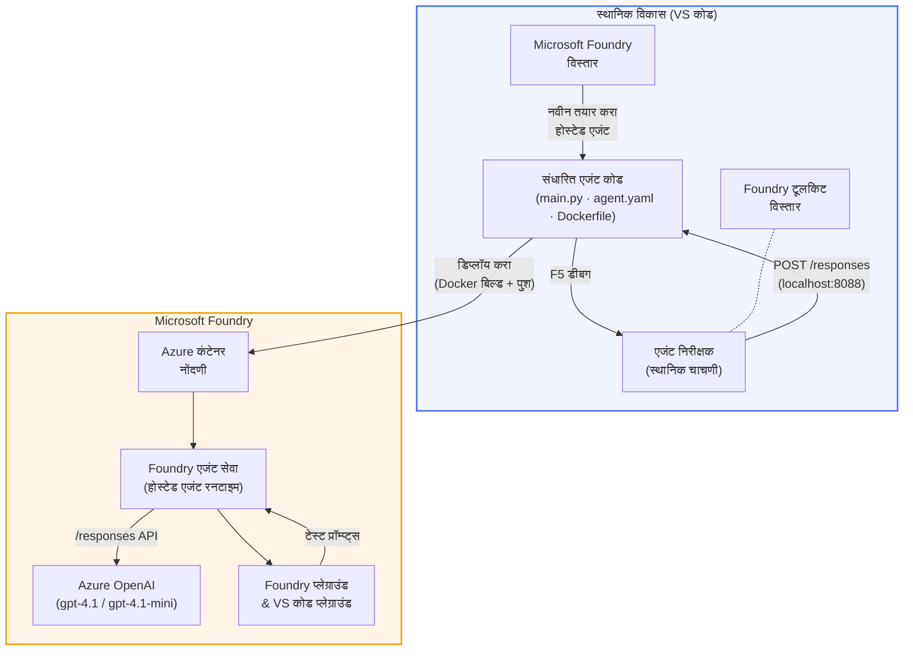

# Foundry Toolkit + Foundry Hosted Agents कार्यशाळा

[](https://www.python.org/)
[](https://github.com/microsoft/agents)
[](https://learn.microsoft.com/azure/ai-foundry/agents/concepts/hosted-agents/)
[](https://ai.azure.com/)
[](https://learn.microsoft.com/azure/ai-services/openai/)
[](https://learn.microsoft.com/cli/azure/install-azure-cli)
[](https://learn.microsoft.com/azure/developer/azure-developer-cli/install-azd)
[](https://www.docker.com/)
[](https://marketplace.visualstudio.com/items?itemName=ms-windows-ai-studio.windows-ai-studio)
[](LICENSE)

**Microsoft Foundry Agent Service** मध्ये AI एजंट्स तयार करा, चाचणी करा आणि तैनात करा, जे पूर्णपणे VS Code वापरून **Microsoft Foundry विस्तार** आणि **Foundry Toolkit** द्वारे **Hosted Agents** म्हणून चालतात.

> **Hosted Agents सध्या पूर्वावलोकन अवस्थेत आहेत.** समर्थित प्रदेश मर्यादित आहेत - पाहा [प्रदेश उपलब्धता](https://learn.microsoft.com/azure/foundry/agents/concepts/hosted-agents#region-availability).

> प्रत्येक लॅबमधील `agent/` फोल्डर **Foundry विस्ताराद्वारे स्वयंचलितरित्या तयार** केला जातो - तुम्ही नंतर कोड सानुकूल करता, स्थानिक चाचणी करता आणि तैनात करता.

### 🌐 बहुभाषिक समर्थन

#### GitHub Action द्वारे समर्थित (स्वयंचलित आणि सदैव अद्ययावत)

<!-- CO-OP TRANSLATOR LANGUAGES TABLE START -->
[Arabic](../ar/README.md) | [Bengali](../bn/README.md) | [Bulgarian](../bg/README.md) | [Burmese (Myanmar)](../my/README.md) | [Chinese (Simplified)](../zh-CN/README.md) | [Chinese (Traditional, Hong Kong)](../zh-HK/README.md) | [Chinese (Traditional, Macau)](../zh-MO/README.md) | [Chinese (Traditional, Taiwan)](../zh-TW/README.md) | [Croatian](../hr/README.md) | [Czech](../cs/README.md) | [Danish](../da/README.md) | [Dutch](../nl/README.md) | [Estonian](../et/README.md) | [Finnish](../fi/README.md) | [French](../fr/README.md) | [German](../de/README.md) | [Greek](../el/README.md) | [Hebrew](../he/README.md) | [Hindi](../hi/README.md) | [Hungarian](../hu/README.md) | [Indonesian](../id/README.md) | [Italian](../it/README.md) | [Japanese](../ja/README.md) | [Kannada](../kn/README.md) | [Khmer](../km/README.md) | [Korean](../ko/README.md) | [Lithuanian](../lt/README.md) | [Malay](../ms/README.md) | [Malayalam](../ml/README.md) | [Marathi](./README.md) | [Nepali](../ne/README.md) | [Nigerian Pidgin](../pcm/README.md) | [Norwegian](../no/README.md) | [Persian (Farsi)](../fa/README.md) | [Polish](../pl/README.md) | [Portuguese (Brazil)](../pt-BR/README.md) | [Portuguese (Portugal)](../pt-PT/README.md) | [Punjabi (Gurmukhi)](../pa/README.md) | [Romanian](../ro/README.md) | [Russian](../ru/README.md) | [Serbian (Cyrillic)](../sr/README.md) | [Slovak](../sk/README.md) | [Slovenian](../sl/README.md) | [Spanish](../es/README.md) | [Swahili](../sw/README.md) | [Swedish](../sv/README.md) | [Tagalog (Filipino)](../tl/README.md) | [Tamil](../ta/README.md) | [Telugu](../te/README.md) | [Thai](../th/README.md) | [Turkish](../tr/README.md) | [Ukrainian](../uk/README.md) | [Urdu](../ur/README.md) | [Vietnamese](../vi/README.md)

> **स्थानिकरीत्या क्लोन करायचे प्राधान्य आहे?**
>
> या रेपॉझिटरीमध्ये ५०+ भाषा अनुवाद आहेत ज्यामुळे डाउनलोडचा आकार मोठा होतो. अनुवादांशिवाय क्लोन करण्यासाठी sparse checkout वापरा:
>
> **Bash / macOS / Linux:**
> ```bash
> git clone --filter=blob:none --sparse https://github.com/microsoft-foundry/Foundry_Toolkit_for_VSCode_Lab.git
> cd Foundry_Toolkit_for_VSCode_Lab
> git sparse-checkout set --no-cone '/*' '!translations' '!translated_images'
> ```
>
> **CMD (Windows):**
> ```cmd
> git clone --filter=blob:none --sparse https://github.com/microsoft-foundry/Foundry_Toolkit_for_VSCode_Lab.git
> cd Foundry_Toolkit_for_VSCode_Lab
> git sparse-checkout set --no-cone "/*" "!translations" "!translated_images"
> ```
>
> हे तुम्हाला कोर्स पूर्ण करण्यासाठी आवश्यक असलेले सर्व काही जलद डाउनलोडसह देते.
<!-- CO-OP TRANSLATOR LANGUAGES TABLE END -->

---

## आर्किटेक्चर


**प्रवाह:** Foundry विस्तार एजंट तयार करतो → तुम्ही कोड आणि सूचना सानुकूल करता → Agent Inspector सह स्थानिक चाचणी करता → Foundry मध्ये तैनात करता (Docker प्रतिमा ACR मध्ये ढकलली जाते) → Playground मध्ये पडताळणी करता.

---

## तुम्ही काय तयार कराल

| लॅब | वर्णन | स्थिती |
|-----|-------------|--------|
| **Lab 01 - Single Agent** | **"Explain Like I'm an Executive" एजंट** तयार करा, स्थानिक चाचणी करा, आणि Foundry मध्ये तैनात करा | ✅ उपलब्ध |
| **Lab 02 - Multi-Agent Workflow** | **"Resume → Job Fit Evaluator"** तयार करा - ४ एजंट्स एकत्र काम करून Resume फिटचे गुणांकन करतात आणि शिक्षण रोडमॅप तयार करतात | ✅ उपलब्ध |

---

## Executive Agent बघा

या कार्यशाळेत तुम्ही **"Explain Like I'm an Executive" एजंट** तयार कराल - एखादा AI एजंट जो गुंतागुंतीच्या तांत्रिक भाषणाला सोप्या, बोर्डरूमसाठी तयार सारांशात रूपांतरित करतो. खरं तर, C-स्तरीवर कोणाला "thread pool exhaustion caused by synchronous calls introduced in v3.2" याबद्दल ऐकायचे नसते.

मी हा एजंट तयार केला कारण माझा परिपूर्ण पोस्ट-मॉर्टेम ऐकल्यावर अनेकदा प्रतिसाद आला: *"म्हणजे... वेबसाईट खाली आहे का नाही?"*

### तो कसा काम करतो

तुम्ही त्याला तांत्रिक अपडेट देता. तो तीन बुलेट पॉइंट्ससह एक Executive सारांश परत करतो - कोणताही जटिल शब्द, stack trace किंवा अस्वस्थता नाही. फक्त **काय घडलं**, **व्यवसायावर परिणाम**, आणि **पुढचा टप्पा**.

### कृतीत पाहा

**तुम्ही म्हणता:**
> "API ची विलंबता वाढली कारण v3.2 मध्ये समकालिक कॉल्समुळे thread pool exhaustion झाला."

**एजंट उत्तर देतो:**

> **Executive सारांश:**
> - **काय घडलं:** नवीनतम प्रकाशनानंतर प्रणाली मंदावली.
> - **व्यवसायावर परिणाम:** काही वापरकर्त्यांना सेवा वापरताना विलंब अनुभवला.
> - **पुढचा टप्पा:** बदल मागे घेतला गेला आहे आणि पुनःतैनातीपूर्वी दुरुस्ती तयार केली जात आहे.

### हा एजंट का?

हा एक सोपा, एकाच उद्देशाचा एजंट आहे - complex tool chains मध्ये अडथळा न होता hosted agent workflow शिकण्यासाठी अगदी योग्य. आणि खरी गोष्ट? प्रत्येक अभियांत्रिकी संघाला यापैकी एक हवा.

---

## कार्यशाळेची रचना

```
📂 Foundry_Toolkit_for_VSCode_Lab/
├── 📄 README.md                      ← You are here
├── 📂 ExecutiveAgent/                ← Standalone hosted agent project
│   ├── agent.yaml
│   ├── Dockerfile
│   ├── main.py
│   └── requirements.txt
└── 📂 workshop/
    ├── 📂 lab01-single-agent/        ← Full lab: docs + agent code
    │   ├── README.md                 ← Hands-on lab instructions
    │   ├── 📂 docs/                  ← Step-by-step tutorial modules
    │   │   ├── 00-prerequisites.md
    │   │   ├── 01-install-foundry-toolkit.md
    │   │   ├── 02-create-foundry-project.md
    │   │   ├── 03-create-hosted-agent.md
    │   │   ├── 04-configure-and-code.md
    │   │   ├── 05-test-locally.md
    │   │   ├── 06-deploy-to-foundry.md
    │   │   ├── 07-verify-in-playground.md
    │   │   └── 08-troubleshooting.md
    │   └── 📂 agent/                 ← Reference solution (auto-scaffolded by Foundry extension)
    │       ├── agent.yaml
    │       ├── Dockerfile
    │       ├── main.py
    │       └── requirements.txt
    └── 📂 lab02-multi-agent/         ← Resume → Job Fit Evaluator
        ├── README.md                 ← Hands-on lab instructions (end-to-end)
        ├── 📂 docs/                  ← Step-by-step tutorial modules
        │   ├── 00-prerequisites.md
        │   ├── 01-understand-multi-agent.md
        │   ├── 02-scaffold-multi-agent.md
        │   ├── 03-configure-agents.md
        │   ├── 04-orchestration-patterns.md
        │   ├── 05-test-locally.md
        │   ├── 06-deploy-to-foundry.md
        │   ├── 07-verify-in-playground.md
        │   └── 08-troubleshooting.md
        └── 📂 PersonalCareerCopilot/ ← Reference solution (multi-agent workflow)
            ├── agent.yaml
            ├── Dockerfile
            ├── main.py
            └── requirements.txt
```

> **टीप:** प्रत्येक लॅबमधील `agent/` फोल्डर हा फक्त Microsoft Foundry विस्ताराने निर्माण होतो जेव्हा तुम्ही Command Palette मधून `Microsoft Foundry: Create a New Hosted Agent` चालवता. फायली त्यानंतर तुमच्या एजंटच्या सूचना, साधने आणि कॉन्फिगरेशननुसार सानुकूलित केल्या जातात. Lab 01 तुम्हाला याचा आरंभ करुन देतो.

---

## प्रारंभ करा

### 1. रेपॉझिटरी क्लोन करा

```bash
git clone https://github.com/microsoft-foundry/Foundry_Toolkit_for_VSCode_Lab.git
cd Foundry_Toolkit_for_VSCode_Lab
```

### 2. Python व्हर्चुअल एन्व्हायर्नमेंट सेट करा

```bash
python -m venv venv
```

ते सक्रिय करा:

- **Windows (PowerShell):**
  ```powershell
  .\venv\Scripts\Activate.ps1
  ```
- **macOS / Linux:**
  ```bash
  source venv/bin/activate
  ```

### 3. अवलंबित्वे इंस्टॉल करा

```bash
pip install -r workshop/lab01-single-agent/agent/requirements.txt
```

### 4. एन्व्हायर्नमेंट व्हेरिएबल्स कॉन्फिगर करा

एजंट फोल्डरमध्ये असलेली उदाहरण `.env` फाइल कॉपी करा आणि तुमची मूल्ये भरा:

```bash
cp workshop/lab01-single-agent/agent/.env.example workshop/lab01-single-agent/agent/.env
```

`workshop/lab01-single-agent/agent/.env` संपादित करा:

```env
AZURE_AI_PROJECT_ENDPOINT=https://<your-account>.services.ai.azure.com/api/projects/<your-project>
MODEL_DEPLOYMENT_NAME=<your-model-deployment-name>
```

### 5. कार्यशाळेतील लॅबस फॉलो करा

प्रत्येक लॅब स्वतःच्या मॉड्यूलसह स्वतंत्र आहे. मूलभूत गोष्टी शिकण्यासाठी **Lab 01** पासून सुरुवात करा, त्यानंतर बहु-एजंट workflows साठी **Lab 02** च्या दिशेने जा.

#### Lab 01 - Single Agent ([संपूर्ण सूचना](workshop/lab01-single-agent/README.md))

| # | मॉड्यूल | लिंक |
|---|--------|------|
| 1 | पूर्वापेक्षा वाचा | [00-prerequisites.md](workshop/lab01-single-agent/docs/00-prerequisites.md) |
| 2 | Foundry Toolkit आणि Foundry विस्तार इंस्टॉल करा | [01-install-foundry-toolkit.md](workshop/lab01-single-agent/docs/01-install-foundry-toolkit.md) |
| 3 | Foundry प्रोजेक्ट तयार करा | [02-create-foundry-project.md](workshop/lab01-single-agent/docs/02-create-foundry-project.md) |
| 4 | Hosted agent तयार करा | [03-create-hosted-agent.md](workshop/lab01-single-agent/docs/03-create-hosted-agent.md) |
| 5 | सूचना आणि पर्यावरण कॉन्फिगर करा | [04-configure-and-code.md](workshop/lab01-single-agent/docs/04-configure-and-code.md) |
| 6 | स्थानिक चाचणी | [05-test-locally.md](workshop/lab01-single-agent/docs/05-test-locally.md) |
| 7 | Foundry मध्ये तैनात करा | [06-deploy-to-foundry.md](workshop/lab01-single-agent/docs/06-deploy-to-foundry.md) |
| 8 | प्लेग्राउंडमध्ये पडताळणी करा | [07-verify-in-playground.md](workshop/lab01-single-agent/docs/07-verify-in-playground.md) |
| 9 | समस्या निवारण | [08-troubleshooting.md](workshop/lab01-single-agent/docs/08-troubleshooting.md) |

#### Lab 02 - Multi-Agent Workflow ([संपूर्ण सूचना](workshop/lab02-multi-agent/README.md))

| # | मॉड्यूल | लिंक |
|---|--------|------|
| 1 | पूर्वापेक्षा (Lab 02) | [00-prerequisites.md](workshop/lab02-multi-agent/docs/00-prerequisites.md) |
| 2 | बहु-एजंट आर्किटेक्चर समजून घ्या | [01-understand-multi-agent.md](workshop/lab02-multi-agent/docs/01-understand-multi-agent.md) |
| 3 | बहु-एजंट प्रोजेक्ट स्कॅफोल्ड करा | [02-scaffold-multi-agent.md](workshop/lab02-multi-agent/docs/02-scaffold-multi-agent.md) |
| 4 | एजंट्स आणि पर्यावरण कॉन्फिगर करा | [03-configure-agents.md](workshop/lab02-multi-agent/docs/03-configure-agents.md) |
| 5 | ऑर्केस्ट्रेशन पॅटर्न्स | [04-orchestration-patterns.md](workshop/lab02-multi-agent/docs/04-orchestration-patterns.md) |
| 6 | स्थानिक चाचणी (बहु-एजंट) | [05-test-locally.md](workshop/lab02-multi-agent/docs/05-test-locally.md) |
| 7 | फाउंड्रीवर तैनात करा | [06-deploy-to-foundry.md](workshop/lab02-multi-agent/docs/06-deploy-to-foundry.md) |
| 8 | प्लेग्राउंडमध्ये पडताळणी करा | [07-verify-in-playground.md](workshop/lab02-multi-agent/docs/07-verify-in-playground.md) |
| 9 | समस्या निवारण (बहु-एजंट) | [08-troubleshooting.md](workshop/lab02-multi-agent/docs/08-troubleshooting.md) |

---

## देखभाल करणारा

<table>
<tr>
    <td align="center"><a href="https://github.com/ShivamGoyal03">
        <br />
        <sub><b>शिवम गोयल</b></sub>
    </a><br />
    </td>
</tr>
</table>

---

## आवश्यक परवानग्या (जलद संदर्भ)

| परिस्थिती | आवश्यक भूमिका |
|----------|---------------|
| नवीन फाउंड्री प्रोजेक्ट तयार करा | फाउंड्री संसाधनांवर **Azure AI Owner** |
| विद्यमान प्रोजेक्टवर तैनात करा (नवीन संसाधने) | सदस्यत्वावर **Azure AI Owner** + **Contributor** |
| पूर्णपणे कॉन्फिगर केलेल्या प्रोजेक्टवर तैनात करा | खात्यावर **Reader** + प्रोजेक्टवर **Azure AI User** |

> **महत्वाचे:** Azure मध्ये `Owner` आणि `Contributor` भूमिका फक्त *व्यवस्थापन* परवानग्या समाविष्ट करतात, *विकास* (डेटा क्रिया) परवानग्या नाहीत. एजंट तयार करण्यासाठी आणि तैनात करण्यासाठी तुम्हाला **Azure AI User** किंवा **Azure AI Owner** लागतो.

---

## संदर्भ

- [जलद प्रारंभ: तुमचा पहिला होस्टेड एजंट तैनात करा (VS Code)](https://learn.microsoft.com/azure/foundry/agents/quickstarts/quickstart-hosted-agent)
- [होस्टेड एजंट म्हणजे काय?](https://learn.microsoft.com/azure/foundry/agents/concepts/hosted-agents)
- [VS कोडमध्ये होस्टेड एजंट वर्कफ़्लोज तयार करा](https://learn.microsoft.com/azure/foundry/agents/how-to/vs-code-agents-workflow-pro-code)
- [होस्टेड एजंट तैनात करा](https://learn.microsoft.com/azure/foundry/agents/how-to/deploy-hosted-agent)
- [Microsoft Foundry साठी RBAC](https://learn.microsoft.com/azure/foundry/concepts/rbac-foundry)
- [आर्किटेक्चर रिव्ह्यू एजंट नमुना](https://github.com/Azure-Samples/agent-architecture-review-sample) - MCP टूल्स, Excalidraw आकृत्या, आणि ड्युअल तैनातीसह रिअल-वर्ल्ड होस्टेड एजंट

---

## परवाना

[MIT](../../LICENSE)

---

<!-- CO-OP TRANSLATOR DISCLAIMER START -->
**सोडून देणे**:  
हा दस्तऐवज AI भाषा अनुवाद सेवा [Co-op Translator](https://github.com/Azure/co-op-translator) वापरून अनुवादित केला आहे. आम्ही अचूकतेसाठी प्रयत्नशील असलो तरी, कृपया लक्षात ठेवा की स्वयंचलित अनुवादांमध्ये चुका किंवा अचूकतेत फरक असू शकतो. मूळ दस्तऐवज त्याच्या स्थानिक भाषेत अधिकृत स्रोत म्हणून गणला जावा. महत्वाची माहिती असल्यास, व्यावसायिक मानवी अनुवाद करण्याची शिफारस केली जाते. या अनुवादाच्या वापरामुळे उद्भवलेल्या कुठल्याही गैरसमज किंवा गैरवर्तनांसाठी आम्ही जबाबदार नाही.
<!-- CO-OP TRANSLATOR DISCLAIMER END -->