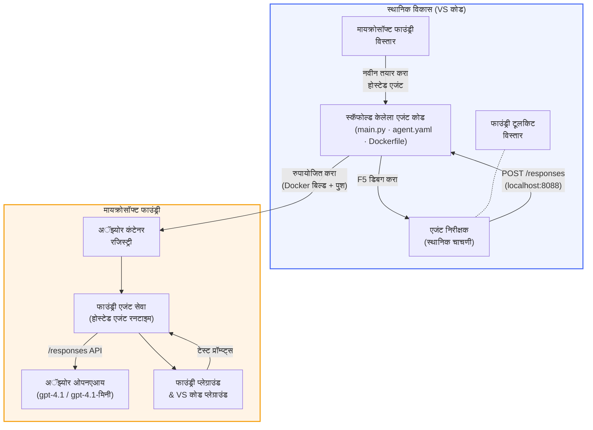

# Foundry Toolkit + Foundry Hosted Agents कार्यशाळा

[](https://www.python.org/)
[](https://github.com/microsoft/agents)
[](https://learn.microsoft.com/azure/ai-foundry/agents/concepts/hosted-agents/)
[](https://ai.azure.com/)
[](https://learn.microsoft.com/azure/ai-services/openai/)
[](https://learn.microsoft.com/cli/azure/install-azure-cli)
[](https://learn.microsoft.com/azure/developer/azure-developer-cli/install-azd)
[](https://www.docker.com/)
[](https://marketplace.visualstudio.com/items?itemName=ms-windows-ai-studio.windows-ai-studio)
[](LICENSE)

**Microsoft Foundry Agent Service** मध्ये AI एजंट्स तयार करा, चाचणी करा आणि तैनात करा **Hosted Agents** म्हणून - पूर्णपणे VS Code वापरून **Microsoft Foundry विस्तार** आणि **Foundry Toolkit** वापरून.

> **Hosted Agents सध्या प्रिव्ह्यूमध्ये आहेत.** समर्थित प्रदेश मर्यादित आहेत - पाहा [प्रदेश उपलब्धता](https://learn.microsoft.com/azure/foundry/agents/concepts/hosted-agents#region-availability).

> प्रत्येक लॅबमधील `agent/` फोल्डर **Foundry विस्ताराद्वारे आपोआप स्कॅफोल्ड केला जातो** - त्यानंतर तुम्ही कोड सानुकूल करता, स्थानिकपणे चाचणी करता आणि तैनात करता.

<!-- CO-OP TRANSLATOR LANGUAGES TABLE START -->
[Arabic](../ar/README.md) | [Bengali](../bn/README.md) | [Bulgarian](../bg/README.md) | [Burmese (Myanmar)](../my/README.md) | [Chinese (Simplified)](../zh-CN/README.md) | [Chinese (Traditional, Hong Kong)](../zh-HK/README.md) | [Chinese (Traditional, Macau)](../zh-MO/README.md) | [Chinese (Traditional, Taiwan)](../zh-TW/README.md) | [Croatian](../hr/README.md) | [Czech](../cs/README.md) | [Danish](../da/README.md) | [Dutch](../nl/README.md) | [Estonian](../et/README.md) | [Finnish](../fi/README.md) | [French](../fr/README.md) | [German](../de/README.md) | [Greek](../el/README.md) | [Hebrew](../he/README.md) | [Hindi](../hi/README.md) | [Hungarian](../hu/README.md) | [Indonesian](../id/README.md) | [Italian](../it/README.md) | [Japanese](../ja/README.md) | [Kannada](../kn/README.md) | [Khmer](../km/README.md) | [Korean](../ko/README.md) | [Lithuanian](../lt/README.md) | [Malay](../ms/README.md) | [Malayalam](../ml/README.md) | [Marathi](./README.md) | [Nepali](../ne/README.md) | [Nigerian Pidgin](../pcm/README.md) | [Norwegian](../no/README.md) | [Persian (Farsi)](../fa/README.md) | [Polish](../pl/README.md) | [Portuguese (Brazil)](../pt-BR/README.md) | [Portuguese (Portugal)](../pt-PT/README.md) | [Punjabi (Gurmukhi)](../pa/README.md) | [Romanian](../ro/README.md) | [Russian](../ru/README.md) | [Serbian (Cyrillic)](../sr/README.md) | [Slovak](../sk/README.md) | [Slovenian](../sl/README.md) | [Spanish](../es/README.md) | [Swahili](../sw/README.md) | [Swedish](../sv/README.md) | [Tagalog (Filipino)](../tl/README.md) | [Tamil](../ta/README.md) | [Telugu](../te/README.md) | [Thai](../th/README.md) | [Turkish](../tr/README.md) | [Ukrainian](../uk/README.md) | [Urdu](../ur/README.md) | [Vietnamese](../vi/README.md)

> **स्थानिक करू इच्छिता?**
>
> हा संग्रहालय 50+ भाषा भाषांतरांसह आहे जे डाउनलोड आकार मोठा करतात. भाषांतराशिवाय क्लोन करण्यासाठी, sparse checkout वापरा:
>
> **Bash / macOS / Linux:**
> ```bash
> git clone --filter=blob:none --sparse https://github.com/microsoft-foundry/Foundry_Toolkit_for_VSCode_Lab.git
> cd Foundry_Toolkit_for_VSCode_Lab
> git sparse-checkout set --no-cone '/*' '!translations' '!translated_images'
> ```
>
> **CMD (Windows):**
> ```cmd
> git clone --filter=blob:none --sparse https://github.com/microsoft-foundry/Foundry_Toolkit_for_VSCode_Lab.git
> cd Foundry_Toolkit_for_VSCode_Lab
> git sparse-checkout set --no-cone "/*" "!translations" "!translated_images"
> ```
>
> यामुळे तुम्हाला कोर्स पूर्ण करण्यासाठी आवश्यक सर्वकाही खूप वेगाने डाउनलोड करता येते.
<!-- CO-OP TRANSLATOR LANGUAGES TABLE END -->

---

## आर्किटेक्चर


**प्रवाह:** Foundry विस्तार एजंट स्कॅफोल्ड करतो → तुम्ही कोड आणि सूचना सानुकूल करता → Agent Inspector सह स्थानिकपणे चाचणी करता → Foundry मध्ये तैनात करता (Docker इमेज ACR वर ढकलली जाते) → Playground मध्ये पडताळणी करता.

---

## तुम्ही काय तयार करणार आहात

| लॅब | वर्णन | स्थिती |
|-----|-------------|--------|
| **Lab 01 - Single Agent** | **"Explain Like I'm an Executive" Agent** तयार करा, स्थानिकपणे चाचणी करा आणि Foundry कडे तैनात करा | ✅ उपलब्ध |
| **Lab 02 - Multi-Agent Workflow** | **"Resume → Job Fit Evaluator"** तयार करा - 4 एजंट गुणांकनासाठी सहकार्य करतात आणि शिकण्याचा रोडमॅप तयार करतात | ✅ उपलब्ध |

---

## Executive Agent परिचय

या कार्यशाळेत तुम्ही **"Explain Like I'm an Executive" Agent** तयार कराल - एक AI एजंट जो गुंतागुंतीची तांत्रिक भाषा घेतो आणि ते शांत, बोर्डरूमसाठी तयार सारांशांमध्ये भाषांतरित करतो. कारण खरे सांगायचे तर, C-suite मधील कोणीही "thread pool exhaustion caused by synchronous calls introduced in v3.2" याबद्दल ऐकू इच्छित नाही.

मी हा एजंट तयार केला कारण अनेक वेळा माझ्या परिपूर्ण पोस्ट-मॉर्टेमनंतर मला मिळालेली प्रतिक्रिया होती: *"म्हणजे... वेबसाइट बंद आहे का नाही?"*

### ते कसे कार्य करते

तुम्ही त्याला तांत्रिक अद्ययावत माहिती देता. ते एक कार्यकारी सारांश परत देते - तीन मुद्दे, कोणतीही तांत्रिक भाषा नाही, कोणतेही स्टॅक ट्रेस नाही, कोणतीही भीती नाही. फक्त **काय घडले**, **व्यवसायावर परिणाम**, आणि **पुढील पाऊल**.

### ते प्रत्यक्ष पाहा

**तुम्ही म्हणता:**  
> "The API latency increased due to thread pool exhaustion caused by synchronous calls introduced in v3.2."

**एजंट प्रत्युत्तर देतो:**  

> **कार्यकारी सारांश:**  
> - **काय घडले:** नवीनतम अद्ययावतीनंतर, सिस्टम हळुवार झाले.  
> - **व्यवसायावर परिणाम:** काही वापरकर्त्यांना सेवा वापरताना विलंबांचा अनुभव आला.  
> - **पुढील पाऊल:** बदल मागे घेण्यात आला आहे आणि पुनःतैनातीपूर्वी दुरुस्ती तयार केली जात आहे.

### हा एजंट का?

हा एक सोपा, एकल-उद्देशीय एजंट आहे - होस्टेड एजंट वर्कफ्लो शिकण्याकरिता अगदी योग्य. आणि खरं तर? प्रत्येक अभियांत्रिकी टीमला अशा एजंटची गरज आहे.

---

## कार्यशाळेची रचना

```
📂 Foundry_Toolkit_for_VSCode_Lab/
├── 📄 README.md                      ← You are here
├── 📂 ExecutiveAgent/                ← Standalone hosted agent project
│   ├── agent.yaml
│   ├── Dockerfile
│   ├── main.py
│   └── requirements.txt
└── 📂 workshop/
    ├── 📂 lab01-single-agent/        ← Full lab: docs + agent code
    │   ├── README.md                 ← Hands-on lab instructions
    │   ├── 📂 docs/                  ← Step-by-step tutorial modules
    │   │   ├── 00-prerequisites.md
    │   │   ├── 01-install-foundry-toolkit.md
    │   │   ├── 02-create-foundry-project.md
    │   │   ├── 03-create-hosted-agent.md
    │   │   ├── 04-configure-and-code.md
    │   │   ├── 05-test-locally.md
    │   │   ├── 06-deploy-to-foundry.md
    │   │   ├── 07-verify-in-playground.md
    │   │   └── 08-troubleshooting.md
    │   └── 📂 agent/                 ← Reference solution (auto-scaffolded by Foundry extension)
    │       ├── agent.yaml
    │       ├── Dockerfile
    │       ├── main.py
    │       └── requirements.txt
    └── 📂 lab02-multi-agent/         ← Resume → Job Fit Evaluator
        ├── README.md                 ← Hands-on lab instructions (end-to-end)
        ├── 📂 docs/                  ← Step-by-step tutorial modules
        │   ├── 00-prerequisites.md
        │   ├── 01-understand-multi-agent.md
        │   ├── 02-scaffold-multi-agent.md
        │   ├── 03-configure-agents.md
        │   ├── 04-orchestration-patterns.md
        │   ├── 05-test-locally.md
        │   ├── 06-deploy-to-foundry.md
        │   ├── 07-verify-in-playground.md
        │   └── 08-troubleshooting.md
        └── 📂 PersonalCareerCopilot/ ← Reference solution (multi-agent workflow)
            ├── agent.yaml
            ├── Dockerfile
            ├── main.py
            └── requirements.txt
```
  
> **टीप:** `agent/` फोल्डर प्रत्येक लॅबमध्ये तो फाईल्स तयार करतो जेव्हा तुम्ही कमांड पॅलेटमधून `Microsoft Foundry: Create a New Hosted Agent` चालवता. नंतर त्या फाइल्स तुमच्या एजंटच्या सूचनांनी, साधनांनी आणि कॉन्फिगरेशनने सानुकूलित केल्या जातात. लॅब 01 तुम्हाला सुरुवातीपासून हे पुन्हा बनवायला शिकवते.

---

## सुरुवात कशी करावी

### 1. रिपॉझिटरी क्लोन करा

```bash
git clone https://github.com/microsoft-foundry/Foundry_Toolkit_for_VSCode_Lab.git
cd Foundry_Toolkit_for_VSCode_Lab
```
  
### 2. Python वर्च्युअल वातावरण सेट करा

```bash
python -m venv venv
```
  
ते सक्रिय करा:

- **Windows (PowerShell):**  
  ```powershell
  .\venv\Scripts\Activate.ps1
  ```
  
- **macOS / Linux:**  
  ```bash
  source venv/bin/activate
  ```
  
### 3. अवलंबित्वे स्थापित करा

```bash
pip install -r workshop/lab01-single-agent/agent/requirements.txt
```
  
### 4. पर्यावरणीय बदल (environment variables) कॉन्फिगर करा

एजंट फोल्डरमधील उदाहरण `.env` फाइल कॉपी करा आणि तुमची मूल्ये भरा:

```bash
cp workshop/lab01-single-agent/agent/.env.example workshop/lab01-single-agent/agent/.env
```
  
`workshop/lab01-single-agent/agent/.env` संपादित करा:

```env
AZURE_AI_PROJECT_ENDPOINT=https://<your-account>.services.ai.azure.com/api/projects/<your-project>
MODEL_DEPLOYMENT_NAME=<your-model-deployment-name>
```
  
### 5. कार्यशाळेतील लॅब्सचा अवलंब करा

प्रत्येक लॅब स्वतंत्र मॉड्यूल्ससह आहे. मूलभूत गोष्टी शिकण्यासाठी **Lab 01** पासून सुरुवात करा, नंतर मल्टी-एजंट वर्कफ्लोजसाठी **Lab 02** कडे जा.

#### Lab 01 - Single Agent ([पूर्ण सूचनांसाठी](workshop/lab01-single-agent/README.md))

| # | मॉड्यूल | दुवा |
|---|--------|------|
| 1 | पूर्वअट वाचा | [00-prerequisites.md](workshop/lab01-single-agent/docs/00-prerequisites.md) |
| 2 | Foundry Toolkit & Foundry विस्तार स्थापित करा | [01-install-foundry-toolkit.md](workshop/lab01-single-agent/docs/01-install-foundry-toolkit.md) |
| 3 | Foundry प्रकल्प तयार करा | [02-create-foundry-project.md](workshop/lab01-single-agent/docs/02-create-foundry-project.md) |
| 4 | होस्टेड एजंट तयार करा | [03-create-hosted-agent.md](workshop/lab01-single-agent/docs/03-create-hosted-agent.md) |
| 5 | सूचना आणि वातावरण सेट करा | [04-configure-and-code.md](workshop/lab01-single-agent/docs/04-configure-and-code.md) |
| 6 | स्थानिक चाचणी करा | [05-test-locally.md](workshop/lab01-single-agent/docs/05-test-locally.md) |
| 7 | Foundry कडे तैनात करा | [06-deploy-to-foundry.md](workshop/lab01-single-agent/docs/06-deploy-to-foundry.md) |
| 8 | प्लेग्राऊंडमध्ये पडताळणी करा | [07-verify-in-playground.md](workshop/lab01-single-agent/docs/07-verify-in-playground.md) |
| 9 | समस्या निवारण | [08-troubleshooting.md](workshop/lab01-single-agent/docs/08-troubleshooting.md) |

#### Lab 02 - Multi-Agent Workflow ([पूर्ण सूचनांसाठी](workshop/lab02-multi-agent/README.md))

| # | मॉड्यूल | दुवा |
|---|--------|------|
| 1 | पूर्वअटी (Lab 02) | [00-prerequisites.md](workshop/lab02-multi-agent/docs/00-prerequisites.md) |
| 2 | मल्टी-एजंट आर्किटेक्चर समजून घ्या | [01-understand-multi-agent.md](workshop/lab02-multi-agent/docs/01-understand-multi-agent.md) |
| 3 | मल्टी-एजंट प्रकल्प स्कॅफोल्ड करा | [02-scaffold-multi-agent.md](workshop/lab02-multi-agent/docs/02-scaffold-multi-agent.md) |
| 4 | एजंट्स आणि वातावरण कॉन्फिगर करा | [03-configure-agents.md](workshop/lab02-multi-agent/docs/03-configure-agents.md) |
| 5 | ऑर्केस्ट्रेशन पॅटर्न्स | [04-orchestration-patterns.md](workshop/lab02-multi-agent/docs/04-orchestration-patterns.md) |
| 6 | स्थानिक चाचणी करा (मल्टी-एजंट) | [05-test-locally.md](workshop/lab02-multi-agent/docs/05-test-locally.md) |
| 7 | फाउंडरीवर तैनाती करा | [06-deploy-to-foundry.md](workshop/lab02-multi-agent/docs/06-deploy-to-foundry.md) |
| 8 | प्लेग्राउंडमध्ये सत्यापित करा | [07-verify-in-playground.md](workshop/lab02-multi-agent/docs/07-verify-in-playground.md) |
| 9 | समस्या निवारण (मल्टी-एजंट) | [08-troubleshooting.md](workshop/lab02-multi-agent/docs/08-troubleshooting.md) |

---

## देखभाल करणारा

<table>
<tr>
    <td align="center"><a href="https://github.com/ShivamGoyal03">
        <br />
        <sub><b>शिवम गोयल</b></sub>
    </a><br />
    </td>
</tr>
</table>

---

## आवश्यक परवानग्या (त्वरित संदर्भ)

| परिदृश्य | आवश्यक भूमिका |
|----------|---------------|
| नवीन फाउंडरी प्रोजेक्ट तयार करा | फाउंडरी स्त्रोतावर **Azure AI मालक** |
| विद्यमान प्रोजेक्टमध्ये तैनाती करा (नवीन स्त्रोत) | सदस्यत्वावर **Azure AI मालक** + **योगदानकर्ता** |
| पूर्णपणे कॉन्फिगर केलेल्या प्रोजेक्टमध्ये तैनाती करा | खात्यावर **वाचक** + प्रोजेक्टवर **Azure AI वापरकर्ता** |

> **महत्त्वाचे:** Azure `मालक` आणि `योगदानकर्ता` भूमिका फक्त *व्यवस्थापन* परवानग्यांचा समावेश करतात, *विकास* (डेटा क्रिया) परवानग्या नाहीत. एजंट तयार करण्यासाठी आणि तैनात करण्यासाठी तुम्हाला **Azure AI वापरकर्ता** किंवा **Azure AI मालक** आवश्यक आहे.

---

## संदर्भ

- [त्वरित प्रारंभ: आपला पहिला होस्टेड एजंट तैनात करा (VS कोड)](https://learn.microsoft.com/azure/foundry/agents/quickstarts/quickstart-hosted-agent)
- [होस्टेड एजंट म्हणजे काय?](https://learn.microsoft.com/azure/foundry/agents/concepts/hosted-agents)
- [VS कोडमध्ये होस्टेड एजंट कार्यप्रवाह तयार करा](https://learn.microsoft.com/azure/foundry/agents/how-to/vs-code-agents-workflow-pro-code)
- [होस्टेड एजंट तैनात करा](https://learn.microsoft.com/azure/foundry/agents/how-to/deploy-hosted-agent)
- [मायक्रोसॉफ्ट फाउंडरीजाठी RBAC](https://learn.microsoft.com/azure/foundry/concepts/rbac-foundry)
- [आर्किटेक्चर पुनरावलोकन एजंट नमुना](https://github.com/Azure-Samples/agent-architecture-review-sample) - MCP साधने, Excalidraw आकृत्या, आणि दुहेरी तैनातीसह वास्तविक जगातील होस्टेड एजंट

---


## परवाना

[MIT](../../LICENSE)

---

<!-- CO-OP TRANSLATOR DISCLAIMER START -->
**अस्वीकरण**:  
हा दस्तऐवज AI अनुवाद सेवा [Co-op Translator](https://github.com/Azure/co-op-translator) चा वापर करून अनुवादित केला आहे. आम्ही अचूकतेसाठी प्रयत्नशील असलो तरी, कृपया लक्षात ठेवा की स्वयंचलित अनुवादांमध्ये त्रुटी किंवा अचूकतेतील चुकां होऊ शकतात. मूळ दस्तऐवज त्याच्या स्थानिक भाषेत अधिकृत स्रोत समजला जातो. महत्वाच्या माहितीच्या बाबतीत व्यावसायिक मानवी अनुवाद शिफारसीय आहे. या अनुवादाच्या वापरामुळे उद्भवलेल्या कोणत्याही गैरसमज किंवा चुकीच्या अर्थलागी आम्ही जबाबदार नाही.
<!-- CO-OP TRANSLATOR DISCLAIMER END -->