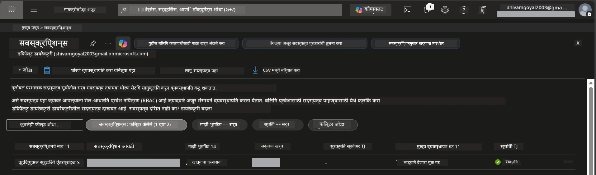

# Module 0 - पूर्वआवश्यकता

वर्कशॉप सुरू करण्यापूर्वी, खालील उपकरणे, प्रवेश आणि वातावरण तयार असल्याची खात्री करा. खालील प्रत्येक टप्पा अवश्य पूर्ण करा - पुढे उडू नका.

---

## 1. Azure खाते आणि सदस्यता

### 1.1 तुमची Azure सदस्यता तयार करा किंवा सत्यापित करा

1. ब्राउझर उघडा आणि [https://azure.microsoft.com/free/](https://azure.microsoft.com/free/) येथे जा.
2. तुमच्याकडे Azure खाते नसेल तर, **Start free** वर क्लिक करा आणि साइन-अप प्रक्रियेचे पालन करा. तुम्हाला Microsoft खाते (किंवा नवीन तयार करा) आणि ओळख प्रमाणित करण्यासाठी क्रेडिट कार्ड आवश्यक असणार.
3. जर आधीपासून खाते असेल तर [https://portal.azure.com](https://portal.azure.com) येथे साइन इन करा.
4. पोर्टलमध्ये, डाव्या नेव्हिगेशनमध्ये **Subscriptions** ब्लेडवर क्लिक करा (किंवा शीर्ष सर्च बारमध्ये "Subscriptions" शोधा).
5. किमान एक **Active** सदस्यता दिसते याची खात्री करा. नंतर वापरण्यासाठी **Subscription ID** नोंद करा.



### 1.2 आवश्यक RBAC भूमिका समजून घ्या

[Hosted Agent](https://learn.microsoft.com/azure/foundry/agents/concepts/hosted-agents) तैनात करण्यासाठी **डेटा क्रिया** परवानग्या आवश्यक आहेत ज्या सानुकूल Azure `Owner` आणि `Contributor` भूमिका समाविष्ट करत नाहीत. तुम्हाला खालील [भूमिका संयोजनांपैकी एक](https://learn.microsoft.com/azure/foundry/concepts/rbac-foundry#built-in-roles) आवश्यक असेल:

| परिस्थिती | आवश्यक भूमिका | नेमणूक कुठे करायची |
|----------|---------------|----------------------|
| नवीन Foundry प्रोजेक्ट तयार करा | Foundry रिसोर्सवर **Azure AI Owner** | Azure पोर्टलमधील Foundry रिसोर्स |
| विद्यमान प्रोजेक्टमध्ये (नवीन रिसोर्सेस) तैनात करा | सदस्यत्वावर **Azure AI Owner** + **Contributor** | सदस्यत्व + Foundry रिसोर्स |
| पूर्णपणे संरचित प्रोजेक्टमध्ये तैनात करा | खात्यावर **Reader** + प्रोजेक्टवर **Azure AI User** | Azure पोर्टलमधील खाते + प्रोजेक्ट |

> **महत्त्वाचा मुद्दा:** Azure `Owner` आणि `Contributor` भूमिका फक्त *व्यवस्थापन* परवानग्यांसाठी (ARM ऑपरेशन्स) आहेत. तुम्हाला एजंट तयार करण्यासाठी व तैनात करण्यासाठी आवश्यक असलेल्या `agents/write` सारख्या *डेटा क्रिया* साठी [**Azure AI User**](https://learn.microsoft.com/azure/foundry/concepts/rbac-foundry#built-in-roles) (किंवा त्याहून अधिक) भूमिका आवश्यक आहेत. या भूमिका तुम्ही [Module 2](02-create-foundry-project.md) मध्ये नेमाल.

---

## 2. स्थानिक उपकरणे स्थापित करा

खाली दिलेली प्रत्येक टूल इंस्टॉल करा. इंस्टॉलेशन झाल्यानंतर, खालील तपासणी आदेश चालवून ते कार्यरत आहे की नाही हे सत्यापित करा.

### 2.1 Visual Studio Code

1. [https://code.visualstudio.com/](https://code.visualstudio.com/) येथे जा.
2. तुमच्या OS (Windows/macOS/Linux) साठी इंस्टॉलर डाउनलोड करा.
3. डीफॉल्ट सेटिंग्जसह इंस्टॉलर चालवा.
4. VS Code उघडा आणि ते सुरळीत सुरू होते का ते तपासा.

### 2.2 Python 3.10+

1. [https://www.python.org/downloads/](https://www.python.org/downloads/) येथे जा.
2. Python 3.10 किंवा नंतरचे (3.12+ शिफारसीय) आवृत्ती डाउनलोड करा.
3. **Windows:** इंस्टॉलेशन दरम्यान, पहिल्या स्क्रीनवर **"Add Python to PATH"** निवडा.
4. टर्मिनल उघडा आणि तपासा:

   ```powershell
   python --version
   ```

   अपेक्षित आउटपुट: `Python 3.10.x` किंवा त्याहून अधिक.

### 2.3 Azure CLI

1. [https://learn.microsoft.com/cli/azure/install-azure-cli](https://learn.microsoft.com/cli/azure/install-azure-cli) वर जा.
2. तुमच्या OS साठी इंस्टॉलेशन सूचना पाळा.
3. तपासणी करा:

   ```powershell
   az --version
   ```

   अपेक्षित: `azure-cli 2.80.0` किंवा त्याहून अधिक.

4. साइन इन करा:

   ```powershell
   az login
   ```

### 2.4 Azure Developer CLI (azd)

1. [https://learn.microsoft.com/azure/developer/azure-developer-cli/install-azd](https://learn.microsoft.com/azure/developer/azure-developer-cli/install-azd) येथे जा.
2. तुमच्या OS साठी इंस्टॉलेशन सूचना पाळा. Windows वर:

   ```powershell
   winget install microsoft.azd
   ```

3. तपासा:

   ```powershell
   azd version
   ```

   अपेक्षित: `azd version 1.x.x` किंवा त्याहून अधिक.

4. साइन इन करा:

   ```powershell
   azd auth login
   ```

### 2.5 Docker Desktop (ऐच्छिक)

जर तुम्हाला डिप्लॉयमेंटपूर्वी स्थानिक कंटेनर इमेज तयार करायची व चाचणी चालवायची असेल तर Docker आवश्यक आहे. Foundry विस्तार डिप्लॉयमेंट दरम्यान कंटेनर बिल्डस आपोआप हाताळतो.

1. [https://docs.docker.com/get-docker/](https://docs.docker.com/get-docker/) येथे जा.
2. तुमच्या OS साठी Docker Desktop डाउनलोड आणि इंस्टॉल करा.
3. **Windows:** इंस्टॉलेशन दरम्यान WSL 2 बॅकएंड निवडलं असल्याची खात्री करा.
4. Docker Desktop सुरू करा आणि सिस्टीम ट्रेमध्ये **"Docker Desktop is running"** असा आयकॉन दिसेपर्यंत थांबा.
5. टर्मिनल उघडा आणि तपासा:

   ```powershell
   docker info
   ```

   यामुळे Docker सिस्टमची माहिती त्रुटीशिवाय दिसून येईल. जर तुम्हाला `Cannot connect to the Docker daemon` असा संदेश दाखवला, तर Docker पूर्णपणे सुरू होईपर्यंत अजून काही सेकंद थांबा.

---

## 3. VS Code एक्सटेंशन्स इंस्टॉल करा

तुम्हाला तीन एक्सटेंशन्सची गरज आहे. वर्कशॉप सुरू होण्याच्या अगोदरच त्या इंस्टॉल करा.

### 3.1 Microsoft Foundry for VS Code

1. VS Code उघडा.
2. `Ctrl+Shift+X` दाबा जे Extenions पॅनेल उघडेल.
3. शोध बॉक्समध्ये **"Microsoft Foundry"** टाईप करा.
4. **Microsoft Foundry for Visual Studio Code** शोधा (प्रकाशक: Microsoft, ID: `TeamsDevApp.vscode-ai-foundry`).
5. **Install** क्लिक करा.
6. इंस्टॉलेशन नंतर, Activity Bar (डाव्या साइडबार) मध्ये **Microsoft Foundry** आयकॉन दिसेल.

### 3.2 Foundry Toolkit

1. Extenions पॅनेलमध्ये (`Ctrl+Shift+X`) **"Foundry Toolkit"** शोधा.
2. **Foundry Toolkit** शोधा (प्रकाशक: Microsoft, ID: `ms-windows-ai-studio.windows-ai-studio`).
3. **Install** क्लिक करा.
4. Activity Bar मध्ये **Foundry Toolkit** आयकॉन दिसेल.

### 3.3 Python

1. Extenions पॅनेलमध्ये **"Python"** शोधा.
2. **Python** शोधा (प्रकाशक: Microsoft, ID: `ms-python.python`).
3. **Install** क्लिक करा.

---

## 4. VS Code मधून Azure मध्ये साइन इन करा

[Microsoft Agent Framework](https://learn.microsoft.com/agent-framework/overview/) [`DefaultAzureCredential`](https://learn.microsoft.com/azure/developer/python/sdk/authentication/credential-chains#defaultazurecredential-overview) वापरतो. तुम्हाला VS Code मध्ये Azure मध्ये साइन इन केलेले असणे गरजेचे आहे.

### 4.1 VS Code मधून साइन इन करा

1. VS Code च्या खालच्या डाव्या कोपर्‍याकडे जा आणि **Accounts** आयकॉन (मनुष्याच्या सिलेहुट सारखा) क्लिक करा.
2. **Sign in to use Microsoft Foundry** (किंवा **Sign in with Azure**) क्लिक करा.
3. ब्राउझर विंडो उघडेल - तुमच्या सदस्यत्वाच्या प्रवेश असलेल्या Azure खात्याने साइन इन करा.
4. VS Code मध्ये परत या. तुमचे खाते नाव खालच्या डाव्या कोपर्‍यात दिसेल.

### 4.2 (ऐच्छिक) Azure CLI द्वारे साइन इन करा

जर तुम्ही Azure CLI इंस्टॉल केले असेल आणि CLI बेस auth प्राधान्य देता:

```powershell
az login
```

यामुळे साइन-इनसाठी ब्राउझर उघडेल. साइन-इन नंतर, योग्य सदस्यत्व सेट करा:

```powershell
az account set --subscription "<your-subscription-id>"
```

तपासणी करा:

```powershell
az account show --query "{name:name, id:id, state:state}" --output table
```

तुमच्या सदस्यत्वाचे नाव, आयडी, व स्थिती = `Enabled` दिसणे अपेक्षित.

### 4.3 (पर्यायी) सेवा प्रमुख प्रमाणीकरण

CI/CD किंवा सामायिक वातावरणासाठी, खालील पर्यावरण चल सेट करा:

```powershell
$env:AZURE_TENANT_ID = "<your-tenant-id>"
$env:AZURE_CLIENT_ID = "<your-client-id>"
$env:AZURE_CLIENT_SECRET = "<your-client-secret>"
```

---

## 5. पूर्वावलोकन निर्बंध

पुढे जाण्यापूर्वी, सध्याच्या निर्बंधांची माहिती असणे आवश्यक आहे:

- [**Hosted Agents**](https://learn.microsoft.com/azure/foundry/agents/concepts/hosted-agents) सध्या **सार्वजनिक प्रिव्ह्यू** मध्ये आहेत - उत्पादनासाठी शिफारस केलेले नाही.
- **समर्थित प्रदेश मर्यादित आहेत** - रिसोर्सेस तयार करण्यापूर्वी [प्रदेश उपलब्धता](https://learn.microsoft.com/azure/foundry/agents/concepts/hosted-agents#region-availability) तपासा. अवांछित प्रदेश निवडल्यास, डिप्लॉयमेंट अपयशी ठरेल.
- `azure-ai-agentserver-agentframework` पॅकेज प्री-रिलीज (`1.0.0b16`) आहे - API मध्ये बदल होऊ शकतात.
- प्रमाण मर्यादा: Hosted एजंट 0-5 पुनरावृत्ती (स्केल-टू-झीरो सह) समर्थित.

---

## 6. पूर्वसंकल्प सूची

खालील प्रत्येक तपशील पूर्ण करा. कोणताही टप्पा अयशस्वी झाल्यास, मागे जाऊन तो दुरुस्त करा.

- [ ] VS Code कोणताही त्रुटी न देता उघडतो
- [ ] Python 3.10+ PATH मध्ये आहे (`python --version` `3.10.x` किंवा त्याहून अधिक दर्शवितो)
- [ ] Azure CLI इंस्टॉल केलेले आहे (`az --version` `2.80.0` किंवा त्याहून अधिक दर्शवितो)
- [ ] Azure Developer CLI इंस्टॉल केलेले आहे (`azd version` आवृत्ती माहिती दर्शवितो)
- [ ] Microsoft Foundry एक्सटेंशन इंस्टॉल आहे (Activity Bar मध्ये आयकॉन दिसते)
- [ ] Foundry Toolkit एक्सटेंशन इंस्टॉल आहे (Activity Bar मध्ये आयकॉन दिसते)
- [ ] Python एक्सटेंशन इंस्टॉल आहे
- [ ] तुम्ही VS Code मध्ये Azure मध्ये साइन इन केलेले आहात (Accounts आयकॉन, खालचा डावा तपासा)
- [ ] `az account show` तुमची सदस्यता परत करतो
- [ ] (ऐच्छिक) Docker Desktop चालू आहे (`docker info` प्रणालीची त्रुटीशिवाय माहिती परत करतो)

### तपासणी बिंदू

VS Code च्या Activity Bar मध्ये **Foundry Toolkit** आणि **Microsoft Foundry** साइडबार दृश्ये दोन्ही दिसतात याची खात्री करा. प्रत्येकावर क्लिक करून ते कोणतीही त्रुटी न देता लोड होतात का ते तपासा.

---

**पुढे:** [01 - Install Foundry Toolkit & Foundry Extension →](01-install-foundry-toolkit.md)

---

<!-- CO-OP TRANSLATOR DISCLAIMER START -->
**तडजोड**:
हा दस्तऐवज AI भाषांतर सेवा [Co-op Translator](https://github.com/Azure/co-op-translator) वापरून अनुवादित केला आहे. आम्ही अचूकतेसाठी प्रयत्नशील असलो तरी, कृपया लक्षात घ्या की स्वयंचलित अनुवादांमध्ये चुका किंवा असमर्थता असू शकते. मूळ दस्तऐवज त्याच्या स्थानिक भाषेत अधिकृत स्त्रोत मानला जाण्याचा आहे. महत्त्वपूर्ण माहितीसाठी, व्यावसायिक मानवी भाषांतराची शिफारस केली जाते. या भाषांतराच्या वापरामुळे उद्भवलेल्या कोणत्याही गैरसमजुती किंवा गैरव्याख्यांसाठी आम्ही जबाबदार नाही.
<!-- CO-OP TRANSLATOR DISCLAIMER END -->