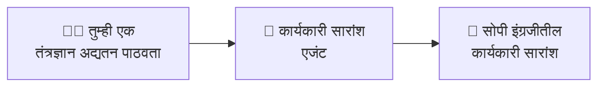

# मॉड्यूल 0 - परिचय

⏱️ ~10 मिनिटे

> [!WARNING]
> **पूर्वावलोकन आणि निर्बंध:** [होस्टेड एजंट्स](https://learn.microsoft.com/azure/foundry/agents/concepts/hosted-agents) सध्या **सार्वजनिक प्रीव्ह्यू** मध्ये आहेत - उत्पादन कार्यभारांसाठी शिफारस केली जात नाही. खालील गोष्टी लक्षात ठेवा:
> - **समर्थित प्रदेश मर्यादित आहेत** - संसाधने तयार करण्यापूर्वी [प्रदेश उपलब्धता](https://learn.microsoft.com/azure/foundry/agents/concepts/hosted-agents#region-availability) तपासा. जर तुम्ही अप्रत्यक्ष प्रदेश निवडला तर वितरण अयशस्वी होईल.
> - `azure-ai-agentserver-agentframework` पॅकेज प्री-रिलीस आहे - API आवृत्त्यांदरम्यान बदल होऊ शकतात.
> - स्केल मर्यादा: होस्टेड एजंट् 0–5 प्रती (स्केल-टू-झीरोसह) पर्यंत समर्थन करतात.
> - या कार्यशाळेत दर्शविलेली काही वैशिष्ट्ये सेवा GA कडे जाताना बदलू शकतात.

## तुम्ही काय तयार कराल

या कार्यशाळेमध्ये, तुम्ही एक **"जसे मी एक कार्यकारी आहे त्याप्रमाणे समजावून सांगा"** एजंट तयार कराल - एक होस्टेड AI एजंट जो जटिल तांत्रिक अपडेट्स घेतो आणि त्यांना सोप्या इंग्रजी कार्यकारी सारांशांमध्ये पुन्हा लिहितो.

```mermaid
flowchart LR
    A["🧑‍💻 तुम्ही एक\nतंत्रज्ञान अद्यतन पाठवता"] --> B["🤖 कार्यकारी सारांश\nएजंट"]
    B --> C["📝 सोपी इंग्रजीतील\nकार्यकारी सारांश"]
```

**एजंट वापरतो:**
- **मायक्रोसॉफ्ट एजंट फ्रेमवर्क** - एजंट लॉजिक आणि संरचनेसाठी
- **फाउंड्री टूलकिट फॉर VS कोड** - स्कॅफोल्ड, स्थानिक चाचणी, आणि तैनातीसाठी
- **AI मॉडेल** (उदा., `gpt-4.1-mini/gpt-5-mini`) - सारांश तयार करण्यासाठी

या लॅबच्या शेवटी, तुमच्याकडे एक कार्यरत एजंट असेल ज्याची तुम्ही स्थानिकपणे एजंट इन्स्पेक्टरद्वारे चाचणी करू शकता आणि हवे असल्यास ते क्लाऊडवर तैनात करू शकता.

---

## होस्टेड एजंट म्हणजे काय?

एक **होस्टेड एजंट** हा एक AI एजंट आहे जो Microsoft Foundry मध्ये व्यवस्थापित सेवेसारखा चालतो. तुमच्या स्वतःच्या इन्फ्रास्ट्रक्चरचे व्यवस्थापन न करता, तुम्ही तुमचा एजंट कोड कंटेनरमध्ये पॅकेज करता आणि Foundry स्केलिंग, होस्टिंग, आणि सामान्य HTTP एंडपॉइंटद्वारे एक्सपोजिंगची काळजी घेतो.

| संकल्पना | त्याचा अर्थ |
|---------|--------------|
| **एजंट** | तुमचा Python कोड जो वापरकर्त्याचा संदेश घेतो, AI मॉडेल कॉल करतो, आणि संरचित प्रतिसाद परत करतो |
| **होस्टेड** | Foundry तुमचा कंटेनर तुमच्याऐवजी चालवतो - कोणतीही VM, Kubernetes, किंवा इन्फ्रास्ट्रक्चर व्यवस्थापन नाही |
| **प्रतिसाद प्रोटोकॉल** | एक सामान्य HTTP API (`POST /responses`) ज्याला कोणत्याही क्लायंटद्वारे एजंटशी संवाद साधता येतो |
| **एजंट इन्स्पेक्टर** | स्थानिक चाचणीसाठी UI (Foundry टूलकिटमध्ये बिल्ड) जे एजंटशी बोलण्याची अनुमती देते तैनाती करण्यापूर्वी |

या कार्यशाळेत, तुम्ही शून्यापासून एक पूर्ण होस्टेड एजंटपर्यंत जाल - किंवा स्थानिक चाचणीवर थांबू शकता जर तुम्हाला हवं असेल तर.

---

## तुमचा मार्ग निवडा

> ⚠️ **सुरू करण्यापूर्वी एक मार्ग निवडा.** तुमचा पर्याय कोणती साधने इन्स्टॉल करायची आणि कोणते मॉड्यूल लागू होतील हे ठरवतो. तुम्ही Path B → Path A मध्ये नंतर सदस्यता घेतल्यास बदल करू शकता.

<strong>🅰️ मार्ग A - Azure क्लाउड (Azure सदस्यता आवश्यक)</strong>

| | तपशील |
|---|---|
| **हा कोणासाठी?** | तुमच्याकडे सक्रिय Azure सदस्यता आहे आणि तुम्ही Foundry संसाधने तयार करू शकता |
| **मॉडेल** | Foundry द्वारे Azure OpenAI (उदा., `gpt-4.1-mini/gpt-5-mini`) |
| **मॉड्यूल्स समाविष्ट** | सर्व मॉड्यूल्स (00–07) |
| **क्लाउडवर तैनाती?** | ✅ होय - पूर्ण एंड-टू-एंड तैनाति |

<strong>🅱️ मार्ग B - स्थानिक / फ्री-टियर (Azure सदस्यता आवश्यक नाही)</strong>

| | तपशील |
|---|---|
| **हा कोणासाठी?** | MVP, विद्यार्थी किंवा ज्यांच्याकडे Azure प्रवेश नाही |
| **मॉडेल** | **Foundry Local** (मोफत, तुमच्या मशीनवर चालणारे) |
| **मॉड्यूल्स समाविष्ट** | मॉड्यूल 00–04 (तैनाती आणि क्लाउड तपासणी वगळा) |
| **क्लाउडवर तैनाती?** | ❌ नाही - फक्त स्थानिक चाचणी Agent Inspector द्वारे |

---

## सर्व मार्गांसाठी: आवश्यक साधने

खालील प्रत्येक साधन इंस्टॉल करा. इंस्टॉल केल्यावर, तपासणी आदेश चालवून ते कार्यरत आहे का हे तपासा.

| # | साधन | आवृत्ती | इंस्टॉल | तपासा (अपेक्षित आउटपुट) |
|---|------|---------|---------|---------------------------|
| 1 | **Visual Studio Code** | नवीनतम | [code.visualstudio.com](https://code.visualstudio.com/) | त्रुटीशिवाय उघडते |
| 2 | **Python** | 3.12 किंवा त्याहून अधिक | [python.org/downloads](https://www.python.org/downloads/) | `python --version` $\rightarrow$ `Python 3.12.x` |
| 3 | **Foundry Toolkit for VS Code** | नवीनतम | विस्तार आयडी: `ms-windows-ai-studio.windows-ai-studio` | क्रियाकलाप पट्ट्यात Foundry चिन्ह |
| 4 | **Python extension for VS Code** | नवीनतम | विस्तार आयडी: `ms-python.python` | विस्तार पॅनेलमध्ये इन्स्टॉल केलेले |

> [!TIP]
> **इंस्टॉलेशनसाठी प्रो-टिप्स:**
> - **Python PATH (Windows):** Python इन्स्टॉलरच्या पहिल्या स्क्रीनवर नेहमीच **"Add Python to PATH"** तपासा. याशिवाय, `python` तुमच्या टर्मिनलमध्ये ओळखला जाणार नाही.
> - **एकाहून अधिक Python आवृत्त्या:** जर तुमच्याकडे Python 3.10 आणि 3.12 दोन्ही असल्यास, तुमच्या व्हर्चुअल एन्व्हायर्नमेंटसाठी योग्य आवृत्ती वापरण्यासाठी `python3.12 -m venv .venv` वापरा.
> - **Docker WSL 2 (Windows):** Docker Desktop इंस्टॉलेशन दरम्यान, **WSL 2 backend** निवडलेले असल्याचे सुनिश्चित करा. Hyper-V सह Docker हळू आहे आणि Foundry कंटेनर बिल्डसाठी अडचणी निर्माण करू शकतो.
> - **Docker सुरू होत नाही?** Docker Desktop सुरू केल्यावर 30–60 सेकंद प्रतीक्षा करा. `docker info` चालवा - जर तुम्हाला "Cannot connect to the Docker daemon" दिसेल, तर Docker अजूनही सुरू होत आहे.
> - **VS Code विस्तार लोड होत नाहीत?** विस्तार इन्स्टॉल केल्यानंतर विंडो रीलोड करा: `Ctrl+Shift+P` → `Developer: Reload Window`.

> **Windows वापरकर्ते:** Python इन्स्टॉलेशन दरम्यान **"Add Python to PATH"** तपासा.

**पुढे:** [01 - सेटअप →](01-setup.md)

---

<!-- CO-OP TRANSLATOR DISCLAIMER START -->
**अस्वीकरण**:
हा दस्तऐवज AI भाषांतर सेवा [Co-op Translator](https://github.com/Azure/co-op-translator) चा वापर करून अनुवादित केला आहे. जरी आम्ही अचूकतेसाठी प्रयत्न करतो, तरी कृपया लक्षात घ्या की स्वयंचलित भाषांतरांमध्ये त्रुटी किंवा अचूकतेची कमतरता असू शकते. मूळ दस्तऐवज त्याच्या मूळ भाषेत अधिकृत स्रोत मानला पाहिजे. महत्त्वाची माहिती असल्यास, व्यावसायिक मानवी भाषांतराची शिफारस केली जाते. या भाषांतराच्या वापरामुळे उद्भवणाऱ्या कोणत्याही गैरसमज किंवा चुकीच्या अर्थलावणीसाठी आम्ही जबाबदार नाही.
<!-- CO-OP TRANSLATOR DISCLAIMER END -->