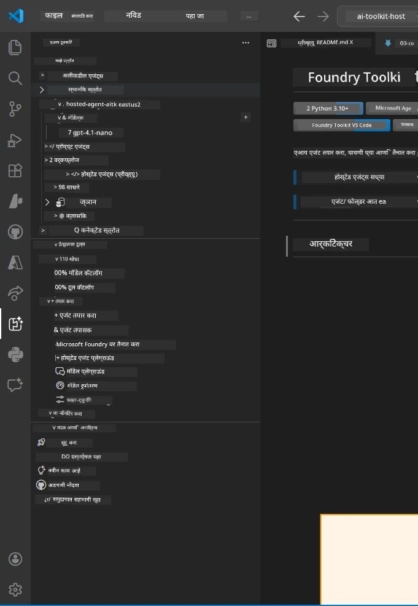
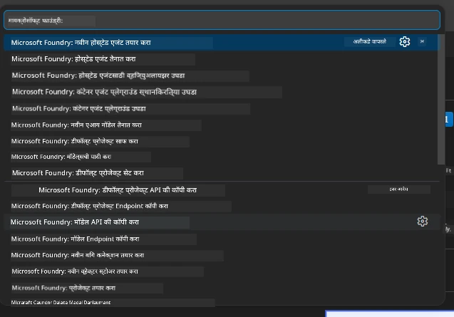

# Module 1 - Foundry Toolkit & Foundry Extension स्थापित करा

हा मॉड्यूल तुम्हाला या कार्यशाळेसाठी दोन प्रमुख VS Code एक्सटेन्शन्स स्थापित करण्याची आणि पडताळणी करण्याची प्रक्रिया दाखवतो. जर तुम्ही [Module 0](00-prerequisites.md) मध्ये आधीच त्यांना स्थापित केले असेल, तर हा मॉड्यूल त्यांचा योग्य प्रकारे काम करत असल्याची खात्री करण्यासाठी वापरा.

---

## Step 1: Microsoft Foundry Extension स्थापित करा

**Microsoft Foundry for VS Code** एक्सटेन्शन हे Foundry प्रोजेक्ट्स तयार करण्यासाठी, मॉडेल्स वितरित करण्यासाठी, होस्टेड एजंट्सची scaffolding करण्यासाठी आणि थेट VS Code मधून deploy करण्यासाठी तुमचे मुख्य टूल आहे.

1. VS Code उघडा.
2. `Ctrl+Shift+X` दाबा जेणेकरून **Extensions** पॅनेल उघडेल.
3. वरच्या शोध बॉक्समध्ये टाइप करा: **Microsoft Foundry**
4. परिणामांमध्ये शोधा शीर्षकात **Microsoft Foundry for Visual Studio Code**.
   - प्रकाशक: **Microsoft**
   - Extension ID: `TeamsDevApp.vscode-ai-foundry`
5. **Install** बटणावर क्लिक करा.
6. स्थापनेची प्रक्रिया पूर्ण होईपर्यंत थांबा (लहान प्रगती निर्देशक दिसेल).
7. स्थापना झाल्यानंतर, **Activity Bar** (VS Code च्या डाव्या बाजूस उभा चिन्हपट्टी) पाहा. तुम्हाला नवीन **Microsoft Foundry** चिन्ह दिसेल (हीरा/AI चिन्हासारखे).
8. **Microsoft Foundry** चिन्हावर क्लिक करा ते त्याचे साइडबार दृश्य उघडेल. तुम्हाला खालील विभाग दिसतील:
   - **Resources** (किंवा Projects)
   - **Agents**
   - **Models**

> **जर चिन्ह दिसत नसेल:** VS Code पुन्हा लोड करण्याचा प्रयत्न करा (`Ctrl+Shift+P` → `Developer: Reload Window`).

---

## Step 2: Foundry Toolkit Extension स्थापित करा

**Foundry Toolkit** एक्सटेन्शन मध्ये [**Agent Inspector**](https://learn.microsoft.com/azure/foundry/agents/how-to/vs-code-agents-workflow-pro-code) आहे - एजंट्स स्थानिकपणे तपासण्यासाठी आणि डिबग करण्यासाठी दृश्य इंटरफेस - तसेच playground, मॉडेल व्यवस्थापन, आणि मूल्यांकन साधने आहेत.

1. Extensions पॅनेलमध्ये (`Ctrl+Shift+X`), शोध बॉक्स साफ करा आणि टाइप करा: **Foundry Toolkit**
2. परिणामांतून **Foundry Toolkit** शोधा.
   - प्रकाशक: **Microsoft**
   - Extension ID: `ms-windows-ai-studio.windows-ai-studio`
3. **Install** क्लिक करा.
4. स्थापनेनंतर, **Foundry Toolkit** चिन्ह Actvity Bar मध्ये दिसेल (रॉबोट/चमकणारे चिन्हासारखे).
5. **Foundry Toolkit** चिन्हावर क्लिक करा ते त्याचे साइडबार दृश्य उघडेल. तुम्हाला Foundry Toolkit स्वागत स्क्रीन दिसेल ज्यात पर्याय असतील:
   - **Models**
   - **Playground**
   - **Agents**

---

## Step 3: दोन्ही एक्सटेन्शन्स कार्यरत आहेत का याची खात्री करा

### 3.1 Microsoft Foundry Extension तपासा

1. Activity Bar मध्ये **Microsoft Foundry** चिन्हावर क्लिक करा.
2. जर तुम्ही Azure मध्ये साइन इन असाल (Module 0 पासून), तर **Resources** अंतर्गत तुमची प्रोजेक्ट्स सूचीबद्ध दिसतील.
3. साइन इन करण्यास सांगितले तर, **Sign in** क्लिक करा आणि प्रमाणीकरण प्रक्रियेचे पालन करा.
4. खात्री करा की साइडबार त्रुटीशिवाय दिसतो.

### 3.2 Foundry Toolkit Extension तपासा

1. Activity Bar मध्ये **Foundry Toolkit** चिन्हावर क्लिक करा.
2. स्वागत दृश्य किंवा मुख्य पॅनेल त्रुटीशिवाय लोड होते का याची खात्री करा.
3. अद्याप काही सेटअप करायची गरज नाही - Agent Inspector आम्ही [Module 5](05-test-locally.md) मध्ये वापरू.

### 3.3 Command Palette द्वारे तपासा

1. `Ctrl+Shift+P` दाबा आणि Command Palette उघडा.
2. टाइप करा **"Microsoft Foundry"** - तुम्हाला खालील प्रमाणे आदेश दिसतील:
   - `Microsoft Foundry: Create a New Hosted Agent`
   - `Microsoft Foundry: Deploy Hosted Agent`
   - `Microsoft Foundry: Open Model Catalog`
3. Command Palette बंद करण्यासाठी `Escape` दाबा.
4. परत Command Palette उघडा आणि टाइप करा **"Foundry Toolkit"** - कमांडसारखे दिसतील:
   - `Foundry Toolkit: Open Agent Inspector`

> जर हे आदेश दिसत नाहीत तर, एक्सटेन्शन्स योग्यरितीने स्थापित झालेले नसतील. ते अनइंस्टॉल करून पुन्हा स्थापित करण्याचा प्रयत्न करा.

---

## या कार्यशाळेत या एक्सटेन्शन्सचे कार्य

| Extension | काय करते | तुम्ही केव्हा वापराल |
|-----------|----------|---------------------|
| **Microsoft Foundry for VS Code** | Foundry प्रोजेक्ट तयार करणे, मॉडेल्स deploy करणे, **[hosted agents ला scaffolding करणे](https://learn.microsoft.com/azure/foundry/agents/concepts/hosted-agents)** (स्वतःच `agent.yaml`, `main.py`, `Dockerfile`, `requirements.txt` बनवते), [Foundry Agent Service](https://learn.microsoft.com/azure/foundry/agents/overview) ला deploy करणे | Modules 2, 3, 6, 7 |
| **Foundry Toolkit** | स्थानिक तपासणी/डिबगिंग साठी Agent Inspector, playground UI, मॉडेल व्यवस्थापन | Modules 5, 7 |

> **Foundry एक्सटेन्शन या कार्यशाळेतील सर्वात महत्त्वाचे टूल आहे.** ते संपूर्ण lifecycle हाताळते: scaffolding → कॉन्फिगर → deploy → पडताळणी. Foundry Toolkit स्थानिक तपासणीसाठी दृश्यात्मक Agent Inspector पुरवते.

---

### पडताळणी यादी

- [ ] Activity Bar मध्ये Microsoft Foundry चिन्ह दिसत आहे
- [ ] त्यावर क्लिक केल्यास साइडबार त्रुटीशिवाय उघडतो
- [ ] Activity Bar मध्ये Foundry Toolkit चिन्ह दिसत आहे
- [ ] त्यावर क्लिक केल्यास साइडबार त्रुटीशिवाय उघडतो
- [ ] `Ctrl+Shift+P` → "Microsoft Foundry" टाइप केल्यास उपलब्ध आदेश दिसतात
- [ ] `Ctrl+Shift+P` → "Foundry Toolkit" टाइप केल्यास उपलब्ध आदेश दिसतात

---

**मागील:** [00 - आवश्यक अटी](00-prerequisites.md) · **पुढील:** [02 - Foundry प्रोजेक्ट तयार करा →](02-create-foundry-project.md)

---

<!-- CO-OP TRANSLATOR DISCLAIMER START -->
**अस्वीकरण**:  
हा दस्तऐवज AI अनुवाद सेवा [Co-op Translator](https://github.com/Azure/co-op-translator) वापरून अनुवादित केला आहे. आम्ही अचूकतेसाठी प्रयत्न करतो, तरी कृपया लक्षात घ्या की स्वयंचालित अनुवादांमध्ये चुका किंवा अपूर्णता असू शकते. मूळ दस्तऐवज त्याच्या स्थानिक भाषेत अधिकृत स्रोत म्हणून मान्य केला जावा. महत्त्वाची माहिती असल्यास, व्यावसायिक मानवी अनुवाद करणे शिफारसीय आहे. या अनुवादाच्या वापरामुळे उद्भवणार्‍या कोणत्याही गैरसमजुती किंवा चुकीच्या अर्थ घेण्याबद्दल आम्ही जबाबदार नाही.
<!-- CO-OP TRANSLATOR DISCLAIMER END -->