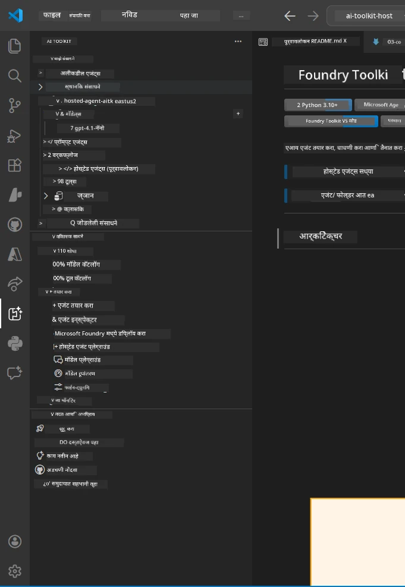
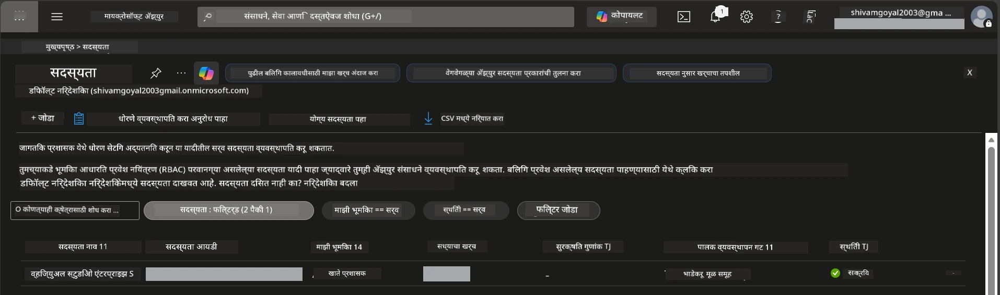
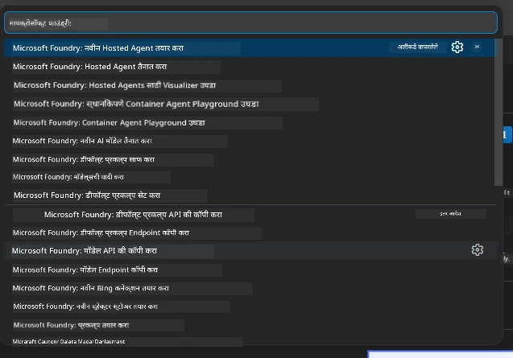
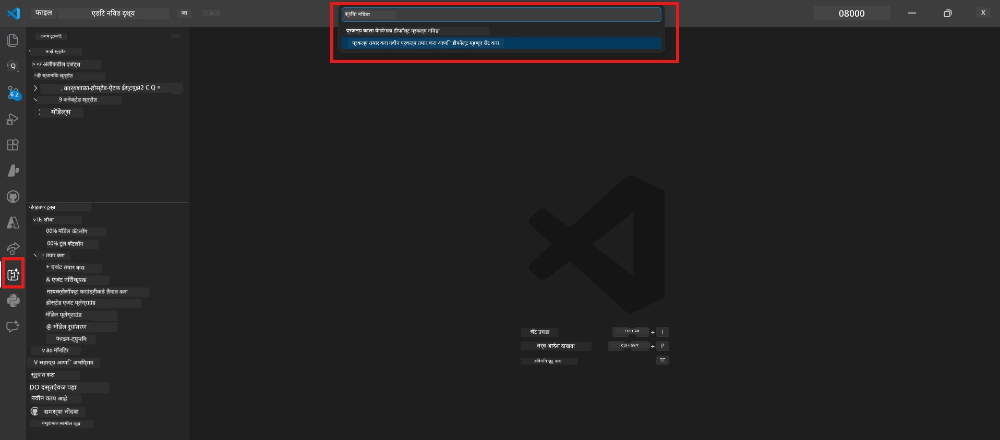
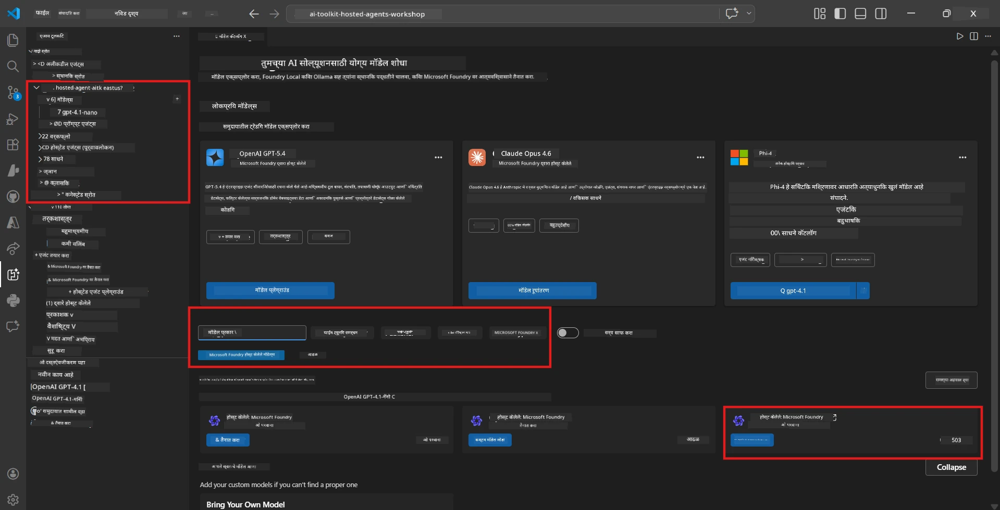
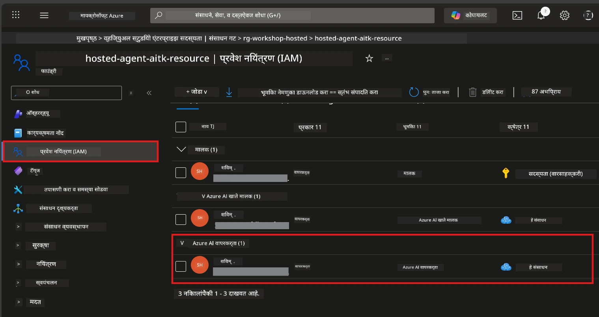

# सेटअप: विस्तार, प्रकल्प आणि मॉडेल

⏱️ ~१५ मिनिटे

या मॉड्यूलमध्ये, आपण Foundry Toolkit विस्तार स्थापित आणि पडताळणी कराल, Foundry प्रकल्प तयार (किंवा कनेक्ट) कराल, आणि आपल्या एजंटसाठी मॉडेल तैनात कराल.

## पायरी 1: Foundry Toolkit स्थापित करा

**Foundry Toolkit for VS Code** हा या कार्यशाळेसाठी मुख्य विस्तार आहे. तो प्रकल्प निर्मिती, मॉडेल तैनाती, एजंट स्कॅफोल्डिंग, स्थानिक चाचणी (Agent Inspector), आणि क्लाउड तैनाती - हे सर्व VS Code मधून पुरवतो.

१. VS Code उघडा आणि नंतर `Ctrl+Shift+X` दाबा जेणेकरून **Extensions** पॅनेल उघडेल.
२. **Foundry Toolkit** साठी शोधा.
३. **Foundry Toolkit for VS Code** (Publisher: Microsoft, ID: `ms-windows-ai-studio.windows-ai-studio`) स्थापित करा.
४. स्थापनेनंतर, **Foundry Toolkit** चिन्ह Activity Bar (डाव्या साइडबार) मध्ये दिसेल.

> *टीप: जुना विस्तार आवृत्तीत Activity Bar मध्ये "AI TOOLKIT" दिसू शकते. कार्यक्षमता तशीच आहे.*



## पायरी 2: तुमच्या प्रवेशानुसार सेटअप करा

> **तुमचा मार्ग निवडा:** खाली दिलेला विभाग तुमच्या सेटअपशी जुळणारा विस्तार करा. तुम्हाला फक्त **एकच** मार्ग पूर्ण करावा लागेल.

<details>
<summary><strong>🅰️ मार्ग A - Azure क्लाउड (Azure सदस्यत्व आवश्यक)</strong></summary>

### Azure CLI

१. [learn.microsoft.com/cli/azure/install-azure-cli](https://learn.microsoft.com/cli/azure/install-azure-cli) वरून स्थापित करा.
२. पडताळणी करा: `az --version` (2.80.0+ अपेक्षित).
३. साइन इन करा: `az login`

### प्रमाणीकरण पर्याय

[Microsoft Agent Framework](https://learn.microsoft.com/agent-framework/overview/) हे [`DefaultAzureCredential`](https://learn.microsoft.com/azure/developer/python/sdk/authentication/credential-chains#defaultazurecredential-overview) वापरते जे अनेक प्रमाणीकरण पद्धतीचा क्रमाने प्रयत्न करते. तुमच्या पर्यावरणाला जे सूटते ते निवडा:

#### पर्याय 1: VS Code खाते (कार्यशाळांसाठी शिफारस)
१. VS Code च्या खाली-डाव्या कोपऱ्यातील **Accounts** चिन्हावर (व्यक्तीचे आरेख) क्लिक करा.
२. **Microsoft Foundry वापरण्यासाठी साइन इन करा** (किंवा **Azure सह साइन इन करा**) निवडा.
३. ब्राउझर उघडेल - Azure खाते ज्याकडे सदस्यत्व आहे त्यात साइन इन करा.
४. VS Code मध्ये परत या. तुम्हाला खाली-डाव्या कोपऱ्यात तुमचे खाते नाव दिसेल.

#### पर्याय 2: Azure CLI
```bash
az login
az account set --subscription "<your-subscription-id>"
```

#### पर्याय 3: सेवा प्राधान्य (उद्योग/CI)
कठोर नियंत्रणाखालील वातावरण किंवा CI/CD पाइपलाइनसाठी, तुमच्या `.env` फाइलमध्ये हे पर्यावरण चल सेट करा:
```env
AZURE_TENANT_ID=<your-tenant-id>
AZURE_CLIENT_ID=<your-client-id>
AZURE_CLIENT_SECRET=<your-client-secret>
```

> **`DefaultAzureCredential` कसे कार्य करते:** हे प्रथम पर्यावरण चल, नंतर व्यवस्थापित ओळख, त्यानंतर VS Code साइन-इन, नंतर Azure CLI वापरते - आणि जे पहिले यशस्वी होते ते वापरते. पाहा [परवानगी साखळी दस्तऐवज](https://learn.microsoft.com/azure/developer/python/sdk/authentication/credential-chains#defaultazurecredential-overview).

### Azure Developer CLI (azd)

१. स्थापित करा: `winget install microsoft.azd` (Windows) किंवा [स्थापना दस्तऐवज](https://learn.microsoft.com/azure/developer/azure-developer-cli/install-azd) पाहा.
२. पडताळणी करा: `azd version`
३. साइन इन करा: `azd auth login`

### Docker Desktop (ऐच्छिक)

तुम्हाला स्थानिकपणे कंटेनर तयार करायचे असल्यास Docker आवश्यक आहे. Foundry विस्तार नियुक्ती दरम्यान बिल्ड्स आपोआप हाताळतो.

१. [docs.docker.com/get-docker](https://docs.docker.com/get-docker/) वरून स्थापित करा.
२. पडताळणी करा: `docker info`

### Azure सदस्यत्व & RBAC

१. [portal.azure.com](https://portal.azure.com) येथे साइन इन करा.
२. **Subscriptions** कडे जा आणि एक पेक्षा जास्त सदस्यत्व **Active** आहे याची खात्री करा.
३. तुमचा **Subscription ID** नोंद करा - तुम्हाला मॉड्यूल 01 मध्ये याची गरज पडेल.



#### RBAC परिस्थिती तक्ता

[Hosted Agent](https://learn.microsoft.com/azure/foundry/agents/concepts/hosted-agents) तैनातीसाठी **डेटा क्रिया** परवानग्या आवश्यक आहेत ज्या स्टँडर्ड Azure `Owner` आणि `Contributor` भूमिकांमध्ये **नाहीत**. खालील तक्त्यातुन तुम्हाला कोणत्या भूमिका हव्यात ते ठरवा:

| परिस्थिती | आवश्यक भूमिका | कुठे नियुक्त करायचे |
|----------|---------------|----------------------|
| नवीन Foundry प्रकल्प तयार करा | **Azure AI Owner** Foundry रिसोर्सवर | Azure Portal मधील Foundry रिसोर्स |
| विद्यमान प्रकल्पात तैनात करा (नवीन रिसोर्सेस) | **Azure AI Owner** + **Contributor** सदस्यत्वावर | सदस्यत्व + Foundry रिसोर्स |
| पूर्णपणे कॉन्फिगर केलेल्या प्रकल्पात तैनात करा | **Reader** खातेवर + **Azure AI User** प्रकल्पावर | खाते + प्रकल्प Azure Portal मध्ये |
| फक्त स्थानिक चाचणी (तैनात नाही) | **Azure AI User** प्रकल्पावर | प्रकल्प Azure Portal मध्ये |

> **महत्त्वाचा मुद्दा:** Azure `Owner` आणि `Contributor` भूमिका फक्त *व्यवस्थापन* परवानग्या (ARM ऑपरेशन्स) कव्हर करतात. तुम्हाला एजंट तयार आणि तैनात करण्यासाठी आवश्यक `agents/write` सारख्या *डेटा क्रिया* साठी [**Azure AI User**](https://learn.microsoft.com/azure/foundry/concepts/rbac-foundry#built-in-roles) (किंवा उच्चतर) आवश्यक आहे.

## Foundry प्रकल्प कनेक्ट किंवा तयार करा



१. `Ctrl+Shift+P` दाबा → **Foundry Toolkit: Create Project** टाइप करा → निवडा.
२. ड्रॉपडाऊनमधून तुमचे **Azure सदस्यत्व** निवडा.
३. एक **resource group** निवडा किंवा तयार करा (उदा. `rg-hosted-agents-workshop`).
४. ज्या प्रदेशात होस्ट केलेले एजंट समर्थित आहेत त्या **region** निवडा: `East US`, `West US 2`, किंवा `Sweden Central`. [region availability](https://learn.microsoft.com/azure/foundry/agents/concepts/hosted-agents#region-availability) पहा.
५. प्रकल्पाचे नाव टाका (उदा. `workshop-agents`).
६. पुरवठा होण्यासाठी २–५ मिनिटे वाट पहा. VS Code मध्ये प्रगती सूचना दिसेल.
७. पूर्ण झाल्यावर, तुमचा प्रकल्प **Foundry Toolkit** साइडबारमध्ये **MY RESOURCES** अंतर्गत दिसेल.



## मॉडेल तैनात करा & RBAC नियुक्त करा

तुमच्या होस्ट केलेल्या एजंटला प्रतिसाद तयार करण्यासाठी एआय मॉडेल लागेल.

#### मॉडेल निवड मॅट्रिक्स
तुमच्या गरजेनुसार तुम्ही वेगवेगळ्या मॉडेल स्तरांमधून निवड करू शकता:

| मॉडेल | सर्वोत्तम उपयोग | किंमत | टीपा |
|-------|----------|------|-------|
| `gpt-4.1` | उच्च-गुणवत्तेचे, सूक्ष्म प्रतिसाद | जास्त | सर्वोत्तम परिणाम, अंतिम चाचणीसाठी शिफारस |
| `gpt-4.1-mini/gpt-5-mini` | वेगवान पुनरावृत्ती, कमी खर्च | कमी | कार्यशाळा विकास आणि वेगवान चाचणीसाठी चांगले |
| `gpt-4.1-nano` | हलके काम | सर्वात कमी | सर्वात खर्च-कम, परंतु सोपे प्रतिसाद |

१. `Ctrl+Shift+P` दाबा → **Foundry Toolkit: Open Model Catalog** (किंवा साइडबारमध्ये DEVELOPER TOOLS → Discover अंतर्गत **Model Catalog** क्लिक करा).
२. कॅटलॉगमध्ये **gpt-4.1** साठी शोधा.
३. **OpenAI GPT-4.1-mini** (किंवा चांगल्या गुणवत्तेसाठी `gpt-5-mini`) शोधा आणि **Deploy** क्लिक करा.



४. तैनाती संरचनेत:
   - **Deployment name:** डीफॉल्ट ठेवा किंवा सानुकूल नाव द्या. **हे नाव लक्षात ठेवा.**
   - **Target:** **Deploy to Foundry Toolkit** निवडा → तुमचा प्रकल्प निवडा.
५. **Deploy** क्लिक करा आणि १–३ मिनिटे प्रतीक्षा करा.

> **शिफारस:** कार्यशाळेसाठी `gpt-4.1-mini/gpt-5-mini` वापरा - वेगवान, परवडणारे, आणि चांगले परिणाम देणारे.

### तुमची मूल्ये नोंद करा

तैनाती नंतर, ही दोन मूल्ये नोंद करा (मॉड्यूल 03 मध्ये यांची गरज आहे):

| मूल्य | कुठे सापडेल |
|-------|-----------------|
| **प्रकल्प अंतिम बिंदू** | साइडबारमध्ये तुमचा प्रकल्प क्लिक करा → तपशील दृश्यात URL दिसेल (उदा. `https://<account>.services.ai.azure.com/api/projects/<project>`) |
| **मॉडेल तैनाती नाव** | प्रकल्प विस्तारा करा → **Models** → तैनात केलेल्या मॉडेलचं नाव (उदा. `gpt-4.1-mini/gpt-5-mini`) |

### RBAC भूमिका नियुक्त करा

> ⚠️ **हा सर्वात वारंवार चुकला जाणारा टप्पा आहे.** योग्य भूमिका नसल्यास मॉड्यूल 05 मध्ये तैनाती अयशस्वी होईल.

#### मला कोणती भूमिका लागेल?
तुमच्या परिस्थितीनुसार, खालील भूमिका संयोजने आवश्यक आहेत:

| परिस्थिती | आवश्यक भूमिका | कुठे नियुक्त करायचे |
|----------|---------------|----------------------|
| नवीन Foundry प्रकल्प तयार करा | **Azure AI Owner** Foundry रिसोर्सवर | Azure Portal मधील Foundry रिसोर्स |
| विद्यमान प्रकल्पात तैनात करा (नवीन रिसोर्सेस) | **Azure AI Owner** + **Contributor** सदस्यत्वावर | सदस्यत्व + Foundry रिसोर्स |
| पूर्णपणे कॉन्फिगर केलेल्या प्रकल्पात तैनात करा | **Reader** खातेवर + **Azure AI User** प्रकल्पावर | खाते + प्रकल्प Azure Portal मध्ये |

**महत्त्वाचा मुद्दा:** Azure `Owner` आणि `Contributor` भूमिका फक्त *व्यवस्थापन* परवानग्या कव्हर करतात. तुम्हाला एजंट तयार आणि तैनात करण्याच्या कामासाठी आवश्यक `agents/write` सारख्या *डेटा क्रिया* साठी **Azure AI User** (किंवा उच्चतर) भूमिका हवा.

१. [portal.azure.com](https://portal.azure.com) उघडा.
२. तुमचा **Foundry प्रकल्प** नाव शोधा → टाइपची निकालावर क्लिक करा **"Foundry Toolkit project"** (पालक खाते नाही).
३. डाव्या नेव्हिगेशनमध्ये **Access control (IAM)** क्लिक करा.
४. क्लिक करा **+ Add** → **Add role assignment**.
५. **Role tab:** **Azure AI User** शोधा, निवडा, **Next** क्लिक करा.
६. **Members tab:** **User, group, or service principal** निवडा → **+ Select members** क्लिक करा → स्वतःला शोधा आणि निवडा → **Select** क्लिक करा.
७. **Review + assign** क्लिक करा → पुन्हा **Review + assign** क्लिक करा.
८. प्रसरणासाठी **१–२ मिनिटे** प्रतीक्षा करा.

> **ही भूमिका का?** Azure `Owner`/`Contributor` फक्त व्यवस्थापन परवानग्या देतात. **Azure AI User** भूमिका `agents/write` डेटा क्रिया देते जी एजंट तयार करण्यासाठी आणि तैनात करण्यासाठी आवश्यक आहे. पाहा [Foundry RBAC दस्तऐवज](https://learn.microsoft.com/azure/foundry/concepts/rbac-foundry#built-in-roles).



</details>

<details>
<summary><strong>🅱️ मार्ग B - स्थानिक / विनामूल्य-स्तर (Azure सदस्यत्व आवश्यक नाही)</strong></summary>

### Foundry Local

Foundry Local तुम्हाला तुमच्या स्वतःच्या यंत्रावर AI मॉडेल चालवण्याची परवानगी देते - कोणताही क्लाउड खाते आवश्यक नाही. तुम्ही Foundry Toolkit वापरून स्थानिक मॉडेल्स मोडेल कॅटलॉगमध्ये प्रवेश करू शकता:

१. Foundry Toolkit विस्तारावर जा.
२. Foundry Toolkit नेव्हिगेशनमध्ये जा **Developer Tools** > आणि **Model Catalog** निवडा.
३. नवीन विंडो मध्ये, नेव्हिगेशन बारमधून **local** निवडा.
४. **Phi 4 Mini,** पर्यंत स्क्रोल करा आणि **add button** क्लिक करा, एक पॉप अप येईल जे मॉडेल डाउनलोड होत असल्याचे दर्शवेल.
५. एकदा मॉडेल डाउनलोड झाल्यावर, पुढील टप्प्यांकडे पुढे जा.

</details>

### ✅ तपासणी बिंदू


- [ ] `Ctrl+Shift+P` → "Foundry Toolkit" उपलब्ध आदेश दर्शवितो
- [ ] Foundry Toolkit विस्तार स्थापित केला आहे आणि साइडबार त्रुटीशिवाय लोड होतो
- [ ] VS Code उघडतो आणि अचूक चालतो
- [ ] `python --version` 3.10+ दाखवतो
- [ ] Foundry Toolkit चिन्ह VS Code Activity Bar मध्ये दिसते
- [ ] **मार्ग A:** `az login` यशस्वी, सदस्यत्व Active आहे
- [ ] **मार्ग B:** Foundry Local चालू आहे (`foundry local status`)
- [ ] **मार्ग A:** Foundry प्रकल्प साइडबारमध्ये दिसतो, मॉडेल तैनात केले आहे, Azure AI User भूमिका नियुक्त केली आहे
- [ ] **मार्ग B:** Foundry Local मोडेलसह चालू आहे
- [ ] तुम्ही तुमचा **endpoint** आणि **model deployment name** नोंद केला आहे


**मागील:** [00 - Prerequisites](00-prerequisites.md) · **पुढील:** [02 - Create Hosted Agent →](02-create-hosted-agent.md)

---

<!-- CO-OP TRANSLATOR DISCLAIMER START -->
**अस्वीकरण**:
हा दस्तऐवज AI भाषांतर सेवा [Co-op Translator](https://github.com/Azure/co-op-translator) चा वापर करून अनुवादित केला आहे. जरी आम्ही अचूकतेसाठी प्रयत्न करतो, तरी कृपया लक्षात घ्या की स्वयंचलित भाषांतरांमध्ये त्रुटी किंवा अचूकतेची कमतरता असू शकते. मूळ दस्तऐवज त्याच्या मूळ भाषेत अधिकृत स्रोत मानला पाहिजे. महत्त्वाची माहिती असल्यास, व्यावसायिक मानवी भाषांतराची शिफारस केली जाते. या भाषांतराच्या वापरामुळे उद्भवणाऱ्या कोणत्याही गैरसमज किंवा चुकीच्या अर्थलावणीसाठी आम्ही जबाबदार नाही.
<!-- CO-OP TRANSLATOR DISCLAIMER END -->