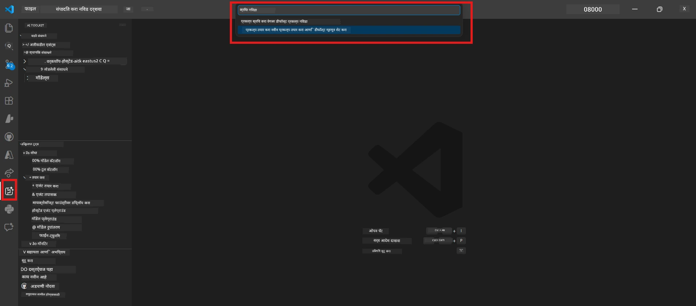
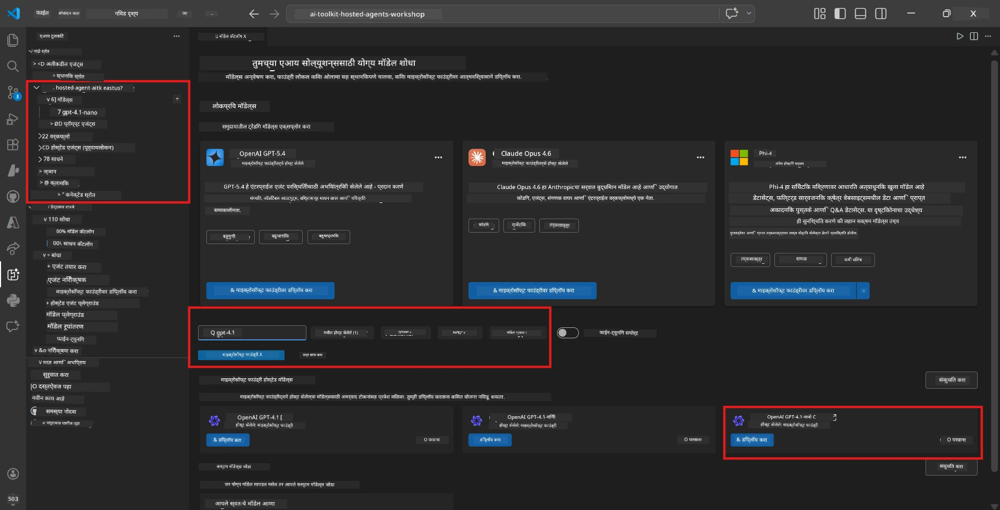
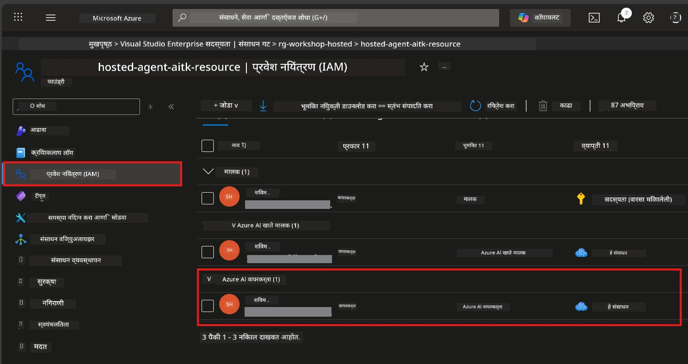

# Module 2 - Foundry प्रोजेक्ट तयार करा आणि मॉडेल डिप्लॉय करा

या मोड्युलमध्ये, आपण Microsoft Foundry प्रोजेक्ट तयार करता (किंवा निवडता) आणि आपल्या एजंटसाठी वापरायचा मॉडेल डिप्लॉय करता. प्रत्येक टप्पा स्पष्टपणे लिहिलेला आहे - त्यांचे अनुक्रमणाने अनुसरण करा.

> जर आपल्याकडे आधीच डिप्लॉय केलेला मॉडेल असलेला Foundry प्रोजेक्ट असेल, तर [Module 3](03-create-hosted-agent.md) कडे जा.

---

## टप्पा 1: VS Code मधून Foundry प्रोजेक्ट तयार करा

आपण Microsoft Foundry एक्सटेंशन वापरून VS Code सोडले न देता प्रोजेक्ट तयार करू शकता.

1. **Command Palette** उघडण्यासाठी `Ctrl+Shift+P` दाबा.
2. टाइप करा: **Microsoft Foundry: Create Project** आणि ते निवडा.
3. एक ड्रॉपडाउन दिसेल - आपल्या **Azure subscription** यादीतून निवडा.
4. आपल्याला **resource group** निवडण्यास किंवा तयार करण्यास सांगितले जाईल:
   - नवीन तयार करण्यासाठी: नाव टाइप करा (उदा., `rg-hosted-agents-workshop`) आणि Enter दाबा.
   - विद्यमान वापरण्यासाठी: ते ड्रॉपडाउनमधून निवडा.
5. एक **region** निवडा. **महत्वाचे:** त्या प्रदेशाचा निवड करा जेथे hosted agents समर्थित आहेत. तपासा [region availability](https://learn.microsoft.com/azure/foundry/agents/concepts/hosted-agents#region-availability) - सामान्य निवडी `East US`, `West US 2`, किंवा `Sweden Central` आहेत.
6. Foundry प्रोजेक्टसाठी एक **नाव** टाका (उदा., `workshop-agents`).
7. Enter दाबा आणि provisioning पूर्ण होईपर्यंत प्रतीक्षा करा.

> **Provisioning मध्ये 2-5 मिनिटे लागतात.** VS Code च्या खालच्या उजव्या कोपऱ्यात प्रगती सूचना दिसेल. Provisioning दरम्यान VS Code बंद करू नका.

8. पूर्ण झाल्यावर, **Microsoft Foundry** साइडबारमध्ये नवीन प्रोजेक्ट **Resources** अंतर्गत दिसेल.
9. प्रोजेक्ट नावावर क्लिक करा आणि ते विस्तारून **Models + endpoints** आणि **Agents** यांसारखे विभाग दिसत आहेत का ते पहा.



### पर्यायी: Foundry पोर्टलद्वारे तयार करा

जर तुम्हाला ब्राउझर वापरायला आवडत असेल तर:

1. [https://ai.azure.com](https://ai.azure.com) उघडा आणि साइन इन करा.
2. मुख्य पृष्ठावर **Create project** क्लिक करा.
3. प्रोजेक्ट नाव टाका, आपली subscription, resource group आणि region निवडा.
4. **Create** क्लिक करा आणि provisioning पूर्ण होईपर्यंत प्रतीक्षा करा.
5. तयार झाल्यावर VS Code मध्ये परत या - प्रोजेक्ट Foundry साइडबारमध्ये रिफ्रेश (refresh icon क्लिक करा) केल्यावर दिसेल.

---

## टप्पा 2: मॉडेल डिप्लॉय करा

आपल्या [hosted agent](https://learn.microsoft.com/azure/foundry/agents/concepts/hosted-agents) ला प्रतिसाद तयार करण्यासाठी Azure OpenAI मॉडेलची गरज आहे. आपण आता [एक डिप्लॉय करू](https://learn.microsoft.com/azure/ai-foundry/openai/how-to/create-resource#deploy-a-model) शकता.

1. **Command Palette** उघडण्यासाठी `Ctrl+Shift+P` दाबा.
2. टाइप करा: **Microsoft Foundry: Open [Model Catalog](https://learn.microsoft.com/azure/ai-foundry/openai/concepts/models)** आणि ते निवडा.
3. VS Code मध्ये Model Catalog विंडो उघडेल. **gpt-4.1** शोधा किंवा वापरा.
4. **gpt-4.1** मॉडेल कार्ड क्लिक करा (किंवा `gpt-4.1-mini` जर कमी खर्चीचे आवडत असेल तर).
5. **Deploy** क्लिक करा.


6. डिप्लॉयमेंट कॉन्फिगरेशनमध्ये:
   - **Deployment name**: डीफॉल्ट नाव ठेवा (उदा., `gpt-4.1`) किंवा कस्टम नाव द्या. **हे नाव लक्षात ठेवा** - Module 4 मध्ये तुम्हाला ते लागेल.
   - **Target**: **Deploy to Microsoft Foundry** निवडा आणि तुम्ही नुकताच तयार केलेला प्रोजेक्ट निवडा.
7. **Deploy** क्लिक करा आणि डिप्लॉयमेंट पूर्ण होईपर्यंत प्रतीक्षा करा (1-3 मिनिटे).

### मॉडेलची निवड

| मॉडेल | सर्वोत्कृष्ट वापर | खर्च | नोंदी |
|-------|------------------|-------|---------|
| `gpt-4.1` | उच्च दर्जाचे, सूक्ष्म उत्तरे | जास्त | सर्वोत्तम निकाल, अंतिम चाचणीसाठी शिफारस केलेले |
| `gpt-4.1-mini` | जलद पुनरावृत्ती, कमी खर्च | कमी | वर्कशॉप विकास आणि जलद चाचणीसाठी उपयुक्त |
| `gpt-4.1-nano` | हलक्या कामांसाठी | सगळ्यात कमी | अत्यंत किफायतशीर, पण साधी उत्तरे |

> **या वर्कशॉपसाठी शिफारस:** विकास आणि चाचणीसाठी `gpt-4.1-mini` वापरा. हे वेगवान, स्वस्त आणि सरावासाठी चांगले निकाल देते.

### मॉडेल डिप्लॉयमेंटची पुष्टी करा

1. **Microsoft Foundry** साईडबारमध्ये आपला प्रोजेक्ट विस्तार करा.
2. **Models + endpoints** (किंवा तत्सम विभाग) पाहा.
3. आपला डिप्लॉय केलेला मॉडेल (उदा., `gpt-4.1-mini`) **Succeeded** किंवा **Active** स्टेटससह दिसायला हवा.
4. मॉडेल डिप्लॉयमेंटवर क्लिक करून त्याचे तपशील पहा.
5. हे दोन मूल्ये नोंद करा - Module 4 मध्ये त्यांचा उपयोग होणार आहे:

   | सेटिंग | कुठे मिळेल | उदाहरण मूल्य |
   |---------|------------|--------------|
   | **प्रोजेक्ट एंडपॉइंट** | Foundry साइडबारमधील प्रोजेक्ट नावावर क्लिक करा. तपशील देखाव्यात एंडपॉइंट URL दिसेल. | `https://<account>.services.ai.azure.com/api/projects/<project>` |
   | **मॉडेल डिप्लॉयमेंट नाव** | डिप्लॉय केलेल्या मॉडेलच्या जवळील नाव. | `gpt-4.1-mini` |

---

## टप्पा 3: आवश्यक RBAC भूमिका असाइन करा

हा **सर्वात सामान्य चुकलेला टप्पा** आहे. योग्य भूमिका न दिल्यास, Module 6 मध्ये डिप्लॉयमेंट अयशस्वी होईल आणि परवानग्यांसंबंधी त्रुटी येईल.

### 3.1 स्वतःला Azure AI User भूमिका द्या

1. ब्राउझर उघडा आणि [https://portal.azure.com](https://portal.azure.com) वर जा.
2. टॉप सर्च बारमध्ये आपला **Foundry प्रोजेक्ट** नाव टाइप करा आणि निकालांमध्ये त्यावर क्लिक करा.
   - **महत्वाचे:** प्रोजेक्ट संसाधन (प्रकार: "Microsoft Foundry project") वर जा, पालक खाते/हब रिसोर्सवर नाही.
3. प्रोजेक्टच्या डाव्या नेव्हिगेशनमध्ये **Access control (IAM)** क्लिक करा.
4. वरच्या बाजूला **+ Add** → **Add role assignment** निवडा.
5. **Role** टॅबमध्ये [**Azure AI User**](https://learn.microsoft.com/azure/foundry/concepts/rbac-foundry#built-in-roles) शोधा आणि निवडा. **Next** क्लिक करा.
6. **Members** टॅबमध्ये:
   - **User, group, or service principal** निवडा.
   - **+ Select members** क्लिक करा.
   - आपले नाव किंवा ईमेल शोधा, स्वतःला निवडा आणि **Select** क्लिक करा.
7. **Review + assign** क्लिक करा → पुन्हा **Review + assign** क्लिक करून पुष्टी करा.



### 3.2 (ऐच्छिक) Azure AI Developer भूमिका द्या

जर तुम्हाला प्रोजेक्टमध्ये अतिरिक्त संसाधने तयार करायची असतील किंवा डिप्लॉयमेंट प्रोग्रामॅटिकली व्यवस्थापित करायचे असेल:

1. वरीलच टप्पे पुन्हा करा, पण पायरी 5 मध्ये **Azure AI Developer** निवडा.
2. हि भूमिका Foundry रिसोर्स (अकाउंट) पातळीवर द्या, फक्त प्रोजेक्ट पातळीवर नाही.

### 3.3 आपली भूमिका तपासा

1. प्रोजेक्टच्या **Access control (IAM)** पानावर **Role assignments** टॅब क्लिक करा.
2. आपले नाव शोधा.
3. प्रोजेक्ट स्कोपसाठी किमान **Azure AI User** सूचीबद्ध असावी.

> **हे का महत्त्वाचे आहे:** [`Azure AI User`](https://learn.microsoft.com/azure/foundry/concepts/rbac-foundry#built-in-roles) भूमिका `Microsoft.CognitiveServices/accounts/AIServices/agents/write` डेटा क्रिया देते. याशिवाय डिप्लॉयमेंट दरम्यान खालील त्रुटी येईल:
>
> ```
> Error: lacks the required data action 
> Microsoft.CognitiveServices/accounts/AIServices/agents/write 
> to perform POST /api/projects/{projectName}/assistants operation.
> ```
>
> अधिक माहितीसाठी [Module 8 - Troubleshooting](08-troubleshooting.md) पहा.

---

### चेकपॉइंट

- [ ] Foundry प्रोजेक्ट अस्तित्वात आहे आणि VS Code मधील Microsoft Foundry साइडबारमध्ये दिसतो
- [ ] किमान एक मॉडेल डिप्लॉय आहे (उदा., `gpt-4.1-mini`) ज्याची स्थिति **Succeeded** आहे
- [ ] **प्रोजेक्ट एंडपॉइंट** URL आणि **मॉडेल डिप्लॉयमेंट नाव** नोंदवले आहे
- [ ] आपल्याला प्रोजेक्ट स्तरावर **Azure AI User** भूमिका दिलेली आहे (Azure Portal → IAM → Role assignments मध्ये तपासा)
- [ ] प्रोजेक्ट [समर्थित प्रदेश](https://learn.microsoft.com/azure/foundry/agents/concepts/hosted-agents#region-availability) मध्ये आहे जो hosted agents साठी योग्य आहे

---

**पूर्वीचे:** [01 - Install Foundry Toolkit](01-install-foundry-toolkit.md) · **पुढचे:** [03 - Create a Hosted Agent →](03-create-hosted-agent.md)

---

<!-- CO-OP TRANSLATOR DISCLAIMER START -->
**अस्वीकरण**:  
हा दस्तऐवज AI अनुवाद सेवा [Co-op Translator](https://github.com/Azure/co-op-translator) वापरून अनुवादित केला आहे. आम्ही अचूकतेसाठी प्रयत्न करीत असलो तरी, कृपया लक्षात ठेवा की स्वयंचलित अनुवादांमध्ये चुका किंवा विषंगती असू शकतात. मूळ भाषा असलेला मूळ दस्तऐवज अधिकृत स्रोत मानला जावा. महत्वाच्या माहितीसाठी व्यावसायिक मानवनिमित्त अनुवाद शिफारस केला जातो. या अनुवादाच्या वापरामुळे उद्भवलेल्या कोणत्याही गैरसमज किंवा चुकीच्या अर्थसंग्रहाबद्दल आम्ही जबाबदार नाही.
<!-- CO-OP TRANSLATOR DISCLAIMER END -->