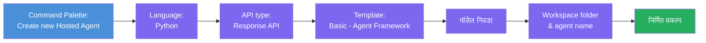
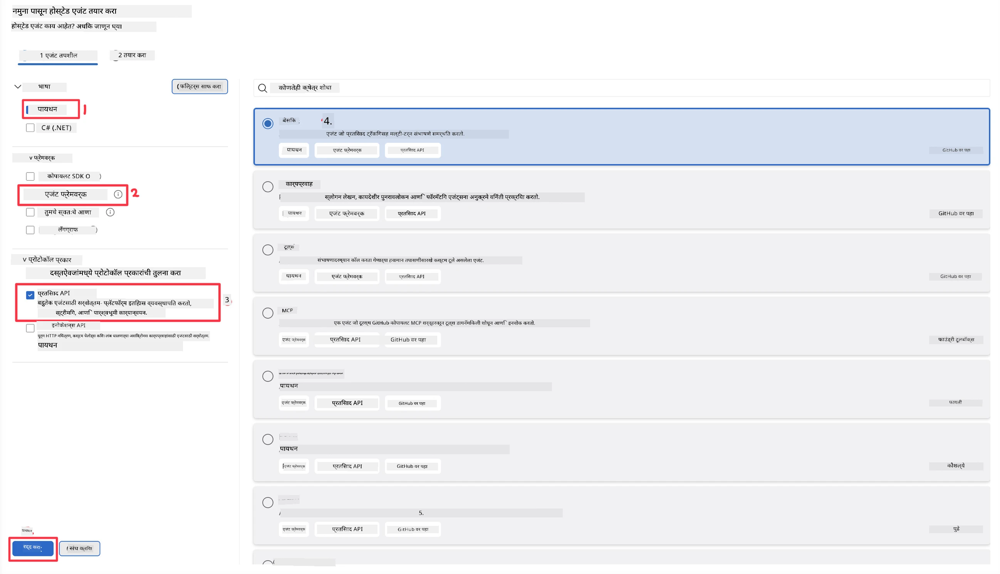
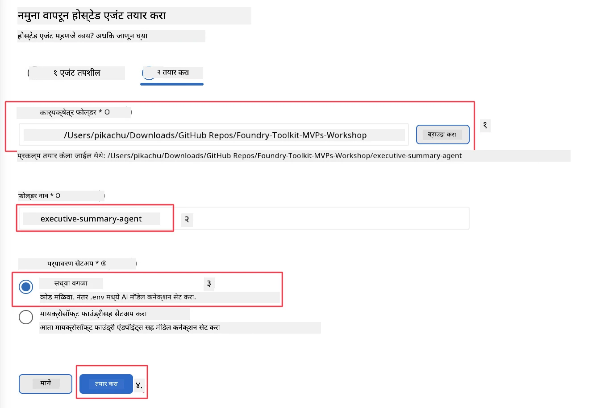

# मॉड्यूल 2 - नवीन होस्टेड एजंट तयार करा

⏱️ ~5 मिनिटे

या मॉड्यूलमध्ये, तुम्ही Foundry Toolkit वापरून **होस्टेड एजंट प्रोजेक्टची स्कॅफोल्ड तयार करता**. स्कॅफोल्ड प्रोजेक्टची पूर्ण रचना तयार करते - `agent.yaml`, `main.py`, `Dockerfile`, `requirements.txt`, आणि VS Code डिबग कॉन्फिगरेशन - जेणेकरून तुम्ही एजंटच्या वर्तनानुसार सानुकूलन करण्यावर लक्ष केंद्रित करू शकाल.

> **महत्त्वाची संकल्पना:** या लॅबमध्ये `agent/` फोल्डर हा Foundry Toolkit ने तयार केलेल्या फोल्डरचा उदाहरण आहे. तुम्ही हे फायली सुरुवातीपासून लिहित नाही.

### स्कॅफोल्ड विजार्ड फ्लो



---

## पायरी 1: Create Hosted Agent विजार्ड उघडा

1. **Command Palette** उघडण्यासाठी `Ctrl+Shift+P` दाबा.
2. टाइप करा: **Foundry Toolkit: Create new Hosted Agent** आणि ते निवडा.

> **पर्याय:** Foundry पोर्टलद्वारे तयार करा
> तुम्हाला ब्राउझर आवडत असल्यास, तुम्ही प्रोजेक्ट तयार करू शकता [https://ai.azure.com](https://ai.azure.com) येथे. प्रोजेक्ट प्रोव्हीजन झाल्यानंतर, VS Code वर परत या आणि **Foundry Toolkit** साईडबार वापरून त्याच्याशी कनेक्ट व्हा.

> **पर्याय:** Foundry Toolkit साईडबारमधील **Hosted Agents (Preview)** च्या बाजूला असलेल्या **+** च्या चिन्हावर क्लिक करा.

## पायरी 2: सेटिंग्ज निवडा



1. डाव्या बाजूच्या नेव्हिगेशन/पर्याय विभागात खालील निवडा:

| मेनू | निवड | टीपा |
|--------|-----------|-------|
| **Language** | Python | C# देखील समर्थित |
| **Framework** | Agent Framework | Agent Framework SDK वापरुन सोपी सुरुवात |
| **API type** | Response API | `POST /responses` - प्लॅटफॉर्मने व्यवस्थापित केलेल्या इतिहासासह संवादात्मक |
| **Template** | Basic | Agent Framework SDK वापरुन सोपी सुरुवात |

2. निवडल्यानंतर, **Next** क्लिक करा



3. पुढील विंडोमध्ये खालील निवडा:

| मेनू | निवड | टीपा |
|--------|-----------|-------|
| **Workspace folder** | लक्ष्य फोल्डर निवडा | उदा. `/workspace/Foundry_Toolkit_for_VSCode_Lab/` किंवा या रेपोतील उपफोल्डर |
| **Agent name** | नाव प्रविष्ट करा | उदा. `executive-summary-agent` |
| **Environment Setup** | सध्या सेटअप वगळा |  |

आमचा एजंट तयार करण्यासाठी **create** क्लिक करा. निवडलेल्या एजंटच्या नावाने नवीन फोल्डर तयार होईल.

## पायरी 3: तयार झालेले प्रोजेक्ट तपासा

स्कॅफोल्डिंग पूर्ण झाल्यानंतर, Explorer मध्ये ही फायली दिसत आहेत याची खात्री करा (`Ctrl+Shift+E`):

```
📂 my-agent/
├── .env                ← Environment variables (placeholders)
├── .vscode/
│   ├── launch.json     ← Debug config (F5 → run + Agent Inspector)
│   └── tasks.json      ← VS Code task definitions
├── agent.yaml          ← Agent definition (kind: hosted)
├── Dockerfile          ← Container config for deployment
├── main.py             ← Agent entry point (your main code)
└── requirements.txt    ← Python dependencies
```

### मुख्य फायली समजावून सांगितल्या

| फाइल | उद्देश |
|------|---------|
| `agent.yaml` | एजंटला `kind: hosted` म्हणून घोषित करते, पर्यावरण व्हेरिएबल मॅप करते, `/responses` प्रोटोकॉल परिभाषित करते |
| `main.py` | `FoundryChatClient` तयार करतो → त्याला सूचनांसह `Agent` मध्ये गुंडाळतो → `ResponsesHostServer` द्वारे पोर्ट 8088 वर सेवा देतो |
| `Dockerfile` | `python:3.12-slim` वापरतो, अवलंबित्वे इन्स्टॉल करतो, पोर्ट 8088 उघडतो, `main.py` चालवतो |
| `requirements.txt` | `agent-framework-foundry`, `agent-framework-foundry-hosting`, `mcp`, `debugpy` |

> **महत्त्वाचे:** स्कॅफोल्ड केलेल्या एजंट फोल्डरला थेट VS Code मध्ये उघडा (फक्त `agent/` फोल्डर) जेणेकरून `.vscode/launch.json` आणि `tasks.json` F5 डिबगिंगसाठी योग्यरित्या काम करतील.

---

### ✅ चेकपॉइंट

- [ ] स्कॅफोल्ड केलेला प्रोजेक्ट सर्व अपेक्षित फायलींसह तयार झाला आहे
- [ ] `agent.yaml` मध्ये `kind: hosted` आणि `protocol: responses` दिसते
- [ ] `main.py` मध्ये `Agent`, `FoundryChatClient`, `ResponsesHostServer` आयात केले आहे
- [ ] एजंट फोल्डर VS Code मध्ये कार्यक्षेत्र मुळ फोल्डर म्हणून उघडलेले आहे

---

**मागील:** [01 - Setup](01-setup.md) · **पुढील:** [03 - Configure & Code →](03-configure-and-code.md)

---

<!-- CO-OP TRANSLATOR DISCLAIMER START -->
**अस्वीकरण**:
हा दस्तऐवज AI भाषांतर सेवा [Co-op Translator](https://github.com/Azure/co-op-translator) चा वापर करून अनुवादित केला आहे. जरी आम्ही अचूकतेसाठी प्रयत्न करतो, तरी कृपया लक्षात घ्या की स्वयंचलित भाषांतरांमध्ये त्रुटी किंवा अचूकतेची कमतरता असू शकते. मूळ दस्तऐवज त्याच्या मूळ भाषेत अधिकृत स्रोत मानला पाहिजे. महत्त्वाची माहिती असल्यास, व्यावसायिक मानवी भाषांतराची शिफारस केली जाते. या भाषांतराच्या वापरामुळे उद्भवणाऱ्या कोणत्याही गैरसमज किंवा चुकीच्या अर्थलावणीसाठी आम्ही जबाबदार नाही.
<!-- CO-OP TRANSLATOR DISCLAIMER END -->