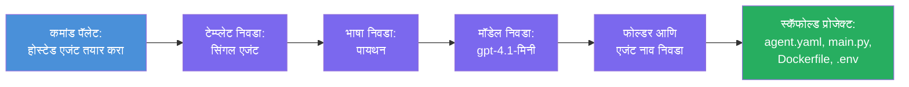

# Module 3 - नवीन होस्टेड एजंट तयार करा (Foundry विस्ताराद्वारे ऑटो-स्कॅफोल्डेड)

या मॉड्यूलमध्ये, आपण Microsoft Foundry विस्तार वापरून नवीन [होस्टेड एजंट](https://learn.microsoft.com/azure/foundry/agents/concepts/hosted-agents) प्रकल्प **स्कॅफोल्ड कराल**. विस्तार संपूर्ण प्रकल्प रचना आपल्यासाठी तयार करतो - यामध्ये `agent.yaml`, `main.py`, `Dockerfile`, `requirements.txt`, `.env` फाइल आणि VS Code डिबग कॉन्फिगरेशन समाविष्ट आहे. स्कॅफोल्ड झाल्यानंतर, आपण या फाइल्सना आपल्या एजंटच्या सूचना, साधने आणि कॉन्फिगरेशननुसार सानुकूल करता.

> **कळीची संकल्पना:** या लॅबमधील `agent/` फोल्डर हा Foundry विस्ताराने चालवलेला स्कॅफोल्ड आदेश चालवल्यावर तयार होणाऱ्या फाइल्सचे उदाहरण आहे. आपण या फाइल्स सुरुवातीपासून लिहीत नाही - विस्तार त्या तयार करतो आणि नंतर आपण त्यात बदल करता.

### स्कॅफोल्ड विजार्ड फ्लो


---

## पायरी 1: Create Hosted Agent विजार्ड उघडा

1. `Ctrl+Shift+P` दाबा आणि **Command Palette** उघडा.
2. टाइप करा: **Microsoft Foundry: Create a New Hosted Agent** आणि ते निवडा.
3. होस्टेड एजंट तयार करण्याचा विजार्ड उघडेल.

> **पर्यायी मार्ग:** आपण Microsoft Foundry साइडबार मधून देखील हा विजार्ड उघडू शकता → **Agents** च्या बाजूला असलेला **+** चिन्ह क्लिक करा किंवा राईट-क्लिक करून **Create New Hosted Agent** निवडा.

---

## पायरी 2: आपला टेम्पलेट निवडा

विजार्ड आपल्याला टेम्पलेट निवडण्यास सांगेल. आपल्याला खालील पर्याय दिसतील:

| टेम्पलेट | वर्णन | कधी वापरावे |
|----------|--------|-------------|
| **सिंगल एजंट** | स्वतःचा मॉडेल, सूचना आणि पर्यायी साधने असलेला एक एजंट | हा वर्कशॉप (Lab 01) |
| **मल्टी-एजंट वर्कफ्लो** | एकामागोमाग एकत्र काम करणारे अनेक एजंट | Lab 02 |

1. **सिंगल एजंट** निवडा.
2. **Next** क्लिक करा (किंवा निवड आपोआप पुढे जाईल).

---

## पायरी 3: प्रोग्रामिंग भाषा निवडा

1. **Python** निवडा (हा वर्कशॉपसाठी शिफारस केलेला).
2. **Next** क्लिक करा.

> **C# देखील समर्थित आहे** जर आपण .NET वापरू इच्छित असाल. स्कॅफोल्ड रचना समान आहे (main.py च्या ऐवजी `Program.cs` वापरते).

---

## पायरी 4: आपला मॉडेल निवडा

1. विजार्ड आपल्या Foundry प्रकल्पात डिप्लॉय केलेले मॉडेल्स दाखवेल (Module 2 मधून).
2. आपण डिप्लॉय केलेला मॉडेल निवडा - उदाहरणार्थ, **gpt-4.1-mini**.
3. **Next** क्लिक करा.

> जर आपल्याला कोणतेही मॉडेल दिसत नसेल, तर [Module 2](02-create-foundry-project.md) कडे परत जा आणि प्रथम एक मॉडेल डिप्लॉय करा.

---

## पायरी 5: फोल्डर स्थान आणि एजंटचे नाव निवडा

1. एक फाइल संवाद उघडेल - प्रकल्प तयार होण्यासाठी एक **लक्ष्य फोल्डर** निवडा. या वर्कशॉपसाठी:
   - जर नवीन सुरुवात करत असाल: कोणताही फोल्डर निवडा (उदा., `C:\Projects\my-agent`)
   - वर्कशॉप रेपोमध्ये काम करत असाल: `workshop/lab01-single-agent/agent/` खाली नवीन सबफोल्डर तयार करा
2. होस्टेड एजंटसाठी एक **नाव** प्रविष्ट करा (उदा., `executive-summary-agent` किंवा `my-first-agent`).
3. **Create** क्लिक करा (किंवा Enter दाबा).

---

## पायरी 6: स्कॅफोल्डिंग पूर्ण होण्याची प्रतीक्षा करा

1. VS Code मध्ये स्कॅफोल्डेड प्रकल्पासह एक **नवीन विंडो** उघडेल.
2. प्रकल्प पूर्णपणे लोड होईपर्यंत काही सेकंद प्रतीक्षा करा.
3. एक्सप्लोरर पॅनेलमध्ये (`Ctrl+Shift+E`) खालील फायली दिसाव्यात:

```
📂 my-first-agent/
├── .env                ← Environment variables (auto-generated with placeholders)
├── .vscode/
│   └── launch.json     ← Debug configuration (F5 to run + Agent Inspector)
├── agent.yaml          ← Agent definition (kind: hosted)
├── Dockerfile          ← Container configuration for deployment
├── main.py             ← Agent entry point (your main code file)
└── requirements.txt    ← Python dependencies
```

> **हा लॅबमधील `agent/` फोल्डरसारखाच रचना आहे.** Foundry विस्तार हे फायली आपोआप तयार करतो - आपल्याला त्या स्वतः तयार करण्याची आवश्यकता नाही.

> **वर्कशॉप नोट:** या वर्कशॉप रेपॉजिटरीमध्ये `.vscode/` फोल्डर **कार्यस्थळ मूळामध्ये** आहे (प्रत्येक प्रकल्पात नाही). यात सामायिक `launch.json` आणि `tasks.json` आहेत ज्यात दोन डिबग कॉन्फिगरेशन आहेत - **"Lab01 - Single Agent"** आणि **"Lab02 - Multi-Agent"** - जे योग्य लॅबच्या `cwd` कडे निर्देश करतात. F5 दाबताना, वापरत असलेल्या लॅबशी जुळणारी कॉन्फिगरेशन ड्रॉपडाऊनमधून निवडा.

---

## पायरी 7: प्रत्येक तयार केलेल्या फाइलची समजून घ्या

विजार्डने तयार केलेल्या प्रत्येक फाइलचा आढावा घ्या. ती समजून घेणे Module 4 (सानुकूलनासाठी) महत्त्वाचे आहे.

### 7.1 `agent.yaml` - एजंट व्याख्या

`agent.yaml` उघडा. याचे स्वरूप असे आहे:

```yaml
# yaml-language-server: $schema=https://raw.githubusercontent.com/microsoft/AgentSchema/refs/heads/main/schemas/v1.0/ContainerAgent.yaml

kind: hosted
name: my-first-agent
description: >
  A hosted agent deployed to Microsoft Foundry Agent Service.
metadata:
  authors:
    - Microsoft
  tags:
    - Azure AI AgentServer
    - Microsoft Agent Framework
    - Hosted Agent
protocols:
  - protocol: responses
    version: v1
environment_variables:
  - name: AZURE_AI_PROJECT_ENDPOINT
    value: ${PROJECT_ENDPOINT}
  - name: AZURE_AI_MODEL_DEPLOYMENT_NAME
    value: ${MODEL_DEPLOYMENT_NAME}
dockerfile_path: Dockerfile
resources:
  cpu: '0.25'
  memory: 0.5Gi
```

**महत्त्वाची फील्ड्स:**

| फील्ड | उद्देश |
|-------|--------|
| `kind: hosted` | हे होस्टेड एजंट असल्याचे जाहीर करते (कंटेनर-आधारित, [Foundry Agent Service](https://learn.microsoft.com/azure/foundry/agents/overview) येथे डिप्लॉय केलेले) |
| `protocols: responses v1` | एजंट OpenAI-सुसंगत `/responses` HTTP endpoint उघडतो |
| `environment_variables` | `.env` मधील मूल्ये कंटेनर पर्यावरण चलांशी (env vars) मेल करतात ज्यावेळी डिप्लॉय होते |
| `dockerfile_path` | कंटेनर इमेज तयार करताना वापरला जाणारा Dockerfile दर्शवितो |
| `resources` | कंटेनरसाठी CPU आणि मेमरी वाटप (0.25 CPU, 0.5Gi मेमरी) |

### 7.2 `main.py` - एजंट एंट्री पॉइंट

`main.py` उघडा. ही मुख्य Python फाइल आहे जिथे आपला एजंट लॉजिक आहे. स्कॅफोल्डमध्ये समाविष्ट आहे:

```python
from agent_framework.azure import AzureAIAgentClient
from azure.ai.agentserver.agentframework import from_agent_framework
from azure.identity.aio import DefaultAzureCredential
```

**महत्त्वाचे आयात:**

| आयात | उद्देश |
|--------|---------|
| `AzureAIAgentClient` | आपल्या Foundry प्रकल्पाशी कनेक्ट करतो आणि `.as_agent()` द्वारे एजंट तयार करतो |
| [`DefaultAzureCredential`](https://learn.microsoft.com/azure/developer/python/sdk/authentication/credential-chains#defaultazurecredential-overview) | प्रमाणीकरण हाताळतो (Azure CLI, VS Code साइन-इन, व्यवस्थापित ओळख, किंवा सेवा प्राचार्य) |
| `from_agent_framework` | एजंटला HTTP सर्व्हर म्हणून वेढतो जो `/responses` endpoint उघडतो |

मुख्य प्रवाह:
1. क्रेडेंशियल तयार करा → क्लायंट तयार करा → `.as_agent()` कॉल करा (async context manager) → सर्व्हर म्हणून वेढा → चालवा

### 7.3 `Dockerfile` - कंटेनर इमेज

```dockerfile
FROM python:3.14-slim

WORKDIR /app

COPY ./ .

RUN pip install --upgrade pip && \
    if [ -f requirements.txt ]; then \
        pip install -r requirements.txt; \
    else \
        echo "No requirements.txt found" >&2; exit 1; \
    fi

EXPOSE 8088

CMD ["python", "main.py"]
```

**महत्त्वाचे तपशील:**
- `python:3.14-slim` बेस इमेज वापरतो.
- सर्व प्रकल्प फायली `/app` मध्ये कॉपी करतो.
- `pip` ची उन्नती करतो, `requirements.txt` मधील अवलंबन स्थापित करतो, आणि जर फाइल गायब असेल तर जलद फेल होतो.
- **पोर्ट 8088 उघडतो** - होस्टेड एजंटसाठी आवश्यक पोर्ट. यात बदल करू नका.
- एजंट `python main.py` ने सुरू होतो.

### 7.4 `requirements.txt` - अवलंबन

```
agent-framework-azure-ai==1.0.0rc3
agent-framework-core==1.0.0rc3
azure-ai-agentserver-agentframework==1.0.0b16
azure-ai-agentserver-core==1.0.0b16
debugpy
agent-dev-cli
```

| पॅकेज | उद्देश |
|---------|---------|
| `agent-framework-azure-ai` | Microsoft Agent Framework साठी Azure AI एकत्रीकरण |
| `agent-framework-core` | एजंट तयार करण्यासाठी कोर रंटाइम (यात `python-dotenv` समाविष्ट) |
| `azure-ai-agentserver-agentframework` | Foundry Agent Service साठी होस्टेड एजंट सर्व्हर रंटाइम |
| `azure-ai-agentserver-core` | कोर एजंट सर्व्हर अमूर्तता |
| `debugpy` | Python डिबगिंग समर्थन (VS Code मध्ये F5 डिबगिंगसाठी) |
| `agent-dev-cli` | एजंट चाचणीसाठी स्थानिक विकास CLI (डिबग/रन कॉन्फिगरेशनद्वारे वापरले जाते) |

---

## एजंट प्रोटोकॉल समजून घेणे

होस्टेड एजंट **OpenAI Responses API** प्रोटोकॉलद्वारे संवाद साधतात. रन करत असताना (स्थानिक किंवा क्लाउडमध्ये), एजंट एकच HTTP endpoint उघडतो:

```
POST http://localhost:8088/responses
Content-Type: application/json

{
  "input": "Your prompt here",
  "stream": false
}
```

Foundry Agent Service हा endpoint वापरून वापरकर्त्याचे प्रॉम्प्ट पाठवतो आणि एजंट प्रतिसाद मिळवतो. हा OpenAI API द्वारे वापरला जाणारा तोच प्रोटोकॉल आहे, त्यामुळे आपला एजंट OpenAI Responses फॉरमॅट बोलेलेले कोणतेही क्लायंटसह सुसंगत आहे.

---

### चेकपॉइंट

- [ ] स्कॅफोल्ड विजार्ड यशस्वीपणे पूर्ण झाला आणि **नवीन VS Code विंडो** उघडली
- [ ] खालील 5 फाइल्स आपल्याला दिसतात: `agent.yaml`, `main.py`, `Dockerfile`, `requirements.txt`, `.env`
- [ ] `.vscode/launch.json` फाइल अस्तित्वात आहे (F5 डिबगिंग सक्षम करते - या वर्कशॉपमध्ये कार्यस्थळ मूळावर आहे ज्यात लॅब-विशिष्ट कॉन्फिग आहेत)
- [ ] प्रत्येक फाइल वाचा आणि तिचा उद्देश समजून घ्या
- [ ] आपण समजले आहे की पोर्ट `8088` आवश्यक आहे आणि `/responses` endpoint हा प्रोटोकॉल आहे

---

**मागील:** [02 - Create Foundry Project](02-create-foundry-project.md) · **पुढील:** [04 - Configure & Code →](04-configure-and-code.md)

---

<!-- CO-OP TRANSLATOR DISCLAIMER START -->
**अस्वीकरण**:
हा दस्तऐवज AI अनुवाद सेवा [Co-op Translator](https://github.com/Azure/co-op-translator) वापरून अनुवादित केला गेला आहे. आम्ही अचूकतेसाठी प्रयत्नशील असलो तरी, कृपया लक्षात घ्या की स्वयंचलित अनुवादांमध्ये चुका किंवा अचूकतेच्या त्रुटी असू शकतात. मूळ दस्तऐवज त्याच्या स्थानिक भाषेत अधिकृत स्रोत मानला जावा. महत्त्वाच्या माहितीकरिता व्यावसायिक मानवनिर्मित अनुवाद शिफारस केला जातो. या अनुवादाच्या वापरामुळे उद्भवलेल्या कोणत्याही गैरसमज किंवा चुकीच्या अर्थलागी आम्ही जबाबदार नाही.
<!-- CO-OP TRANSLATOR DISCLAIMER END -->