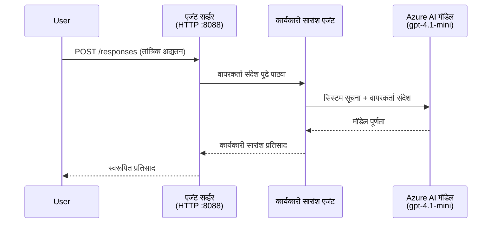
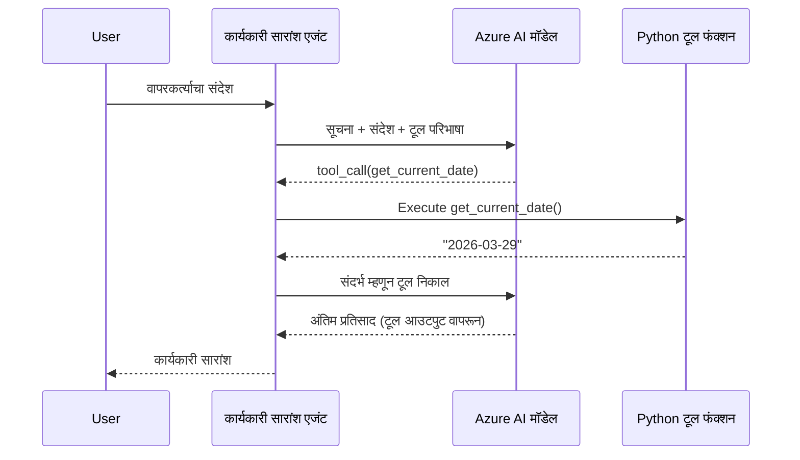

# Module 4 - सूचनांची संरचना करा, पर्यावरण सेट करा आणि अवलंबित्वे स्थापित करा

या मॉड्यूलमध्ये, तुम्ही Module 3 मधील ऑटो-स्कॅफोल्डेड एजंट फायली सानुकूल करता. येथे तुम्ही सामान्य स्कॅफोल्डला **तुमच्या** एजंटमध्ये रूपांतरित करता - सूचना लिहून, पर्यावरणातील व्हेरिएबल्स सेट करून, पर्यायीपणे साधने जोडून आणि अवलंबित्वे स्थापित करून.

> **सावधगिरी:** Foundry एक्सटेंशनने आपोआप तुमच्या प्रकल्पाच्या फाइल्स तयार केल्या आहेत. आता तुम्ही त्यात बदल कराल. सानुकूलित एजंटचे पूर्ण कार्यरत उदाहरण पाहण्यासाठी [`agent/`](../../../../../workshop/lab01-single-agent/agent) फोल्डर पहा.

---

## घटक कसे एकत्र बसतात

### विनंतीचा जीवनचक्र (एकल एजंट)


> **साधनांसह:** जर एजंटने साधने नोंदवली असतील, तर मॉडेल थेट पूर्ण करण्याऐवजी साधन कॉल परत करू शकते. फ्रेमवर्क स्थानिकरित्या साधन चालवते, निकाल मॉडेलला परत पोहोचवते, आणि मॉडेल नंतर अंतिम प्रतिसाद तयार करते.


---

## पाऊल 1: पर्यावरणीय चल सेट करा

स्कॅफोल्डने `.env` फाइल प्लेसहोल्डर व्हॅल्यूसह तयार केली आहे. तुम्हाला Module 2 मधील वास्तविक मूल्ये भरावी लागतील.

1. तुमच्या स्कॅफोल्ड केलेल्या प्रकल्पात, **`.env`** फाइल उघडा (ही प्रकल्पाच्या मूळ फोल्डरमध्ये आहे).
2. प्लेसहोल्डर मूल्ये तुमच्या वास्तविक Foundry प्रकल्प तपशीलासह बदला:

   ```env
   PROJECT_ENDPOINT=https://<your-account>.services.ai.azure.com/api/projects/<your-project>
   MODEL_DEPLOYMENT_NAME=gpt-4.1-mini
   ```

3. फाइल जतन करा.

### ही मूल्ये कुठे सापडतील

| मूल्य | कसे शोधावे |
|-------|--------------|
| **प्रोजेक्ट एन्डपॉइंट** | VS Code मध्ये **Microsoft Foundry** साइडबार उघडा → तुमचा प्रकल्प निवडा → तपशील दृश्यात एन्डपॉइंट URL दाखवला जातो. तो असा दिसतो `https://<account-name>.services.ai.azure.com/api/projects/<project-name>` |
| **मॉडेल डिप्लॉयमेंट नाव** | Foundry साइडबार मध्ये तुमचा प्रकल्प वाढवा → **Models + endpoints** खाली पहा → डिप्लॉयड मॉडेलजवळ त्याचे नाव (उदा., `gpt-4.1-mini`) दिलेले आहे |

> **सुरक्षा:** `.env` फाइल कधीही व्हर्जन कंट्रोल मध्ये कमिट करू नका. ती आधीच `.gitignore` मध्ये आहे. जर नसेल तर ती जोडा:
> ```
> .env
> ```

### पर्यावरणीय चल कसे वाहतात

मॅपिंग क्रम: `.env` → `main.py` (`os.getenv` द्वारे वाचले जाते) → `agent.yaml` (डिप्लॉय वेळेस कंटेनर पर्यावरणीय चलांवर मॅप होते).

`main.py` मध्ये, स्कॅफोल्ड या मूल्यांना असे वाचते:

```python
PROJECT_ENDPOINT = os.getenv("AZURE_AI_PROJECT_ENDPOINT") or os.getenv("PROJECT_ENDPOINT")
MODEL_DEPLOYMENT_NAME = os.getenv("AZURE_AI_MODEL_DEPLOYMENT_NAME", os.getenv("MODEL_DEPLOYMENT_NAME", "gpt-4.1-mini"))
```

`AZURE_AI_PROJECT_ENDPOINT` आणि `PROJECT_ENDPOINT` दोन्ही स्वीकारले जातात (`agent.yaml` मध्ये `AZURE_AI_*` प्रीफिक्स वापरला जातो).

---

## पाऊल 2: एजंट सूचन लिहा

हा सर्वात महत्त्वाचा सानुकूलन टप्पा आहे. सूचना तुमच्या एजंटची व्यक्तिमत्व, वर्तन, आउटपुट स्वरूप आणि सुरक्षा अटी ठरवतात.

1. तुमच्या प्रकल्पात `main.py` उघडा.
2. सूचना स्ट्रिंग शोधा (स्कॅफोल्डने डीफॉल्ट/सामान्य सूचना समाविष्ट केल्या आहेत).
3. त्यांना तपशीलवार, संरचित सूचनांशी बदला.

### चांगल्या सूचनांत काय असते

| घटक | उद्देश | उदाहरण |
|-------|----------|----------|
| **भूमिका** | एजंट काय आहे आणि काय करतो | "तुम्ही एक कार्यकारी सारांश एजंट आहात" |
| **प्रेक्षक** | प्रतिसाद कोणासाठी आहे | "मर्यादित तांत्रिक पार्श्वभूमी असलेले वरिष्ठ नेते" |
| **इनपुट व्याख्या** | कोणत्या प्रकारचे प्रॉम्प्ट हाताळतो | "तांत्रिक घटना अहवाल, ऑपरेशनल अपडेट्स" |
| **आउटपुट स्वरूप** | प्रतिसादांची अचूक रचना | "कार्यकारी सारांश: - काय घडले: ... - व्यवसाय प्रभाव: ... - पुढचे पाऊल: ..." |
| **नियमे** | बंधने आणि नकारात्मक परिस्थिती | "पुरवलेल्या माहिती पेक्षा अधिक माहिती वाचा नका" |
| **सुरक्षा** | गैरवापर आणि भ्रम टाळणे | "जर इनपुट अस्पष्ट असेल तर स्पष्टता विचारा" |
| **उदाहरणे** | वर्तन सुसंगत ठेवण्यासाठी इनपुट/आउटपुट जोड्या | 2-3 वेगवेगळ्या इनपुटसह उदाहरणे समाविष्ट करा |

### उदाहरण: कार्यकारी सारांश एजंट सूचन

खाली कार्यशाळेतील [`agent/main.py`](../../../../../workshop/lab01-single-agent/agent/main.py) मधील सूचना दिल्या आहेत:

```python
AGENT_INSTRUCTIONS = """You are an "Explain Like I'm an Executive" agent.

Purpose:
Your job is to translate complex technical or operational information into
clear, concise, and outcome-focused summaries that can be easily understood
by non-technical executives.

Audience:
Senior leaders with limited technical background who care about impact,
risk, and what happens next.

What you must do:
- Rephrase the input so it is understandable to a non-technical audience
- Prioritize clarity, brevity, and outcomes over technical accuracy
- Remove technical jargon, logs, metrics, stack traces, and deep root-cause details
- Translate technical causes into simple cause-and-effect statements
- Explicitly call out business impact
- Always include a clear next step or action
- Maintain a neutral, factual, and calm executive tone
- Do NOT add new facts or speculate beyond the input

Standard Output Structure (always use this wording):

Executive Summary:
- What happened: <plain-language description>
- Business impact: <clear, non-technical impact>
- Next step: <clear action or mitigation>

Rules:
- Keep responses under 100 words
- Do NOT add facts beyond the input
- If input is unclear, ask for clarification
"""
```

4. `main.py` मध्ये असलेल्या विद्यमान सूचना स्ट्रिंगसाठी तुमच्या सानुकूल सूचनांनी बदल करा.
5. फाइल जतन करा.

---

## पाऊल 3: (पर्यायी) सानुकूल साधने जोडा

होस्टेड एजंट स्थानिक Python फंक्शन्सना [tools](https://learn.microsoft.com/azure/foundry/agents/concepts/tool-catalog) म्हणून चालवू शकतात. कोड-आधारित होस्टेड एजंटच्या बाबतीत हा एक महत्वाचा फायदा आहे - तुमचा एजंट arbitrary सर्व्हर-साइड लॉजिक चालवू शकतो.

### 3.1 साधन फंक्शन डिफाइन करा

`main.py` मध्ये साधन फंक्शन जोडा:

```python
from agent_framework import tool

@tool
def get_current_date() -> str:
    """Returns the current date in YYYY-MM-DD format."""
    from datetime import date
    return str(date.today())
```

`@tool` डेकोरेटर सामान्य Python फंक्शनला एजंट साधनात बदलतो. डॉक्स्ट्रिंग साधनाचे वर्णन होते जे मॉडेलला दिसते.

### 3.2 एजंटसह साधन नोंदवा

`.as_agent()` कॉन्टेक्स्ट मॅनेजर वापरताना, `tools` पॅरामीटरमध्ये साधन द्या:

```python
async with AzureAIAgentClient(
    project_endpoint=PROJECT_ENDPOINT,
    model_deployment_name=MODEL_DEPLOYMENT_NAME,
    credential=credential,
).as_agent(
    name="my-agent",
    instructions=AGENT_INSTRUCTIONS,
    tools=[get_current_date],
) as agent:
    server = from_agent_framework(agent)
    await server.run_async()
```

### 3.3 साधन कॉल कसे कार्य करतात

1. वापरकर्ता एक प्रॉम्प्ट पाठवतो.
2. मॉडेल ठरवते की साधन आवश्यक आहे का (प्रॉम्प्ट, सूचना आणि साधन वर्णनांच्या आधारे).
3. साधन लागत असल्यास, फ्रेमवर्क तुमच्या Python फंक्शनला कंटेनरमध्ये स्थानिकरित्या कॉल करतो.
4. साधनाचा परतावा संदर्भ म्हणून मॉडेलला पाठवला जातो.
5. मॉडेल अंतिम प्रतिसाद तयार करतो.

> **साधने सर्व्हर-साइड चालतात** - ती तुमच्या कंटेनरमध्ये चालतात, वापरकर्त्याच्या ब्राउझर किंवा मॉडेलमध्ये नाही. याचा अर्थ तुम्ही डेटाबेस, API, फाइल सिस्टम किंवा कोणतीही Python लायब्ररी वापरू शकता.

---

## पाऊल 4: व्हर्च्युअल एन्व्हायर्नमेंट तयार करा आणि सक्रिय करा

अवलंबित्वे स्थापित करण्यापूर्वी स्वतंत्र Python वातावरण तयार करा.

### 4.1 व्हर्च्युअल एन्व्हायर्नमेंट तयार करा

VS Code मध्ये टर्मिनल उघडा (`` Ctrl+` ``) आणि चालवा:

```powershell
python -m venv .venv
```

यामुळे प्रकल्प निर्देशिकेत `.venv` फोल्डर तयार होतो.

### 4.2 व्हर्च्युअल एन्व्हायर्नमेंट सक्रिय करा

**PowerShell (Windows):**

```powershell
.\.venv\Scripts\Activate.ps1
```

**Command Prompt (Windows):**

```cmd
.venv\Scripts\activate.bat
```

**macOS/Linux (Bash):**

```bash
source .venv/bin/activate
```

तुमच्या टर्मिनल प्रॉम्प्टच्या सुरुवातीला `(.venv)` दिसावे लागेल, ज्याचा अर्थ व्हर्च्युअल एन्व्हायर्नमेंट सक्रिय आहे.

### 4.3 अवलंबित्वे स्थापित करा

व्हर्च्युअल एन्व्हायर्नमेंट सक्रिय असतानाच, आवश्यक पॅकेजेस स्थापित करा:

```powershell
pip install -r requirements.txt
```

हे स्थापित करेल:

| पॅकेज | उद्देश |
|--------|---------|
| `agent-framework-azure-ai==1.0.0rc3` | [Microsoft Agent Framework](https://learn.microsoft.com/agent-framework/overview/) साठी Azure AI एकत्रीकरण |
| `agent-framework-core==1.0.0rc3` | एजंट तयार करण्यासाठी मुख्य रनटाइम (या मध्ये `python-dotenv` आहे) |
| `azure-ai-agentserver-agentframework==1.0.0b16` | [Foundry Agent Service](https://learn.microsoft.com/azure/foundry/agents/overview) साठी होस्टेड एजंट सर्व्हर रनटाइम |
| `azure-ai-agentserver-core==1.0.0b16` | मुख्य एजंट सर्व्हरचा अब्स्ट्रॅक्शन |
| `debugpy` | Python डिबगिंग (VS Code मध्ये F5 डिबग सक्षम करते) |
| `agent-dev-cli` | एजंट्सची स्थानिक विकासासाठी CLI |

### 4.4 स्थापना तपासा

```powershell
pip list | Select-String "agent-framework|agentserver"
```

अपेक्षित आउटपुट:
```
agent-framework-azure-ai   1.0.0rc3
agent-framework-core       1.0.0rc3
azure-ai-agentserver-agentframework 1.0.0b16
azure-ai-agentserver-core  1.0.0b16
```

---

## पाऊल 5: प्रमाणीकरण तपासा

एजंट [`DefaultAzureCredential`](https://learn.microsoft.com/azure/developer/python/sdk/authentication/credential-chains#defaultazurecredential-overview) वापरतो जे खालील क्रमाने अनेक प्रमाणीकरण पद्धती वापरते:

1. **पर्यावरणीय चलं** - `AZURE_CLIENT_ID`, `AZURE_TENANT_ID`, `AZURE_CLIENT_SECRET` (सेवा प्रिंसिपल)
2. **Azure CLI** - तुमच्या `az login` सत्राला वापरतो
3. **VS Code** - VS Code मध्ये लॉग इन केलेल्या खात्याचा वापर करतो
4. **मॅनेज्ड ओळख** - Azure मध्ये चालवतानाचा वापर (डिप्लॉयमेंटच्या वेळी)

### 5.1 स्थानिक विकासासाठी प्रमाणीकरण तपासा

किमान एक खालीलपैकी कार्यरत असावा:

**पर्याय A: Azure CLI (शिफारस)**

```powershell
az account show --query "{name:name, id:id}" --output table
```

अपेक्षित: तुमचे सबस्क्रिप्शन नाव आणि आयडी दाखवेल.

**पर्याय B: VS Code साइन-इन**

1. VS Code च्या तळव्याच्या डाव्या बाजूला **Accounts** आयकॉन पहा.
2. तुमचे खाते दिसत असल्यास, तुम्ही प्रमाणित झाला आहात.
3. नसेल तर, आयकॉन क्लिक करा → **Microsoft Foundry वापरण्यासाठी साइन इन करा**.

**पर्याय C: सेवा प्रिंसिपल (CI/CD साठी)**

```powershell
$env:AZURE_TENANT_ID = "<your-tenant-id>"
$env:AZURE_CLIENT_ID = "<your-client-id>"
$env:AZURE_CLIENT_SECRET = "<your-client-secret>"
```

### 5.2 सामान्य प्रमाणीकरण समस्या

जर तुम्ही अनेक Azure खात्यांमध्ये साइन इन केलेले असाल, तर खात्री करा योग्य सबस्क्रिप्शन निवडलेले आहे:

```powershell
az account set --subscription "<your-subscription-id>"
```

---

### चेकपॉइंट

- [ ] `.env` फाइलमध्ये वैध `PROJECT_ENDPOINT` आणि `MODEL_DEPLOYMENT_NAME` आहेत (प्लेसहोल्डर नाहीत)
- [ ] एजंट सूचन `main.py` मध्ये सानुकूलित केल्या आहेत - ज्यात भूमिका, प्रेक्षक, आउटपुट स्वरूप, नियम आणि सुरक्षा अटी आहेत
- [ ] (पर्यायी) सानुकूल साधने define आणि नोंदवलेली आहेत
- [ ] व्हर्च्युअल एन्व्हायर्नमेंट तयार आणि सक्रिय केलेले आहे (`(.venv)` टर्मिनल प्रॉम्प्टमध्ये दिसते)
- [ ] `pip install -r requirements.txt` यशस्वीपणे पूर्ण झाले आहे
- [ ] `pip list | Select-String "azure-ai-agentserver"` पॅकेज स्थापित दिसत आहे
- [ ] प्रमाणीकरण वैध आहे - `az account show` तुमचे सबस्क्रिप्शन परत करत आहे किंवा तुम्ही VS Code मध्ये साइन इन केलेले आहात

---

**पूर्वीचे:** [03 - Create Hosted Agent](03-create-hosted-agent.md) · **पुढचे:** [05 - Test Locally →](05-test-locally.md)

---

<!-- CO-OP TRANSLATOR DISCLAIMER START -->
**अस्वीकरण**:
हा दस्तऐवज AI अनुवाद सेवा [Co-op Translator](https://github.com/Azure/co-op-translator) चा उपयोग करून अनुवादित केला गेला आहे. आम्ही अचूकतेसाठी प्रयत्नशील असलो तरी, कृपया लक्षात घ्या की स्वयंचलित अनुवादांमध्ये चुका किंवा असमर्थने असू शकतात. मूळ दस्तऐवज त्याच्या स्थानिक भाषेत अधिकृत स्रोत मानला जावा. महत्त्वपूर्ण माहितीसाठी, व्यावसायिक मानवी अनुवाद शिफारसीय आहे. या अनुवादाच्या वापरातून उद्भवलेल्या कोणत्याही गैरसमजुती किंवा चुकीच्या अर्थलागी आम्ही जबाबदार नाही.
<!-- CO-OP TRANSLATOR DISCLAIMER END -->