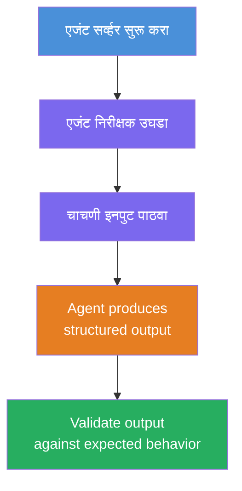
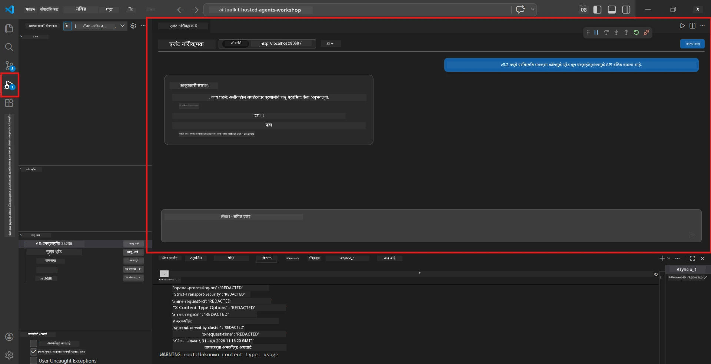
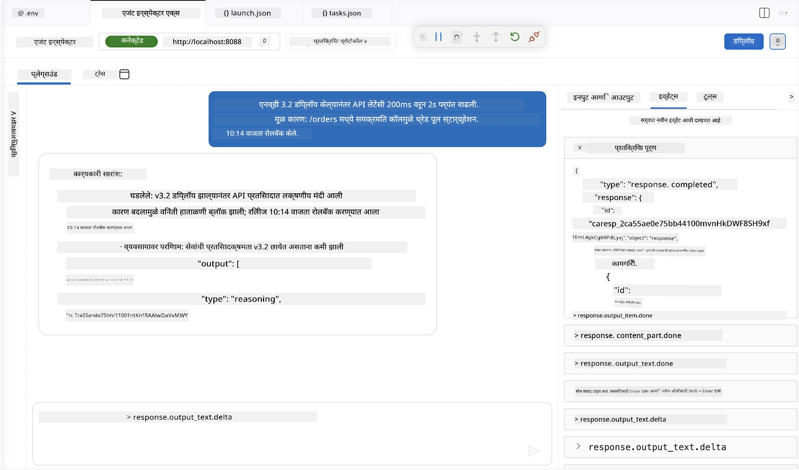

# मॉड्यूल 4 - स्थानिक चाचणी

⏱️ ~10 मिनिटे

या मॉड्यूलमध्ये, आपण आपला एजंट स्थानिकपणे चालवता आणि **हॅपी-पाथ फंक्शनल चाचण्या** वापरून ते योग्य प्रकारे कार्य करते का ते तपासता. एजंट इन्स्पेक्टर (दृश्यमान UI) किंवा थेट HTTP कॉल वापरून एजंट योग्य, अचूक प्रत्युत्तर तयार करतो का हे आपण पुष्टी कराल.

### स्थानिक चाचणी प्रवाह



---

## पर्याय 1: F5 दाबा - एजंट इन्स्पेक्टरसह डीबग करा (शिफारस केली आहे)

### डीबगर सुरू करा

1. **executive-summary-agent/** फोल्डर थेट VS Code मध्ये उघडा (`File → Open Folder`).
2. **Run and Debug** पॅनेल उघडा (`Ctrl+Shift+D`).
3. ड्रॉपडाऊनमधून **Debug Local Agent Server** निवडा.
4. **F5** दाबा (किंवा ▶ Start Debugging क्लिक करा).

> ⚠️ **महत्त्वाचे: आपला Python Interpreter निवडा**
> जर "ModuleNotFoundError" आला किंवा डीबगर सुरू झाला नाही, तर आपल्याला VS Code ला आपले वर्चुअल एन्व्हायर्नमेंट वापरण्यास सांगावे लागेल:
  > 1. `Ctrl+Shift+P` दाबा $\rightarrow$ **Python: Select Interpreter** टाइप करा.
  > 2. आपल्या प्रोजेक्टच्या `.venv` फोल्डरमध्ये असलेला इंटरप्रेटर निवडा (उदा., Windows मध्ये `.\.venv\Scripts\python.exe`).
  > 3. डीबग सत्र पुन्हा सुरू करा.
> जर अजूनही त्रुटी आल्या, तर आपले `tasks.json` फाईल खालीलप्रमाणे हाताने अपडेट करा:
  > 1. `.vscode/tasks.json` फाईलवर जा
  > 2. `Run Agent/Workflow HTTP Server` नावाच्या कमांडकडे जा
  > 3. खालील प्रमाणे कमांड व्हॅल्यू अपडेट करा: `"value": "${workspaceFolder}/.venv/bin/python",`

### काय होते

1. HTTP सर्व्हर `http://localhost:8088/responses` वर सुरू होतो.
2. **Agent Inspector** पॅनेल आपोआप उघडते - चाचणीसाठी एक दृश्यात्मक चॅट इंटरफेस.
3. `main.py` मध्ये ब्रेकपॉईंट्स सक्षम आहेत.

टर्मिनलमध्ये पहा:
```
Starting executive summary hosted agent
Executive agent server running on http://localhost:8088
```

> **जर Agent Inspector उघडत नसेल:** `Ctrl+Shift+P` दाबा → **Foundry Toolkit: Open Agent Inspector**.



> *स्क्रीनशॉटमध्ये पूर्वीच्या एक्सटेंशन आवृत्तीच्या 'AI TOOLKIT' ब्रँडिंगचा उल्लेख असू शकतो.*

---

## पर्याय 2: टर्मिनलद्वारे चाचणी (पर्यायी)

एका टर्मिनलमध्ये एजंट सुरू करा, दुसर्‍या टर्मिनलमधून विनंत्या पाठवा:

```bash
# टर्मिनल 1: एजंट सुरू करा
cd executive-summary-agent/
source .venv/bin/activate
python main.py
```

```bash
# टर्मिनल 2: चाचणी पाठवा (कर्ल)
curl -sS -X POST http://localhost:8088/responses \
  -H "Content-Type: application/json" \
  -d '{"input": "The API latency increased due to thread pool exhaustion caused by sync calls in v3.2.", "stream": false}'
```

---

## परिस्थिती चाचण्या: हॅपी-पाथ फंक्शनल पडताळणी

खालील **तीनही** परिस्थिती चालवा. या पडताळणी करतात की आपला एजंट वास्तववादी इनपुटसाठी योग्य, रचनेतल्या आउटपुटची निर्मिती करतो.



### परिस्थिती 1: IT घटना - API विलंब वाढ

**इनपुट:**
```
The API latency increased from 200ms to 2s after deploying v3.2.
Root cause: thread pool starvation from synchronous calls in /orders.
Rolled back at 10:14.
```

**अपेक्षित वर्तन:**
- ✅ "Executive Summary" रचना (काय घडले / व्यवसायावर परिणाम / पुढील पाऊल) यांचे पालन करते
- ✅ कुठलाही तांत्रिक परिचय नाही ("thread pool", "/orders", "v3.2" नाही)
- ✅ व्यवसायाचा परिणाम स्पष्टपणे नमूद करते (उदा., वापरकर्त्यांना विलंब अनुभवास आला)
- ✅ पुढील पाऊल समाविष्ट करते (उदा., दुरुस्ती तैनात, निरीक्षण सुरू)

---

### परिस्थिती 2: डेटा पाइपलाइन - ETL अपयश

**इनपुट:**
```
The nightly ETL job failed because the upstream schema changed. APAC dashboards show missing data.
```

**अपेक्षित वर्तन:**
- ✅ डेटाच्या पुनर्रचना अपयशाचे साधे स्पष्टीकरण देते
- ✅ APAC डॅशबोर्डच्या परिणामाची नोंद करते
- ✅ सुधारणा म्हणून पुढील पाऊल दिले आहे
- ✅ "ETL", "schema", किंवा अन्य तांत्रिक शब्दांचा उल्लेख नाही

---

### परिस्थिती 3: सुरक्षा - उघडकीची साखळी

**इनपुट:**
```
Static analysis flagged a hardcoded secret in the repository.
The secret may have been exposed in commit history.
```

**अपेक्षित वर्तन:**
- ✅ साखळी/सुरक्षा समस्येचे कार्यकारी भाषेत वर्णन करते
- ✅ संभाव्य धोका (अनधिकृत प्रवेश) नमूद करते
- ✅ दुरुस्ती क्रिया (साखळी फेरविणे, ऑडिट) सूचित करते
- ✅ "static analysis", "commit history", किंवा "hardcoded" सारख्या शब्दांचा समावेश नाही

---

## पडताळणी निकष

प्रत्येक परिस्थितीसाठी तपासा:

| # | निकष | यशस्वी स्थिती |
|---|----------|---------------|
| 1 | **रचना** | प्रत्युत्तर "Executive Summary" फॉर्मॅट वापरते आणि सर्व तीन मुद्दे असतात |
| 2 | **साधी भाषा** | कोणतेही तांत्रिक शब्द नाहीत जे एक कार्यकारी समजणार नाही |
| 3 | **अचूकता** | सारांश इनपुटशी सुसंगत आहे - कोणतीही बनावट माहिती नाही |
| 4 | **संक्षिप्तता** | प्रत्युत्तर 100 शब्दांपेक्षा कमी आहे |
| 5 | **पुढील पाऊल** | स्पष्ट कारवाई किंवा प्रतिबंध नमूद केलेले आहे |

---

## डीबगिंग टिपा

| समस्या | सुधारणा |
|-------|---------|
| एजंट सुरू होत नाही | `.env` मूल्य तपासा, venv सक्रिय आहे का ते पहा, `pip install -r requirements.txt` चालवा |
| रिकामे किंवा सामान्य प्रत्युत्तर | `main.py` मधील सूचना तपासा - आउटपुट फॉर्मॅट दिला आहे का ते पाहा |
| प्रत्युत्तरात तांत्रिक शब्द | "तांत्रिक शब्द काढा" नियम सशक्त करा निर्देशांमध्ये |
| Agent Inspector उघडत नाही | `Ctrl+Shift+P` → **Foundry Toolkit: Open Agent Inspector** |
| टर्मिनलमध्ये मॉडेलचे त्रुटी | `AZURE_AI_MODEL_DEPLOYMENT_NAME` नेमके जुळते का (केस संवेदनशील) तपासा |

---

### ✅ तपासणी बिंदू

- [ ] एजंट स्थानिकपणे त्रुटीशिवाय सुरू होतो
- [ ] Agent Inspector उघडतो आणि चॅट इंटरफेस दाखवतो (F5 वापरत असल्यास)
- [ ] **परिस्थिती 1** (IT घटना) - संरचित Executive Summary, कोणताही तांत्रिक शब्द नाही
- [ ] **परिस्थिती 2** (डेटा पाइपलाइन) - संबंधित सारांश व व्यवसाय परिणाम
- [ ] **परिस्थिती 3** (सुरक्षा अलर्ट) - योग्य धोका संवाद
- [ ] सर्व प्रतिसाद परिभाषित आउटपुट रचनेचे पालन करतात

> **आपले प्रतिसाद जतन करा** (कॉपी किंवा स्क्रीनशॉट) - आपण मॉड्यूल 06 मध्ये क्लाउडच्या निकालांसोबत त्यांची तुलना करणार आहात.

---

**मागील:** [03 - Configure & Code](03-configure-and-code.md) · **पुढील:** [05 - Deploy to Foundry →](05-deploy-to-foundry.md)

---

<!-- CO-OP TRANSLATOR DISCLAIMER START -->
**अस्वीकरण**:
हा दस्तऐवज AI भाषांतर सेवा [Co-op Translator](https://github.com/Azure/co-op-translator) चा वापर करून अनुवादित केला आहे. जरी आम्ही अचूकतेसाठी प्रयत्न करतो, तरी कृपया लक्षात घ्या की स्वयंचलित भाषांतरांमध्ये त्रुटी किंवा अचूकतेची कमतरता असू शकते. मूळ दस्तऐवज त्याच्या मूळ भाषेत अधिकृत स्रोत मानला पाहिजे. महत्त्वाची माहिती असल्यास, व्यावसायिक मानवी भाषांतराची शिफारस केली जाते. या भाषांतराच्या वापरामुळे उद्भवणाऱ्या कोणत्याही गैरसमज किंवा चुकीच्या अर्थलावणीसाठी आम्ही जबाबदार नाही.
<!-- CO-OP TRANSLATOR DISCLAIMER END -->