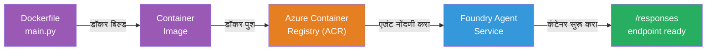
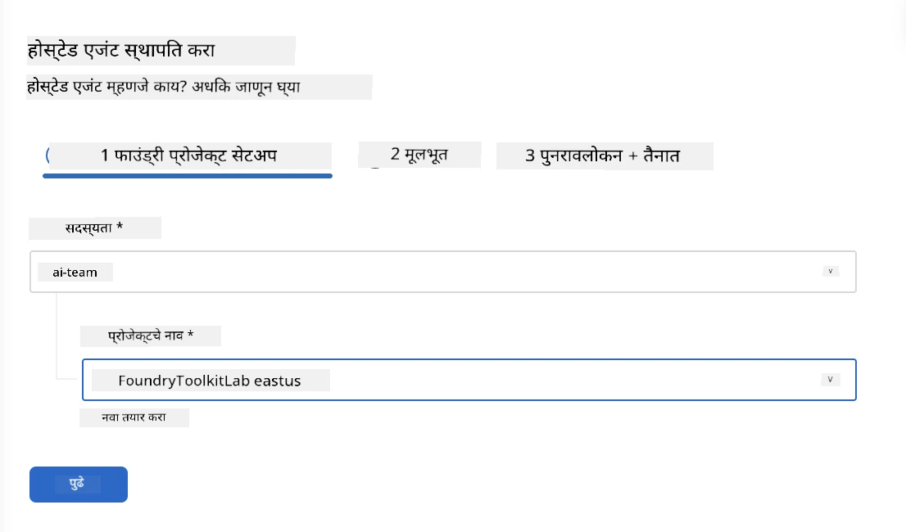
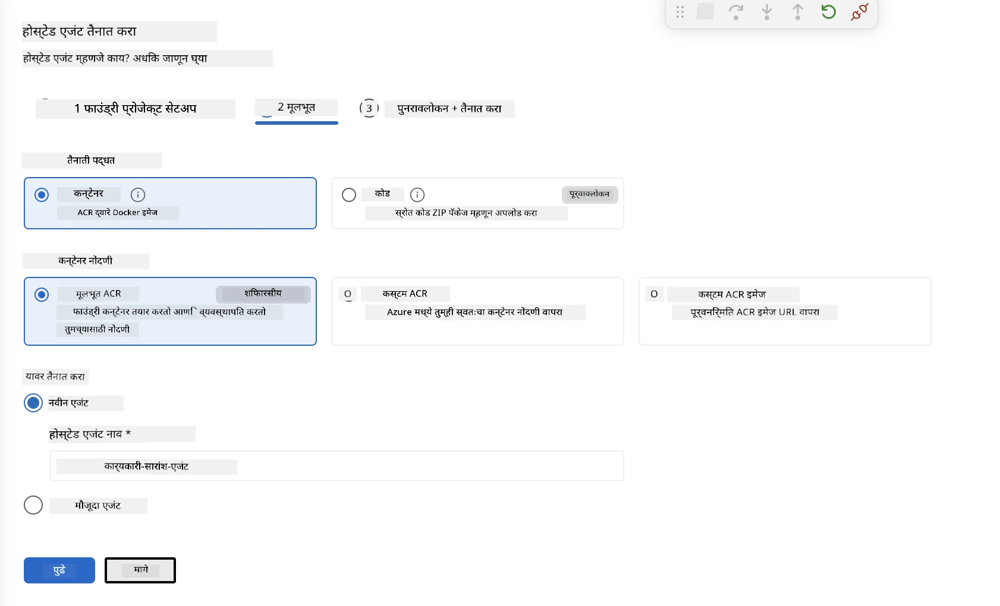
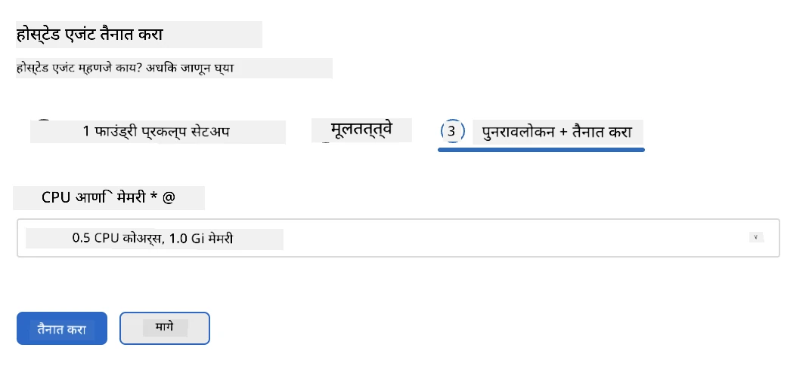
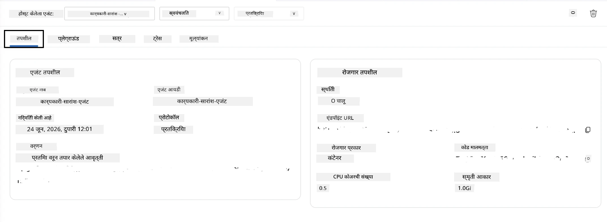

# मॉड्यूल 5 - फाउंड्री एजंट सेवा येथे नियुक्ती करा

⏱️ ~10 मिनिटे

> ⚠️ **पथ B वापरकर्ते:** हे मॉड्यूल फाउंड्री सदस्यत्व आवश्यक आहे. तुम्ही फाउंड्री लोकल वापरत असाल, तर [मॉड्यूल 07 - सारांश](07-summary.md) कडे जा. तुम्ही स्थानिक विकास कार्यप्रवाह यशस्वीरित्या पूर्ण केला आहे!

या मॉड्युलमध्ये, तुम्ही स्थानिकपणे चाचणी केलेला तुमचा एजंट Microsoft Foundry मध्ये एक **होस्टेड एजंट** म्हणून तैनात करता. ही नियुक्ती कंटेनर इमेज तयार करते, ती Azure कंटेनर रजिस्ट्रीमध्ये ढकलते, आणि Foundry च्या व्यवस्थापित पायाभूत सुविधेमध्ये एजंट सुरू करते.

### नियुक्ती पाईपलाइन

---

## पूर्वअट तपासणी

नियुक्ती करण्यापूर्वी, तपासा:

- [ ] एजंट सर्व 3 स्थानिक परिदृश्यांमध्ये यशस्वीपणे पार पडला आहे [मॉड्यूल 04](04-test-locally.md)
- [ ] तुमच्याकडे प्रकल्प स्तरावर **Azure AI User** भूमिका आहे ([मॉड्यूल 01, RBAC वाटप](01-setup.md#deploy-a-model--assign-rbac))
- [ ] तुम्ही VS Code मध्ये Azure मध्ये साइन इन केलेले आहात (खाते चिन्हावर तुमचे नाव दिसते)

---

## चरण 1: नियुक्ती सुरू करा

### पर्याय अ: एजंट इन्स्पेक्टरमधून नियुक्ती करा (शिफारसीय)

जर एजंट इन्स्पेक्टर उघडा असेल (चाचणीसाठी):
1. उजव्या वरच्या कोपऱ्यातील **Deploy** बटणावर क्लिक करा (क्लाउड चिन्ह ↑).

### पर्याय ब: कमांड पॅलेटमधून नियुक्ती करा

1. `Ctrl+Shift+P` दाबा → **Foundry Toolkit: Deploy Hosted Agent** निवडा.

---

## चरण 2: नियुक्ती कॉन्फिगर करा

विजार्ड तुम्हाला विचारतो:

| विचारणा | निवड |
|--------|-----------|
| **सदस्यता** | तुमची Azure सदस्यता |
| **लक्षित प्रकल्प** | तुमचा Foundry प्रकल्प (उदा., `workshop-agents`) |

तुमचा एजंट कॉन्फिगर करण्यासाठी **पुढील** वर क्लिक करा.

| विचारणा | निवड |
|--------|-----------|
| **नियुक्ती पद्धत** | कंटेनर |
| **कंटेनर रजिस्ट्री** | **डिफॉल्ट ACR** (Microsoft Foundry तुमच्यासाठी एक तयार करते आणि व्यवस्थापित करते) |
| **नियुक्त करा** | नवीन एजंट (नाव, `executive-summary-agent`) |

तुमचा एजंट पाहण्यासाठी आणि नियुक्त करण्यासाठी **पुढील** वर क्लिक करा.

| विचारणा | निवड |
|--------|-----------|
| **CPU आणि मेमरी** | **0.25 CPU कोर, 0.5 Gi मेमरी** (कार्यशाळेसाठी पुरेशी) |

---

## चरण 3: नियुक्त करा आणि मॉनिटर करा

1. **Deploy** वर क्लिक करा.
2. **Output** पॅनेल पाहा (ड्रॉपडाउनमधून **Microsoft Foundry** निवडा).
3. नियुक्ती खालील टप्प्यांत पार पडते:
   - **डॉकर बिल्ड** - तुमच्या Dockerfile मधून कंटेनर तयार करतो
   - **डॉकर पुश** - ACR मध्ये इमेज ढकलतो (पहिल्या नियुक्तीवर 1-3 मिनिटे लागतात)
   - **एजंट नोंदणी** - Foundry मध्ये होस्टेड एजंट तयार करतो
   - **कंटेनर सुरू** - सिस्टिम-व्यवस्थापित आयडेंटिटीने सुरू होतो

4. पूर्ण झाल्यावर सूचना दिसेल:
   > **my-agent यशस्वीपणे तैनात केला आहे.** `लॉग पाहा` `एजंट चालवा`

5. एजंट प्लेग्राउंड उघडण्यासाठी **Run agent** वर क्लिक करा.

### नियुक्ती स्थिती मूल्ये

| स्थिती | अर्थ |
|--------|---------|
| **चालू आहे** | कंटेनर तयार, एजंट प्रतिसाद देत आहे |
| **प्रलंबित आहे** | कंटेनर सुरू होत आहे - 30–60 सेकंद थांबा |
| **अपयशी** | लॉग तपासा (खालील समस्या निवारण पहा) |

---

## सामान्य नियुक्ती त्रुटी

| त्रुटी | मूळ कारण | दुरुस्ती |
|-------|-----------|-----|
| `agents/write` परवानगी नाकारली | प्रकल्प स्तरावर **Azure AI User** भूमिका नाही | [मॉड्यूल 01, RBAC वाटप](01-setup.md#deploy-a-model--assign-rbac) |
| डॉकर चालू नाही | Docker Desktop सुरू नाही | Docker Desktop सुरू करा → `docker info` तपासा |
| ACR प्राधिकरण समस्या | व्यवस्थापित ओळख इमेज डाउनलोड करू शकत नाही | पहा [मॉड्यूल 08 - समस्या निवारण](08-troubleshooting.md) |

---

### ✅ तपासणी बिंदू

- [ ] नियुक्ती त्रुटीशिवाय पूर्ण झाली आहे
- [ ] Foundry साइडबारमध्ये **Hosted Agents (Preview)** अंतर्गत एजंट दिसतो आहे
- [ ] कंटेनर स्थिती **चालू आहे** दाखवतो
- [ ] एजंट प्लेग्राउंड टॅब उघडले आहे, एजंट तपशील आणि बिंदू URL प्रदर्शित होते

---

**मागील:** [04 - स्थानिक चाचणी](04-test-locally.md) · **पुढील:** [06 - प्लेग्राउंडमध्ये पडताळणी →](06-verify-in-playground.md)

---

<!-- CO-OP TRANSLATOR DISCLAIMER START -->
**अस्वीकरण**:
हा दस्तऐवज AI भाषांतर सेवा [Co-op Translator](https://github.com/Azure/co-op-translator) चा वापर करून अनुवादित केला आहे. जरी आम्ही अचूकतेसाठी प्रयत्न करतो, तरी कृपया लक्षात घ्या की स्वयंचलित भाषांतरांमध्ये त्रुटी किंवा अचूकतेची कमतरता असू शकते. मूळ दस्तऐवज त्याच्या मूळ भाषेत अधिकृत स्रोत मानला पाहिजे. महत्त्वाची माहिती असल्यास, व्यावसायिक मानवी भाषांतराची शिफारस केली जाते. या भाषांतराच्या वापरामुळे उद्भवणाऱ्या कोणत्याही गैरसमज किंवा चुकीच्या अर्थलावणीसाठी आम्ही जबाबदार नाही.
<!-- CO-OP TRANSLATOR DISCLAIMER END -->