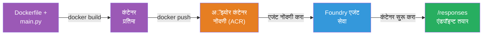
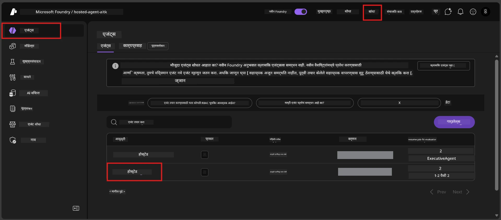

# Module 6 - Foundry एजंट सेवा मध्ये तैनाती करा

या मोड्यूलमध्ये, तुम्ही तुमचा स्थानिक चाचणी केलेला एजंट Microsoft Foundry मध्ये [**Hosted Agent**](https://learn.microsoft.com/azure/foundry/agents/concepts/hosted-agents) म्हणून तैनात करता. तैनाती प्रक्रिया तुमच्या प्रोजेक्टमधून Docker कंटेनर इमेज तयार करते, ती [Azure Container Registry (ACR)](https://learn.microsoft.com/azure/container-registry/container-registry-intro) मध्ये पुश करते, आणि [Foundry Agent Service](https://learn.microsoft.com/azure/foundry/agents/overview) मध्ये एक होस्टेड एजंट आवृत्ती तयार करते.

### तैनाती पाईपलाइन


---

## गरजा तपासा

तैनात करण्यापूर्वी, खालील प्रत्येक आयटम सत्यापित करा. हे वगळणे तैनाती अपयशाचे सर्वात सामान्य कारण आहे.

1. **एजंट स्थानिक स्मोक चाचण्या पास करतो:**
   - तुम्ही [Module 5](05-test-locally.md) मध्ये 4 चाचण्या पूर्ण केल्या आहेत आणि एजंट योग्यरित्या प्रतिसाद दिला आहे.

2. **तुमच्याकडे [Azure AI User](https://learn.microsoft.com/azure/foundry/concepts/rbac-foundry#built-in-roles) भूमिका आहे:**
   - हे [Module 2, Step 3](02-create-foundry-project.md) मध्ये दिले गेले होते. जर खात्री नसेल, आता तपासा:
   - Azure पोर्टल → तुमचा Foundry **प्रोजेक्ट** संसाधन → **Access control (IAM)** → **Role assignments** टॅब → तुमचे नाव शोधा → खात्री करा की **Azure AI User** यादीत आहे.

3. **तुम्ही VS Code मध्ये Azure मध्ये साइन इन आहात:**
   - VS Code च्या खाली-डाव्या कोपऱ्यातील Accounts आयकॉन तपासा. तुमचे खाते नाव दिसले पाहिजे.

4. **(ऐच्छिक) Docker Desktop चालू आहे:**
   - Docker फक्त तेव्हा आवश्यक आहे जेव्हा Foundry विस्तार तुम्हाला स्थानिक बिल्डसाठी विचारतो. बहुतेक प्रकरणांत, विस्तार तैनाती दरम्यान कंटेनर बिल्ड आपोआप हाताळतो.
   - जर Docker इन्स्टॉल केले असेल, तर तो चालू आहे का ते तपासा: `docker info`

---

## टप्पा 1: तैनाती सुरू करा

तुमच्याकडे तैनाती करण्याचे दोन मार्ग आहेत - दोन्ही एकाच निकालाकडे नेतात.

### पर्याय A: Agent Inspector मधून तैनात करा (शिफारसीय)

जर तुम्ही debugger (F5) सह एजंट चालवत असाल आणि Agent Inspector उघडा असेल:

1. Agent Inspector पॅनेलच्या **वरच्या उजव्या कोपऱ्यात** पहा.
2. **Deploy** बटणावर क्लिक करा (मेघाची प्रतिमा ज्यात वरच्या दिशेने बाण ↑ आहे).
3. तैनाती विजार्ड उघडेल.

### पर्याय B: Command Palette मधून तैनात करा

1. `Ctrl+Shift+P` दाबा **Command Palette** उघडण्यासाठी.
2. टाइप करा: **Microsoft Foundry: Deploy Hosted Agent** आणि त्यावर क्लिक करा.
3. तैनाती विजार्ड उघडेल.

---

## टप्पा 2: तैनाती सानुकूलित करा

तैनाती विजार्ड तुम्हाला कॉन्फिगर करण्यासाठी मार्गदर्शन करतो. प्रत्येक प्रम्प्ट भरा:

### 2.1 लक्ष्य प्रोजेक्ट निवडा

1. एक ड्रॉपडाऊन तुमच्या Foundry प्रोजेक्ट्स दाखवते.
2. Module 2 मध्ये तयार केलेला प्रोजेक्ट निवडा (उदा., `workshop-agents`).

### 2.2 कंटेनर एजंट फाइल निवडा

1. तुम्हाला एजंट एन्ट्री पॉईंट निवडायला सांगितले जाईल.
2. निवडा **`main.py`** (Python) - ही फाइल विजार्ड तुमचा एजंट प्रोजेक्ट ओळखण्यासाठी वापरतो.

### 2.3 संसाधने कॉन्फिगर करा

| सेटिंग | शिफारस केलेली किंमत | टीपा |
|---------|---------------------|-------|
| **CPU** | `0.25` | डीफॉल्ट, कार्यशाळेसाठी पुरेसे. उत्पादन कार्यभारांसाठी वाढवा |
| **Memory** | `0.5Gi` | डीफॉल्ट, कार्यशाळेसाठी पुरेसे |

हे `agent.yaml` मधील किमतीशी जुळतात. तुम्ही डीफॉल्ट स्वीकारू शकता.

---

## टप्पा 3: पुष्टी करा आणि तैनात करा

1. विजार्ड तैनाती सारांश दर्शवतो ज्यात:
   - लक्ष्य प्रोजेक्टचे नाव
   - एजंटचे नाव (`agent.yaml` मधून)
   - कंटेनर फाइल आणि संसाधने
2. सारांश तपासा आणि **Confirm and Deploy** (किंवा **Deploy**) क्लिक करा.
3. प्रगती VS Code मध्ये पाहा.

### तैनाती दरम्यान काय होते (टप्प्याटप्प्याने)

तैनाती ही एक बहु-टप्प्याची प्रक्रिया आहे. VS Code चा **Output** पॅनेल पाहा (ड्रॉपडाऊनमधून "Microsoft Foundry" निवडा) आणि तपासा:

1. **Docker build** - VS Code तुमच्या `Dockerfile` मधून Docker कंटेनर इमेज तयार करतो. तुम्हाला Docker लेयर मेसेजेस दिसतील:
   ```
   Step 1/6 : FROM python:<version>-slim
   Step 2/6 : WORKDIR /app
   ...
   Successfully built abc123def456
   ```

2. **Docker push** - इमेज Foundry प्रोजेक्टशी संबंधित **Azure Container Registry (ACR)** मध्ये पुश केली जाते. पहिल्या तैनातीत हे 1-3 मिनिटे लागू शकतात (बेस इमेज >100MB आहे).

3. **एजंट नोंदणी** - Foundry Agent Service नवीन होस्टेड एजंट तयार करतो (किंवा जर एजंट आधीच अस्तित्वात असेल तर नवीन आवृत्ती). `agent.yaml` मधील एजंट मेटाडेटा वापरला जातो.

4. **कंटेनर सुरू** - कंटेनर Foundry च्या व्यवस्थापित पायाभूत सुविधा मध्ये सुरू होतो. प्लॅटफॉर्म एक [सिस्टम-व्यवस्थापित ओळख](https://learn.microsoft.com/azure/foundry/agents/concepts/agent-identity) असाइन करतो आणि `/responses` एंडपॉइंट उघडतो.

> **पहिली तैनात हळू असते** (Docker सर्व लेयर्स पुश करते). नंतरच्या तैनाती वेगवान असतात कारण Docker कॅश केलेल्या लेयर्सचा वापर करतो.

---

## टप्पा 4: तैनाती स्थिती तपासा

तैनाती आदेश पूर्ण झाल्यानंतर:

1. Activity Bar मधील Foundry आयकॉन क्लिक करून **Microsoft Foundry** साइडबार उघडा.
2. तुमच्या प्रोजेक्टखालील **Hosted Agents (Preview)** विभाग विस्तारा.
3. तुमचा एजंट नाव दिसेल (उदा., `ExecutiveAgent` किंवा `agent.yaml` मधील नाव).
4. **एजंट नावावर क्लिक करा** ते विस्तारित करण्यासाठी.
5. तुम्हाला एक किंवा अधिक **आवृत्त्या** दिसतील (उदा., `v1`).
6. आवृत्तीवर क्लिक करा जेणेकरून **Container Details** दिसतील.
7. **Status** फील्ड तपासा:

   | स्थिती | अर्थ |
   |--------|--------|
   | **Started** किंवा **Running** | कंटेनर चालू आहे आणि एजंट तयार आहे |
   | **Pending** | कंटेनर सुरू होत आहे (30-60 सेकंद थांबा) |
   | **Failed** | कंटेनर सुरू झाला नाही (लॉग्स तपासा - खाली ट्रबलशूटिंग पहा) |



> **जर "Pending" 2 मिनिटांपेक्षा जास्त दिसत असेल:** कंटेनर बेस इमेज पुल करत असू शकतो. थोडं अधिक थांबा. जर ते तशाच अवस्थेत राहिले, तर कंटेनर लॉग्स तपासा.

---

## सामान्य तैनाती त्रुटी आणि उपाय

### त्रुटी 1: परवानगी नाकारली - `agents/write`

```
Error: lacks the required data action 
Microsoft.CognitiveServices/accounts/AIServices/agents/write 
to perform POST /api/projects/{projectName}/assistants operation.
```

**मुळ कारण:** तुमच्याकडे **प्रोजेक्ट** पातळीवर `Azure AI User` भूमिका नाही.

**उपाय टप्प्याटप्प्याने:**

1. [https://portal.azure.com](https://portal.azure.com) उघडा.
2. शोधा तुमचा Foundry **प्रोजेक्ट** नाव आणि त्यावर क्लिक करा.
   - **महत्त्वाचे:** खात्री करा की तुम्ही **प्रोजेक्ट** संसाधनावर आहात (टाइप: "Microsoft Foundry project"), वडल खाते/हब संसाधन नाही.
3. डाव्या नेव्हिगेशनमध्ये, **Access control (IAM)** क्लिक करा.
4. **+ Add** → **Add role assignment** क्लिक करा.
5. **Role** टॅबमध्ये [**Azure AI User**](https://learn.microsoft.com/azure/foundry/concepts/rbac-foundry#built-in-roles) शोधा आणि निवडा. **Next** क्लिक करा.
6. **Members** टॅबमध्ये, **User, group, or service principal** निवडा.
7. **+ Select members** क्लिक करा, तुमचं नाव/ईमेल शोधा, स्वतःला निवडा, **Select** क्लिक करा.
8. **Review + assign** → पुन्हा **Review + assign** क्लिक करा.
9. भूमिका लागू होण्यासाठी 1-2 मिनिटे थांबा.
10. टप्पा 1 मधून तैनाती पुन्हा करा.

> भूमिका **प्रोजेक्ट** स्कोपवर असावी, केवळ खाते स्कोपवर नाही. ही तैनाती अपयशाची सर्वात सामान्य कारणे आहे.

### त्रुटी 2: Docker सुरू नाही

```
Error: Docker build failed / Cannot connect to Docker daemon
```

**उपाय:**
1. Docker Desktop सुरू करा (तुमच्या Start मेन्यू किंवा सिस्टिम ट्रेमध्ये शोधा).
2. "Docker Desktop is running" दिसेपर्यंत थांबा (30-60 सेकंद).
3. तपासा: टर्मिनलमध्ये `docker info` चालवा.
4. **Windows साठी:** Docker Desktop सेटिंग्ज → **General** → **Use the WSL 2 based engine** सक्षम आहे का तपासा.
5. तैनात करण्याचा प्रयत्न पुन्हा करा.

### त्रुटी 3: ACR अधिकृतता - `AcrPullUnauthorized`

```
Error: AcrPullUnauthorized
```

**मुळ कारण:** Foundry प्रोजेक्टची व्यवस्थापित ओळख कंटेनर रजिस्ट्रीवर पुल करण्याचा अधिकार नाही.

**उपाय:**
1. Azure पोर्टलमध्ये, आपल्या **[Container Registry](https://learn.microsoft.com/azure/container-registry/container-registry-intro)** (तीच रिसोर्स ग्रुप जिथे Foundry आहे) कडे जा.
2. **Access control (IAM)** → **Add** → **Add role assignment** वर जा.
3. **[AcrPull](https://learn.microsoft.com/azure/container-registry/container-registry-roles)** भूमिका निवडा.
4. Members अंतर्गत, **Managed identity** निवडा → Foundry प्रोजेक्टची व्यवस्थापित ओळख शोधा.
5. **Review + assign** करा.

> Foundry एक्सटेंशन सहसा हे आपोआप सेट करते. जर तुम्हाला ही त्रुटी दिसली, तर स्वयंचलित सेटअप अयशस्वी झाला असू शकतो.

### त्रुटी 4: कंटेनर प्लॅटफॉर्म विसंगती (Apple Silicon)

जर Apple Silicon Mac (M1/M2/M3) पासून तैनात करत असाल, कंटेनर `linux/amd64` साठी तयार केला पाहिजे:

```bash
docker build --platform linux/amd64 -t myagent:v1 .
```

> Foundry विस्तार बहुसंख्य वापरकर्त्यांसाठी हे आपोआप हाताळतो.

---

### चेकपॉइंट

- [ ] VS Code मध्ये तैनाती आदेश त्रुटीशिवाय पूर्ण झाला
- [ ] Foundry साइडबारमध्ये **Hosted Agents (Preview)** खाली एजंट दिसतो
- [ ] तुम्ही एजंट क्लिक केला → आवृत्ती निवडली → **Container Details** पाहिले
- [ ] कंटेनर स्थिती **Started** किंवा **Running** दर्शविते
- [ ] (जर त्रुटी आल्या) तुम्ही त्रुटी ओळखली, उपाय केला, आणि यशस्वीरित्या पुन्हा तैनात केले

---

**मागील:** [05 - Test Locally](05-test-locally.md) · **पुढील:** [07 - Verify in Playground →](07-verify-in-playground.md)

---

<!-- CO-OP TRANSLATOR DISCLAIMER START -->
**अस्वीकरण**:
हा दस्तऐवज AI अनुवाद सेवा [Co-op Translator](https://github.com/Azure/co-op-translator) वापरून अनुवादित केला आहे. आम्ही अचूकतेसाठी प्रयत्न करतो, तरीही कृपया लक्षात घ्या की स्वयंचलित अनुवादांमध्ये चुका किंवा अचूकतेचे अभाव असू शकतात. मूळ दस्तऐवज त्याच्या मूळ भाषेतच अधिकृत स्रोत मानला पाहिजे. महत्त्वाच्या माहितीसाठी व्यावसायिक मानवी अनुवादाची शिफारस केली जाते. या अनुवादाच्या वापरामुळे उद्भवणाऱ्या कोणत्याही गैरसमजुतीं किंवा चुकीच्या अर्थसंगतीसाठी आम्ही जबाबदार आहोत असे समजू नयेत.
<!-- CO-OP TRANSLATOR DISCLAIMER END -->