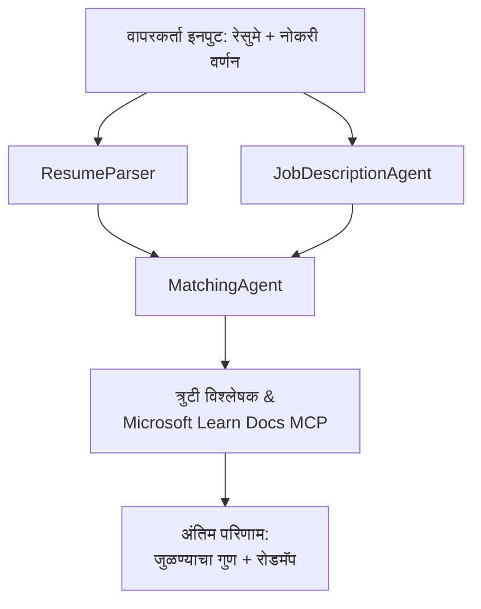

# PersonalCareerCopilot - Resume → Job Fit Evaluator

एक बहु-एजंट कार्यप्रवाह जो रिज्युमे एका नोकरीच्या वर्णनाशी कितपत जुळतो हे मोजतो, नंतर अंतर भरण्यासाठी वैयक्तिकृत शिक्षण रोडमॅप तयार करतो.

---

## एजंट

| एजंट | भूमिका | साधने |
|-------|------|-------|
| **ResumeParser** | रिज्युमे मजकूरातून संरचित कौशल्ये, अनुभव, प्रमाणपत्रे काढतो | - |
| **JobDescriptionAgent** | JD मधून आवश्यक/आवश्यक नसलेली कौशल्ये, अनुभव, प्रमाणपत्रे काढतो | - |
| **MatchingAgent** | प्रोफाइल व गरजा यांची तुलना करतो → फिट स्कोअर (0-100) + जुळणारी/गायब कौशल्ये | - |
| **GapAnalyzer** | Microsoft Learn संसाधनांसह वैयक्तिकृत शिक्षण रोडमॅप तयार करतो | `search_microsoft_learn_for_plan` (MCP) |

## कार्यप्रवाह


---

## जलद प्रारंभ

### 1. वातावरण सेट करा

```powershell
cd workshop\lab02-multi-agent\PersonalCareerCopilot
python -m venv .venv
.\.venv\Scripts\Activate.ps1          # विंडोज पॉवरशेल
# स्रोत .venv/bin/activate            # macOS / लिनक्स
pip install -r requirements.txt
```

### 2. प्रमाणपत्रे कॉन्फिगर करा

उदाहरण env फाइल कॉपी करा आणि तुमच्या Foundry प्रोजेक्ट तपशील भरा:

```powershell
cp .env.example .env
```

`.env` संपादित करा:

```env
PROJECT_ENDPOINT=https://<your-account>.services.ai.azure.com/api/projects/<your-project>
MODEL_DEPLOYMENT_NAME=gpt-4.1-mini
```

| मूल्य | कुठे शोधायचे |
|-------|-----------------|
| `PROJECT_ENDPOINT` | VS Code मधील Microsoft Foundry साइडबार → तुमच्या प्रोजेक्टवर उजवीक्लिक करा → **Copy Project Endpoint** |
| `MODEL_DEPLOYMENT_NAME` | Foundry साइडबार → प्रोजेक्ट विस्तृत करा → **Models + endpoints** → डिप्लॉयमेंट नाव |

### 3. स्थानिकपणे चालवा

```powershell
python -m debugpy --listen 127.0.0.1:5679 -m agentdev run main.py --verbose --port 8088
```

किंवा VS Code टास्क वापरा: `Ctrl+Shift+P` → **Tasks: Run Task** → **Run Lab02 HTTP Server**.

### 4. एजंट इंस्पेक्टरसह चाचणी करा

एजंट इंस्पेक्टर उघडा: `Ctrl+Shift+P` → **Foundry Toolkit: Open Agent Inspector**.

हा चाचणी प्रॉम्प्ट पेस्ट करा:

```
Resume:
Jane Doe
Senior Software Engineer with 5 years of experience in Python, Django, and AWS.
Built microservices handling 10K+ requests/second. Led a team of 4 developers.
Certifications: AWS Solutions Architect Associate.
Education: B.S. Computer Science, State University.

Job Description:
Senior Cloud Engineer at Contoso Ltd.
Required: Python, Azure, Kubernetes, Terraform, CI/CD pipelines.
Preferred: Go, monitoring (Prometheus/Grafana), cost optimization.
Experience: 5+ years in cloud infrastructure.
Certifications: Azure Solutions Architect Expert preferred.
```

**अपेक्षित:** फिट स्कोर (0-100), जुळणारी/गायब कौशल्ये, आणि Microsoft Learn URL सहित वैयक्तिकृत शिक्षण रोडमॅप.

### 5. Foundry मध्ये डिप्लॉय करा

`Ctrl+Shift+P` → **Microsoft Foundry: Deploy Hosted Agent** → तुमचा प्रोजेक्ट निवडा → पुष्टी करा.

---

## प्रोजेक्ट संरचना

```
PersonalCareerCopilot/
├── .env.example        ← Template for environment variables
├── .env                ← Your credentials (git-ignored)
├── agent.yaml          ← Hosted agent definition (name, resources, env vars)
├── Dockerfile          ← Container image for Foundry deployment
├── main.py             ← 4-agent workflow (instructions, MCP tool, WorkflowBuilder)
└── requirements.txt    ← Python dependencies
```

## प्रमुख फाईल्स

### `agent.yaml`

Foundry Agent Service साठी होस्टेड एजंट परिभाषित करतो:
- `kind: hosted` - व्यवस्थापित कंटेनर म्हणून चालवतो
- `protocols: [responses v1]` - `/responses` HTTP एंडपॉइंट एक्सपोज करतो
- `environment_variables` - `PROJECT_ENDPOINT` आणि `MODEL_DEPLOYMENT_NAME` डिप्लॉय वेळेस इन्जेक्ट होतात

### `main.py`

यामध्ये आहे:
- **एजंट सूचना** - चार `*_INSTRUCTIONS` स्थिरांक, प्रत्येक एजंटसाठी एक
- **MCP साधन** - `search_microsoft_learn_for_plan()` हे Streamable HTTP द्वारे `https://learn.microsoft.com/api/mcp` कॉल करते
- **एजंट निर्मिती** - `create_agents()` कोंटेक्स्ट मॅनेजर `AzureAIAgentClient.as_agent()` वापरतो
- **कार्यप्रवाह ग्राफ** - `create_workflow()` `WorkflowBuilder` वापरून एजंट्सना फॅन-आउट/फॅन-इन/क्रमिक पॅटर्नसह वायर करतो
- **सर्व्हर सुरूवात** - `from_agent_framework(agent).run_async()` पोर्ट 8088 वर

### `requirements.txt`

| पॅकेज | आवृत्ती | उद्देश्य |
|---------|---------|---------|
| `agent-framework-azure-ai` | `1.0.0rc3` | Microsoft Agent Framework साठी Azure AI एकत्रीकरण |
| `agent-framework-core` | `1.0.0rc3` | कोअर रनटाइम (WorkflowBuilder समाविष्ट) |
| `azure-ai-agentserver-agentframework` | `1.0.0b16` | होस्टेड एजंट सर्व्हर रनटाइम |
| `azure-ai-agentserver-core` | `1.0.0b16` | कोअर एजंट सर्व्हर अमूर्तता |
| `debugpy` | नवीनतम | Python डिबगिंग (VS Code मध्ये F5) |
| `agent-dev-cli` | `--pre` | स्थानिक डेव्ह CLI + एजंट इंस्पेक्टर बॅकएंड |

---

## समस्या निवारण

| समस्या | निराकरण |
|-------|-----|
| `RuntimeError: Missing required environment variable(s)` | `.env` तयार करा ज्यात `PROJECT_ENDPOINT` आणि `MODEL_DEPLOYMENT_NAME` असतील |
| `ModuleNotFoundError: No module named 'agent_framework'` | व्हर्च्युअल एन्व्हायर्नमेंट सक्रिय करून `pip install -r requirements.txt` चालवा |
| आउटपुटमध्ये Microsoft Learn URLs नाहीत | `https://learn.microsoft.com/api/mcp` यात इंटरनेट कनेक्टिव्हिटी तपासा |
| फक्त 1 गॅप कार्ड दिसते (छाटलेली) | खात्री करा की `GAP_ANALYZER_INSTRUCTIONS` मध्ये `CRITICAL:` ब्लॉक समाविष्ट आहे |
| पोर्ट 8088 वापरात आहे | इतर सर्व्हर थांबवा: `netstat -ano \| findstr :8088` |

सविस्तर समस्या निवारणासाठी पहा [Module 8 - Troubleshooting](../docs/08-troubleshooting.md).

---

**संपूर्ण मार्गदर्शक:** [Lab 02 Docs](../docs/README.md) · **मागे जा:** [Lab 02 README](../README.md) · [कार्यशाळा मुख्यपृष्ठ](../../../README.md)

---

<!-- CO-OP TRANSLATOR DISCLAIMER START -->
**अस्वीकरण**:
हा दस्तऐवज AI भाषांतर सेवा [Co-op Translator](https://github.com/Azure/co-op-translator) वापरून भाषांतरित केला आहे. आम्ही अचूकतेसाठी प्रयत्न करतो, तरीही कृपया लक्षात ठेवा की स्वयंचलित भाषांतरात चुका किंवा अचूकतेतील त्रुटी असू शकतात. मूळ दस्तऐवज त्याच्या स्थानिक भाषेत अधिकृत स्रोत मानला पाहिजे. महत्त्वाच्या माहितीसाठी व्यावसायिक मानवी भाषांतराचे शिफारस केली जाते. या भाषांतराच्या वापरामुळे उद्भवलेल्या कोणत्याही गैरसमजुती किंवा चुकीच्या अर्थव्यवस्थेसाठी आम्ही जबाबदार नाही.
<!-- CO-OP TRANSLATOR DISCLAIMER END -->