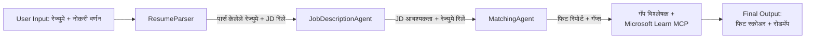

# PersonalCareerCopilot - रिज्युमे → नोकरीशी जुळणी मूल्यांकन करणारा

एक वर्कफ्लो-प्रथम मल्टी-एजंट अ‍ॅप जो रिज्युमे नोकरीच्या वर्णनाशी किती चांगला जुळतो हे मूल्यांकन करतो, नंतर अंतर भरण्यासाठी वैयक्तिकृत शिक्षण रोडमॅप तयार करतो.

---

## एजंट्स

| एजंट | भूमिका | साधने |
|-------|------|-------|
| **ResumeParser** | रिज्युमे मजकूरातून संरचित कौशल्ये, अनुभव, प्रमाणपत्रे काढतो | - |
| **JobDescriptionAgent** | एका JD मधून आवश्यक/प्राथमिक कौशल्ये, अनुभव, प्रमाणपत्रे काढतो | - |
| **MatchingAgent** | प्रोफाइल विरुद्ध आवश्यकता तुलना करतो → जुळणी गुणांकन (0-100) + जुळलेली/गायब कौशल्ये | - |
| **GapAnalyzer** | Microsoft Learn संसाधनांसह वैयक्तिकृत शिक्षण रोडमॅप तयार करतो | `search_microsoft_learn_for_plan` (MCP) |

## वर्कफ्लो


```mermaid
flowchart LR
    UserInput["User Input: रेज्युमे + नोकरी वर्णन"] --> ResumeParser
    ResumeParser -- "पार्स केलेले रेज्युमे + JD रिले" --> JobDescriptionAgent
    JobDescriptionAgent -- "JD आवश्यकता + रेज्युमे रिले" --> MatchingAgent
    MatchingAgent -- "फिट रिपोर्ट + गॅप्स" --> GapAnalyzerMCP["गॅप विश्लेषक +\nMicrosoft Learn MCP"]
    GapAnalyzerMCP --> FinalOutput["Final Output:\nफिट स्कोअर + रोडमॅप"]
```

---

## जलद सुरूवात

### 1. पर्यावरण सेट करा

हा फोल्डर वर्कफ्लो-आधारित Lab 02 स्कॅफोल्डसाठी संदर्भ अंमलबजावणी आहे. याचे `main.py` विद्यमान प्रॉम्प्ट ब्लॉक्स आणि `WorkflowBuilder` वापरून चार एजंट्स एकत्र जोडतो.

```powershell
cd workshop\lab02-multi-agent\PersonalCareerCopilot
python -m venv .venv
.\.venv\Scripts\Activate.ps1          # Windows PowerShell
# source .venv/bin/activate            # macOS / Linux
pip install -r requirements.txt
```

### 2. क्रेडेंशियल्स कॉन्फिगर करा

या फोल्डरमध्ये `.env` फाइल तयार करा:

```powershell
copy .env .env.bak 2>$null; echo $null > .env
```

`.env` संपादित करा:

```env
FOUNDRY_PROJECT_ENDPOINT=https://<your-account>.services.ai.azure.com/api/projects/<your-project>
AZURE_AI_MODEL_DEPLOYMENT_NAME=gpt-4.1-mini
```

| मूल्य | कुठे शोधायचे |
|-------|------------------|
| `FOUNDRY_PROJECT_ENDPOINT` | Foundry Toolkit साइडबार → आपल्या प्रोजेक्टवर उजवे-क्लिक करा → **Copy Project Endpoint** |
| `AZURE_AI_MODEL_DEPLOYMENT_NAME` | Foundry साइडबार → प्रोजेक्ट विस्तृत करा → **Models + endpoints** → तैनातीचे नाव |

### 3. स्थानिकरित्या चालवा

```powershell
python -m debugpy --listen 127.0.0.1:5679 main.py --port 8088
```

किंवा VS कोड टास्क वापरा: `Ctrl+Shift+P` → **Tasks: Run Task** → **Run Agent HTTP Server**.

F5 डिबगिंगसाठी, वापरा **Debug Local Agent HTTP Server**.

### 4. Agent Inspector सह तपासा

Agent Inspector उघडा: `Ctrl+Shift+P` → **Foundry Toolkit: Open Agent Inspector**.

हा तपास प्रॉम्प्ट पेस्ट करा:

```
Resume:
Jane Doe
Senior Software Engineer with 5 years of experience in Python, Django, and AWS.
Built microservices handling 10K+ requests/second. Led a team of 4 developers.
Certifications: AWS Solutions Architect Associate.
Education: B.S. Computer Science, State University.

Job Description:
Senior Cloud Engineer at Contoso Ltd.
Required: Python, Azure, Kubernetes, Terraform, CI/CD pipelines.
Preferred: Go, monitoring (Prometheus/Grafana), cost optimization.
Experience: 5+ years in cloud infrastructure.
Certifications: Azure Solutions Architect Expert preferred.
```

**अपेक्षित:** एक जुळणी गुणांकन (0-100), जुळलेली/गायब कौशल्ये, आणि Microsoft Learn URLs सह वैयक्तिकृत शिक्षण रोडमॅप.

### 5. Foundry मध्ये तैनात करा

`Ctrl+Shift+P` → **Foundry Toolkit: Deploy Hosted Agent** → आपला प्रोजेक्ट निवडा → पुष्टी करा.

---

## प्रोजेक्ट संरचना

```
PersonalCareerCopilot/
├── .env                ← Your credentials (git-ignored)
├── agent.yaml          ← Hosted agent definition (name, resources, env vars)
├── Dockerfile          ← Container image for Foundry deployment
├── main.py             ← 4-agent workflow (instructions, MCP tool, WorkflowBuilder)
└── requirements.txt    ← Python dependencies
```

## मुख्य फाइल्स

### `agent.yaml`

Foundry Agent Service साठी होस्टेड एजंट निश्चित करते:
- `kind: hosted` - एक व्यवस्थापित कंटेनर म्हणून चालतो
- `protocols` - `responses` प्रोटोकॉलसह `version: 1.0.0`, `/responses` HTTP एंडपॉइंट उघडतो
- `environment_variables` - `AZURE_AI_MODEL_DEPLOYMENT_NAME` येथे घोषित; `FOUNDRY_PROJECT_ENDPOINT` तैनाती वेळी स्वयंचलितपणे इंजेक्ट केला जातो

### `main.py`

यात समाविष्ट आहे:
- **एजंट सूचना** - चार `*_INSTRUCTIONS` स्थिरांक, प्रत्येक एजंटसाठी एक
- **MCP साधन** - `search_microsoft_learn_for_plan()` `https://learn.microsoft.com/api/mcp` ला Streamable HTTP द्वारे कॉल करतो
- **एजंट निर्मिती** - चार `Agent()` + `AgentExecutor()` उदाहरणे जी एक `FoundryChatClient` शेअर करतात
- **वर्कफ्लो ग्राफ** - `WorkflowBuilder` एजंट्सना अनुक्रमिक पाईपलाईन म्हणून जोडतो: ResumeParser → JD Agent → MatchingAgent → GapAnalyzer
- **सर्व्हर सुरूवात** - `ResponsesHostServer` पोर्ट 8088 वर चालतो

### `requirements.txt`

| पॅकेज | उद्देश |
|---------|----------|
| `agent-framework-foundry` | मुख्य रनटाइम: `Agent`, `AgentExecutor`, `WorkflowBuilder`, `@tool`, `FoundryChatClient` |
| `agent-framework-foundry-hosting` | `ResponsesHostServer` + Foundry होस्टिंग इंटिग्रेशन |
| `mcp<2,>=1.24.0` | GapAnalyzer साठी MCP क्लायंट (`streamable_http_client`) |
| `debugpy` | Python डिबगिंग (VS कोड मध्ये F5) |

---

## त्रुटी निराकरण

| समस्या | निराकरण |
|-------|-----|
| `KeyError: 'FOUNDRY_PROJECT_ENDPOINT'` किंवा `KeyError: 'AZURE_AI_MODEL_DEPLOYMENT_NAME'` | `.env` तयार करा ज्यात दोन्ही `FOUNDRY_PROJECT_ENDPOINT` आणि `AZURE_AI_MODEL_DEPLOYMENT_NAME` सेट केलेले असतील |
| `ModuleNotFoundError: No module named 'agent_framework'` | वर्चुअल एन्व्हायर्नमेंट सक्रिय करा आणि `pip install -r requirements.txt` चालवा |
| आउटपुटमध्ये Microsoft Learn URLs नाहीत | `https://learn.microsoft.com/api/mcp` कडे इंटरनेट कनेक्टिव्हिटी तपासा |
| फक्त 1 गॅप कार्ड (कपातलेले) | खात्री करा की `GAP_ANALYZER_INSTRUCTIONS` मध्ये `CRITICAL:` ब्लॉक समाविष्ट आहे |
| पोर्ट 8088 वापरात आहे | इतर सर्व्हर थांबवा: `netstat -ano \| findstr :8088` |

तपशीलवार त्रुटी निराकरणासाठी, पहा [Module 8 - Troubleshooting](../docs/08-troubleshooting.md).

---

**पूर्ण मार्गदर्शन:** [Lab 02 Docs](../docs/README.md) · **मागे जा:** [Lab 02 README](../README.md) · [कार्यशाळा होम](../../../README.md)

---

<!-- CO-OP TRANSLATOR DISCLAIMER START -->
**अस्वीकरण**:
हा दस्तऐवज AI भाषांतर सेवा [Co-op Translator](https://github.com/Azure/co-op-translator) चा वापर करून अनुवादित केला आहे. जरी आम्ही अचूकतेसाठी प्रयत्न करतो, तरी कृपया लक्षात घ्या की स्वयंचलित भाषांतरांमध्ये त्रुटी किंवा अचूकतेची कमतरता असू शकते. मूळ दस्तऐवज त्याच्या मूळ भाषेत अधिकृत स्रोत मानला पाहिजे. महत्त्वाची माहिती असल्यास, व्यावसायिक मानवी भाषांतराची शिफारस केली जाते. या भाषांतराच्या वापरामुळे उद्भवणाऱ्या कोणत्याही गैरसमज किंवा चुकीच्या अर्थलावणीसाठी आम्ही जबाबदार नाही.
<!-- CO-OP TRANSLATOR DISCLAIMER END -->