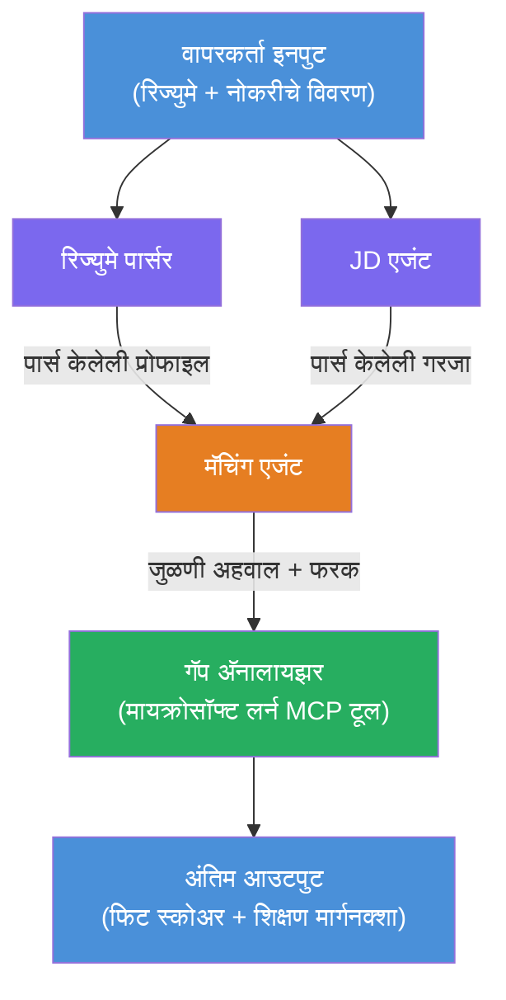

# Lab 02 - मल्टी-एजंट वर्कफ्लो: रेस्यूमे → नोकरी सुसंगतता मूल्यांकनकर्ता

---

## तुम्ही काय तयार कराल

एक **रेस्यूमे → नोकरी सुसंगतता मूल्यांकनकर्ता** - एक मल्टी-एजंट वर्कफ्लो जिथे चार तज्ञ एजंट एकत्रितपणे उमेदवाराच्या रेस्यूमेची नोकरीच्या वर्णनाशी किती चांगली जुळणूक होते हे मूल्यांकन करतात, आणि मग अंतर भरण्यासाठी वैयक्तिकृत शिकण्याची रोडमॅप तयार करतात.

### एजंट

| एजंट | भूमिका |
|-------|---------|
| **रेस्यूमे पार्सर** | रेस्यूमे मजकुरातून संरचित कौशल्ये, अनुभव, प्रमाणपत्रे काढतो |
| **नोकरी वर्णन एजंट** | JD मधून आवश्यक/अग्रिम कौशल्ये, अनुभव, प्रमाणपत्रे काढतो |
| **साम्य एजंट** | प्रोफाइल व गरजा तुलना करतो → फिट स्कोअर (0-100) + जुळलेल्या/गायब कौशल्यांचा तपशील |
| **अंतर विश्लेषक** | साधनांसह, कालमर्यादा आणि जलद यश प्रकल्पांसह वैयक्तिकृत शिकण्याची रोडमॅप तयार करतो |

### डेमो प्रवाह

**रेस्यूमे + नोकरी वर्णन** अपलोड करा → **फिट स्कोअर + गायब कौशल्ये** मिळवा → **वैयक्तिकृत शिकण्याची रोडमॅप** प्राप्त करा.

### वर्कफ्लो आर्किटेक्चर

> जांभळा = समांतर एजंट | संत्ररंगी = संकलन बिंदू | हिरवा = टूलसह अंतिम एजंट. तपशीलवार नकाशे आणि डेटा प्रवाहासाठी [Module 1 - Understand the Architecture](docs/01-understand-multi-agent.md) आणि [Module 4 - Orchestration Patterns](docs/04-orchestration-patterns.md) पहा.

### कव्हर केलेले विषय

- **WorkflowBuilder** वापरून मल्टी-एजंट वर्कफ्लो तयार करणे
- एजंट भूमिका आणि ऑर्केस्ट्रेशन प्रवाह (समांतर + अनुक्रमिक) परिभाषित करणे
- एजंट-एजंट संप्रेषण पॅटर्न्स
- एजंट इन्स्पेक्टरसह स्थानिक चाचणी
- फाउंड्री एजंट सेवा वर मल्टी-एजंट वर्कफ्लो तैनात करणे

---

## पूर्वापेक्षा

सर्वप्रथम Lab 01 पूर्ण करा:

- [Lab 01 - Single Agent](../lab01-single-agent/README.md)

---

## प्रारंभ करा

पूर्ण सेटअप सूचना, कोड मार्गदर्शन, आणि चाचणी आदेशांसाठी पहा:

- [Lab 2 Docs - Prerequisites](docs/00-prerequisites.md)
- [Lab 2 Docs - Full Learning Path](docs/README.md)
- [PersonalCareerCopilot run guide](PersonalCareerCopilot/README.md)

## ऑर्केस्ट्रेशन पॅटर्न्स (एजंटिक विकल्पे)

Lab 2 मध्ये डीफॉल्ट **समांतर → संकलक → नियोजक** प्रवाह आहे, आणि दस्तऐवजांमध्ये आणखी पर्यायी पॅटर्न दिले आहेत जे अधिक एजंटिक वर्तन दाखवतात:

- **वजनित सहमतीसह फॅन-आउट/फॅन-इन**
- **अंतिम रोडमॅपपूर्वी पुनरावलोकक/समीक्षक पस**
- **शर्तीवर आधारित राउटर** (फिट स्कोअर आणि गायब कौशल्यांवर आधारित मार्ग निवड)

[docs/04-orchestration-patterns.md](docs/04-orchestration-patterns.md) पहा.

---

**मागील:** [Lab 01 - Single Agent](../lab01-single-agent/README.md) · **परत:** [कार्यशाळा मुख्यपृष्ठ](../../README.md)

---

<!-- CO-OP TRANSLATOR DISCLAIMER START -->
**अस्वीकरण**:
हा दस्तऐवज AI अनुवाद सेवा [Co-op Translator](https://github.com/Azure/co-op-translator) वापरून अनुवादित केला आहे. आम्ही अचूकतेसाठी प्रयत्न करत असले तरी, कृपया लक्षात घ्या की स्वयंचलित अनुवादांमध्ये चुका किंवा अचूकतेत त्रुटी असू शकतात. मूळ दस्तऐवज त्याच्या स्थानिक भाषेत अधिकृत स्रोत मानला जावा. महत्त्वाच्या माहितीकरिता, व्यावसायिक मानवी अनुवाद शिफारस केला जातो. या अनुवादाच्या वापरामुळे झालेल्या कोणत्याही गैरसमजुती किंवा चुकीच्या अर्थलागी आम्ही जबाबदार आहोत असे नाही.
<!-- CO-OP TRANSLATOR DISCLAIMER END -->