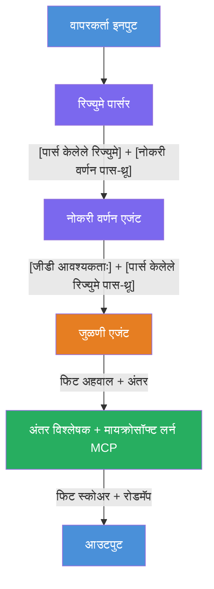

# लॅब ०२ - मल्टि-एजंट वर्कफ्लो: रेज्युमे → नोकरीसाठी योग्यतेचे मूल्यमापन

## आढावा

या हँड्स-ऑन लॅबमध्ये, तुम्ही VS कोडमधील Foundry Toolkit वापरून **वर्कफ्लो-प्रथम मल्टि-एजंट अ‍ॅप** तयार करून ते Microsoft Foundry Agent Service वर तैनात कराल.

**तुम्ही जे तयार कराल:** एक रेज्युमे → नोकरी योग्यतेचे मूल्यांकन करणारा अ‍ॅप जो रेज्युमे आणि नोकरीचे वर्णन पार्स करतो, जुळणीचे गुणांकन करतो, आणि Microsoft Learn स्रोतांचा वापर करून वैयक्तिकृत शिकण्याचा रोडमॅप तयार करतो.

---

## आर्किटेक्चर

```mermaid
flowchart TD
    A["वापरकर्ता इनपुट"] --> B["रिज्युमे पार्सर"]
    B -->|"[पार्स केलेले रिज्युमे] + [नोकरी वर्णन पास-थ्रू]"| C["नोकरी वर्णन एजंट"]
    C -->|"[जीडी आवश्यकताः] + [पार्स केलेले रिज्युमे पास-थ्रू]"| D["जुळणी एजंट"]
    D -->|फिट अहवाल + अंतर| E["अंतर विश्लेषक + मायक्रोसॉफ्ट लर्न MCP"]
    E -->|फिट स्कोअर + रोडमॅप| F["आउटपुट"]

    style A fill:#4A90D9,color:#fff
    style B fill:#7B68EE,color:#fff
    style C fill:#7B68EE,color:#fff
    style D fill:#E67E22,color:#fff
    style E fill:#27AE60,color:#fff
    style F fill:#4A90D9,color:#fff
```

**हे कसे कार्य करते:**
1. वापरकर्ता रेज्युमे आणि नोकरीचे वर्णन पेस्ट करतो.
2. **ResumeParser** रेज्युमे पार्स करतो आणि JD नेमके `[JOB DESCRIPTION PASS-THROUGH]` विभागात कॉपी करतो.
3. **JD Agent** पास-थ्रू मधून संरचित आवश्यकता काढतो, त्यानंतर `[PARSED RESUME]` पुढे `[PARSED RESUME PASS-THROUGH]` म्हणून पाठवतो.
4. **MatchingAgent** `[PARSED RESUME PASS-THROUGH]` आणि `[JD REQUIREMENTS]` यांची तुलना करतो आणि फिट स्कोर तयार करतो.
5. **GapAnalyzer** गॅप्सना प्रॅक्टिकल रोडमॅपमध्ये रूपांतरित करतो आणि MCP च्या माध्यमातून खऱ्या Microsoft Learn दुव्यांसाठी शोध घेतो.

---

## पूर्वतयारी

प्रथम लॅब ०१ पूर्ण करा:

- [Lab 01 - Single Agent](../lab01-single-agent/README.md)

---

## भाग १: मॉड्यूल्स क्रमाने वाचा

पूर्ण शिकण्याचा मार्ग येथे पहा:

- [Lab 2 Docs - Prerequisites](docs/00-prerequisites.md)
- [Lab 2 Docs - Full Learning Path](docs/README.md)
- [PersonalCareerCopilot run guide](PersonalCareerCopilot/README.md)

---

## भाग २: वर्कफ्लो तयार करा आणि तपासा

1. Foundry Toolkit विजार्डचा वापर करून वर्कफ्लो-आधारित प्रोजेक्ट स्कॅफोल्ड करा.
2. `PersonalCareerCopilot/main.py` मधील प्रॉम्प्ट ब्लॉक्स आणि वर्कफ्लो ग्राफ तुमच्या कार्यक्षेत्रात कॉपी करा.
3. एजंट इन्स्पेक्टरसह स्थानिकपणे चालवा आणि सर्व चार एजंट्स आणि MCP टूलची पडताळणी करा.
4. स्थानिक तपासणी पास झाल्यावर होस्टेड एजंट Foundry वर तैनात करा.

---

## समन्वय नमुने (Orchestration patterns)

लॅब ०२ मध्ये डीफॉल्ट **fan-out → fan-in → अनुक्रमिक** प्रवाह आहे, आणि दस्तऐवजांमध्ये प्रयोगांसाठी पर्यायी समन्वय नमुन्यांचे वर्णन देखील आहे.

- **भारित सहमतीसह Fan-out/Fan-in**
- **अंतिम रोडमॅपपूर्वी पुनरावलोकनकर्ता/टिका करणारा पास**
- **योग्यतेचा गुणांकन आणि गहाळ कौशल्यांवर आधारित अटीसंबंधी राउटर**

पहा [docs/04-orchestration-patterns.md](docs/04-orchestration-patterns.md).

---

**मागील:** [Lab 01 - Single Agent](../lab01-single-agent/README.md) · **परत जा:** [वर्कशॉप होम](../../README.md)

---

<!-- CO-OP TRANSLATOR DISCLAIMER START -->
**अस्वीकरण**:
हा दस्तऐवज AI भाषांतर सेवा [Co-op Translator](https://github.com/Azure/co-op-translator) चा वापर करून अनुवादित केला आहे. जरी आम्ही अचूकतेसाठी प्रयत्न करतो, तरी कृपया लक्षात घ्या की स्वयंचलित भाषांतरांमध्ये त्रुटी किंवा अचूकतेची कमतरता असू शकते. मूळ दस्तऐवज त्याच्या मूळ भाषेत अधिकृत स्रोत मानला पाहिजे. महत्त्वाची माहिती असल्यास, व्यावसायिक मानवी भाषांतराची शिफारस केली जाते. या भाषांतराच्या वापरामुळे उद्भवणाऱ्या कोणत्याही गैरसमज किंवा चुकीच्या अर्थलावणीसाठी आम्ही जबाबदार नाही.
<!-- CO-OP TRANSLATOR DISCLAIMER END -->