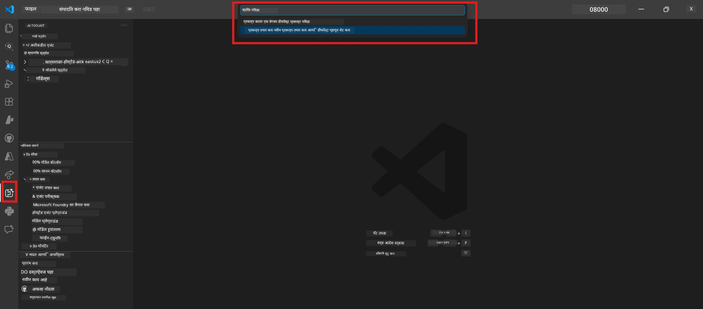

# Module 0 - आधीची तयारी

Lab 02 सुरु करण्यापूर्वी, खालील गोष्टी पूर्ण झाल्या असल्याची खात्री करा. हा लॅब थेट Lab 01 वर आधारित आहे - ते चुकवू नका.

---

## 1. Lab 01 पूर्ण करा

Lab 02 असे धरणे आहे की तुम्ही आधीच:

- [x] [Lab 01 - Single Agent](../../lab01-single-agent/README.md) मधील सर्व 8 मोड्यूल पूर्ण केले आहेत
- [x] Foundry Agent Service वर यशस्वीपणे एकल एजंट डिप्लॉय केला आहे
- [x] एजंट स्थानिक Agent Inspector आणि Foundry Playground मध्ये कार्यरत आहे याची पडताळणी केली आहे

जर तुम्ही Lab 01 पूर्ण केले नसेल, तर परत जा आणि ते आत्ता पूर्ण करा: [Lab 01 Docs](../../lab01-single-agent/docs/00-prerequisites.md)

---

## 2. विद्यमान सेटअपची पडताळणी करा

Lab 01 मधील सर्व साधने अद्याप स्थापित आणि कार्यरत असावीत. हे जलद तपासणी करा:

### 2.1 Azure CLI

```powershell
az account show --query "{name:name, id:id}" --output table
```

अपेक्षित: तुमचे सबस्क्रिप्शन नाव आणि आयडी दाखवते. हे अयशस्वी झाल्यास, [`az login`](https://learn.microsoft.com/cli/azure/authenticate-azure-cli-interactively) चालवा.

### 2.2 VS Code एक्सटेंशन्स

1. `Ctrl+Shift+P` दाबा → **"Microsoft Foundry"** टाइप करा → आदेश दिसत असल्याची पुष्टी करा (उदा., `Microsoft Foundry: Create a New Hosted Agent`).
2. `Ctrl+Shift+P` दाबा → **"Foundry Toolkit"** टाइप करा → आदेश दिसत असल्याची पुष्टी करा (उदा., `Foundry Toolkit: Open Agent Inspector`).

### 2.3 Foundry प्रोजेक्ट आणि मॉडेल

1. VS Code Activity Bar मध्ये **Microsoft Foundry** आयकॉन वर क्लिक करा.
2. तुमचा प्रोजेक्ट सूचीबद्ध आहे याची खात्री करा (उदा., `workshop-agents`).
3. प्रोजेक्ट विस्तार करा → डिप्लॉय केलेले मॉडेल अस्तित्वात आहे (उदा., `gpt-4.1-mini`) आणि स्थिती **Succeeded** आहे याची पडताळणी करा.

> **तुमचा मॉडेल डिप्लॉयमेंट एक्सपायर झाला असल्यास:** काही फ्री-टियर डिप्लॉयमेंट आपोआप एक्सपायर होतात. [मॉडेल कॅटलॉग](https://learn.microsoft.com/azure/foundry/foundry-models/concepts/models-sold-directly-by-azure) मधून पुनःडिप्लॉय करा (`Ctrl+Shift+P` → **Microsoft Foundry: Open Model Catalog**).



### 2.4 RBAC भूमिका

तुमच्याकडे Foundry प्रोजेक्टवर **Azure AI User** भूमिका आहे याची पडताळणी करा:

1. [Azure Portal](https://portal.azure.com) → तुमचा Foundry **प्रोजेक्ट** रिसोर्स → **Access control (IAM)** → **[Role assignments](https://learn.microsoft.com/azure/foundry/concepts/rbac-foundry)** टॅब.
2. तुमचे नाव शोधा → **[Azure AI User](https://aka.ms/foundry-ext-project-role)** सूचीबद्ध आहे याची पुष्टी करा.

---

## 3. बहु-एजंट संकल्पना समजून घ्या (Lab 02 साठी नवीन)

Lab 02 मध्ये Lab 01 मध्ये न समाविष्ट केलेल्या संकल्पना सहभागी आहेत. पुढे जाण्याआधी यांचे वाचन करा:

### 3.1 बहु-एजंट कार्यप्रवाह म्हणजे काय?

सर्व काही एका एजंटकडे न ठेवता, **बहु-एजंट कार्यप्रवाह** अनेक विशेषज्ञ एजंटमध्ये काम विभाजित करतो. प्रत्येक एजंटकडे:

- स्वतःच्या **सूचना** (सिस्टम प्रॉम्प्ट)
- स्वतःची **भूमिका** (त्या काय जबाबदार आहे)
- ऐच्छिक **साधने** (ज्या फंक्शन्स कॉल करू शकतात)

एजंट एकमेकांशी **ओर्केस्ट्रेशन ग्राफ** च्या माध्यमातून संवाद साधतात जे डेटाचा प्रवाह कसा असतो हे निश्चित करते.

### 3.2 WorkflowBuilder

`agent_framework` मधील [`WorkflowBuilder`](https://learn.microsoft.com/agent-framework/workflows/agents-in-workflows) वर्ग एजंट एकत्र कनेक्ट करणारा SDK घटक आहे:

```python
from agent_framework import WorkflowBuilder

workflow = (
    WorkflowBuilder(
        name="MyWorkflow",
        start_executor=agent_a,
        output_executors=[agent_d],
    )
    .add_edge(agent_a, agent_b)
    .add_edge(agent_a, agent_c)
    .add_edge(agent_b, agent_d)
    .add_edge(agent_c, agent_d)
    .build()
)
```

- **`start_executor`** - पहिला एजंट जो वापरकर्त्याचा इनपुट प्राप्त करतो
- **`output_executors`** - एजंट(स्) ज्यांचे आउटपुट अंतिम प्रतिसाद होते
- **`add_edge(source, target)`** - `target` ला `source` चा आउटपुट प्राप्त होतो असे परिभाषित करते

### 3.3 MCP (मॉडेल कॉन्टेक्स्ट प्रोटोकॉल) साधने

Lab 02 एक **MCP साधन** वापरते जे Microsoft Learn API कॉल करून शिक्षण संसाधने मिळवते. [MCP (Model Context Protocol)](https://modelcontextprotocol.io/introduction) हा AI मॉडेल्सना बाह्य डेटा स्रोत आणि साधनांशी जोडणारा एक प्रमाणित प्रोटोकॉल आहे.

| संज्ञा | परिभाषा |
|------|-----------|
| **MCP सर्व्हर** | [MCP प्रोटोकॉल](https://learn.microsoft.com/azure/foundry/agents/how-to/tools/model-context-protocol) द्वारे साधने/संसाधने एक्सपोज करणारी सेवा |
| **MCP क्लायंट** | तुमचा एजंट कोड जो MCP सर्व्हरशी जोडतो आणि त्याची साधने कॉल करतो |
| **[Streamable HTTP](https://learn.microsoft.com/agent-framework/agents/tools/hosted-mcp-tools)** | MCP सर्व्हरशी संवाद साधण्यासाठी वापरलेली ट्रान्सपोर्ट पद्धत |

### 3.4 Lab 02 आणि Lab 01 मधील फरक

| पैलू | Lab 01 (एकल एजंट) | Lab 02 (बहु-एजंट) |
|--------|----------------------|---------------------|
| एजंट्स | 1 | 4 (विशेषज्ञ भूमिका) |
| ओर्केस्ट्रेशन | नाही | WorkflowBuilder (पॅरालल + सिक्वेन्शियल) |
| साधने | ऐच्छिक `@tool` फंक्शन | MCP साधन (बाह्य API कॉल) |
| गुंतागुंत | साधा प्रॉम्प्ट → प्रतिसाद | Resume + JD → फिट स्कोअर → रोडमॅप |
| संदर्भ प्रवाह | थेट | एजंट-टू-एजंट हँडऑफ |

---

## 4. Lab 02 साठी वर्कशॉप रेपॉजिटरी रचना

Lab 02 फाइल्स कुठे आहेत हे नक्की करा:

```
workshop/
└── lab02-multi-agent/
    ├── README.md                       ← Lab overview
    ├── docs/                           ← You are here
    │   ├── README.md                   ← Learning path index
    │   ├── 00-prerequisites.md         ← This file
    │   ├── 01-understand-multi-agent.md
    │   ├── ...
    │   └── 08-troubleshooting.md
    └── PersonalCareerCopilot/          ← The agent project
        ├── agent.yaml                  ← Agent definition
        ├── main.py                     ← 4-agent workflow code
        ├── Dockerfile                  ← Container configuration
        └── requirements.txt            ← Python dependencies
```

---

### चेकपॉइंट

- [ ] Lab 01 पूर्णपणे पूर्ण आहे (सर्व 8 मोड्यूल, एजंट डिप्लॉय आणि पडताळणी)
- [ ] `az account show` तुमचे सबस्क्रिप्शन दर्शवते
- [ ] Microsoft Foundry आणि Foundry Toolkit एक्सटेंशन्स स्थापित आहेत आणि प्रतिसाद देत आहेत
- [ ] Foundry प्रोजेक्टमध्ये डिप्लॉय केलेले मॉडेल आहे (उदा., `gpt-4.1-mini`)
- [ ] तुमच्याकडे प्रोजेक्टवर **Azure AI User** भूमिका आहे
- [ ] वरच्या बहु-एजंट संकल्पना विभागाचे वाचन केले आहे आणि WorkflowBuilder, MCP, आणि एजंट ओर्केस्ट्रेशन समजले आहे

---

**पुढचे:** [01 - बहु-एजंट आर्किटेक्चर समजून घ्या →](01-understand-multi-agent.md)

---

<!-- CO-OP TRANSLATOR DISCLAIMER START -->
**अस्वीकरण**:  
हा दस्तऐवज AI अनुवाद सेवा [Co-op Translator](https://github.com/Azure/co-op-translator) वापरून अनुवादित केला आहे. आम्ही अचूकतेसाठी प्रयत्नशील असलो तरी, कृपया लक्षात घ्या की स्वयंचलित अनुवादांमध्ये चुका किंवा अचूकतेच्या गैरहजेरी असू शकते. मूळ दस्तऐवज त्याच्या मूळ भाषेत अधिकृत स्त्रोत समजावा. महत्त्वाची माहिती संदर्भासाठी व्यावसायिक मानवी अनुवाद करणे शिफारसीय आहे. या अनुवादाचा वापरातून निर्माण झालेल्या कोणत्याही गैरसमजुती किंवा गैरव्याख्यांसाठी आम्ही जबाबदार नाही.
<!-- CO-OP TRANSLATOR DISCLAIMER END -->