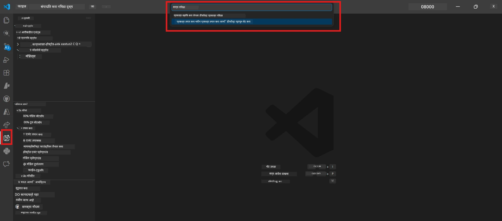

# मॉड्यूल 0 - परिचय

⏱️ ~10 मिनिटे

> [!WARNING]
> **पूर्वावलोकन आणि मर्यादा:** [होस्टेड एजंट्स](https://learn.microsoft.com/azure/foundry/agents/concepts/hosted-agents) सध्या **सार्वजनिक पूर्वावलोकन** मध्ये आहेत - उत्पादन कार्यभारासाठी शिफारस नाही. या कार्यशाळेमध्ये दर्शविलेली काही वैशिष्ट्ये सेवा GA दिशेने जाताना बदलू शकतात.

## तुम्ही काय तयार करणार आहात

या लॅबमध्ये, तुम्ही लॅब 01 मधील सिंगल-एजंट कौशल्ये वाढवून एक **मल्टी-एजंट वर्कफ्लो** तयार करता - रिझ्युमे → नोकरीसाठी योग्यता मूल्यांकन.

तुम्ही एक **रिझ्युमे** आणि एक **नोकरीचे वर्णन** पेस्ट करता. चार विशेष एजंट्स क्रमाने इनपुट प्रक्रिया करतात आणि नंतर परत करतात:
- एक फिट स्कोअर (0–100 सह स्कोअरिंग ब्रेकडाउन)
- कौशल्य आणि प्रमाणपत्रातील फरकांची यादी
- प्रत्येक फरकासाठी वास्तविक Microsoft Learn लिंकसह वैयक्तिकृत शैक्षणिक रोडमॅप

**वर्कफ्लो वापरतो:**
- **Microsoft Agent Framework** - `WorkflowBuilder` साठी अनुक्रमित पाइपलाइन संयोजन
- **Foundry Toolkit for VS Code** - स्कॅफोल्ड, स्थानिक चाचणी, वितरण
- **एक AI मॉडेल** (उदा., `gpt-4.1-mini`) - सर्व चार एजंट्स द्वारे वापरले जाते
- **Microsoft Learn MCP सर्व्हर** - प्रत्येक कौशल्य फरकासाठी वास्तविक शिकण्याचे स्त्रोत लिंक प्रदान करतो

---

## तुमचा मार्ग निवडा

> ⚠️ **लॅब 01 मध्ये वापरलेला तोच मार्ग पुढे चालू ठेवा.**

<details open>
<summary><strong>🅰️ मार्ग A - Azure क्लाउड (Azure सबस्क्रिप्शन आवश्यक)</strong></summary>

| | तपशील |
|---|---|
| **कोणासाठी आहे?** | तुम्ही Azure सबस्क्रिप्शन वापरून लॅब 01 पूर्ण केला आहे |
| **मॉडेल** | Foundry द्वारे Azure OpenAI (उदा., `gpt-4.1-mini`) |
| **आवृत मॉड्यूल्स** | सर्व मॉड्यूल्स (00–09) |
| **क्लाउडवर तैनात करायचे का?** | ✅ हो - पूर्ण एन्ड-टू-एन्ड तैनातीकडे |

</details>

<details open>
<summary><strong>🅱️ मार्ग B - Foundry स्थानिक (Azure सबस्क्रिप्शन आवश्यक नाही)</strong></summary>

| | तपशील |
|---|---|
| **कोणासाठी आहे?** | तुम्ही Foundry स्थानिक वापरून लॅब 01 पूर्ण केला आहे |
| **मॉडेल** | Foundry स्थानिक (मुक्त, तुमच्या मशीनवर चालते) |
| **आवृत मॉड्यूल्स** | मॉड्यूल्स 00–05 (06–07 वगळा - तैनात आणि क्लाउड पडताळणी) |
| **क्लाउडवर तैनात करायचे का?** | ❌ नाही - केवळ स्थानिक चाचणी Agent Inspector द्वारे |

</details>

---

## लॅब 01 तपासणी

लॅब 02 थेट लॅब 01 वर आधारित आहे. येथे सुरुवात करण्यापूर्वी लॅब 01 पूर्ण करा.

अजून लॅब 01 केला नाही? येथे सुरू करा: [Lab 01 - Introduction](../../lab01-single-agent/docs/00-prerequisites.md)

<details open>
<summary><strong>🅰️ मार्ग A - Azure क्लाउड</strong></summary>

```powershell
az account show --query "{name:name, id:id}" --output table
```

जर हे अपयशी ठरले, तर `az login` चालवा. नंतर VS Code मध्ये तपासा:

1. `Ctrl+Shift+P` → "**Foundry Toolkit**" टाइप करा → कमांड दिसत असल्याची पुष्टी करा.
2. "**Foundry Toolkit**" चिन्हावर क्लिक करा → तुमचा प्रोजेक्ट आणि तैनात मॉडेल **यशस्वी** दाखवते.



> **RBAC:** तुम्ही लॅब 01 मध्ये **Foundry User** नियुक्त केला होता. पुन्हा नियुक्त करण्याची गरज असल्यास, पहा [Lab 01, Module 1](../../lab01-single-agent/docs/01-setup.md#deploy-a-model--assign-rbac). भूमिका पूर्वी **Azure AI User** नावाची होती - त्याच परवानग्या.

</details>

<details open>
<summary><strong>🅱️ मार्ग B - Foundry स्थानिक</strong></summary>

```powershell
Invoke-WebRequest -Uri "http://localhost:5273/v1/health" -UseBasicParsing | Select-Object StatusCode
```

अपेक्षित: `StatusCode: 200`. नसल्यास, Foundry Toolkit साइडबारमधून Foundry स्थानिक पुनःप्रारंभ करा.

> सर्व अनुमान तुमच्या मशीनवर चालतात. एकमेव बाह्य कॉल MCP टूल पासून `https://learn.microsoft.com/api/mcp` आहे.

</details>

---

## लॅब 02 मध्ये काय नवीन आहे

| | लॅब 01 | लॅब 02 |
|--|--------|--------|
| एजंट्स | 1 | 4 (WorkflowBuilder सह साखळी) |
| स्कॅफोल्ड टेम्प्लेट | मूलभूत - एजंट फ्रेमवर्क | वर्कफ्लोज - एजंट फ्रेमवर्क |
| नवीन पॅकेज | - | `mcp` |
| संयोजन | एकल संवाद एजंट | अनुक्रमित पाइपलाइन (WorkflowBuilder) |
| नवीन साधन | - | `search_microsoft_learn_for_plan` (MCP) |

---

**पुढील:** [01 - आर्किटेक्चर समजून घ्या →](01-understand-multi-agent.md)

---

<!-- CO-OP TRANSLATOR DISCLAIMER START -->
**अस्वीकरण**:
हा दस्तऐवज AI भाषांतर सेवा [Co-op Translator](https://github.com/Azure/co-op-translator) चा वापर करून अनुवादित केला आहे. जरी आम्ही अचूकतेसाठी प्रयत्न करतो, तरी कृपया लक्षात घ्या की स्वयंचलित भाषांतरांमध्ये त्रुटी किंवा अचूकतेची कमतरता असू शकते. मूळ दस्तऐवज त्याच्या मूळ भाषेत अधिकृत स्रोत मानला पाहिजे. महत्त्वाची माहिती असल्यास, व्यावसायिक मानवी भाषांतराची शिफारस केली जाते. या भाषांतराच्या वापरामुळे उद्भवणाऱ्या कोणत्याही गैरसमज किंवा चुकीच्या अर्थलावणीसाठी आम्ही जबाबदार नाही.
<!-- CO-OP TRANSLATOR DISCLAIMER END -->