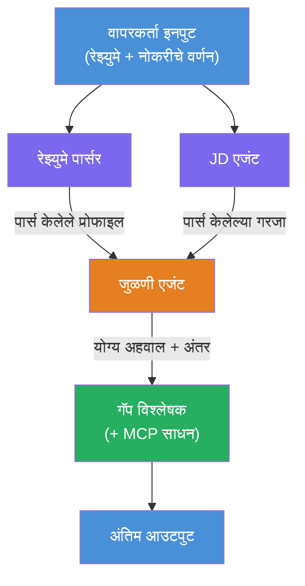
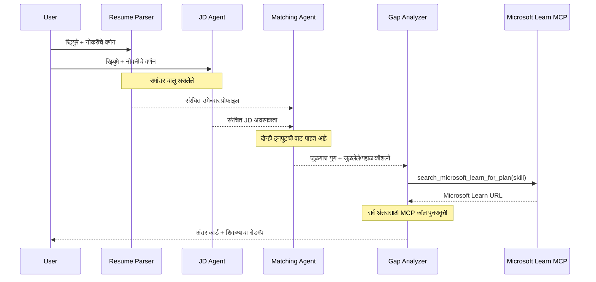
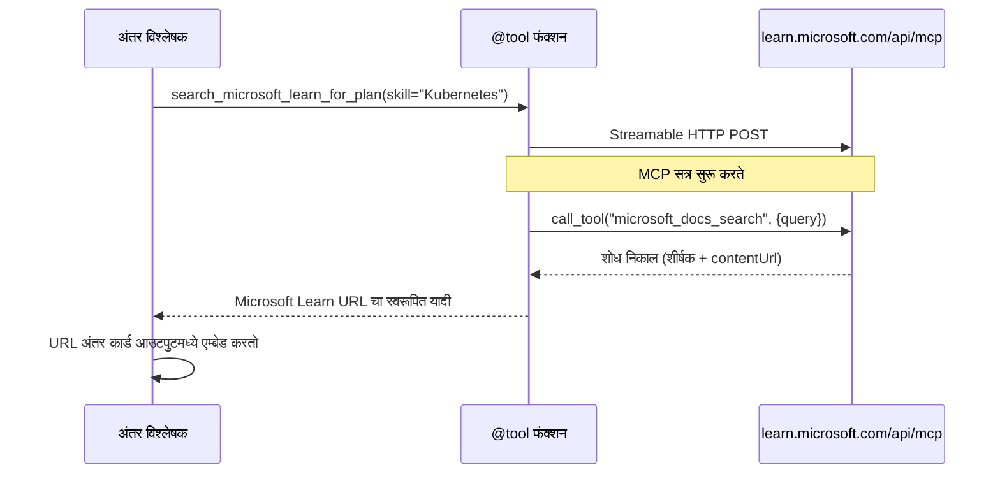

# Module 1 - मल्टी-एजेंट आर्किटेक्चर समजून घ्या

या मॉड्युलमध्ये, आपण Resume → Job Fit Evaluator च्या आर्किटेक्चरबद्दल शिकता, जे कोड लिहिण्यापूर्वी महत्त्वाचे आहे. ऑर्केस्ट्रेशन ग्राफ, एजंट भूमिका आणि डेटा फ्लो समजून घेतले तर [मल्टी-एजेंट कार्यप्रवाहांचे](https://learn.microsoft.com/azure/architecture/ai-ml/idea/multiple-agent-workflow-automation) डिबगिंग आणि विस्तार करणे सोपे होते.

---

## हे समस्या काय सोडवते

रेझ्युमेमध्ये जॉब वर्णनाशी जुळवून घेणे अनेक वेगळ्या कौशल्यांची गरज असते:

1. **पार्सिंग** - असंरचित मजकुरातून (रेझ्युमे) संरचित डेटा काढणे
2. **विश्लेषण** - जॉब वर्णनातून आवश्यकतांची माहिती काढणे
3. **तुलना** - दोन्हींचे अनुरूपता गुणांकन करणे
4. **योजना** - भेदांवर मात करण्यासाठी शिकण्याचा रोडमॅप तयार करणे

एकाच एजंटने हे चारही काम एका प्रॉम्प्टमध्ये केल्यास सहसा:
- अपूर्ण एक्सट्रॅक्शन (गुणांकनाकडे जाण्यासाठी पार्सिंगवर घाई केली जाते)
- पडताळणी नसलेले गुणांकन (पुराव्यांवर आधारित तपशील नाही)
- सामान्य रोडमॅप्स (विशिष्ट भेदांनुसार सानुकूलित नाहीत)

**चार विशेषीकृत एजंट्स** मध्ये विभागल्यास, प्रत्येक एजंट त्याच्या कार्यावर लक्ष केंद्रित करतो आणि प्रत्येक टप्प्यावर उच्च दर्जाचे परिणाम तयार होतात.

---

## चार एजंट्स

प्रत्येक एजंट पूर्ण [Microsoft Foundry](https://learn.microsoft.com/azure/foundry/agents/concepts/hosted-agents) एजंट आहे जो `AzureAIAgentClient.as_agent()` द्वारे तयार केला जातो. ते समान मॉडेल डिप्लॉयमेंट शेअर करतात पण त्यांचे सुचना आणि (ऐच्छिक) साधने वेगवेगळी असतात.

| # | एजंट नाव | भूमिका | इनपुट | आउटपुट |
|---|-----------|------|-------|--------|
| 1 | **ResumeParser** | रेझ्युमे मजकुरातून संरचित प्रोफाइल काढतो | रॉ रेझ्युमे मजकूर (वापरकर्त्याकडून) | उमेदवार प्रोफाइल, तांत्रिक कौशल्ये, सॉफ्ट कौशल्ये, प्रमाणपत्रे, क्षेत्रानुभव, मिळकती |
| 2 | **JobDescriptionAgent** | जॉब वर्णनातून संरचित आवश्यकता काढतो | रॉ JD मजकूर (वापरकर्त्याकडून, ResumeParser मार्फत पुढे पाठवलेले) | भूमिका परिचय, आवश्यक कौशल्ये, प्राधान्य कौशल्ये, अनुभव, प्रमाणपत्रे, शिक्षण, जबाबदा-या |
| 3 | **MatchingAgent** | पुराव्यावर आधारित अनुरूपता गुणांकन करतो | ResumeParser + JobDescriptionAgent चे आउटपुट | फिट गुण (0-100 तपशीलासहित), जुळलेली कौशल्ये, गहाळ कौशल्ये, भेद |
| 4 | **GapAnalyzer** | वैयक्तिकृत शिकण्याचा रोडमॅप तयार करतो | MatchingAgent चे आउटपुट | कौशल्यांसाठी भेद कार्ड्स, शिक्षण क्रम, वेळापत्रक, Microsoft Learn मधील साधने |

---

## ऑर्केस्ट्रेशन ग्राफ

कार्यप्रवाहात **पॅरॅलेल फॅन-आउट** नंतर **सोप्या सल्ल्याचा समावेश** होतो:


> **संकेत:** जांभळा = समांतर एजंट, नारिंगी = सल्ला बिंदू, हिरवा = साधने असलेला अंतिम एजंट

### डेटा कसा वाहतो


1. **वापरकर्ता पाठवतो** रेझ्युमे आणि जॉब वर्णन असलेला संदेश.
2. **ResumeParser** पूर्ण वापरकर्ता इनपुट मिळवतो आणि संरचित उमेदवार प्रोफाइल तयार करतो.
3. **JobDescriptionAgent** वापरकर्ता इनपुट समांतरपणे मिळवतो आणि संरचित आवश्यकता काढतो.
4. **MatchingAgent** दोन्ही ResumeParser आणि JobDescriptionAgent चा आउटपुट मिळवतो (फ्रेमवर्क दोन्ही पूर्ण होईपर्यंत वाट पाहतो).
5. **GapAnalyzer** MatchingAgent चा आउटपुट मिळवतो आणि प्रत्येक भेदासाठी **Microsoft Learn MCP साधन** वापरून खऱ्या शिकणाऱ्या साधनांची माहिती आणतो.
6. अंतिम आउटपुट म्हणजे GapAnalyzer ची प्रतिक्रिया, ज्यात फिट स्कोअर, भेद कार्ड्स आणि पूर्ण शिकण्याचा रोडमॅप असतो.

### पॅरॅलेल फॅन-आउट का महत्त्वाचा आहे

ResumeParser आणि JobDescriptionAgent **समांतर चालतात** कारण त्यातील कोणताही दुसऱ्यावर अवलंबून नाही. यामुळे:
- एकूण विलंब वेळ कमी होते (दोघेही एकाचवेळी चालतात, क्रमाने नव्हे)
- नैसर्गिक विभागणी होते (रेझ्युमे पार्सिंग आणि जॉब वर्णन पार्सिंग स्वतंत्र आहेत)
- हे एक सामान्य मल्टी-एजंट नमुना दर्शवते: **फॅन-आउट → संकलन → क्रिया**

---

## WorkflowBuilder कोडमध्ये

वरील ग्राफ `main.py` मधील [`WorkflowBuilder`](https://learn.microsoft.com/agent-framework/workflows/agents-in-workflows) API कॉल्सशी कसा जुळतो:

```python
from agent_framework import WorkflowBuilder

workflow = (
    WorkflowBuilder(
        name="ResumeJobFitEvaluator",
        start_executor=resume_parser,       # वापरकर्त्याचा इनपुट प्राप्त करणारा पहिला एजंट
        output_executors=[gap_analyzer],     # अंतिम एजंट ज्याचा आउटपुट परत केला जातो
    )
    .add_edge(resume_parser, jd_agent)      # ResumeParser → JobDescriptionAgent
    .add_edge(resume_parser, matching_agent) # ResumeParser → MatchingAgent
    .add_edge(jd_agent, matching_agent)      # JobDescriptionAgent → MatchingAgent
    .add_edge(matching_agent, gap_analyzer)  # MatchingAgent → GapAnalyzer
    .build()
)
```

**एजंच्या कड्यांचे समज:**

| कडा | काय अर्थ आहे |
|------|--------------|
| `resume_parser → jd_agent` | JD एजंट ResumeParser चा आउटपुट मिळवतो |
| `resume_parser → matching_agent` | MatchingAgent ResumeParser चा आउटपुट मिळवतो |
| `jd_agent → matching_agent` | MatchingAgent JD एजंट चा आउटपुट पण मिळवतो (दोन्हीची वाट पाहतो) |
| `matching_agent → gap_analyzer` | GapAnalyzer MatchingAgent चा आउटपुट मिळवतो |

कारण `matching_agent` ला **दोन इनकमिंग एज** आहेत (`resume_parser` आणि `jd_agent`), फ्रेमवर्क दोन्ही पूर्ण होईपर्यंत थांबून नंतर MatchingAgent चालवतो.

---

## MCP साधन

GapAnalyzer एजंट कडे एकच साधन आहे: `search_microsoft_learn_for_plan`. हे एक **[MCP साधन](https://learn.microsoft.com/agent-framework/agents/tools/hosted-mcp-tools)** आहे जे Microsoft Learn API ला कॉल करून क्युरेटेड शिकण्याच्या साधनांची माहिती आणते.

### ते कसे कार्य करते

```python
@tool
async def search_microsoft_learn_for_plan(
    skill: str, role: str = "", max_results: int = 5
) -> str:
    """Search Microsoft Learn MCP and return curated official links."""
    # Streamable HTTP द्वारे https://learn.microsoft.com/api/mcp शी कनेक्ट होते
    # MCP सर्व्हरवरील 'microsoft_docs_search' टूल कॉल करते
    # Microsoft Learn URLs ची स्वरूपित यादी परत करते
```

### MCP कॉल फ्लो


1. GapAnalyzer ठरवतो की एखाद्या कौशल्यासाठी शिकण्याची साधने पाहिजे (उदा. "Kubernetes")
2. फ्रेमवर्क कॉल करतो `search_microsoft_learn_for_plan(skill="Kubernetes")`
3. फंक्शन एक [Streamable HTTP](https://learn.microsoft.com/agent-framework/agents/tools/hosted-mcp-tools) कनेक्शन उघडते `https://learn.microsoft.com/api/mcp` ला
4. ते [MCP सर्व्हरवर](https://learn.microsoft.com/azure/foundry/agents/how-to/tools/model-context-protocol) `microsoft_docs_search` साधन कॉल करते
5. MCP सर्व्हर शोध परिणाम (शीर्षक + URL) परत करतो
6. फंक्शन निकाल फॉरमॅट करून स्ट्रिंगमध्ये परत करते
7. GapAnalyzer परत आलेले URL आपल्या भेद कार्ड्समध्ये वापरते

### अपेक्षित MCP लॉग्स

साधन चालू असताना, तुम्हाला खालील प्रमाणे लॉग एंट्री दिसतील:

```
GET https://learn.microsoft.com/api/mcp → 405 (Method Not Allowed)
POST https://learn.microsoft.com/api/mcp → 200
DELETE https://learn.microsoft.com/api/mcp → 405 (Method Not Allowed)
```

**हे सामान्य आहे.** MCP क्लायंट सुरुवातीस GET आणि DELETE विनंत्यांसह तपासणी करतो - ज्यावर 405 प्रतिसाद आल्यास ते सामान्य आहे. प्रत्यक्ष साधन कॉल POST वापरतो आणि 200 परत करतो. POST कॉल फेल झाले तरच काळजी करावी.

---

## एजंट तयार करण्याचा नमुना

प्रत्येक एजंट **[`AzureAIAgentClient.as_agent()`](https://learn.microsoft.com/python/api/overview/azure/ai-agents-readme) async संदर्भ व्यवस्थापक** वापरून तयार होतो. हे Foundry SDK मधील नमुना आहे ज्यामुळे एजंट आपोआप स्वच्छ केला जातो:

```python
async with (
    get_credential() as credential,
    AzureAIAgentClient(
        project_endpoint=PROJECT_ENDPOINT,
        model_deployment_name=MODEL_DEPLOYMENT_NAME,
        credential=credential,
    ).as_agent(
        name="ResumeParser",
        instructions=RESUME_PARSER_INSTRUCTIONS,
    ) as resume_parser,
    # ... प्रत्येक एजंटसाठी पुन्हा करा ...
):
    # येथे सर्व 4 एजंट्स आहेत
    workflow = create_workflow(resume_parser, jd_agent, matching_agent, gap_analyzer)
```

**महत्वाचे मुद्दे:**
- प्रत्येक एजंटला स्वतःचा `AzureAIAgentClient` उदाहरण मिळते (SDK ला क्लायंटवर एजंट नाव Scoped हवे असते)
- सर्व एजंट समान `credential`, `PROJECT_ENDPOINT`, आणि `MODEL_DEPLOYMENT_NAME` वापरतात
- `async with` ब्लॉक सर्व एजंट सत्र बंद होईपर्यंत सुरक्षित ठेवतो
- GapAnalyzer ला अतिरिक्त `tools=[search_microsoft_learn_for_plan]` मिळतो

---

## सर्व्हर स्टार्टअप

एजंट्स तयार करून कार्यप्रवाह बांधल्यानंतर, सर्व्हर चालू होतो:

```python
from azure.ai.agentserver.agentframework import from_agent_framework

agent = create_workflow(resume_parser, jd_agent, matching_agent, gap_analyzer)
await from_agent_framework(agent).run_async()
```

`from_agent_framework()` कार्यप्रवाहाला HTTP सर्व्हरमध्ये रॅप करते जो `/responses` एंडपॉइंट 8088 पोर्टवर एक्सपोज करतो. हा Lab 01 प्रमाणेच नमुना आहे, पण "एजंट" आता संपूर्ण [workflow ग्राफ](https://learn.microsoft.com/agent-framework/workflows/as-agents) असतो.

---

### तपासणी यादी

- [ ] तुम्हाला 4-एजंट आर्किटेक्चर आणि प्रत्येक एजंटची भूमिका समजली आहे
- [ ] तुम्ही डेटा फ्लो ट्रेस करू शकता: वापरकर्ता → ResumeParser → (समांतर) JD एजंट + MatchingAgent → GapAnalyzer → आउटपुट
- [ ] तुम्हाला समजले आहे की MatchingAgent का ResumeParser आणि JD एजंट दोघांची वाट पाहतो (दोन येणाऱ्या एज)
- [ ] MCP साधन काय करते, कसे कॉल होते, आणि GET 405 लॉग्स का सामान्य आहेत हे समजलं आहे
- [ ] तुम्हाला `AzureAIAgentClient.as_agent()` नमुना आणि प्रत्येक एजंटला स्वतंत्र क्लायंट का मिळतो हे समजलं आहे
- [ ] तुम्ही `WorkflowBuilder` कोड वाचू शकता आणि त्याला दृष्य ग्राफशी जुळवू शकता

---

**मागील:** [00 - Prerequisites](00-prerequisites.md) · **पुढील:** [02 - Scaffold the Multi-Agent Project →](02-scaffold-multi-agent.md)

---

<!-- CO-OP TRANSLATOR DISCLAIMER START -->
**अस्वीकरण**:
हा दस्तऐवज AI अनुवाद सेवा [Co-op Translator](https://github.com/Azure/co-op-translator) वापरून अनुवादित केला आहे. आम्ही अचूकतेसाठी प्रयत्न करतो, पण कृपया लक्षात ठेवा की स्वयंचलित अनुवादांमध्ये चुका किंवा गैरसमज असू शकतात. मूळ दस्तऐवज त्याच्या स्थानिक भाषेत अधिकृत स्रोत मानला पाहिजे. महत्त्वाच्या माहितीसाठी व्यावसायिक मानवी अनुवाद शिफारस केली जाते. या अनुवादाचा वापर केल्याबद्दल निर्माण झालेल्या कोणत्याही गैरसमजुती किंवा चुकांसाठी आम्ही जबाबदार नाही.
<!-- CO-OP TRANSLATOR DISCLAIMER END -->