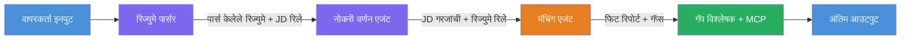

# मोड्यूल 1 - आर्किटेक्चर समजून घ्या

⏱️ सुमारे 5 मिनिटे

कोणताही कोड लिहिण्यापूर्वी, आपण काय तयार करत आहात आणि ते कसे कार्य करते याचे एक जलद विहंगावलोकन येथे आहे.

---

## आपण काय तयार करत आहात

आपण एक **रेझ्युमे** आणि एक **पदवर्णन** पेस्ट करतो. वर्कफ्लो परत करते:

- एक फिट स्कोअर (0-100 सह तपशीलवार विभाग)
- कौशल्य आणि प्रमाणपत्रातील अंतरांची यादी
- प्रत्येक अंतरासाठी Microsoft Learn लिंकसह वैयक्तिकृत शिक्षण रोडमॅप

---

## चार एजंट्स

एकल एजंट जो सर्व एकत्रितपणे पार्स, स्कोअर आणि नियोजन करण्याचा प्रयत्न करतो तो सहसा घाई करून उथळ परिणाम उत्पादन करतो. चार विशेष एजंटमध्ये काम विभागल्यास सुधारित परिणाम मिळतात:

| एजंट | काय करतो |
|-------|-------------|
| **ResumeParser** | रेज्युमे पार्स करतो; JD अगदी तसा `[JOB DESCRIPTION PASS-THROUGH]` मध्ये कॉपी करतो पुढील एजंटसाठी |
| **JobDescriptionAgent** | पास-थ्रू मधून JD आवश्यकतांचे निष्कर्ष काढतो; `[PARSED RESUME]` पुढे `[PARSED RESUME PASS-THROUGH]` म्हणून पुढे पाठवतो |
| **MatchingAgent** | दोन्ही लेबल केलेल्या विभागांची तुलना करतो; 0-100 फिट स्कोअर आणि अंतरांची यादी तयार करतो |
| **GapAnalyzer** | शिक्षण रोडमॅप तयार करतो; Microsoft Learn मधून प्रत्येक अंतरासाठी शोध घेतो |

---

## ऑर्केस्ट्रेशन ग्राफ

वर्कफ्लो हा एक **सुकाळी रेषीय पाइपलाइन** आहे - प्रत्येक एजंट आपला आउटपुट पुढील एजंटला पुरवतो:


```mermaid
flowchart LR
    A["वापरकर्ता इनपुट"] --> B["रिज्युमे पार्सर"]
    B -- "पार्स केलेले रिज्युमे + JD रिले" --> C["नोकरी वर्णन एजंट"]
    C -- "JD गरजांची + रिज्युमे रिले" --> D["मॅचिंग एजंट"]
    D -- "फिट रिपोर्ट + गॅप्स" --> E["गॅप विश्लेषक + MCP"]
    E --> F["अंतिम आउटपुट"]

    style A fill:#4A90D9,color:#fff
    style B fill:#7B68EE,color:#fff
    style C fill:#7B68EE,color:#fff
    style D fill:#E67E22,color:#fff
    style E fill:#27AE60,color:#fff
    style F fill:#4A90D9,color:#fff
```

1. **ResumeParser** वापरकर्त्याचा इनपुट घेतो, रेज्युमे पार्स करतो, आणि JD `[JOB DESCRIPTION PASS-THROUGH]` मध्ये कॉपी करतो.
2. **JD एजंट** संरचित आवश्यकता काढतो आणि `[PARSED RESUME PASS-THROUGH]` पुढे पाठवतो.
3. **MatchingAgent** दोन्ही विभागांची तुलना करतो आणि फिट स्कोअर व अंतरांची यादी तयार करतो.
4. **GapAnalyzer** रोडमॅप तयार करतो आणि Microsoft Learn MCP टूल प्रत्येक अंतरासाठी कॉल करतो.

---

## हे कोडशी कसे जुळते

`main.py` मध्ये, आपण हा ग्राफ `WorkflowBuilder` वापरून वर्णन करता:

```python
workflow_agent = (
    WorkflowBuilder(
        start_executor=resume_executor,       # वापरकर्त्याच्या इनपुटस प्रथम एजंट
        output_executors=[gap_executor],      # शेवटचा एजंट - त्याचा आउटपुट म्हणजे उत्तर
    )
    .add_edge(resume_executor, jd_executor)       # ResumeParser → JD एजंट
    .add_edge(jd_executor, matching_executor)     # JD एजंट → MatchingAgent
    .add_edge(matching_executor, gap_executor)    # MatchingAgent → GapAnalyzer
    .build()
    .as_agent()
)
```

प्रत्येक `Agent` एका `AgentExecutor` मध्ये व्रॅप केला जातो. `add_edge()` कॉल्स कडक रेषीय पाइपलाइन परिभाषित करतात - प्रत्येक एजंटला फक्त त्याच्या थेट पूर्ववर्तीचा आउटपुट मिळतो.

> `context_mode="last_agent"` म्हणजे प्रत्येक कार्यान्वयन फक्त त्याच्या थेट पूर्ववर्तीचा आउटपुट पाहतो. ResumeParser आणि JD Agent लेबल केलेल्या विभागांमध्ये डेटा पुढे पाठवतात ज्यामुळे प्रत्येक पुढील एजंटला नेमके जे आवश्यक असते ते मिळते.

---

## MCP टूल

GapAnalyzer कडे एक टूल आहे: `search_microsoft_learn_for_plan`. हे `https://learn.microsoft.com/api/mcp` शी कनेक्ट होते आणि प्रत्येक कौशल्यातील अंतरासाठी वास्तविक Microsoft Learn लिंक परत देते.

टूल चालू असताना तुम्हाला हे लॉग्स दिसतील - सर्व अपेक्षित आहेत:

```
GET  https://learn.microsoft.com/api/mcp → 405   ← connection probe, normal
POST https://learn.microsoft.com/api/mcp → 200   ← actual tool call
DELETE https://learn.microsoft.com/api/mcp → 405 ← cleanup probe, normal
```

केवळ `POST` एरर परत आणल्यास काळजी करा.

---

**मागील:** [00 - पूर्वअटी](00-prerequisites.md) · **पुढील:** [02 - प्रोजेक्ट स्कॅफोल्ड करा →](02-scaffold-multi-agent.md)

---

<!-- CO-OP TRANSLATOR DISCLAIMER START -->
**अस्वीकरण**:
हा दस्तऐवज AI भाषांतर सेवा [Co-op Translator](https://github.com/Azure/co-op-translator) चा वापर करून अनुवादित केला आहे. जरी आम्ही अचूकतेसाठी प्रयत्न करतो, तरी कृपया लक्षात घ्या की स्वयंचलित भाषांतरांमध्ये त्रुटी किंवा अचूकतेची कमतरता असू शकते. मूळ दस्तऐवज त्याच्या मूळ भाषेत अधिकृत स्रोत मानला पाहिजे. महत्त्वाची माहिती असल्यास, व्यावसायिक मानवी भाषांतराची शिफारस केली जाते. या भाषांतराच्या वापरामुळे उद्भवणाऱ्या कोणत्याही गैरसमज किंवा चुकीच्या अर्थलावणीसाठी आम्ही जबाबदार नाही.
<!-- CO-OP TRANSLATOR DISCLAIMER END -->