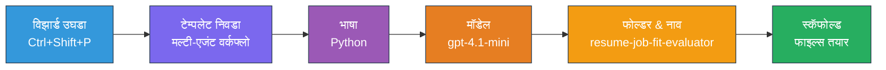
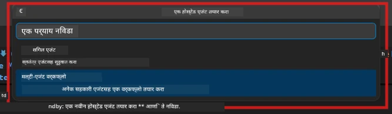

# Module 2 - मल्टी-एजंट प्रोजेक्टचे स्कॅफोल्ड करा

या मॉड्यूलमध्ये, तुम्ही [Microsoft Foundry विस्तार](https://marketplace.visualstudio.com/items?itemName=TeamsDevApp.vscode-ai-foundry) वापरून **मल्टी-एजंट वर्कफ्लो प्रोजेक्ट स्कॅफोल्ड कराल**. विस्तार संपूर्ण प्रोजेक्ट संरचना तयार करतो - `agent.yaml`, `main.py`, `Dockerfile`, `requirements.txt`, `.env`, आणि डिबग कॉन्फिगरेशन. नंतर तुम्ही हे फायली मॉड्यूल 3 आणि 4 मध्ये सानुकूलित करता.

> **नोट:** या लॅबमधील `PersonalCareerCopilot/` फोल्डर हा एक संपूर्ण, कार्यरत सानुकूलित मल्टी-एजंट प्रोजेक्टचा उदाहरण आहे. तुम्ही नवीन प्रोजेक्ट स्कॅफोल्ड करू शकता (शिकण्यासाठी शिफारसीय) किंवा थेट विद्यमान कोड अभ्यासू शकता.

---

## चरण 1: Create Hosted Agent विजार्ड उघडा


1. `Ctrl+Shift+P` दाबून **Command Palette** उघडा.
2. टाईप करा: **Microsoft Foundry: Create a New Hosted Agent** आणि ते निवडा.
3. होस्टेड एजंट क्रिएशन विजार्ड उघडेल.

> **पर्यायी:** Activity Bar मधील **Microsoft Foundry** आयकॉनवर क्लिक करा → **Agents** च्या शेजारील **+** आयकॉनवर क्लिक करा → **Create New Hosted Agent**.

---

## चरण 2: मल्टी-एजंट वर्कफ्लो टेम्प्लेट निवडा

विजार्ड तुम्हाला एक टेम्प्लेट निवडायला सांगतो:

| टेम्प्लेट | वर्णन | कधी वापरायचे |
|----------|-------------|-------------|
| Single Agent | एका एजंटसाठी सूचना आणि पर्यायी टूल्स | लॅब 01 |
| **Multi-Agent Workflow** | WorkflowBuilder द्वारे सहयोग करणारे अनेक एजंट | **हा लॅब (लॅब 02)** |

1. **Multi-Agent Workflow** निवडा.
2. **Next** क्लिक करा.



---

## चरण 3: प्रोग्रामिंग भाषा निवडा

1. **Python** निवडा.
2. **Next** क्लिक करा.

---

## चरण 4: तुमचा मॉडेल निवडा

1. विजार्ड तुमच्या Foundry प्रोजेक्टमध्ये तैनात केलेले मॉडेल दाखवतो.
2. लॅब 01 मध्ये वापरलेलेच मॉडेल निवडा (उदा., **gpt-4.1-mini**).
3. **Next** क्लिक करा.

> **टीप:** [`gpt-4.1-mini`](https://learn.microsoft.com/azure/foundry/foundry-models/concepts/models-sold-directly-by-azure#gpt-41-series) विकासासाठी शिफारस केलेले आहे - हे वेगवान, स्वस्त आणि मल्टी-एजंट वर्कफ्लो व्यवस्थित हाताळते. उच्च गुणवत्तेचा आउटपुट पाहिजे असल्यास अंतिम उत्पादन तैनातीसाठी `gpt-4.1` वापरा.

---

## चरण 5: फोल्डर स्थान आणि एजंट नाव निवडा

1. फाईल डायलॉग उघडेल. एका लक्ष्य फोल्डरची निवड करा:
   - वर्कशॉप रेपो बरोबर चालत असल्यास: `workshop/lab02-multi-agent/` मध्ये जा आणि नवीन सबफोल्डर तयार करा
   - नवीन सुरुवात करत असल्यास: कोणताही फोल्डर निवडा
2. होस्टेड एजंटसाठी **नाव** द्या (उदा., `resume-job-fit-evaluator`).
3. **Create** क्लिक करा.

---

## चरण 6: स्कॅफोल्डिंग पूर्ण होईपर्यंत प्रतीक्षा करा

1. VS Code नवीन विंडो उघडेल (किंवा सद्य विंडो अपडेट होईल) ज्यात स्कॅफोल्ड केलेला प्रोजेक्ट असेल.
2. तुम्हाला खालील फाईल संरचना दिसेल:

```
resume-job-fit-evaluator/
├── .env                ← Environment variables (placeholders)
├── .vscode/
│   └── launch.json     ← Debug configuration
├── agent.yaml          ← Agent definition (kind: hosted)
├── Dockerfile          ← Container configuration
├── main.py             ← Multi-agent workflow code (scaffold)
└── requirements.txt    ← Python dependencies
```

> **वर्कशॉप नोट:** वर्कशॉप रेपॉजिटरीमध्ये, `.vscode/` फोल्डर **वर्कस्पेस रूट** वर आहे ज्यात `launch.json` आणि `tasks.json`  शेअर केलेले आहेत. लॅब 01 आणि लॅब 02 दोन्हीची डिबग कॉन्फिगरेशन अंतर्भूत आहेत. F5 दाबल्यावर, ड्रॉपडाऊनमधून **"Lab02 - Multi-Agent"** निवडा.

---

## चरण 7: स्कॅफोल्ड केलेल्या फाईलची समज (मल्टी-एजंट वैशिष्ट्ये)

मल्टी-एजंट स्कॅफोल्डिंग सिंगल-एजंट स्कॅफोल्डिंगपेक्षा काही महत्त्वाच्या बाबतीत वेगळे आहे:

### 7.1 `agent.yaml` - एजंट व्याख्या

```yaml
kind: hosted
name: resume-job-fit-evaluator
description: >
  A multi-agent workflow that evaluates resume-to-job fit.
metadata:
  authors:
    - Microsoft
  tags:
    - Multi-Agent Workflow
    - Resume Evaluator
protocols:
  - protocol: responses
    version: v1
environment_variables:
  - name: PROJECT_ENDPOINT
    value: ${PROJECT_ENDPOINT}
  - name: MODEL_DEPLOYMENT_NAME
    value: ${MODEL_DEPLOYMENT_NAME}
```

**लॅब 01 पासून मुख्य फरक:** `environment_variables` विभागात MCP endpoints किंवा इतर टूल कॉन्फिगरेशनसाठी अतिरिक्त व्हेरिएबल्स असू शकतात. `name` आणि `description` मल्टी-एजंट वापर प्रकरणावर आधारित आहेत.

### 7.2 `main.py` - मल्टी-एजंट वर्कफ्लो कोड

स्कॅफोल्डमध्ये समाविष्ट आहे:
- **अनेक एजंटांसाठी सूचना स्ट्रिंग्ज** (प्रत्येक एजंटसाठी एक const)
- **अनेक [`AzureAIAgentClient.as_agent()`](https://learn.microsoft.com/python/api/overview/azure/ai-agents-readme) संदर्भ व्यवस्थापक** (प्रत्येक एजंटसाठी एक)
- एजंट्सना एकत्र कनेक्ट करण्यासाठी **[`WorkflowBuilder`](https://learn.microsoft.com/agent-framework/workflows/agents-in-workflows)**
- वर्कफ्लोला HTTP एंडपॉइंट म्हणून सेवा देण्यासाठी **`from_agent_framework()`**

```python
from agent_framework import WorkflowBuilder, tool
from agent_framework.azure import AzureAIAgentClient
from azure.ai.agentserver.agentframework import from_agent_framework
```

`WorkflowBuilder` हि अतिरिक्त आयात लॅब 01 तुलनेत नवीन आहे.

### 7.3 `requirements.txt` - अतिरिक्त अवलंबित्वे

मल्टी-एजंट प्रोजेक्ट लॅब 01 सारख्या बेस पॅकेजेस वापरतो, आणि MCP संबंधित पॅकेजेस देखील:

```
agent-framework-azure-ai==1.0.0rc3
agent-framework-core==1.0.0rc3
azure-ai-agentserver-agentframework==1.0.0b16
azure-ai-agentserver-core==1.0.0b16
debugpy
agent-dev-cli --pre
```

> **महत्त्वाची आवृत्ती नोंद:** `agent-dev-cli` पॅकेजसाठी `requirements.txt` मध्ये `--pre` फ्लॅग आवश्यक आहे जेणेकरून नवीनतम प्रिव्ह्यू व्हर्जन इन्स्टॉल होईल. हे `agent-framework-core==1.0.0rc3` सह Agent Inspector सुसंगततेसाठी आवश्यक आहे. तपशीलांसाठी [Module 8 - Troubleshooting](08-troubleshooting.md) पहा.

| पॅकेज | आवृत्ती | उद्दिष्ट |
|---------|---------|---------|
| [`agent-framework-azure-ai`](https://learn.microsoft.com/agent-framework/overview/) | `1.0.0rc3` | Microsoft Agent Framework साठी Azure AI समाकलन |
| [`agent-framework-core`](https://learn.microsoft.com/agent-framework/overview/) | `1.0.0rc3` | मुख्य रनटाइम (WorkflowBuilder सहित) |
| `azure-ai-agentserver-agentframework` | `1.0.0b16` | होस्टेड एजंट सर्व्हर रनटाइम |
| `azure-ai-agentserver-core` | `1.0.0b16` | मुख्य एजंट सर्व्हर प्रतिबिंब |
| `debugpy` | नवीनतम | Python डिबगिंग (VS Code मध्ये F5) |
| `agent-dev-cli` | `--pre` | स्थानिक विकास CLI + Agent Inspector बॅकएंड |

### 7.4 `Dockerfile` - लॅब 01 प्रमाणेच

Dockerfile लॅब 01 सारखेच आहे - फाईल्स कॉपी करतो, `requirements.txt` मधील अवलंबित्वे इन्स्टॉल करतो, पोर्ट 8088 उघडतो, आणि `python main.py` चालवतो.

```dockerfile
FROM python:3.14-slim
WORKDIR /app
COPY ./ .
RUN pip install --upgrade pip && \
    if [ -f requirements.txt ]; then \
        pip install -r requirements.txt; \
    else \
      echo "No requirements.txt found" >&2; exit 1; \
    fi
EXPOSE 8088
CMD ["python", "main.py"]
```

---

### चेकपॉइंट

- [ ] स्कॅफोल्ड विजार्ड पूर्ण झाले → नवीन प्रोजेक्ट संरचना दिसते
- [ ] तुम्हाला सर्व फाइल्स दिसतात: `agent.yaml`, `main.py`, `Dockerfile`, `requirements.txt`, `.env`
- [ ] `main.py` मध्ये `WorkflowBuilder` आयात समाविष्ट आहे (मल्टी-एजंट टेम्प्लेट निवडले गेले हे दर्शवते)
- [ ] `requirements.txt` मध्ये दोन्ही `agent-framework-core` आणि `agent-framework-azure-ai` आहेत
- [ ] तुम्हाला मल्टी-एजंट स्कॅफोल्ड सिंगल-एजंट स्कॅफोल्डपेक्षा कसे वेगळे आहे ते समजले आहे (अनेक एजंट्स, WorkflowBuilder, MCP टूल्स)

---

**मागील:** [01 - मल्टी-एजंट आर्किटेक्चर समजणे](01-understand-multi-agent.md) · **पुढील:** [03 - एजंट आणि पर्यावरण कॉन्फिगर करा →](03-configure-agents.md)

---

<!-- CO-OP TRANSLATOR DISCLAIMER START -->
**अस्वीकरण**:
हा दस्तऐवज AI भाषांतर सेवा [Co-op Translator](https://github.com/Azure/co-op-translator) चा वापर करून अनुवादित केला आहे. आम्ही अचूकतेसाठी प्रयत्न करतो, तरी कृपया लक्षात ठेवा की स्वयंचलित भाषांतरांमध्ये चुका किंवा अचूकतेच्या त्रुटी असू शकतात. मूळ दस्तऐवज त्याच्या स्थानिक भाषेत अधिकृत स्रोत मानला जावा. महत्त्वाच्या माहितीसाठी व्यावसायिक मानवी भाषांतराची शिफारस केली जाते. या भाषांतराच्या वापरामुळे उद्भवणाऱ्या कोणत्याही गैरसमजुती किंवा चुकीच्या अर्थव्यवस्थांसाठी आम्ही जबाबदार नाही.
<!-- CO-OP TRANSLATOR DISCLAIMER END -->