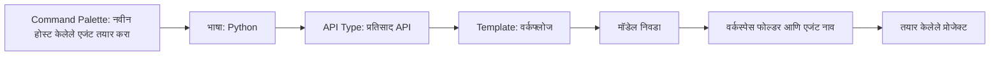
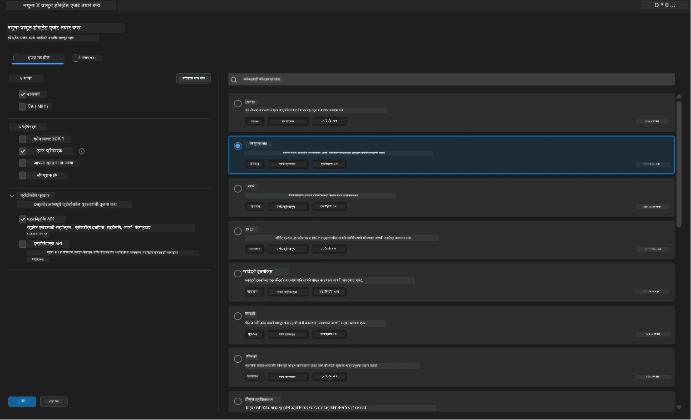
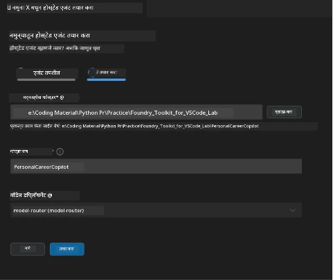

# मॉड्यूल 2 - मल्टी-एजंट प्रोजेक्टची स्कॅफोल्ड करा

⏱️ ~5 मिनिटे

या मॉड्यूलमध्ये, आपण [Foundry Toolkit for VS Code](https://aka.ms/foundrytk) वापरून **मल्टी-एजंट प्रोजेक्टची स्कॅफोल्डिंग** करता. विजार्ड `agent.yaml`, `main.py`, `Dockerfile`, `requirements.txt`, `.env`, आणि VS Code डिबग कॉन्फिगरेशन जनरेट करतो - जेणेकरून आपण मॉड्यूल 3 मध्ये 4-एजंट वर्कफ्लोज वायरिंगवर लक्ष केंद्रित करू शकता.

> **महत्वाची संकल्पना:** स्कॅफोल्ड एक कार्यान्वित स्टब आहे ज्यामध्ये एक एजंट असतो. आपण placeholder लॉजिकला मॉड्यूल 3 मध्ये `WorkflowBuilder` ग्राफने बदलाल. आपण बॉयलरप्लेट सुरुवातीपासून लिहीत नाही.

> **संदर्भ अंमलबजावणी:** [`PersonalCareerCopilot/`](../../../../../workshop/lab02-multi-agent/PersonalCareerCopilot) हा एक पूर्ण कार्यरत उदाहरण आहे. आपण आपले कार्य त्याच्याशी तुलना करण्यासाठी याचा वापर करा.

### स्कॅफोल्ड विजार्डचा प्रवाह


```mermaid
flowchart LR
    A[Command Palette: नवीन होस्ट केलेले एजंट तयार करा] --> B[भाषा: Python]
    B --> C[API Type: प्रतिसाद API]
    C --> D[Template: वर्कफ्लोज]
    D --> E[मॉडेल निवडा]
    E --> F[वर्कस्पेस फोल्डर आणि एजंट नाव]
    F --> G[तयार केलेले प्रोजेक्ट]
```

---

## पायरी 1: Create Hosted Agent विजार्ड उघडा

1. `Ctrl+Shift+P` दाबून **Command Palette** उघडा.
2. टाइप करा: **Foundry Toolkit: Create a New Hosted Agent** आणि निवडा.
3. विजार्ड **Agent Details** टॅबवर उघडेल.

> **पर्यायी:** Activity Bar मध्ये **Foundry Toolkit** आयकॉनवर क्लिक करा → **Hosted Agents** च्या पुढील **+** आयकॉनवर क्लिक करा → **Create New Hosted Agent**.

---

## पायरी 2: सेटिंग्ज निवडा



1. डाव्या नेव्हिगेशन/पर्याय विभागात खालील निवडा:

| मेनू | निवड | टिप्पण्या |
|--------|-----------|-------|
| **Language** | Python | C# (.NET) देखील समर्थित आहे |
| **Framework** | Agent Framework | `Agent`, `AgentExecutor`, `WorkflowBuilder` पुरवते |
| **API type** | Response API | `POST /responses` - प्लॅटफॉर्म व्यवस्थापित इतिहास, स्ट्रीमिंग समर्थन |
| **Template** | **Workflows** | अनेक एजंट्सद्वारे विनंत्या क्रमाने प्रक्रिया करतो |

2. निवडल्यानंतर, **Next** क्लिक करा



3. पुढील विंडोमध्ये खालील निवडा:

| मेनू | निवड | टिप्पण्या |
|--------|-----------|-------|
| **Workspace folder** | लक्ष्य फोल्डर ब्राउझ करा | उदा., या रेपोत `workshop/lab02-multi-agent/` |
| **Agent name** | `PersonalCareerCopilot` | प्रोजेक्ट डायरेक्टरीचे नाव होते |
| **Model Deployment** | तुमचा डिप्लॉयड मॉडेल निवडा | उदा., Lab 01 मधील `gpt-4.1-mini` |

4. प्रोजेक्ट स्कॅफोल्ड करण्यासाठी **Create** क्लिक करा. VS Code फाइल्स जनरेट करून फोल्डर उघडेल.

> **टीप:** [`gpt-4.1-mini`](https://learn.microsoft.com/azure/foundry/foundry-models/concepts/models-sold-directly-by-azure#gpt-41-series) मल्टी-एजंट विकासासाठी वेग आणि गुणवत्ता यांचं चांगलं संतुलन साधतो.

---

## पायरी 3: जनरेट केलेले प्रोजेक्ट तपासा

स्कॅफोल्डिंग पूर्ण झाल्यानंतर, Explorer (`Ctrl+Shift+E`) मध्ये खालील फाइल्स दिसतात का ते तपासा:

```
📂 <your-agent-name>/
├── .azdignore          ← Files excluded from Azure Developer CLI deployments
├── .dockerignore       ← Files excluded from Docker builds
├── .env                ← Environment variables (placeholders - fill in Module 3)
├── .vscode/
│   ├── launch.json     ← Debug config (F5 → run + Agent Inspector)
│   └── tasks.json      ← VS Code task definitions
├── agent.yaml          ← Agent definition (kind: hosted, protocol: responses)
├── Dockerfile          ← Container config for deployment
├── main.py             ← Stub agent entry point (replace with WorkflowBuilder in Module 3)
└── requirements.txt    ← Python dependencies
```

> **महत्त्वाचे:** `.vscode/launch.json` आणि `tasks.json` F5 डिबगिंगसाठी योग्यरित्या लागू होण्यासाठी हा स्कॅफोल्ड केलेला फोल्डर थेट VS Code मध्ये उघडा.

### मुख्य फाइल्सचे स्पष्टीकरण

| फाइल | उद्देश |
|------|---------|
| `agent.yaml` | `kind: hosted` जाहीर करतो, env व्हेरिएबल्स मॅप करतो, `/responses` प्रोटोकॉल परिभाषित करतो |
| `main.py` | स्टब: एक `FoundryChatClient` → `Agent` → `ResponsesHostServer`. आपण हे मॉड्यूल 3 मध्ये 4 एजंट्स + `WorkflowBuilder` ने बदलाल |
| `Dockerfile` | `python:3.12-slim`, `requirements.txt` इन्स्टॉल करतो, पोर्ट 8088 उघडतो, `python main.py` चालवतो |
| `requirements.txt` | `agent-framework-foundry`, `agent-framework-foundry-hosting`, `mcp<2,>=1.24.0`, `debugpy` |

> **संदर्भ:** पूर्ण जनरेटेड कंटेंटसाठी [`PersonalCareerCopilot/agent.yaml`](../../../../../workshop/lab02-multi-agent/PersonalCareerCopilot/agent.yaml) आणि [`PersonalCareerCopilot/requirements.txt`](../../../../../workshop/lab02-multi-agent/PersonalCareerCopilot/requirements.txt) पहा.

---

### ✅ तपासणी बिंदू

- [ ] स्कॅफोल्ड विजार्ड पूर्ण - नवीन प्रोजेक्ट फोल्डर Explorer मध्ये दिसतो
- [ ] सर्व अपेक्षित फाइल्स उपस्थित: `agent.yaml`, `main.py`, `Dockerfile`, `requirements.txt`, `.env`
- [ ] `agent.yaml` मध्ये `kind: hosted` आणि `protocol: responses` दाखवतो
- [ ] `main.py` मध्ये `Agent`, `FoundryChatClient`, `ResponsesHostServer` आयात केलेले आहेत
- [ ] स्कॅफोल्ड केलेला फोल्डर VS Code workspace रूट म्हणून उघडलेला आहे
- [ ] `main.py` हा स्टब आहे हे तुम्हाला कळले आहे - `WorkflowBuilder` मॉड्यूल 3 मध्ये जोडले जाईल

---

**मागील:** [01 - मल्टी-एजंट आर्किटेक्चर समजून घ्या](01-understand-multi-agent.md) · **पुढे:** [03 - एजंट्स आणि वातावरण कॉन्फिगर करा →](03-configure-agents.md)

---

<!-- CO-OP TRANSLATOR DISCLAIMER START -->
**अस्वीकरण**:
हा दस्तऐवज AI भाषांतर सेवा [Co-op Translator](https://github.com/Azure/co-op-translator) चा वापर करून अनुवादित केला आहे. जरी आम्ही अचूकतेसाठी प्रयत्न करतो, तरी कृपया लक्षात घ्या की स्वयंचलित भाषांतरांमध्ये त्रुटी किंवा अचूकतेची कमतरता असू शकते. मूळ दस्तऐवज त्याच्या मूळ भाषेत अधिकृत स्रोत मानला पाहिजे. महत्त्वाची माहिती असल्यास, व्यावसायिक मानवी भाषांतराची शिफारस केली जाते. या भाषांतराच्या वापरामुळे उद्भवणाऱ्या कोणत्याही गैरसमज किंवा चुकीच्या अर्थलावणीसाठी आम्ही जबाबदार नाही.
<!-- CO-OP TRANSLATOR DISCLAIMER END -->