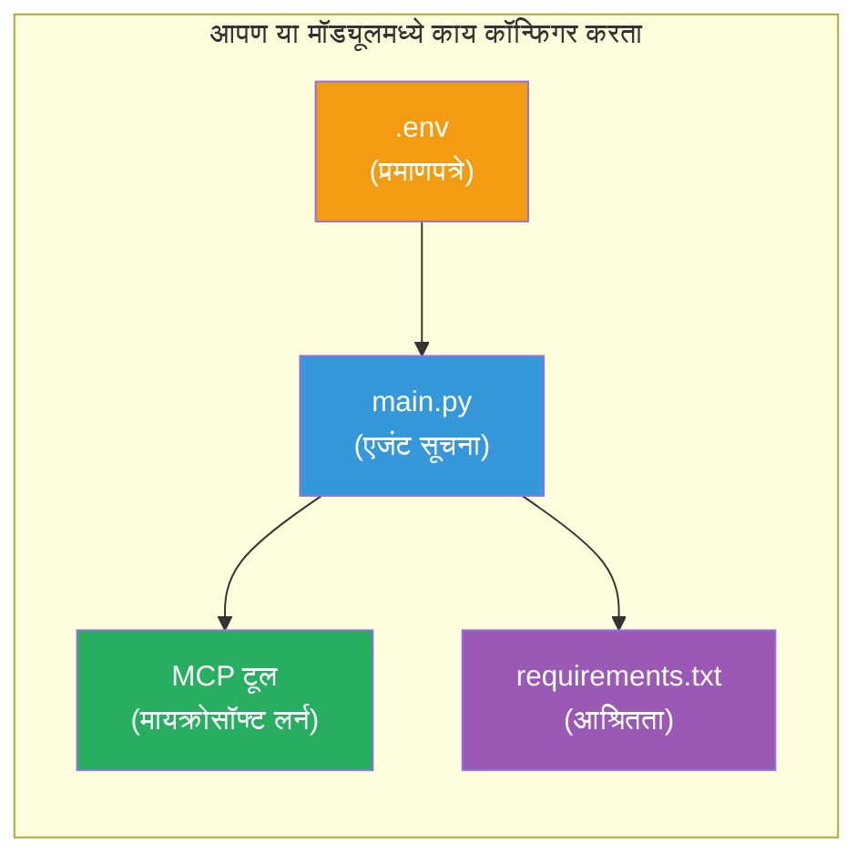

# Module 3 - एजंट्स, MCP टूल आणि एन्व्हायर्नमेंट कॉन्फिगर करा

या मॉड्युलमध्ये, आपण तयार केलेल्या मल्टी-एजंट प्रोजेक्टमध्ये सानुकूलता कराल. आपण सर्व चार एजंटसाठी सूचनांचे लेखन कराल, Microsoft Learn साठी MCP टूल सेट अप कराल, पर्यावरण चल (environment variables) कॉन्फिगर कराल आणि निर्भरता (dependencies) स्थापित कराल.


> **संदर्भ:** संपूर्ण कार्यरत कोड [`PersonalCareerCopilot/main.py`](../../../../../workshop/lab02-multi-agent/PersonalCareerCopilot/main.py) मध्ये आहे. आपले स्वतःचे तयार करताना याचा संदर्भ म्हणून वापरा.

---

## पायरी 1: पर्यावरण चल कॉन्फिगर करा

1. आपल्या प्रोजेक्टच्या मूळ फोल्डरमध्ये **`.env`** फाइल उघडा.
2. आपल्या Foundry प्रोजेक्टची माहिती भरा:

   ```env
   PROJECT_ENDPOINT=https://<your-account>.services.ai.azure.com/api/projects/<your-project>
   MODEL_DEPLOYMENT_NAME=gpt-4.1-mini
   ```

3. फाइल सेव्ह करा.

### ही मूल्ये कुठे शोधायची

| मूल्य | ते कसे शोधायचे |
|-------|-----------------|
| **प्रोजेक्ट एंडपॉइंट** | Microsoft Foundry साइडबार → आपल्या प्रोजेक्टवर क्लिक करा → तपशील दृष्टीमध्ये एंडपॉइंट URL |
| **मॉडेल डिप्लॉयमेंट नाव** | Foundry साइडबार → प्रोजेक्ट विस्तार करा → **Models + endpoints** → वितरित मॉडेलच्या शेजारी नाव |

> **सुरक्षा:** `.env` कोणत्याही आवृत्ती नियंत्रणात कधीही कमिट करू नका. ते `.gitignore` मध्ये आधीपासून नसल्यास जोडा.

### पर्यावरण चल नकाशा

मल्टी-एजंट `main.py` हे सामान्य आणि कार्यशाळा-विशिष्ट env चल नावे दोन्ही वाचतो:

```python
PROJECT_ENDPOINT = os.getenv("AZURE_AI_PROJECT_ENDPOINT") or os.getenv("PROJECT_ENDPOINT")
MODEL_DEPLOYMENT_NAME = os.getenv(
    "AZURE_AI_MODEL_DEPLOYMENT_NAME",
    os.getenv("MODEL_DEPLOYMENT_NAME", "gpt-4.1-mini"),
)
MICROSOFT_LEARN_MCP_ENDPOINT = os.getenv(
    "MICROSOFT_LEARN_MCP_ENDPOINT", "https://learn.microsoft.com/api/mcp"
)
```

MCP एंडपॉइंटसाठी एक योग्य डीफॉल्ट आहे - `.env` मध्ये याची सेटिंग करणे आवश्यक नाही जोपर्यंत आपण ते अधिलेखित करू इच्छित नाही.

---

## पायरी 2: एजंट सूचनांची लेखन करा

ही सर्वात महत्त्वाची पायरी आहे. प्रत्येक एजंटसाठी त्याच्या भूमिका, आउटपुट फॉरमॅट आणि नियम निर्दिष्ट करणाऱ्या काळजीपूर्वक तयार केलेल्या सूचनांची गरज आहे. `main.py` उघडा आणि सूचना स्थिरांक तयार करा (किंवा सुधारणा करा).

### 2.1 बायोडाटा पार्सर एजंट

```python
RESUME_PARSER_INSTRUCTIONS = """\
You are the Resume Parser.
Extract resume text into a compact, structured profile for downstream matching.

Output exactly these sections:
1) Candidate Profile
2) Technical Skills (grouped categories)
3) Soft Skills
4) Certifications & Awards
5) Domain Experience
6) Notable Achievements

Rules:
- Use only explicit or strongly implied evidence.
- Do not invent skills, titles, or experience.
- Keep concise bullets; no long paragraphs.
- If input is not a resume, return a short warning and request resume text.
"""
```

**हे विभाग का?** MatchingAgent ला स्कोअर करण्यासाठी संरचित डेटाची गरज असते. सातत्यपूर्ण विभाग क्रॉस-एजंट हस्तांतरण विश्वासार्ह बनवतात.

### 2.2 नोकरी वर्णन एजंट

```python
JOB_DESCRIPTION_INSTRUCTIONS = """\
You are the Job Description Analyst.
Extract a structured requirement profile from a JD.

Output exactly these sections:
1) Role Overview
2) Required Skills
3) Preferred Skills
4) Experience Required
5) Certifications Required
6) Education
7) Domain / Industry
8) Key Responsibilities

Rules:
- Keep required vs preferred clearly separated.
- Only use what the JD states; do not invent hidden requirements.
- Flag vague requirements briefly.
- If input is not a JD, return a short warning and request JD text.
"""
```

**आवश्यक आणि प्राधान्यक्रम वेगळे का?** MatchingAgent प्रत्येकासाठी भिन्न वजन वापरतो (आवश्यक कौशल्ये = 40 गुण, प्राधान्यक्रम कौशल्ये = 10 गुण).

### 2.3 मॅचिंग एजंट

```python
MATCHING_AGENT_INSTRUCTIONS = """\
You are the Matching Agent.
Compare parsed resume output vs JD output and produce an evidence-based fit report.

Scoring (100 total):
- Required Skills 40
- Experience 25
- Certifications 15
- Preferred Skills 10
- Domain Alignment 10

Output exactly these sections:
1) Fit Score (with breakdown math)
2) Matched Skills
3) Missing Skills
4) Partially Matched
5) Experience Alignment
6) Certification Gaps
7) Overall Assessment

Rules:
- Be objective and evidence-only.
- Keep partial vs missing separate.
- Keep Missing Skills precise; it feeds roadmap planning.
"""
```

**स्पष्ट स्कोअरिंग का?** पुनरुत्पादनीय स्कोअरिंगमुळे रनची तुलना करणे आणि समस्या शोधणे शक्य होते. 100-गुणांचे प्रमाण वापरकर्त्यांना समजायला सोपे आहे.

### 2.4 गॅप एनालायझर एजंट

```python
GAP_ANALYZER_INSTRUCTIONS = """\
You are the Gap Analyzer and Roadmap Planner.
Create a practical upskilling plan from the matching report.

Microsoft Learn MCP usage (required):
- For EVERY High and Medium priority gap, call tool `search_microsoft_learn_for_plan`.
- Use returned Learn links in Suggested Resources.
- Prefer Microsoft Learn for free resources.

CRITICAL: You MUST produce a SEPARATE detailed gap card for EVERY skill listed in
the Missing Skills and Certification Gaps sections of the matching report. Do NOT
skip or combine gaps. Do NOT summarize multiple gaps into one card.

Output format:
1) Personalized Learning Roadmap for [Role Title]
2) One DETAILED card per gap (produce ALL cards, not just the first):
   - Skill
   - Priority (High/Medium/Low)
   - Current Level
   - Target Level
   - Suggested Resources (include Learn URL from tool results)
   - Estimated Time
   - Quick Win Project
3) Recommended Learning Order (numbered list)
4) Timeline Summary (week-by-week)
5) Motivational Note

Rules:
- Produce every gap card before writing the summary sections.
- Keep it specific, realistic, and actionable.
- Tailor to candidate's existing stack.
- If fit >= 80, focus on polish/interview readiness.
- If fit < 40, be honest and provide a staged path.
"""
```

**"CRITICAL" जोर का?** सर्व गॅप कार्ड तयार करण्यासाठी स्पष्ट सूचना न दिल्यास, मॉडेल फक्त 1-2 कार्ड तयार करते आणि बाकीचा संग्रहीत सारांश करते. "CRITICAL" ब्लॉक हा कट ऑउट थांबवतो.

---

## पायरी 3: MCP टूल परिभाषित करा

GapAnalyzer मधील टूल [Microsoft Learn MCP सर्व्हर](https://learn.microsoft.com/azure/foundry/agents/how-to/tools/model-context-protocol) ला कॉल करते. यास `main.py` मध्ये जोडा:

```python
import json
from agent_framework import tool
from mcp.client.session import ClientSession
from mcp.client.streamable_http import streamable_http_client

@tool
async def search_microsoft_learn_for_plan(
    skill: str, role: str = "", max_results: int = 5
) -> str:
    """Search Microsoft Learn MCP and return curated official links for roadmap planning."""
    query = " ".join(part for part in [skill, role, "learning path module"] if part).strip()
    query = query or "job skills learning path"

    try:
        async with streamable_http_client(MICROSOFT_LEARN_MCP_ENDPOINT) as (
            read_stream, write_stream, _,
        ):
            async with ClientSession(read_stream, write_stream) as session:
                await session.initialize()
                result = await session.call_tool(
                    "microsoft_docs_search", {"query": query}
                )

        if not result.content:
            return (
                "No results returned from Microsoft Learn MCP. "
                "Fallback: https://learn.microsoft.com/training/support/catalog-api"
            )

        payload_text = getattr(result.content[0], "text", "")
        data = json.loads(payload_text) if payload_text else {}
        items = data.get("results", [])[:max(1, min(max_results, 10))]

        if not items:
            return f"No direct Microsoft Learn results found for '{skill}'."

        lines = [f"Microsoft Learn resources for '{skill}':"]
        for i, item in enumerate(items, start=1):
            title = item.get("title") or item.get("url") or "Microsoft Learn Resource"
            url = item.get("url") or item.get("link") or ""
            lines.append(f"{i}. {title} - {url}".rstrip(" -"))
        return "\n".join(lines)
    except Exception as ex:
        return (
            f"Microsoft Learn MCP lookup unavailable. Reason: {ex}. "
            "Fallbacks: https://learn.microsoft.com/api/mcp"
        )
```

### टूल कसे कार्य करते

| पायरी | काय होते |
|-------|-----------|
| 1 | GapAnalyzer ठरवते की कौशल्यासाठी संसाधने आवश्यक आहेत (उदा., "Kubernetes") |
| 2 | फ्रेमवर्क कॉल करते `search_microsoft_learn_for_plan(skill="Kubernetes")` |
| 3 | फंक्शन [Streamable HTTP](https://learn.microsoft.com/agent-framework/agents/tools/hosted-mcp-tools) कनेक्शन उघडते `https://learn.microsoft.com/api/mcp` ला |
| 4 | [MCP सर्व्हर](https://learn.microsoft.com/azure/foundry/agents/how-to/tools/model-context-protocol) वर `microsoft_docs_search` ला कॉल करते |
| 5 | MCP सर्व्हर शोध निकाल परत करतो (शीर्षक + URL) |
| 6 | फंक्शन निकाल क्रमांक सूची म्हणून फॉरमॅट करते |
| 7 | GapAnalyzer URL गॅप कार्डमध्ये समाविष्ट करते |

### MCP निर्भरता

MCP क्लायंट लायब्ररी [`agent-framework-core`](https://learn.microsoft.com/agent-framework/overview/) द्वारे अप्रत्यक्षपणे समाविष्ट आहेत. त्यांना `requirements.txt` मध्ये वेगळे जोडण्याची गरज नाही. आयात त्रुटी आल्यास तपासा:

```powershell
pip list | Select-String "mcp"
```

अपेक्षित: `mcp` पॅकेज इन्स्टॉल केलेले आहे (संस्करण 1.x किंवा नंतरचे).

---

## पायरी 4: एजंट आणि वर्कफ्लो कनेक्ट करा

### 4.1 संदर्भ (context) व्यवस्थापकांसह एजंट तयार करा

```python
from contextlib import asynccontextmanager

@asynccontextmanager
async def create_agents():
    async with (
        get_credential() as credential,
        AzureAIAgentClient(
            project_endpoint=PROJECT_ENDPOINT,
            model_deployment_name=MODEL_DEPLOYMENT_NAME,
            credential=credential,
        ).as_agent(
            name="ResumeParser",
            instructions=RESUME_PARSER_INSTRUCTIONS,
        ) as resume_parser,
        AzureAIAgentClient(
            project_endpoint=PROJECT_ENDPOINT,
            model_deployment_name=MODEL_DEPLOYMENT_NAME,
            credential=credential,
        ).as_agent(
            name="JobDescriptionAgent",
            instructions=JOB_DESCRIPTION_INSTRUCTIONS,
        ) as jd_agent,
        AzureAIAgentClient(
            project_endpoint=PROJECT_ENDPOINT,
            model_deployment_name=MODEL_DEPLOYMENT_NAME,
            credential=credential,
        ).as_agent(
            name="MatchingAgent",
            instructions=MATCHING_AGENT_INSTRUCTIONS,
        ) as matching_agent,
        AzureAIAgentClient(
            project_endpoint=PROJECT_ENDPOINT,
            model_deployment_name=MODEL_DEPLOYMENT_NAME,
            credential=credential,
        ).as_agent(
            name="GapAnalyzer",
            instructions=GAP_ANALYZER_INSTRUCTIONS,
            tools=[search_microsoft_learn_for_plan],
        ) as gap_analyzer,
    ):
        yield resume_parser, jd_agent, matching_agent, gap_analyzer
```

**महत्त्वाचे मुद्दे:**
- प्रत्येक एजंटचा स्वतःचा `AzureAIAgentClient` उदाहरण असते
- फक्त GapAnalyzer ला `tools=[search_microsoft_learn_for_plan]` मिळते
- `get_credential()` Azure मध्ये [`ManagedIdentityCredential`](https://learn.microsoft.com/python/api/overview/azure/identity-readme#managed-identity-support) आणि स्थानिकपणे [`DefaultAzureCredential`](https://learn.microsoft.com/azure/developer/python/sdk/authentication/credential-chains#defaultazurecredential-overview) परत करते

### 4.2 वर्कफ्लो ग्राफ तयार करा

```python
def create_workflow(resume_parser, jd_agent, matching_agent, gap_analyzer):
    workflow = (
        WorkflowBuilder(
            name="ResumeJobFitEvaluator",
            start_executor=resume_parser,
            output_executors=[gap_analyzer],
        )
        .add_edge(resume_parser, jd_agent)
        .add_edge(resume_parser, matching_agent)
        .add_edge(jd_agent, matching_agent)
        .add_edge(matching_agent, gap_analyzer)
        .build()
    )
    return workflow.as_agent()
```

> `.as_agent()` पॅटर्न समजण्यासाठी [Workflows as Agents](https://learn.microsoft.com/agent-framework/workflows/as-agents) पहा.

### 4.3 सर्व्हर सुरू करा

```python
async def main() -> None:
    validate_configuration()
    async with create_agents() as (resume_parser, jd_agent, matching_agent, gap_analyzer):
        agent = create_workflow(resume_parser, jd_agent, matching_agent, gap_analyzer)
        from azure.ai.agentserver.agentframework import from_agent_framework
        await from_agent_framework(agent).run_async()

if __name__ == "__main__":
    asyncio.run(main())
```

---

## पायरी 5: वर्चुअल एन्व्हायर्नमेंट तयार करा आणि सुरु करा

### 5.1 एन्व्हायर्नमेंट तयार करा

```powershell
cd workshop\lab02-multi-agent\PersonalCareerCopilot
python -m venv .venv
```

### 5.2 ते सक्रिय करा

**PowerShell (Windows):**
```powershell
.\.venv\Scripts\Activate.ps1
```

**macOS/Linux:**
```bash
source .venv/bin/activate
```

### 5.3 निर्भरता स्थापित करा

```powershell
pip install -r requirements.txt
```

> **टीप:** `requirements.txt` मधील `agent-dev-cli --pre` ओळ नवीनतम प्रिव्ह्यू संस्करण सुनिश्चित करते. हे `agent-framework-core==1.0.0rc3` सह सुसंगततेसाठी आवश्यक आहे.

### 5.4 स्थापना पडताळणे

```powershell
pip list | Select-String "agent-framework|agentserver|agent-dev"
```

अपेक्षित आउटपुट:
```
agent-dev-cli                  0.0.1b260316
agent-framework-azure-ai       1.0.0rc3
agent-framework-core            1.0.0rc3
azure-ai-agentserver-agentframework 1.0.0b16
azure-ai-agentserver-core      1.0.0b16
```

> **जर `agent-dev-cli` जुना आवृत्ती दर्शवत असेल** (उदा., `0.0.1b260119`), तर एजंट इन्स्पेक्टर 403/404 त्रुटींनी अयशस्वी होईल. सुधारणा करा: `pip install agent-dev-cli --pre --upgrade`

---

## पायरी 6: प्रमाणीकरण पडताळा

Lab 01 मधील प्रमाणीकरण तपासणी चालवा:

```powershell
az account show --query "{name:name, id:id}" --output table
```

जर हे अयशस्वी झाले, तर [`az login`](https://learn.microsoft.com/cli/azure/authenticate-azure-cli-interactively) चालवा.

मल्टी-एजंट वर्कफ्लो मध्ये सर्व चार एजंट एकाच क्रेडेन्शियल शेअर करतात. एकासाठी प्रमाणीकरण कार्यरत असल्यास, सर्वांसाठी कार्यरत असते.

---

### तपासणी बिंदू

- [ ] `.env` मध्ये वैध `PROJECT_ENDPOINT` आणि `MODEL_DEPLOYMENT_NAME` मूल्ये आहेत
- [ ] सर्व 4 एजंट सूचना स्थिरांक `main.py` मध्ये परिभाषित आहेत (ResumeParser, JD Agent, MatchingAgent, GapAnalyzer)
- [ ] `search_microsoft_learn_for_plan` MCP टूल GapAnalyzer सोबत परिभाषित आणि नोंदणीकृत आहे
- [ ] `create_agents()` सर्व 4 एजंटसाठी स्वतंत्र `AzureAIAgentClient` उदाहरणे तयार करते
- [ ] `create_workflow()` योग्य ग्राफ `WorkflowBuilder` ने तयार करते
- [ ] वर्चुअल एन्व्हायर्नमेंट तयार आणि सक्रिय (विचित्र `(.venv)` दिसते)
- [ ] `pip install -r requirements.txt` त्रुटीशिवाय पूर्ण होते
- [ ] `pip list` अपेक्षित पॅकेजेस योग्य आवृत्त्याप्रमाणे दर्शवते (rc3 / b16)
- [ ] `az account show` आपले सबस्क्रिप्शन परत करते

---

**मागील:** [02 - Scaffold Multi-Agent Project](02-scaffold-multi-agent.md) · **पुढील:** [04 - Orchestration Patterns →](04-orchestration-patterns.md)

---

<!-- CO-OP TRANSLATOR DISCLAIMER START -->
**अस्वीकरण**:  
हा दस्तऐवज AI भाषांतर सेवा [Co-op Translator](https://github.com/Azure/co-op-translator) वापरून भाषांतरित करण्यात आला आहे. आम्ही अचूकतेसाठी प्रयत्न करतो, पण कृपया लक्षात ठेवा की स्वयंचलित भाषांतरांमध्ये चुका किंवा अचूकतेच्या त्रुटी असू शकतात. मूळ दस्तऐवज त्याच्या स्थानिक भाषेत अधिकृत स्रोत मानला जावा. महत्त्वाच्या माहितीसाठी व्यावसायिक मानवी भाषांतर आवश्यक आहे. या भाषांतराच्या वापरामुळे उद्भवणाऱ्या कुठल्याही गैरसमजुतीसाठी किंवा चुकीच्या अर्थसंधींसाठी आम्ही जबाबदार नाही.
<!-- CO-OP TRANSLATOR DISCLAIMER END -->