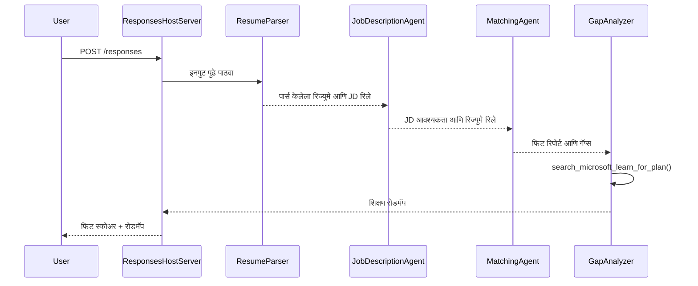

# मॉड्यूल 3 - सूचना, पर्यावरण सेट करा आणि अवलंबन इन्स्टॉल करा

⏱️ ~15 मिनिटे

या मॉड्यूलमध्ये, आपण स्कॅफोल्डेड स्टबला **आपल्या** मल्टी-एजंट वर्कफ्लोमध्ये रूपांतरित करता - पर्यावरण चर सेट करून, एजंट सूचना लिहून, MCP टूल जोडून, वर्कफ्लो ग्राफ वायर करून, आणि अवलंबने इन्स्टॉल करून.

> **संदर्भ:** पूर्ण कार्यरत कोड [`PersonalCareerCopilot/main.py`](../../../../../workshop/lab02-multi-agent/PersonalCareerCopilot/main.py) मध्ये आहे. आपला स्वतःचा वर्कफ्लो ग्राफ आणि प्रॉम्प्ट ब्लॉक्स तयार करताना त्याचा संदर्भ म्हणून वापरा.

---

## चार एजंट एकत्र कसे बसतात


```mermaid
sequenceDiagram
    participant User
    participant Server as ResponsesHostServer
    participant RP as ResumeParser
    participant JD as JobDescriptionAgent
    participant MA as MatchingAgent
    participant GA as GapAnalyzer

    User->>Server: POST /responses
    Server->>RP: इनपुट पुढे पाठवा
    RP-->>JD: पार्स केलेला रिज्युमे आणि JD रिले
    JD-->>MA: JD आवश्यकता आणि रिज्युमे रिले
    MA-->>GA: फिट रिपोर्ट आणि गॅप्स
    GA->>GA: search_microsoft_learn_for_plan()
    GA-->>Server: शिक्षण रोडमॅप
    Server-->>User: फिट स्कोअर + रोडमॅप
```

---

## पाऊल 1: पर्यावरण चर सेट करा

1. आपल्या प्रोजेक्ट रूटमधील **`.env`** फाइल उघडा (स्कॅफोल्ड विजार्डने तयार केलेली).
2. लॅब 01 मधील आपण मिळवलेल्या खऱ्या मूल्यांनी जागा धारण करणारे बदल करा.

<details open>
<summary><strong>🅰️ पाथ A - फाउंड्री सदस्यत्व</strong></summary>

```env
FOUNDRY_PROJECT_ENDPOINT=https://<your-account>.services.ai.azure.com/api/projects/<your-project>
AZURE_AI_MODEL_DEPLOYMENT_NAME=gpt-4.1-mini
```

> **मूल्ये कुठे सापडतील:** पहा [Lab 01, Module 1](../../lab01-single-agent/docs/01-setup.md#deploy-a-model--assign-rbac).

</details>

<details open>
<summary><strong>🅱️ पाथ B - फाउंड्री लोकल</strong></summary>

```env
FOUNDRY_PROJECT_ENDPOINT=http://localhost:5273/v1
AZURE_AI_MODEL_DEPLOYMENT_NAME=phi-4-mini
```

> सर्व इन्फरन्स आपल्या मशीनवर होते - कोणताही डेटा आपल्या उपकरणातून बाहेर जात नाही. 'foundry model list' चालवून अचूक मॉडेल उपनामाचे पुष्टी करा. एकमेव बाह्य विनंती MCP टूल कॉल आहे `https://learn.microsoft.com/api/mcp`.

> **मूल्ये कुठे सापडतील:** पहा [Lab 01, Module 1 - local path](../../lab01-single-agent/docs/01-setup.md#step-2-set-up-based-on-your-access).

</details>

> **सुरक्षितता:** `.env` कधीही व्हर्जन कंट्रोलमध्ये कमिट करू नका. ती `.gitignore` मध्ये आधीच असावी.

---

## पाऊल 2: एजंट सूचना लिहा

सूचना प्रत्येक एजंटची भूमिका, आउटपुट फॉरमॅट आणि नियम स्पष्ट करतात. `main.py` उघडा आणि चार सूचना कायमस्वरूपी स्थिरांक निश्चित करा (किंवा बदला) - पूर्ण स्ट्रींग्ज [`PersonalCareerCopilot/main.py`](../../../../../workshop/lab02-multi-agent/PersonalCareerCopilot/main.py) मध्ये आहेत.

### 2.1 `RESUME_PARSER_INSTRUCTIONS`
रिझ्युमे संरचित उमेदवार प्रोफाइलमध्ये पार्स करते **आणि** नोकरी वर्णन अचूकपणे `[JOB DESCRIPTION PASS-THROUGH]` मध्ये कॉपी करते. आउटपुट मध्ये दोन्ही लेबल केलेले विभाग असणे आवश्यक आहे.

> **पास-थ्रू का?** `context_mode="last_agent"` सह, ResumeParser हा **एकमेव** एजंट आहे जो मूळ वापरकर्ता संदेश पाहतो. जर तो JD पुढे कॉपी केला नाही, तर खालच्या एजंटना कधीच तो दिसणार नाही.

### 2.2 `JOB_DESCRIPTION_INSTRUCTIONS`
ResumeParser आउटपुटमधील `[PARSED RESUME]` आणि `[JOB DESCRIPTION PASS-THROUGH]` वाचतो. `[JD REQUIREMENTS]` (संरचित आवश्यकता) आणि `[PARSED RESUME PASS-THROUGH]` (मॅचिंगएजंटसाठी कच्चा रिझ्युमे कॉपी) आउटपुट करतो.

### 2.3 `MATCHING_AGENT_INSTRUCTIONS`
`[JD REQUIREMENTS]` आणि `[PARSED RESUME PASS-THROUGH]` वाचतो. गुणांकन (0–100) असलेला फिट रिपोर्ट तयार करतो ज्यात गणितीय तपशील, जुळणाऱ्या कौशल्ये, गहाळ कौशल्ये, आणि अनुभवाची सुसंगती असते.

### 2.4 `GAP_ANALYZER_INSTRUCTIONS`
फिट रिपोर्ट वाचतो. प्रत्येक गहाळ कौशल्यासाठी `search_microsoft_learn_for_plan` कॉल करतो जेणेकरून Microsoft Learn संसाधने मिळवता येतील. प्रत्येक कौशल्यासाठी तपशीलवार गॅप कार्ड आणि आठवड्यांनिहाय शिक्षण रोडमॅप तयार करतो.

---

## पाऊल 3: MCP टूल जोडा

GapAnalyzer [Microsoft Learn MCP सर्व्हर](https://learn.microsoft.com/azure/foundry/agents/how-to/tools/model-context-protocol) कॉल करतो ज्यामुळे प्रत्येक कौशल्याच्या तफावतसाठी खरे शिक्षण संसाधने मिळतात. पूर्ण `search_microsoft_learn_for_plan` फंक्शन [`PersonalCareerCopilot/main.py`](../../../../../workshop/lab02-multi-agent/PersonalCareerCopilot/main.py) मध्ये आहे.

एजंट तयार करताना GapAnalyzer वर टूल नोंदणी करा:

```python
gap_analyzer = Agent(
    client=client,
    instructions=GAP_ANALYZER_INSTRUCTIONS,
    name="GapAnalyzer",
    tools=[search_microsoft_learn_for_plan],
)
```

> पूर्ण `WorkflowBuilder` ग्राफसह `FoundryChatClient`, `AgentExecutor`, आणि सर्व `add_edge()` कॉल पाहण्यासाठी [`PersonalCareerCopilot/main.py`](../../../../../workshop/lab02-multi-agent/PersonalCareerCopilot/main.py) पहा.

---

## पाऊल 4: आभासी पर्यावरण तयार करा आणि अवलंबने इन्स्टॉल करा

> ⚠️ **हा टप्पा वगळू नका.** अवलंबने इन्स्टॉल नसल्याशिवाय, F5 डीबगिंग अयशस्वी होईल.

### 4.1 आभासी पर्यावरण तयार करा

```powershell
python -m venv .venv
```

### 4.2 ते सक्रिय करा

| OS | आदेश |
|----|---------|
| **विंडोज (PowerShell)** | `.\.venv\Scripts\Activate.ps1` |
| **विंडोज (CMD)** | `.venv\Scripts\activate.bat` |
| **macOS / Linux** | `source .venv/bin/activate` |

आपल्या टर्मिनल प्रॉम्प्टमध्ये `(.venv)` दिसायला हवे.

### 4.3 अवलंबने इन्स्टॉल करा

```powershell
pip install -r requirements.txt
```

### 4.4 सत्यापित करा

```powershell
pip list | Select-String "agent-framework|mcp|debugpy"
```

अपेक्षित: `agent-framework-foundry`, `agent-framework-foundry-hosting`, `mcp`, आणि `debugpy` यादीत आहेत.

---

## पाऊल 5: प्रमाणीकरण सत्यापित करा

<details open>
<summary><strong>🅰️ पाथ A - Azure क्रेडेन्शियल</strong></summary>

```powershell
az account show --query "{name:name, id:id}" --output table
```

हे अयशस्वी झाल्यास, [`az login`](https://learn.microsoft.com/cli/azure/authenticate-azure-cli-interactively) चालवा.

सर्व चार एजंट एकाच `FoundryChatClient` आणि एकाच `DefaultAzureCredential` शेअर करतात. जर एका एजंटसाठी प्रमाणीकरण कार्यान्वित झाले, तर सर्वांसाठी चालेल.

</details>

<details open>
<summary><strong>🅱️ पाथ B - फाउंड्री लोकल</strong></summary>

लोकल चाचणीसाठी कोणतीही प्रमाणीकरण आवश्यक नाही.

</details>

---

### ✅ तपासणी बिंदू

> मॉड्यूल 04 कडे पुढे जाण्याआधी: **(1)** `(.venv)` आपल्या प्रॉम्प्टमध्ये दिसणे आणि **(2)** `pip install -r requirements.txt` यशस्वीपणे पूर्ण होणे आवश्यक आहे.

- [ ] `.env` मध्ये वैध एंडपॉईंट आणि मॉडेल डिप्लॉयमेंट नाव (जागा धारण करणारे नाहीत)
- [ ] सर्व 4 एजंट सूचना स्थिरांक `main.py` मध्ये परिभाषित (ResumeParser, JD Agent, MatchingAgent, GapAnalyzer)
- [ ] `search_microsoft_learn_for_plan` MCP टूल परिभाषित आणि GapAnalyzer वर नोंदणीकृत
- [ ] `FoundryChatClient` + 4 `Agent` + 4 `AgentExecutor` ऑब्जेक्ट्स `main()` मध्ये तयार
- [ ] `WorkflowBuilder` सर्व 3 `add_edge()` कॉलांसह योग्य अनुक्रमिक ग्राफ तयार करतो
- [ ] आभासी वातावरण तयार आणि सक्रिय (`(.venv)` प्रॉम्प्टमध्ये दिसत आहे)
- [ ] `pip install -r requirements.txt` त्रुटीशिवाय पूर्ण
- [ ] **पाथ A:** `az account show` यशस्वी आहे किंवा VS Code खात्यादर्शकावर साइन-इन खाते दाखवले जाते

---

**मागील:** [02 - स्कॅफोल्ड मल्टी-एजंट प्रोजेक्ट](02-scaffold-multi-agent.md) · **पुढील:** [04 - ऑर्केस्ट्रेशन पॅटर्न्स →](04-orchestration-patterns.md)

---

<!-- CO-OP TRANSLATOR DISCLAIMER START -->
**अस्वीकरण**:
हा दस्तऐवज AI भाषांतर सेवा [Co-op Translator](https://github.com/Azure/co-op-translator) चा वापर करून अनुवादित केला आहे. जरी आम्ही अचूकतेसाठी प्रयत्न करतो, तरी कृपया लक्षात घ्या की स्वयंचलित भाषांतरांमध्ये त्रुटी किंवा अचूकतेची कमतरता असू शकते. मूळ दस्तऐवज त्याच्या मूळ भाषेत अधिकृत स्रोत मानला पाहिजे. महत्त्वाची माहिती असल्यास, व्यावसायिक मानवी भाषांतराची शिफारस केली जाते. या भाषांतराच्या वापरामुळे उद्भवणाऱ्या कोणत्याही गैरसमज किंवा चुकीच्या अर्थलावणीसाठी आम्ही जबाबदार नाही.
<!-- CO-OP TRANSLATOR DISCLAIMER END -->