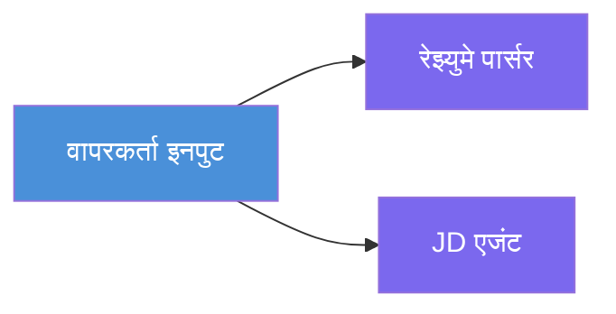
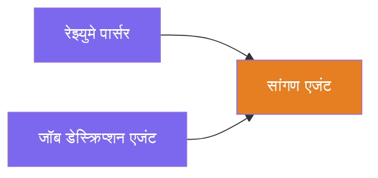
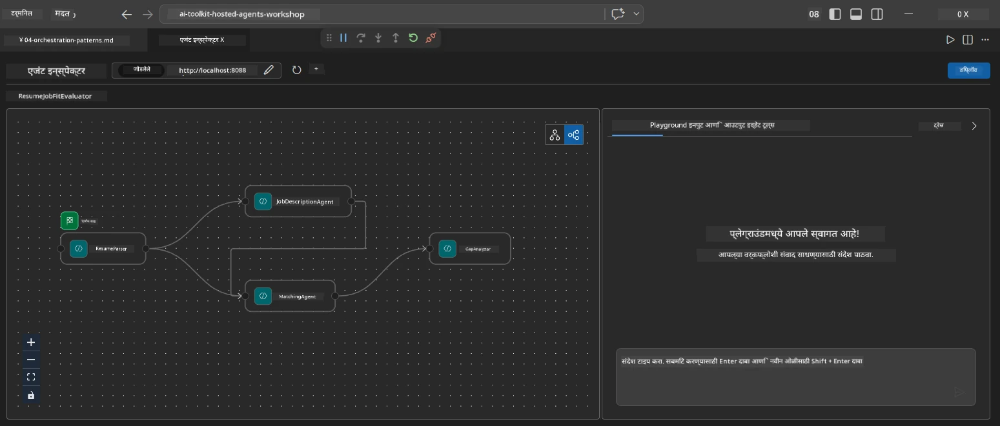
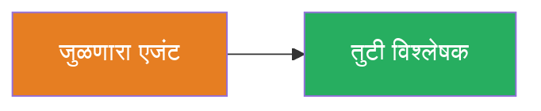
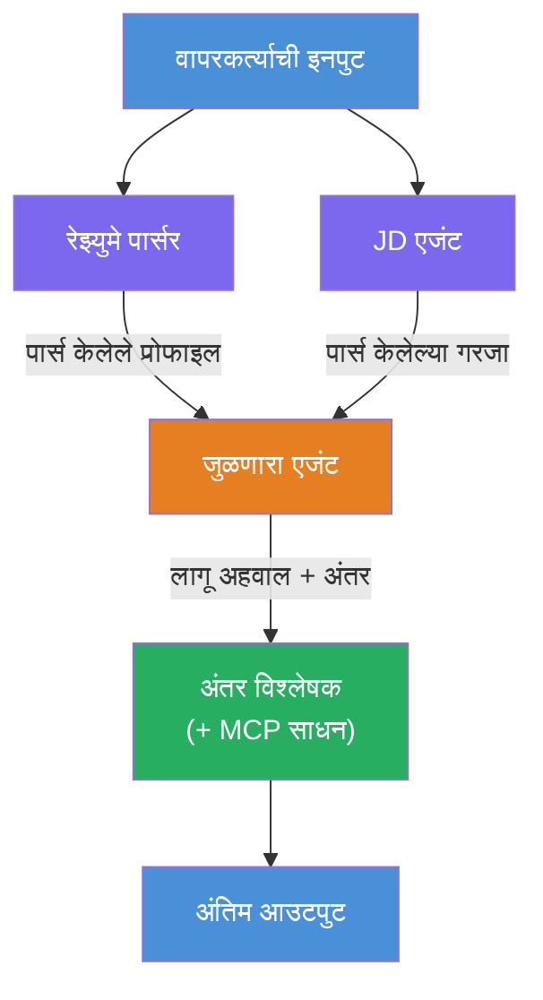
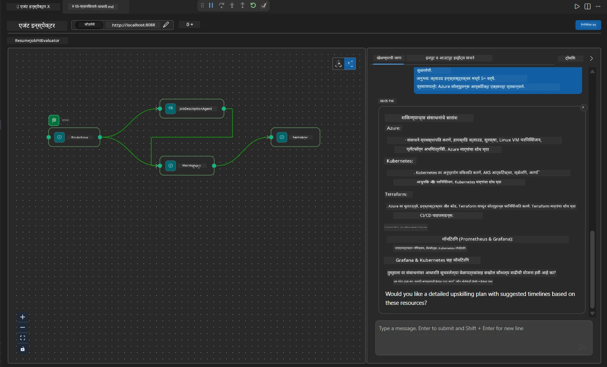

# Module 4 - ऑर्केस्ट्रेशन पॅटर्न्स

या मॉड्यूलमध्ये, तुम्ही Resume Job Fit Evaluator मध्ये वापरलेले ऑर्केस्ट्रेशन पॅटर्न्स एक्सप्लोर करता आणि वर्कफ्लो ग्राफ वाचणे, संपादित करणे, आणि विस्तारित करणे शिकता. या पॅटर्न्स समजून घेणे डेटा फ्लो समस्यांचे डिबगिंग करण्यासाठी आणि तुमचे स्वतःचे [मल्टि-एजंट वर्कफ्लो](https://learn.microsoft.com/agent-framework/workflows/) तयार करण्यासाठी आवश्यक आहे.

---

## पॅटर्न 1: फॅन-आउट (समांतर विभागणी)

वर्कफ्लोमधील पहिला पॅटर्न म्हणजे **फॅन-आउट** - एकल इनपुट एकाच वेळी अनेक एजंट्सकडे पाठवला जातो.


कोडमध्ये, हे होते कारण `resume_parser` हा `start_executor` आहे - तो वापरकर्त्याचा संदेश प्रथम प्राप्त करतो. मग, कारण `jd_agent` आणि `matching_agent` दोघांनाही `resume_parser` कडून एज आहेत, फ्रेमवर्क `resume_parser` चा आउटपुट दोन्ही एजंट्सकडे मार्गदर्शन करतो:

```python
.add_edge(resume_parser, jd_agent)         # ResumeParser आउटपुट → JD एजंट
.add_edge(resume_parser, matching_agent)   # ResumeParser आउटपुट → मॅचिंगएजंट
```

**हे का कार्य करते:** ResumeParser आणि JD Agent त्या इनपुटच्या वेगवेगळ्या पैलूंची प्रक्रिया करतात. त्यांना समांतरपणे चालवल्याने एकुण विलंब कमीतकमी होतो, तळोपरी रीत्या चालवण्याच्या तुलनेत.

### फॅन-आउट वापरण्याच्या वेळा

| वापर प्रकरण | उदाहरण |
|----------|---------|
| स्वतंत्र उपकार्ये | रिज्युमे पार्सिंग वि. JD पार्सिंग |
| पुनरावृत्ती / मतदान | दोन एजंट्स एकाच डेटावर विश्लेषण करतात, तिसरा सर्वोत्तम उत्तर निवडतो |
| बहु-फॉरमॅट आउटपुट | एक एजंट मजकूर तयार करतो, दुसरा संरचित JSON तयार करतो |

---

## पॅटर्न 2: फॅन-इन (एकत्रीकरण)

दुसरा पॅटर्न म्हणजे **फॅन-इन** - अनेक एजंट्सचे आउटपुट एकत्र करून एका खालील एजंटला पाठवले जाते.


कोडमध्ये:

```python
.add_edge(resume_parser, matching_agent)   # ResumeParser आउटपुट → MatchingAgent
.add_edge(jd_agent, matching_agent)        # JD Agent आउटपुट → MatchingAgent
```

**महत्त्वाचे वर्तन:** जेव्हा एखाद्या एजंटकडे **दोन किंवा अधिक इनकमिंग एज** असतात, फ्रेमवर्क स्वयंचलितपणे सर्व वरच्या एजंट्स पूर्ण होईपर्यंत खालील एजंट सुरू होण्यास वाट पाहतो. MatchingAgent फक्त तेव्हाच सुरू होतो जेव्हा ResumeParser आणि JD Agent दोघेही पूर्ण होतात.

### MatchingAgent काय प्राप्त करतो

फ्रेमवर्क सर्व वरच्या एजंट्सचे आउटपुट एकत्र करतो. MatchingAgentची इनपुट अशी दिसते:

```
[ResumeParser output]
---
Candidate Profile:
  Name: Jane Doe
  Technical Skills: Python, Azure, Kubernetes, ...
  ...

[JobDescriptionAgent output]
---
Role Overview: Senior Cloud Engineer
Required Skills: Python, Azure, Terraform, ...
...
```

> **टीप:** अचूक एकत्रीकरणाचा फॉरमॅट फ्रेमवर्कच्या आवृत्तीवर अवलंबून असतो. एजंटच्या सूचना अशा प्रकारे लिहाव्यात की त्या संरचित आणि असंरचित वरच्या आउटपुट्सना दोन्ही हाताळू शकतील.



---

## पॅटर्न 3: क्रमिक साखळी

तिसरा पॅटर्न म्हणजे **क्रमिक साखळी** - एका एजंटचे आउटपुट थेट पुढील एजंटला पुरवले जाते.


कोडमध्ये:

```python
.add_edge(matching_agent, gap_analyzer)    # MatchingAgent आउटपुट → GapAnalyzer
```

हा सर्वात सोपा पॅटर्न आहे. GapAnalyzer ला MatchingAgentचा फिट स्कोअर, जुळलेल्या/गहाळ कौशल्ये आणि गॅप्स मिळतात. नंतर तो प्रत्येक गॅपसाठी [MCP टूल](https://learn.microsoft.com/azure/foundry/agents/how-to/tools/model-context-protocol) कॉल करून Microsoft Learn स्रोत प्राप्त करतो.

---

## पूर्ण ग्राफ

या तीनही पॅटर्न्स एकत्र करून पूर्ण वर्कफ्लो तयार होतो:


### एक्सिक्युशन टाइमलाइन

```mermaid
gantt
    title एजंट अंमलबजावणी कालरेषा
    dateFormat X
    axisFormat %s

    section समांतर
    पुनरारंभ पार्सर       :rp, 0, 3
    जॉब वर्णन एजंट            :jd, 0, 2

    section क्रमाने
    जुळणारा एजंट      :ma, 3, 5
    अंतर विश्लेषक        :ga, 5, 9
```


> एकूण वेळ सुमारे `max(ResumeParser, JD Agent) + MatchingAgent + GapAnalyzer` एवढा आहे. GapAnalyzer सर्वसाधारणपणे सर्वात मंदगतीचा असतो कारण तो अनेक MCP टूल कॉल्स करतो (प्रत्येक गॅपसाठी एक).

---

## WorkflowBuilder कोड वाचणे

`main.py` मधील पूर्ण `create_workflow()` फंक्शन येथे आहे, विषद केलेले:

```python
def create_workflow(resume_parser, jd_agent, matching_agent, gap_analyzer):
    workflow = (
        WorkflowBuilder(
            name="ResumeJobFitEvaluator",

            # वापरकर्ता इनपुट प्राप्त करणारा पहिला एजंट
            start_executor=resume_parser,

            # एजंट(स) ज्यांचे आउटपुट अंतिम प्रतिसाद बनते
            output_executors=[gap_analyzer],
        )
        # फॅन-आऊट: ResumeParser चे आउटपुट दोन्ही JD एजंट आणि MatchingAgent कडे जाते
        .add_edge(resume_parser, jd_agent)
        .add_edge(resume_parser, matching_agent)

        # फॅन-इन: MatchingAgent दोन्ही ResumeParser आणि JD एजंटची वाट पाहतो
        .add_edge(jd_agent, matching_agent)

        # अनुक्रमिक: MatchingAgent चे आउटपुट GapAnalyzer ला दिले जाते
        .add_edge(matching_agent, gap_analyzer)

        .build()
    )
    return workflow.as_agent()
```

### एज सारांश तालिका

| क्र. | एज | पॅटर्न | प्रभाव |
|---|------|---------|--------|
| 1 | `resume_parser → jd_agent` | फॅन-आउट | JD Agent ला ResumeParser चे आउटपुट (तसेच मूळ वापरकर्ता इनपुट) प्राप्त होते |
| 2 | `resume_parser → matching_agent` | फॅन-आउट | MatchingAgent ला ResumeParser चे आउटपुट प्राप्त होते |
| 3 | `jd_agent → matching_agent` | फॅन-इन | MatchingAgent ला JD Agent चे आउटपुट सुद्धा प्राप्त होते (दोन्हीची वाट पाहतो) |
| 4 | `matching_agent → gap_analyzer` | क्रमिक | GapAnalyzer ला फिट रिपोर्ट + गॅप यादी प्राप्त होते |

---

## ग्राफ संपादित करणे

### नवीन एजंट जोडणे

पाचवा एजंट जोडण्यासाठी (उदाहरणार्थ, **InterviewPrepAgent** जो गॅप विश्लेषणावर आधारित मुलाखतीच्या प्रश्नांची निर्मिती करतो):

```python
# 1. सूचनांची व्याख्या करा
INTERVIEW_PREP_INSTRUCTIONS = """\
You are the Interview Prep Agent.
Given a gap analysis and fit report, generate 10 targeted interview questions
the candidate should prepare for.
"""

# 2. एजंट तयार करा (async with ब्लॉकच्या आत)
AzureAIAgentClient(
    project_endpoint=PROJECT_ENDPOINT,
    model_deployment_name=MODEL_DEPLOYMENT_NAME,
    credential=credential,
).as_agent(
    name="InterviewPrepAgent",
    instructions=INTERVIEW_PREP_INSTRUCTIONS,
) as interview_prep,

# 3. create_workflow() मध्ये एजेस जोडा
.add_edge(matching_agent, interview_prep)   # फिट रिपोर्ट प्राप्त होते
.add_edge(gap_analyzer, interview_prep)     # गॅप कार्ड्स देखील प्राप्त होतात

# 4. output_executors अपडेट करा
output_executors=[interview_prep],  # आता अंतिम एजंट
```

### एक्सिक्युशन क्रम बदला

JD Agent ला ResumeParser नंतर चालवण्यासाठी (समांतरऐवजी क्रमिक):

```python
# काढा: .add_edge(resume_parser, jd_agent) ← आधीच अस्तित्वात आहे, तसेच ठेवा
# jd_agent ला थेट युझर इनपुट न मिळवून गुप्त समांतरता काढा
# start_executor प्रथम resume_parser कडे पाठवतो, आणि jd_agent फक्त प्राप्त होतो
# resume_parser चा आउटपुट एजद्वारे. हे त्यांना अनुक्रमिक बनवते.
```

> **महत्त्वाचे:** `start_executor` हा तो एकमेव एजंट आहे जो मूळ वापरकर्ता इनपुट प्राप्त करतो. सर्व इतर एजंट्सना त्यांच्या वरच्या एज्ल कडून आउटपुट मिळतो. जर एखादा एजंटना मूळ वापरकर्ता इनपुट सुद्धा मिळवायचा असेल तर त्याच्याकडे `start_executor` कडून एज असणे आवश्यक आहे.

---

## सामान्य ग्राफ चुका

| चूक | लक्षण | दुरुस्ती |
|---------|---------|-----|
| `output_executors` कडे एज गहाळ | एजंट चालतो पण आउटपुट रिकामे | `start_executor` पासून प्रत्येक `output_executors` एजंटपर्यंत मार्ग असल्याची खात्री करा |
| सरक्युलर अवलंबित्व | अनंत लूप किंवा टाइमआउट | कोणताही एजंट वरच्या एजंटकडे फीडबॅक देत नाही याची तपासणी करा |
| `output_executors` मधील एजंटचे कोणतेही इनकमिंग एज नाही | आउटपुट रिकामे | किमान एक `add_edge(source, that_agent)` जोडा |
| अनेक `output_executors` पण फॅन-इन नाही | आउटपुट फक्त एका एजंटचा प्रतिसाद दाखवतो | एक संग्राहक एजंट वापरा किंवा अनेक आउटपुट स्वीकारा |
| `start_executor` नसणे | बिल्ड वेळेत `ValueError` | नेहमी `WorkflowBuilder()` मध्ये `start_executor` निश्चित करा |

---

## ग्राफ डिबगिंग

### Agent Inspector वापरणे

1. एजंट स्थानिकपणे प्रारंभ करा (F5 किंवा टर्मिनल - पहा [Module 5](05-test-locally.md)).
2. Agent Inspector उघडा (`Ctrl+Shift+P` → **Foundry Toolkit: Open Agent Inspector**).
3. एक टेस्ट मेसेज पाठवा.
4. Inspector च्या प्रतिसाद पॅनेलमध्ये **स्ट्रीमिंग आउटपुट** शोधा - ते प्रत्येकी एजंटचा अनुक्रमे योगदान दाखवते.



### लॉगिंग वापरणे

डेटा फ्लो ट्रेस करण्यासाठी `main.py` वर लॉगिंग जोडा:

```python
import logging
logger = logging.getLogger("resume-job-fit")

# create_workflow() मध्ये, तयार केल्यानंतर:
logger.info("Workflow graph built with edges: RP→JD, RP→MA, JD→MA, MA→GA")
```

सर्व्हर लॉग एजंटची एक्सिक्युशन क्रम आणि MCP टूल कॉल्स दाखवतात:

```
INFO:resume-job-fit:Starting Resume -> Job Fit Evaluator HTTP server...
INFO:resume-job-fit:Server running on http://localhost:8088
INFO:agent_framework:Executing agent: ResumeParser
INFO:agent_framework:Executing agent: JobDescriptionAgent
INFO:agent_framework:Waiting for upstream agents: ResumeParser, JobDescriptionAgent
INFO:agent_framework:Executing agent: MatchingAgent
INFO:agent_framework:Executing agent: GapAnalyzer
INFO:agent_framework:Tool call: search_microsoft_learn_for_plan(skill="Kubernetes")
POST https://learn.microsoft.com/api/mcp → 200
INFO:agent_framework:Tool call: search_microsoft_learn_for_plan(skill="Terraform")
POST https://learn.microsoft.com/api/mcp → 200
```

---

### चेकपॉइंट

- [ ] तुम्ही वर्कफ्लोमधील तीन ऑर्केस्ट्रेशन पॅटर्न्स ओळखू शकता: फॅन-आउट, फॅन-इन, आणि क्रमिक साखळी
- [ ] तुम्हाला समजले आहे की अनेक इनकमिंग एज असलेल्या एजंट्स सर्व वरच्या एजंट्स पूर्ण होईपर्यंत थांबतात
- [ ] तुम्ही `WorkflowBuilder` कोड वाचू शकता आणि प्रत्येक `add_edge()` कॉलला व्हिज्युअल ग्राफमध्ये मॅप करू शकता
- [ ] तुम्हाला एक्सिक्युशन टाइमलाइन समजली आहे: समांतर एजंट्स प्रथम चालतात, नंतर एकत्रीकरण, मग क्रमिक
- [ ] तुम्हाला ग्राफमध्ये नवीन एजंट कसा जोडायचा ते कळते (सूचना निश्चित करा, एजंट तयार करा, एज जोडा़, आउटपुट अपडेट करा)
- [ ] तुम्ही सामान्य ग्राफ चुका आणि त्यांची लक्षणे ओळखू शकता

---

**पूर्वीचे:** [03 - Configure Agents & Environment](03-configure-agents.md) · **पुढे:** [05 - Test Locally →](05-test-locally.md)

---

<!-- CO-OP TRANSLATOR DISCLAIMER START -->
**अस्वीकरण**:  
हा दस्तऐवज AI भाषांतर सेवा [Co-op Translator](https://github.com/Azure/co-op-translator) वापरून अनुवादित केला आहे. आम्ही अचूकतेचा प्रयत्न करतो, परंतु कृपया जाणीव ठेवा की स्वयंचलित भाषांतरांमध्ये चुका किंवा अचूकतेचा अभाव असू शकतो. मूळ दस्तऐवज त्याच्या स्थानिक भाषेत अधिकृत स्रोत मानला जावा. महत्त्वाच्या माहितीसाठी व्यावसायिक मानवी भाषांतराची शिफारस केली जाते. या भाषांतराचा वापर केल्यामुळे उद्भवणाऱ्या कोणत्याही गैरसमजात किंवा गैरवाचनासाठी आम्ही जबाबदार नाही.
<!-- CO-OP TRANSLATOR DISCLAIMER END -->