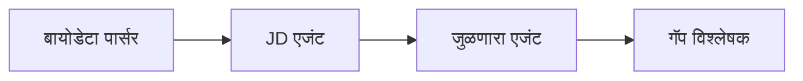
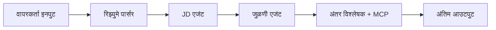

# मॉड्यूल ४ - ऑर्केस्ट्रेशन नमुने

⏱️ ~१० मिनिटे

या मॉड्यूलमध्ये, तुम्ही Resume Job Fit Evaluator मध्ये वापरलेले ऑर्केस्ट्रेशन नमुने एक्सप्लोर करता आणि वर्कफ्लो ग्राफ कसा वाचायचा, सुधारायचा आणि विस्तृत करायचा हे शिका. या नमुन्यांना समजून घेणे महत्त्वाचे आहे जेणेकरून डेटा फ्लोचे अडचणीचे निराकरण करता येईल आणि स्वतःचे [मल्टि-एजंट वर्कफ्लो](https://learn.microsoft.com/agent-framework/workflows/) तयार करता येतील.

---

## नमुना १: अनुक्रमिक साखळी

वर्कफ्लोमधील मूलभूत नमुना म्हणजे **अनुक्रमिक साखळी** - प्रत्येक एजंटचे आउटपुट थेट पुढील एजंटमध्ये जाते.


```mermaid
flowchart LR
    RP[बायोडेटा पार्सर] --> JD[JD एजंट]
    JD --> MA[जुळणारा एजंट]
    MA --> GA[गॅप विश्लेषक]
```

कोडमध्ये, प्रत्येक `add_edge()` कॉल साखळीतील एक पायरी तयार करते:

```python
.add_edge(resume_executor, jd_executor)       # रेस्युमे पार्सर आउटपुट → JD एजंट
.add_edge(jd_executor, matching_executor)     # JD एजंट आउटपुट → मॅचिंग एजंट
.add_edge(matching_executor, gap_executor)    # मॅचिंग एजंट आउटपुट → गॅप अनालायझर
```

> **का अनुक्रमिक, फॅन-आऊट/फॅन-इन नाही?** `WorkflowBuilder` येणाऱ्या एजेसाठी **OR-समानार्थकता** वापरतो: एका खालील एजंटाने जसेच **कोणताही** अग्रगण्य एजंट पूर्ण केल्यावर ती ट्रिगर करते. जर `matching_executor` ला दोन येणाऱ्या एजेस असत्या (दोन्ही `resume_executor` आणि `jd_executor` कडून), तर तो दोन वेळा ट्रिगर व्हावा लागेल - एकदा ResumeParser पूर्ण झाल्यावर आणि पुन्हा JD Agent पूर्ण झाल्यावर - ज्यामुळे GapAnalyzer देखील दोन वेळा चालेल आणि आउटपुट दोन वेळा दिसेल. अनुक्रमिक प्रक्रिया पध्दतीने याचा पूर्णपणे टाळणी होते.

## नमुना २: कंटेंट रिले

कारण `context_mode="last_agent"` चा अर्थ प्रत्येक एजंट केवळ त्याचा **थेट आधीचा एजंटचा आउटपुट** पाहू शकतो, अनुक्रमिक साखळीत एजंट्सना खालील एजंटना आवश्यक असलेली कोणतीही डेटा स्पष्टपणे पुढे द्यावी लागते.

या वर्कफ्लोमध्ये:
- **ResumeParser** JD कागदपत्र `[JOB DESCRIPTION PASS-THROUGH]` मध्ये अगदी तसाच कॉपी करतो (जेणेकरून JD Agent ते शोधू शकेल).
- **JD Agent** `[PARSED RESUME]` अगदी तसाच `[PARSED RESUME PASS-THROUGH]` मध्ये कॉपी करतो (जेणेकरून MatchingAgent हे दोन्ही प्रोफाइल्स तुलना करू शकेल).

```
ResumeParser output
└─ [PARSED RESUME]               ← extracted by JD Agent
└─ [JOB DESCRIPTION PASS-THROUGH] ← extracted by JD Agent

JD Agent output
└─ [JD REQUIREMENTS]             ← extracted by MatchingAgent
└─ [PARSED RESUME PASS-THROUGH]  ← extracted by MatchingAgent
```

प्रत्येक रिले विभाग **अचूक** कॉपी करणे आवश्यक आहे - त्याचे सारांश किंवा परिभाषा करणे खालील एजंटला ज्यावर अवलंबून आहे तो बिघडवते.

---

## संपूर्ण ग्राफ

अनुक्रमिक साखळी आणि कंटेंट रिले नमुन्यांचे संयोजन संपूर्ण वर्कफ्लो तयार करते:


```mermaid
flowchart LR
    U[वापरकर्ता इनपुट] --> RP[रिझ्युमे पार्सर]
    RP --> JD[JD एजंट]
    JD --> MA[जुळणी एजंट]
    MA --> GA[अंतर विश्लेषक + MCP]
    GA --> O[अंतिम आउटपुट]
```

एजंट इन्स्पेक्टर हा एजंट स्थानिकपणे चालवताना हा ग्राफ स्ट्रक्चर दाखवतो. स्क्रीनशॉटसाठी [मॉड्यूल ५ - स्थानिक चाचणी](05-test-locally.md) पहा.

---

## WorkflowBuilder कोड वाचन

पूर्ण `create_workflow()` फंक्शन्स [`PersonalCareerCopilot/main.py`](../../../../../workshop/lab02-multi-agent/PersonalCareerCopilot/main.py) मध्ये आहे. तीन `add_edge()` कॉल्स अनुक्रमिक पाइपलाइन तयार करतात:

| # | एज | परिणाम |
|---|------|--------|
| १ | `resume_executor → jd_executor` | JD Agent ला `[PARSED RESUME]` + `[JOB DESCRIPTION PASS-THROUGH]` मिळतात |
| २ | `jd_executor → matching_executor` | MatchingAgent ला `[JD REQUIREMENTS]` + `[PARSED RESUME PASS-THROUGH]` मिळतात |
| ३ | `matching_executor → gap_executor` | GapAnalyzer ला फिट रिपोर्ट + गॅप लिस्ट मिळते |

---

## ग्राफमध्ये बदल करणे

### नवीन एजंट जोडणे

जर पाचवा एजंट (उदा., GapAnalyzer नंतर **InterviewPrepAgent**) जोडायचा असल्यास:

१. `INTERVIEW_PREP_INSTRUCTIONS` कॉन्स्टंट Define करा.
२. `Agent` + `AgentExecutor` ऑब्जेक्ट्स तयार करा (आधीच्या चार एजंटप्रमाणेच नमुना वापरा).
३. `WorkflowBuilder` मध्ये `.add_edge(gap_executor, interview_exec)` जोडा.
४. `output_executors=[interview_exec]` अपडेट करा.

> **महत्त्वाचे:** `start_executor` हा एकमेव एजंट आहे जो थेट वापरकर्त्याचा इनपुट घेतो. इतर सर्व एजंट्स त्यांचा आउटपुट upstream एजेसवरून घेतात.

---

## सामान्य ग्राफ चुका

| चूक | लक्षण | दुरुस्ती |
|---------|---------|-----|
| `output_executors` कडे एज अॅड नसेल | एजंट चालतो पण आउटपुट रिकामे असते | `start_executor` पासून प्रत्येक `output_executors` एजंटपर्यंत मार्ग आहे याची खात्री करा |
| सर्क्युलर डिपेंडन्सी | अनंत लूप किंवा timeout | पाहा की कोणताही एजंट upstream एजंटमध्ये फीडबॅक देत नाहीये |
| `output_executors` मधील एजंटला कोठूनही एज येत नसेल | रिकामी आउटपुट | किमान एक `add_edge(source, that_agent)` जोडा |
| फॅन-इन नसलेल्या मल्टिपल `output_executors` | आउटपुटमध्ये फक्त एका एजंटचा प्रतिसाद असतो | एकत्र करणारा एकच आउटपुट एजंट वापरा किंवा अनेक आउटपुट स्वीकारा |
| `start_executor` गहाळ | बिल्ड वेळेस `ValueError` | नेहमी `WorkflowBuilder()` मध्ये `start_executor` निर्दिष्ट करा |

---

## ग्राफ डीबगिंग

### एजंट इन्स्पेक्टर वापरणे

१. F5 दाबून एजंट स्थानिकरित्या सुरू करा.
२. एजंट इन्स्पेक्टर उघडा (`Ctrl+Shift+P` → **Foundry Toolkit: Open Agent Inspector**).
३. टेस्ट मेसेज पाठवा.
४. इन्स्पेक्टरच्या प्रतिसाद पॅनेलमध्ये, **स्ट्रीमिंग आउटपुट** पहा - हे प्रत्येक एजंटचा अंशक्रम दाखवते.


### लॉगिंग वापरणे

`main.py` मध्ये डेटा फ्लो ट्रेस करण्यासाठी लॉगिंग जोडा:

```python
import logging
logger = logging.getLogger("resume-job-fit")

# मुख्य() मध्ये, कार्यप्रवाह तयार केल्यानंतर:
logger.info("Workflow graph built with edges: RP→JD, JD→MA, MA→GA")
```

सर्व्हर लॉग एजंटची अंमलबजावणी क्रम आणि MCP टूल कॉल दर्शवितात:

```
INFO:agent_framework:Executing agent: ResumeParser
INFO:agent_framework:Executing agent: JobDescriptionAgent
INFO:agent_framework:Executing agent: MatchingAgent
INFO:agent_framework:Executing agent: GapAnalyzer
INFO:agent_framework:Tool call: search_microsoft_learn_for_plan(skill="Kubernetes")
POST https://learn.microsoft.com/api/mcp → 200
INFO:agent_framework:Tool call: search_microsoft_learn_for_plan(skill="Terraform")
POST https://learn.microsoft.com/api/mcp → 200
```

---

### चेकपॉइंट

- [ ] तुम्ही वर्कफ्लोमधील दोन ऑर्केस्ट्रेशन नमुने ओळखू शकता: अनुक्रमिक साखळी आणि कंटेंट रिले
- [ ] तुम्हाला समजले आहे की `context_mode="last_agent"` मुळे एजंट्स दरम्यान स्पष्ट डेटा रिले आवश्यक आहे
- [ ] तुम्ही `WorkflowBuilder` कोड वाचू शकता आणि प्रत्येक `add_edge()` कॉलला दृश्य ग्राफशी मॅप करू शकता
- [ ] तुम्हाला पाइपलाइनच्या शेवटी नवीन एजंट कसा जोडायचा हे माहित आहे
- [ ] तुम्ही सामान्य ग्राफ चुका आणि त्यांची लक्षणे ओळखू शकता

---

**मागील:** [03 - एजंट्स आणि वातावरण कॉन्फिगर करा](03-configure-agents.md) · **पुढील:** [05 - स्थानिक चाचणी →](05-test-locally.md)

---

<!-- CO-OP TRANSLATOR DISCLAIMER START -->
**अस्वीकरण**:
हा दस्तऐवज AI भाषांतर सेवा [Co-op Translator](https://github.com/Azure/co-op-translator) चा वापर करून अनुवादित केला आहे. जरी आम्ही अचूकतेसाठी प्रयत्न करतो, तरी कृपया लक्षात घ्या की स्वयंचलित भाषांतरांमध्ये त्रुटी किंवा अचूकतेची कमतरता असू शकते. मूळ दस्तऐवज त्याच्या मूळ भाषेत अधिकृत स्रोत मानला पाहिजे. महत्त्वाची माहिती असल्यास, व्यावसायिक मानवी भाषांतराची शिफारस केली जाते. या भाषांतराच्या वापरामुळे उद्भवणाऱ्या कोणत्याही गैरसमज किंवा चुकीच्या अर्थलावणीसाठी आम्ही जबाबदार नाही.
<!-- CO-OP TRANSLATOR DISCLAIMER END -->