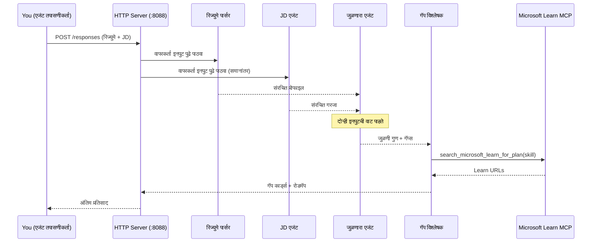
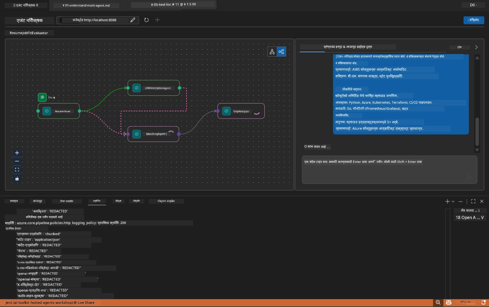

# Module 5 - स्थानिकपणे चाचणी करा (मल्टी-एजंट)

या मॉड्यूलमध्ये, तुम्ही मल्टी-एजंट वर्कफ्लो स्थानिकपणे चालवाल, Agent Inspector ने चाचणी कराल आणि Foundry वर तैनात करण्यापूर्वी सर्व चार एजंट आणि MCP टूल योग्यरित्या कार्य करत असल्याची पुष्टी कराल.

### स्थानिक चाचणी चालवताना काय होते


---

## टप्पा 1: एजंट सर्व्हर सुरू करा

### पर्याय A: VS कोड टास्क वापरून (शिफारस केलेले)

1. `Ctrl+Shift+P` दाबा → **Tasks: Run Task** टाइप करा → **Run Lab02 HTTP Server** निवडा.
2. टास्क सर्व्हर `5679` पोर्टवर debugpy सह आणि एजंट `8088` पोर्टवर जोडून सुरू करतो.
3. आऊटपुटमध्ये पुढील दिसेपर्यंत थांबा:

```
INFO:resume-job-fit:Starting Resume -> Job Fit Evaluator HTTP server...
INFO:resume-job-fit:Server running on http://localhost:8088
```

### पर्याय B: टर्मिनलद्वारे मॅन्युअली वापरणे

```powershell
cd workshop\lab02-multi-agent\PersonalCareerCopilot
```

व्हर्च्युअल एनव्हायर्नमेंट सक्रिय करा:

**PowerShell (Windows):**
```powershell
.\.venv\Scripts\Activate.ps1
```

**macOS/Linux:**
```bash
source .venv/bin/activate
```

सर्व्हर सुरू करा:

```powershell
python -m debugpy --listen 127.0.0.1:5679 -m agentdev run main.py --verbose --port 8088
```

### पर्याय C: F5 वापरुन (डीबग मोड)

1. `F5` दाबा किंवा **Run and Debug** (`Ctrl+Shift+D`) वर जा.
2. ड्रॉपडाऊनमधून **Lab02 - Multi-Agent** लॉन्च कॉन्फिगरेशन निवडा.
3. सर्व्हर पूर्ण ब्रेकपॉइंट समर्थनासह सुरू होतो.

> **टीप:** डीबग मोडमध्ये तुम्ही `search_microsoft_learn_for_plan()` मधील ब्रेकपॉइंट सेट करू शकता जेणेकरून MCP प्रतिसाद तपासता येतील, तसेच एजंटच्या सूचना स्ट्रिंगमध्ये ब्रेकपॉइंट ठेवून प्रत्येक एजंट काय प्राप्त करतो ते पाहू शकता.

---

## टप्पा 2: Agent Inspector उघडा

1. `Ctrl+Shift+P` दाबा → **Foundry Toolkit: Open Agent Inspector** टाइप करा.
2. Agent Inspector ब्राउझर टॅबमध्ये `http://localhost:5679` वर उघडते.
3. तुम्हाला एजंट इंटरफेस संदेश स्वीकारण्यासाठी तयार दिसायला पाहिजे.

> **जर Agent Inspector उघडत नसेल:** खात्री करा की सर्व्हर पूर्णपणे सुरू झाला आहे (तुम्हाला "Server running" लॉग दिसतो). पोर्ट 5679 वापरात असल्यास, पहा [Module 8 - Troubleshooting](08-troubleshooting.md).

---

## टप्पा 3: स्मोक चाचण्या चालवा

हे तीन चाचण्या क्रमाने चालवा. प्रत्येक चाचणी वर्कफ्लोचे प्रगतीशील अधिक भाग तपासते.

### चाचणी 1: मूलभूत रिज्युम + नोकरीचे वर्णन

सदर पुढील एजंट इंस्पेक्टरमध्ये पेस्ट करा:

```
Resume:
Jane Doe
Senior Software Engineer with 5 years of experience in Python, Django, and AWS.
Built microservices handling 10K+ requests/second. Led a team of 4 developers.
Certifications: AWS Solutions Architect Associate.
Education: B.S. Computer Science, State University.

Job Description:
Senior Cloud Engineer at Contoso Ltd.
Required: Python, Azure, Kubernetes, Terraform, CI/CD pipelines.
Preferred: Go, monitoring (Prometheus/Grafana), cost optimization.
Experience: 5+ years in cloud infrastructure.
Certifications: Azure Solutions Architect Expert preferred.
```

**अपेक्षित आउटपुट संरचना:**

प्रतिसादात सर्व चार एजंट्सचे क्रमानुसार आउटपुट असले पाहिजे:

1. **Resume Parser आउटपुट** - कौशल्ये श्रेणीने गटबद्ध केलेल्या रचनाबद्ध उमेदवार प्रोफाइलसह
2. **JD Agent आउटपुट** - आवश्यक आणि प्राधान्य कौशल्ये वेगळ्या संरचनेत
3. **Matching Agent आउटपुट** - फिट स्कोअर (0-100) ब्रेकडाऊनसह, जुळणारी कौशल्ये, हरवलेली कौशल्ये, अंतर
4. **Gap Analyzer आउटपुट** - प्रत्येक हरवलेल्या कौशल्यासाठी वैयक्तिक अंतर कार्ड, प्रत्येकास Microsoft Learn URL सह



### चाचणी 1 मध्ये काय तपासायचे

| तपासा | अपेक्षित | पास? |
|-------|----------|-------|
| प्रतिसादात फिट स्कोअर आहे का | 0-100 मधला अंक ब्रेकडाऊनसह | |
| जुळणारी कौशल्ये यादीत आहेत का | Python, CI/CD (अंशतः), इत्यादी | |
| हरवलेली कौशल्ये यादीत आहेत का | Azure, Kubernetes, Terraform, इत्यादी | |
| प्रत्येक हरवलेल्या कौशल्यासाठी Gap कार्ड आहे का | प्रत्येक कौशल्यासाठी एक कार्ड | |
| Microsoft Learn URLs आहेत का | खरे `learn.microsoft.com` लिंक | |
| प्रतिसादात चूक संदेश नाहीत का | स्वच्छ रचनाबद्ध आउटपुट | |

### चाचणी 2: MCP टूल कार्यान्वयन तपासा

चाचणी 1 चालू असताना, MCP लॉग एंट्रीसाठी **सर्व्हर टर्मिनल** तपासा:

```
GET https://learn.microsoft.com/api/mcp → 405 (Method Not Allowed)
POST https://learn.microsoft.com/api/mcp → 200
DELETE https://learn.microsoft.com/api/mcp → 405 (Method Not Allowed)
```

| लॉग एंट्री | अर्थ | अपेक्षित? |
|-----------|---------|-----------|
| `GET ... → 405` | MCP क्लायंट सुरुवातीला GET वापरतो | होय - सामान्य |
| `POST ... → 200` | वास्तविक टूल कॉल Microsoft Learn MCP सर्व्हरवर | होय - हा खरा कॉल आहे |
| `DELETE ... → 405` | MCP क्लायंट साफसफाईत DELETE वापरतो | होय - सामान्य |
| `POST ... → 4xx/5xx` | टूल कॉल अयशस्वी | नाही - पहा [Troubleshooting](08-troubleshooting.md) |

> **महत्त्वाचा मुद्दा:** `GET 405` आणि `DELETE 405` ओळी **अपेक्षित वर्तन** आहेत. फक्त POST कॉल गैर-200 स्टेटस कोड्स परत करत असतील तर काळजी घ्या.

### चाचणी 3: धार्मीक स्थिति - उच्च फिट उमेदवार

JD शी जवळजवळ जुळणारे रिज्युम पेस्ट करा जेणेकरून GapAnalyzer उच्च फिट परिस्थिती हाताळते हे तपासता येईल:

```
Resume:
Alex Chen
Senior Cloud Engineer with 7 years of experience.
Skills: Python, Azure (AKS, Functions, DevOps), Kubernetes, Terraform, CI/CD (GitHub Actions, Azure Pipelines), Go, Prometheus, Grafana, cost optimization.
Certifications: Azure Solutions Architect Expert, Azure DevOps Engineer Expert.
Led infrastructure migration to Azure for 3 enterprise clients.
Education: M.S. Computer Science, Tech University.

Job Description:
Senior Cloud Engineer at Contoso Ltd.
Required: Python, Azure, Kubernetes, Terraform, CI/CD pipelines.
Preferred: Go, monitoring (Prometheus/Grafana), cost optimization.
Experience: 5+ years in cloud infrastructure.
Certifications: Azure Solutions Architect Expert preferred.
```

**अपेक्षित वर्तन:**
- फिट स्कोअर **80+** असावा (बहुतेक कौशल्ये जुळतात)
- अंतर कार्ड पायाभूत शिक्षणापेक्षा पोलिश/इंटरव्ह्यू तयारीवर लक्ष केंद्रित करावेत
- GapAnalyzer सूचनांमध्ये असं म्हटलं आहे: "जर फिट >= 80, तर पोलिश/इंटरव्ह्यू तयारीवर लक्ष द्या"

---

## टप्पा 4: आउटपुट पूर्णता तपासा

चाचण्या चालवल्यानंतर, खालील निकषांची पूर्तता आउटपुटमध्ये आहे का ते तपासा:

### आउटपुट संरचना यादी

| विभाग | एजंट | उपस्तित? |
|---------|-------|----------|
| उमेदवार प्रोफाइल | Resume Parser | |
| तांत्रिक कौशल्ये (गटबद्ध) | Resume Parser | |
| भूमिका आढावा | JD Agent | |
| आवश्यक विरुद्ध प्राधान्य कौशल्ये | JD Agent | |
| फिट स्कोअर ब्रेकडाऊनसह | Matching Agent | |
| जुळणारी / हरवलेली / अंशतः कौशल्ये | Matching Agent | |
| हरवलेल्या कौशल्यासाठी Gap कार्ड | Gap Analyzer | |
| Gap कार्डमध्ये Microsoft Learn URLs | Gap Analyzer (MCP) | |
| शिकण्याचा क्रम (क्रमांकित) | Gap Analyzer | |
| टाइमलाइन सारांश | Gap Analyzer | |

### या टप्प्यावर सामान्य समस्या

| समस्या | कारण | उपाय |
|-------|-------|-----|
| फक्त 1 Gap कार्ड (बाकी छाटलेले) | GapAnalyzer सूचनांमध्ये CRITICAL ब्लॉक नाही | `GAP_ANALYZER_INSTRUCTIONS` मध्ये `CRITICAL:` परिच्छेद जोडा - पहा [Module 3](03-configure-agents.md) |
| Microsoft Learn URLs नाहीत | MCP एंडपॉइंट पोहोच नाही | इंटरनेट कनेक्टिव्हिटी तपासा. `.env` मध्ये `MICROSOFT_LEARN_MCP_ENDPOINT` `https://learn.microsoft.com/api/mcp` असल्याची पुष्टी करा |
| रिकामा प्रतिसाद | `PROJECT_ENDPOINT` किंवा `MODEL_DEPLOYMENT_NAME` सेट नाहीत | `.env` फाइलातील मूल्ये तपासा. टर्मिनलमध्ये `echo $env:PROJECT_ENDPOINT` चालवा |
| फिट स्कोअर 0 किंवा अनुपस्थित | MatchingAgent कडे कोणतीही इनपुट डेटा नाही | `create_workflow()` मध्ये `add_edge(resume_parser, matching_agent)` आणि `add_edge(jd_agent, matching_agent)` आहेत का तपासा |
| एजंट सुरू होतो पण लगेच बंद होतो | आयात त्रुटी किंवा अवलंबित्व गायब | `pip install -r requirements.txt` पुन्हा चालवा. टर्मिनलमध्ये स्टॅक ट्रेस तपासा |
| `validate_configuration` त्रुटी | एन्व्हायर्नमेंट व्हेरिएबल्स गायब | `.env` फाइल तयार करा आणि `PROJECT_ENDPOINT=<your-endpoint>`, `MODEL_DEPLOYMENT_NAME=<your-model>` टाका |

---

## टप्पा 5: स्वतःच्या डेटासह चाचणी करा (ऐच्छिक)

तुमचे स्वतःचे रिज्युम आणि वास्तविक नोकरीचे वर्णन पेस्ट करून पाहा. यामुळे हे पुष्टी होते:

- एजंट वेगवेगळ्या रिज्युम स्वरूपांना हाताळतात (कालक्रमिक, कार्यात्मक, संमिश्र)
- JD Agent वेगवेगळ्या JD शैली हाताळतो (बुलेट पॉइंट, परिच्छेद, संरचित)
- MCP टूल वास्तविक कौशल्यांसाठी संबंधित संसाधने परत करते
- Gap कार्ड तुमच्या खास पार्श्वभूमीसाठी वैयक्तिकृत असतात

> **गोपनीयता सूचना:** स्थानिकपणे चाचणी करताना, तुमचा डेटा तुमच्या संगणकावर राहतो आणि फक्त तुमच्या Azure OpenAI डिप्लॉयमेंटकडे पाठवला जातो. तो वर्कशॉपच्या इन्फ्रास्ट्रक्चरद्वारे लॉग किंवा साठवला जात नाही. तुम्हाला इच्छित असल्यास ठिकाणी नाव वापरा (उदा., "Jane Doe" तुमच्या खऱ्या नावाऐवजी).

---

### चेकपॉइंट

- [ ] पोर्ट `8088` वर सर्व्हर यशस्वीरित्या सुरू (लॉगमध्ये "Server running" दिसत आहे)
- [ ] Agent Inspector उघडले आणि एजंटशी जोडलेले
- [ ] चाचणी 1: फिट स्कोअर, जुळणारी/हरवलेली कौशल्ये, Gap कार्ड व Microsoft Learn URLs सहित पूर्ण प्रतिसाद
- [ ] चाचणी 2: MCP लॉगमध्ये `POST ... → 200` (टूल कॉल यशस्वी)
- [ ] चाचणी 3: उच्च फिट उमेदवाराला 80+ स्कोअर, पोलिश-केंद्रित शिफारसींसह
- [ ] सर्व Gap कार्ड उपलब्ध (प्रत्येक हरवलेल्या कौशल्यासाठी एक, कोणतीही छाटणी नाही)
- [ ] सर्व्हर टर्मिनलमध्ये कोणत्याही त्रुटी किंवा स्टॅक ट्रेस नाहीत

---

**मागील:** [04 - Orchestration Patterns](04-orchestration-patterns.md) · **पुढील:** [06 - Deploy to Foundry →](06-deploy-to-foundry.md)

---

<!-- CO-OP TRANSLATOR DISCLAIMER START -->
**कृपापत्र**:  
हा दस्तऐवज AI भाषांतर सेवा [Co-op Translator](https://github.com/Azure/co-op-translator) चा वापर करून भाषांतरित केला आहे. आम्ही अचूकतेसाठी प्रयत्न करत असलो तरी, कृपया ध्यानात ठेवा की स्वयंचलित भाषांतरात चुका किंवा अचूकतेतील त्रुटी असू शकतात. मूळ दस्तऐवज त्याच्या स्थानिक भाषेत अधिकृत स्रोत मानले जावे. महत्त्वाची माहिती असल्यास, व्यावसायिक मानवी भाषांतर शिफारस केली जाते. या भाषांतराच्या वापरामुळे उद्भवलेल्या कोणत्याही गैरसमजुतींविषयी किंवा चुकीच्या अर्थग्रहणासाठी आम्ही जबाबदार नाही.
<!-- CO-OP TRANSLATOR DISCLAIMER END -->