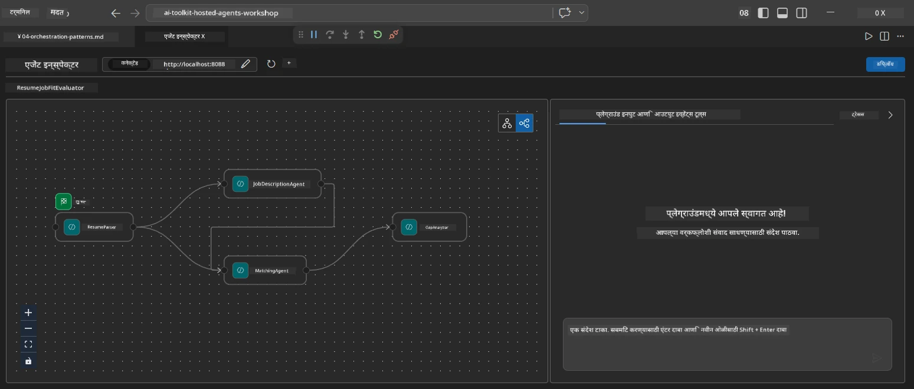
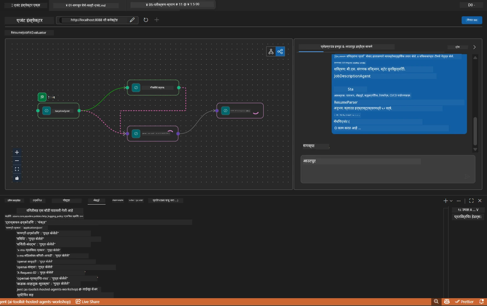
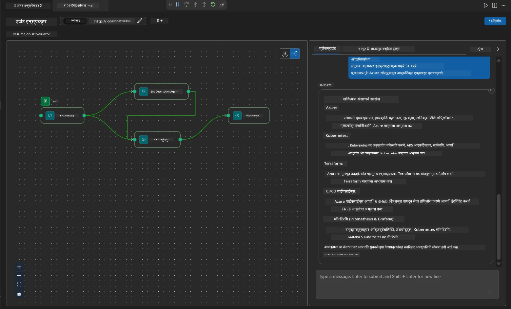

# मॉड्यूल ५ - स्थानिकपणे चाचणी करा

⏱️ ~१५ मिनिटे

या मॉड्यूलमध्ये, आपण मल्टी-एजंट वर्कफ्लो स्थानिकपणे चालवता, Agent Inspector सह चाचणी करता आणि सर्व चार एजंट्स आणि MCP टूल योग्यरीत्या कार्यरत आहेत याची पुष्टी करता त्यानंतर त्यांना तैनात करता.

---

## चरण १: एजंट सर्व्हर सुरू करा

### पर्याय अ: VS कोड टास्क वापरणे (शिफारस)

१. `workshop/lab02-multi-agent/PersonalCareerCopilot/` तुमच्या VS कोड फोल्डर म्हणून उघडा.
२. `Ctrl+Shift+P` दाबा → **Tasks: Run Task** टाइप करा → **Run Agent HTTP Server** निवडा.
३. टास्क सर्व्हर `5679` पोर्टवर debugpy सह आणि एजंट `8088` पोर्टवर सुरू करते.
४. खालील आउटपुट दिसेपर्यंत थांबा:

```
INFO:resume-job-fit:Starting Resume -> Job Fit Evaluator HTTP server...
INFO:resume-job-fit:Server running on http://localhost:8088
```

### पर्याय ब: F5 वापरून (डिबग मोड)

१. `F5` दाबा → **Debug Local Agent HTTP Server** निवडा.
२. सर्व्हर पूर्ण ब्रेकपॉइंट समर्थनासह सुरू होते - MCP प्रतिसाद किंवा एजंट आउटपुट तपासण्यासाठी उपयुक्त.

---

## चरण २: एजंट इन्स्पेक्टर उघडा

१. `Ctrl+Shift+P` दाबा → **Foundry Toolkit: Open Agent Inspector** टाइप करा.
२. एजंट इन्स्पेक्टर VS कोड पॅनेलमध्ये उघडतो जो `http://localhost:8088` शी जोडलेला आहे.
३. तुम्हाला एजंट इंटरफेस मेसेज प्राप्त करण्यासाठी तयार दिसायला हवा.



> **जर एजंट इन्स्पेक्टर उघडत नसेल:** सर्व्हर पूर्णपणे सुरू आहे याची खात्री करा (तुम्हाला "Server running" लॉग दिसेल). जर पोर्ट 5679 वापरात असेल, बघा [Module 8 - Troubleshooting](08-troubleshooting.md).

---

## चरण २ब: (ऐच्छिक) वर्कफ्लो व्हिज्युअलायझर उघडा

Foundry Toolkit मध्ये एक रिअल-टाइम **Workflow Visualizer** आहे जो एजंट्स कसे संवाद साधतात हे ग्राफ चालवताना दाखवतो. हा मल्टी-एजंट डिबगिंगसाठी विशेषतः उपयुक्त आहे.

१. `Ctrl+Shift+P` दाबा → **Foundry Toolkit: Open Visualizer for Hosted Agents** टाइप करा.
२. एक नवीन VS कोड टॅब उघडतो जो थेट एक्सिक्युशन ग्राफ दाखवतो.
३. तुम्ही एजंट इन्स्पेक्टरमध्ये संदेश पाठवताना, व्हिज्युअलायझर आपोआप अपडेट होतो - हिरव्या नोड्सने पूर्ण झालेले एजंट दर्शवितात, आणि अॅनिमेटेड एजेसने त्यांच्यात डेटा प्रवाह दाखवला जातो.

> **पोर्ट संघर्ष:** जर व्हिज्युअलायझर पोर्ट आधीच वापरात असेल, तर VS कोड सेटिंग्ज → **Extensions** → **Microsoft Foundry Configuration** → **Hosted Agents: Visualizer Port** मध्ये बदल करा.

---

## चरण ३: स्मोक चाचण्या चालवा

या तीन चाचण्या क्रमाने चालवा. प्रत्येक चाचणी वर्कफ्लोचा अधिक तपशीलवार भाग तपासते.

### चाचणी १: बेसिक रिझ्युमे + नोकरीचे वर्णन

खालील टेक्स्ट Agent Inspector मध्ये पेस्ट करा:

```
Resume:
Jane Doe
Senior Software Engineer with 5 years of experience in Python, Django, and AWS.
Built microservices handling 10K+ requests/second. Led a team of 4 developers.
Certifications: AWS Solutions Architect Associate.
Education: B.S. Computer Science, State University.

Job Description:
Senior Cloud Engineer at Contoso Ltd.
Required: Python, Azure, Kubernetes, Terraform, CI/CD pipelines.
Preferred: Go, monitoring (Prometheus/Grafana), cost optimization.
Experience: 5+ years in cloud infrastructure.
Certifications: Azure Solutions Architect Expert preferred.
```

**अपेक्षित आउटपुट रचना:**

प्रतिसादामध्ये सर्व चार एजंटची आउटपुट सलग असणे आवश्यक आहे:

१. **रिझ्युमे पार्सर आउटपुट** - दोन लेबल केलेले विभाग: `[PARSED RESUME]` (उमेदवार प्रोफाइल आणि गटबद्ध कौशल्ये) आणि `[JOB DESCRIPTION PASS-THROUGH]` (प्रत्यक्ष JD मजकूर जो JD एजंटला पुरवतो)
२. **JD एजंट आउटपुट** - संरचित आवश्यकता जिथे आवश्यक आणि प्राधान्यक कौशल्ये वेगवेगळे दाखवलेले
३. **मॅचिंग एजंट आउटपुट** - फिट स्कोर (०-१००) सह तपशीलवार, जुळलेल्या कौशल्ये, गहाळ कौशल्ये, अंतर
४. **गॅप अनालायझर आउटपुट** - प्रत्येक गहाळ कौशल्यासाठी स्वतंत्र गॅप कार्ड्स, ज्यात Microsoft Learn URL आहेत





### चाचणी १ मध्ये काय तपासायचे

| तपासा | अपेक्षित | यशस्वी? |
|-------|----------|-------|
| प्रतिसादात फिट स्कोर आहे का | ०-१०० दरम्यान संख्या तपशीलासह | |
| जुळलेली कौशल्ये यादीत आहेत | Python, CI/CD (आंशिक), इत्यादी | |
| गहाळ कौशल्ये यादीत आहेत | Azure, Kubernetes, Terraform, इत्यादी | |
| प्रत्येक गहाळ कौशल्यासाठी गॅप कार्ड्स आहेत | प्रत्येक कौशल्यासाठी एक कार्ड | |
| Microsoft Learn URL उपलब्ध आहेत | खरे `learn.microsoft.com` लिंक | |
| प्रतिसादात कोणतीही त्रुटी संदेश नाहीत | स्वच्छ संरचित आउटपुट | |

### चाचणी २: एडज केस - उच्च फिट उमेदवार

JD शी जुळणारा एक रिझ्युमे पेस्ट करा ज्याने GapAnalyzer उच्च-फिट परिस्थिती नीट हाताळते याची पुष्टी करायची आहे:

```
Resume:
Alex Chen
Senior Cloud Engineer with 7 years of experience.
Skills: Python, Azure (AKS, Functions, DevOps), Kubernetes, Terraform, CI/CD (GitHub Actions, Azure Pipelines), Go, Prometheus, Grafana, cost optimization.
Certifications: Azure Solutions Architect Expert, Azure DevOps Engineer Expert.
Led infrastructure migration to Azure for 3 enterprise clients.
Education: M.S. Computer Science, Tech University.

Job Description:
Senior Cloud Engineer at Contoso Ltd.
Required: Python, Azure, Kubernetes, Terraform, CI/CD pipelines.
Preferred: Go, monitoring (Prometheus/Grafana), cost optimization.
Experience: 5+ years in cloud infrastructure.
Certifications: Azure Solutions Architect Expert preferred.
```

**अपेक्षित वर्तन:**
- फिट स्कोर **८०+** असावा (अधिकतर कौशल्ये जुळतात)
- गॅप कार्ड्स अधिकतर पॉलिश/इंटरव्ह्यू तयारीवर लक्ष केंद्रित करावे, मूलभूत शिक्षणावर नव्हे
- GapAnalyzer सूचना: "जर फिट ≥ ८० असेल, तर पॉलिश/इंटरव्ह्यू तयारीवर लक्ष द्या"

---

## चरण ४: तुमच्या स्वतःच्या डेटासह चाचणी करा (ऐच्छिक)

स्वतःचा रिझ्युमे आणि वास्तविक नोकरीचे वर्णन पेस्ट करून पहा. यामुळे पुष्टी होते:

- एजंट्स वेगवेगळ्या रिझ्युमे फॉरमॅट्स (कालानुक्रमिक, कार्यात्मक, हायब्रिड) हाताळतात
- JD एजंट वेगवेगळ्या JD शैली (बुलेट पॉइंट्स, परिच्छेद, संरचित) हाताळतो
- MCP टूल वास्तविक कौशल्यांसाठी संबंधित संसाधने परत करते
- गॅप कार्ड्स तुमच्या विशिष्ट पार्श्वभूमीशी वैयक्तिकृत असतात

> **गोपनीयता - मार्ग अ (Foundry क्लाउड):** रिझ्युमे आणि JD मजकूर तुमच्या Azure OpenAI डिप्लॉयमेंटवर इन्फरन्ससाठी पाठविला जातो. वर्कशॉप इन्फ्रास्ट्रक्चरद्वारे तो लॉग किंवा संग्रहित केला जात नाही. प्राधान्य असल्यास प्लेसहोल्डर नावे वापरा (उदा., "Jane Doe").
>
> **गोपनीयता - मार्ग ब (Foundry स्थानिक):** सर्व चार एजंट इन्फरन्स पूर्णपणे तुमच्या डिव्हाइसरवर चालतात. तुमचा रिझ्युमे आणि नोकरीचे वर्णन मजकूर **कधीही तुमच्या डिव्हाइसच्या बाहेर जात नाही**. एकमेव आऊटबाउंड कॉल हा MCP टूल कडून संसाधने fetch करणे आहे `https://learn.microsoft.com/api/mcp` कडे; तो क्वेरी फक्त कौशल्याचे नाव पाठवते, तुमचा वैयक्तिक डेटा नाही.

---

### चेकपॉइंट

- [ ] पोर्ट `8088` वर सर्व्हर यशस्वीपणे सुरू झाला (लॉगमध्ये "Server running" दिसतो)
- [ ] एजंट इन्स्पेक्टर उघडला आणि एजंटशी जोडला गेला
- [ ] चाचणी १: फिट स्कोर, जुळलेली/गहाळ कौशल्ये, गॅप कार्ड्स आणि Microsoft Learn URL सह पूर्ण प्रतिसाद
- [ ] चाचणी २: उच्च फिट उमेदवाराला ८०+ स्कोर मिळाला आणि पॉलिश-केंद्रित शिफारसी मिळाल्या
- [ ] सर्व गॅप कार्ड्स उपलब्ध (प्रत्येक गहाळ कौशल्यासाठी एक, कोणतेही संक्षेप नाही)
- [ ] सर्व्हर टर्मिनलमध्ये कोणत्याही त्रुटी किंवा स्टॅक ट्रेस नाहीत

---

**मागील:** [04 - Orchestration Patterns](04-orchestration-patterns.md) · **पुढील:** [06 - Deploy to Foundry →](06-deploy-to-foundry.md)

---

<!-- CO-OP TRANSLATOR DISCLAIMER START -->
**अस्वीकरण**:
हा दस्तऐवज AI भाषांतर सेवा [Co-op Translator](https://github.com/Azure/co-op-translator) चा वापर करून अनुवादित केला आहे. जरी आम्ही अचूकतेसाठी प्रयत्न करतो, तरी कृपया लक्षात घ्या की स्वयंचलित भाषांतरांमध्ये त्रुटी किंवा अचूकतेची कमतरता असू शकते. मूळ दस्तऐवज त्याच्या मूळ भाषेत अधिकृत स्रोत मानला पाहिजे. महत्त्वाची माहिती असल्यास, व्यावसायिक मानवी भाषांतराची शिफारस केली जाते. या भाषांतराच्या वापरामुळे उद्भवणाऱ्या कोणत्याही गैरसमज किंवा चुकीच्या अर्थलावणीसाठी आम्ही जबाबदार नाही.
<!-- CO-OP TRANSLATOR DISCLAIMER END -->