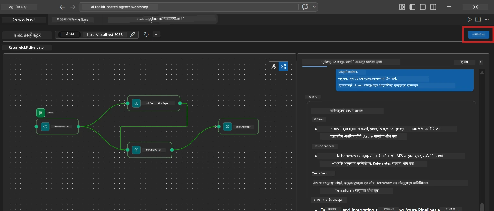
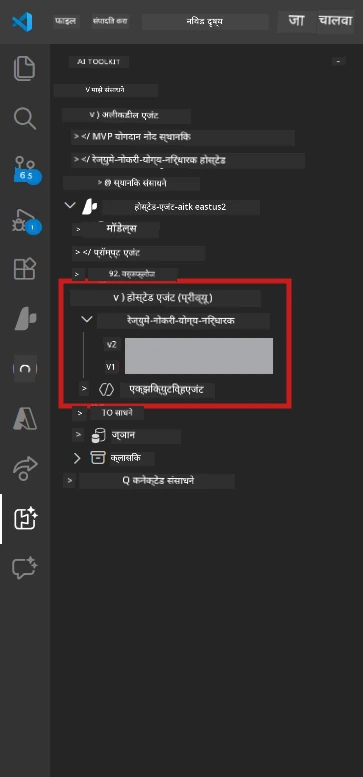

# Module 6 - Foundry Agent सेवा मध्ये तैनात करा

या मोड्यूल मध्ये, तुम्ही तुमचा स्थानिक परीक्षण केलेला मल्टी-एजंट वर्कफ्लो [Microsoft Foundry](https://learn.microsoft.com/azure/foundry/agents/concepts/hosted-agents) मध्ये **होस्टेड एजंट** म्हणून तैनात करता. तैनाती प्रक्रिया एक डॉकर कंटेनर इमेज तयार करते, ती [Azure Container Registry (ACR)](https://learn.microsoft.com/azure/container-registry/container-registry-intro) मध्ये ढकलते, आणि [Foundry Agent Service](https://learn.microsoft.com/azure/foundry/agents/how-to/publish-agent) मध्ये एक होस्टेड एजंट आवृत्ती तयार करते.

> **Lab 01 पासून मुख्य फरक:** तैनात प्रक्रिया अगदी समान आहे. Foundry तुमचा मल्टी-एजंट वर्कफ्लो एकाच होस्टेड एजंट म्हणून समजतो - गुंतागुंत कंटेनरच्या आत आहे, पण तैनात करण्याचा इंटरफेस `/responses` endpoint सारखा आहे.

---

## पूर्वतयारी तपासा

तैनाती करण्यापूर्वी, खालील प्रत्येक गोष्ट तपासा:

1. **एजंट स्थानिक स्मोक चाचण्या पास करतो:**
   - तुम्ही [Module 5](05-test-locally.md) मधील सर्व 3 चाचण्या पूर्ण केल्या आहेत आणि वर्कफ्लोने गॅप कार्ड्स आणि Microsoft Learn URL सह पूर्ण आउटपुट दिले आहे.

2. **तुमच्याकडे [Azure AI User](https://learn.microsoft.com/azure/foundry/concepts/rbac-foundry) भूमिका आहे:**
   - [Lab 01, Module 2](../../lab01-single-agent/docs/02-create-foundry-project.md) मध्ये प्रदान केलेली. खात्री करा:
   - [Azure Portal](https://portal.azure.com) → तुमचा Foundry **प्रोजेक्ट** रिसोर्स → **Access control (IAM)** → **Role assignments** → खात्री करा की **[Azure AI User](https://aka.ms/foundry-ext-project-role)** तुमच्या खात्यासाठी यादीत आहे.

3. **VS Code मध्ये तुम्ही Azure मध्ये साइन इन आहात:**
   - VS Code च्या खालच्या डाव्या कोपऱ्यातील Accounts आयकॉन तपासा. तुमचे खाते दिसायला हवे.

4. **`agent.yaml` मध्ये बरोबर मूल्ये आहेत:**
   - `PersonalCareerCopilot/agent.yaml` उघडा आणि तपासा:
     ```yaml
     environment_variables:
       - name: PROJECT_ENDPOINT
         value: ${PROJECT_ENDPOINT}
       - name: MODEL_DEPLOYMENT_NAME
         value: ${MODEL_DEPLOYMENT_NAME}
     ```
   - ही मूल्ये तुमच्या `main.py` द्वारे वाचल्या जाणाऱ्या env vars शी जुळून यायला हवेत.

5. **`requirements.txt` मध्ये योग्य आवृत्त्या आहेत:**
   ```
   agent-framework-azure-ai==1.0.0rc3
   agent-framework-core==1.0.0rc3
   azure-ai-agentserver-agentframework==1.0.0b16
   azure-ai-agentserver-core==1.0.0b16
   debugpy
   agent-dev-cli --pre
   ```

---

## पायरी 1: तैनाती सुरू करा

### पर्याय A: Agent Inspector मधून तैनात करा (शिफारस)

जर एजंट F5 ने चालू असेल आणि Agent Inspector उघडलेला असेल:

1. Agent Inspector पॅनेलच्या **वरच्या-उजव्या कोपऱ्यात** पहा.
2. **Deploy** बटणावर क्लिक करा (मेघ आयकॉन, वरचा बाण ↑).
3. तैनाती विजार्ड उघडेल.



### पर्याय B: Command Palette मधून तैनात करा

1. `Ctrl+Shift+P` दाबा आणि **Command Palette** उघडा.
2. टाइप करा: **Microsoft Foundry: Deploy Hosted Agent** आणि त्यावर क्लिक करा.
3. तैनाती विजार्ड उघडेल.

---

## पायरी 2: तैनाती सानुकूलित करा

### 2.1 लक्ष्य प्रोजेक्ट निवडा

1. ड्रॉपडाउन मध्ये तुमचे Foundry प्रोजेक्ट्स दिसतील.
2. सेट केलेल्या वर्कशॉप प्रोक्तसाठी वापरलेले प्रोजेक्ट निवडा (उदा., `workshop-agents`).

### 2.2 कंटेनर एजंट फाइल निवडा

1. तुम्हाला एजंट प्रवेशबिंदू निवडावा लागेल.
2. `workshop/lab02-multi-agent/PersonalCareerCopilot/` मध्ये जा आणि **`main.py`** निवडा.

### 2.3 संसाधने सानुकूलित करा

| सेटिंग | शिफारस केलेले मूल्य | टिप्पणी |
|---------|------------------|-------|
| **CPU** | `0.25` | डीफॉल्ट. मल्टी-एजंट वर्कफ्लोना जास्त CPU ची गरज नाही कारण मॉडेल कॉल्स I/O-आधारित आहेत |
| **Memory** | `0.5Gi` | डीफॉल्ट. जर तुम्ही मोठ्या प्रमाणात डेटा प्रक्रिया साधने जोडली तर `1Gi` पर्यंत वाढवा |

---

## पायरी 3: पुष्टी करा आणि तैनात करा

1. विजार्ड तैनाती सारांश दाखवतो.
2. तपासा आणि **Confirm and Deploy** वर क्लिक करा.
3. VS Code मध्ये प्रगती पहा.

### तैनाती दरम्यान काय होते

VS Code च्या **Output** पॅनेलमध्ये (Microsoft Foundry ड्रॉपडाउन निवडा) पहा:


1. **Docker build** - तुमच्या `Dockerfile` पासून कंटेनर तयार करतो:
   ```
   Step 1/6 : FROM python:3.14-slim
   Step 2/6 : WORKDIR /app
   ...
   Successfully built abc123def456
   ```

2. **Docker push** - इमेज ACR मध्ये ढकलतो (पहिल्या तैनातीवर 1-3 मिनिटे).

3. **एजंट नोंदणी** - Foundry `agent.yaml` मेटाडेटावरून एक होस्टेड एजंट तयार करतो. एजंट नाव `resume-job-fit-evaluator` आहे.

4. **कंटेनर सुरू होणे** - Foundry च्या व्यवस्थापित पायाभूत सुविधा मध्ये कंटेनर सिस्टम-व्यवस्थापित ओळखीसह सुरू होते.

> **पहिली तैनाती हळू होते** (Docker सर्व लेयर्स ढकलते). नंतरची तैनाती कॅश केलेले लेयर्स वापरून जलद होतात.

### मल्टी-एजंट विशेष टिपा

- **सर्व चार एजंट एका कंटेनरमध्ये आहेत.** Foundry एकाच होस्टेड एजंटला पाहतो. WorkflowBuilder ग्राफ अंतर्गत चालतो.
- **MCP कॉल्स बाहेर जातात.** कंटेनरला `https://learn.microsoft.com/api/mcp` वर जाण्यासाठी इंटरनेट प्रवेश हवा आहे. Foundry च्या व्यवस्थापित पायाभूत सुविधा यासाठी डीफॉल्ट देतात.
- **[Managed Identity](https://learn.microsoft.com/python/api/overview/azure/identity-readme#managed-identity-support).** होस्टेड वातावरणात, `main.py` मधील `get_credential()` `ManagedIdentityCredential()` परत करते (`MSI_ENDPOINT` सेट असल्यामुळे). हे आपोआप होते.

---

## पायरी 4: तैनाती स्थिती तपासा

1. **Microsoft Foundry** साइडबार उघडा (Activity Bar मध्ये Foundry आयकॉन क्लिक करा).
2. तुमच्या प्रोजेक्ट अंतर्गत **Hosted Agents (Preview)** विस्तारा करा.
3. **resume-job-fit-evaluator** (किंवा तुमच्या एजंटचे नाव) शोधा.
4. एजंट नावावर क्लिक करा → आवृत्त्या विस्तारा (उदा., `v1`).
5. आवृत्त्यावर क्लिक करा → **Container Details** → **Status** तपासा:



| स्थिती | अर्थ |
|--------|---------|
| **Started** / **Running** | कंटेनर चालू आहे, एजंट तयार आहे |
| **Pending** | कंटेनर सुरू होतो आहे (30-60 सेकंद थांबा) |
| **Failed** | कंटेनर सुरू होऊ शकला नाही (लॉग्स तपासा - खाली पहा) |

> **मल्टी-एजंट स्टार्टअप सिंगल एजंटपेक्षा जास्त वेळ घेतो** कारण कंटेनर स्टार्टअपवर 4 एजंट इंस्टन्सेस तयार करतो. "Pending" 2 मिनिटांपर्यंत चालणे सामान्य आहे.

---

## सामान्य तैनात त्रुटी आणि तोडगे

### त्रुटी 1: Permission denied - `agents/write`

```
Error: lacks the required data action 
Microsoft.CognitiveServices/accounts/AIServices/agents/write
```

**सुत्र:** **[Azure AI User](https://learn.microsoft.com/azure/foundry/concepts/rbac-foundry)** भूमिका प्रोजेक्ट स्तरावर द्या. सविस्तर मार्गदर्शनासाठी [Module 8 - Troubleshooting](08-troubleshooting.md) पहा.

### त्रुटी 2: Docker चालू नाही

```
Error: Docker build failed / Cannot connect to Docker daemon
```

**सुत्र:**
1. Docker Desktop सुरू करा.
2. "Docker Desktop is running" येईपर्यंत थांबा.
3. तपासा: `docker info`
4. **Windows:** Docker Desktop सेटिंग्जमध्ये WSL 2 बॅकएंड सक्षम करा.
5. पुन्हा प्रयत्न करा.

### त्रुटी 3: Docker build दरम्यान pip install फेल होते

```
Error: Could not find a version that satisfies the requirement agent-dev-cli
```

**सुत्र:** `requirements.txt` मधील `--pre` फ्लॅग Docker मध्ये वेगळ्या प्रकारे हाताळली जाते. खात्री करा की `requirements.txt` मध्ये:
```
agent-dev-cli --pre
```

जर Docker अजूनही अयशस्वी होत असेल, तर `pip.conf` बनवा किंवा build argument द्वारे `--pre` पाठवा. [Module 8](08-troubleshooting.md) पहा.

### त्रुटी 4: MCP टूल होस्टेड एजंटमध्ये अयशस्वी

जर Gap Analyzer तैनाती नंतर Microsoft Learn URL निर्माण करणे थांबवले:

**मूळ कारण:** नेटवर्क धोरणामुळे कंटेनरमधून आउटबाउंड HTTPS ब्लॉक केलेले असू शकते.

**सुत्र:**
1. Foundry च्या डीफॉल्ट कॉन्फिगरेशन मध्ये सहसा समस्या नाही.
2. जर असे घडले, तर Foundry प्रोजेक्टच्या व्हर्च्युअल नेटवर्कमध्ये NSG आउटबाउंड HTTPS ब्लॉक करते का तपासा.
3. MCP टूलमध्ये fallback URLs असतात, त्यामुळे एजंट तरीही आउटपुट तयार करेल (लाइव्ह URLs शिवाय).

---

### तपासणी बिंदू

- [ ] VS Code मध्ये तैनात आदेश त्रुटीशिवाय पूर्ण झाले
- [ ] Foundry साइडबार मधील **Hosted Agents (Preview)** अंतर्गत एजंट दिसतो
- [ ] एजंट नाव `resume-job-fit-evaluator` (किंवा तुमचे निवडलेले नाव) आहे
- [ ] कंटेनर स्थिती **Started** किंवा **Running** दाखवते
- [ ] (जर त्रुटी असतील) त्रुटी ओळखली, दुरुस्त केली आणि यशस्वीपणे पुन्हा तैनात केले

---

**मागील:** [05 - स्थानिकपणे चाचणी](05-test-locally.md) · **पुढील:** [07 - Playground मध्ये तपासा →](07-verify-in-playground.md)

---

<!-- CO-OP TRANSLATOR DISCLAIMER START -->
**अस्वीकरण**:
हा दस्तऐवज AI भाषांतर सेवा [Co-op Translator](https://github.com/Azure/co-op-translator) चा वापर करून भाषांतरित केला आहे. आम्ही अचूकतेसाठी प्रयत्न करतो, तरी कृपया लक्षात ठेवा की स्वयंचलित भाषांतरांमध्ये चुका किंवा असत्यता असू शकतात. मूळ दस्तऐवज त्याच्या स्थानिक भाषेत अधिकृत स्रोत मानले जावे. महत्त्वपूर्ण माहितीसाठी व्यावसायिक मानवी भाषांतराचा सल्ला देण्यात येतो. या भाषांतराच्या वापरातून निर्माण झालेल्या कोणत्याही गैरसमजुतींसाठी किंवा चुकीच्या अर्थनिर्देशासाठी आम्ही जबाबदार नाही.
<!-- CO-OP TRANSLATOR DISCLAIMER END -->