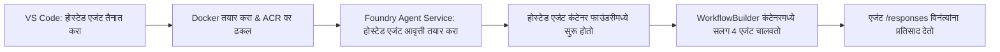
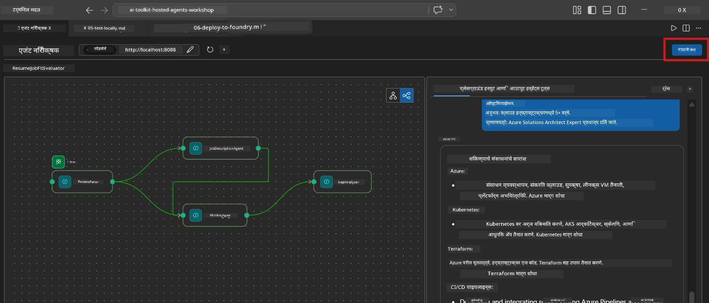

# मॉड्यूल 6 - Foundry एजंट सेवा मध्ये तैनात करा

⏱️ ~10 मिनिटे

या मॉड्यूलमध्ये, आपण आपला स्थानिकपणे चाचणी दिलेला बहु-एजंट वर्कफ्लो [Microsoft Foundry](https://learn.microsoft.com/azure/foundry/agents/concepts/hosted-agents) मध्ये **Hosted Agent** म्हणून तैनात करता. तैनाती प्रक्रिया एक Docker कंटेनर इमेज तयार करते, त्याला [Azure Container Registry (ACR)](https://learn.microsoft.com/azure/container-registry/container-registry-intro) मध्ये धकेलते, आणि [Foundry Agent Service](https://learn.microsoft.com/azure/foundry/agents/how-to/publish-agent) मध्ये एक होस्टेड एजंट आवृत्ती तयार करते.

> **Lab 01 पेक्षा मुख्य फरक:** तैनाती प्रक्रिया एकसारखी आहे. Foundry आपल्या बहु-एजंट वर्कफ्लोला एकच होस्टेड एजंट म्हणून मानते - क्लिष्टता कंटेनरच्या आत आहे, पण तैनाती पृष्ठभाग त्याच `/responses` एंडपॉइंटवर आहे.

### तैनाती पाईपलाईन


```mermaid
flowchart LR
    A[VS Code: होस्टेड एजंट तैनात करा] --> B[Docker तयार करा & ACR वर ढकल]
    B --> C[Foundry Agent Service: होस्टेड एजंट आवृत्ती तयार करा]
    C --> D[होस्टेड एजंट कंटेनर फाउंडरीमध्ये सुरू होतो]
    D --> E[WorkflowBuilder कंटेनरमध्ये सलग 4 एजंट चालवतो]
    E --> F[एजंट /responses विनंत्यांना प्रतिसाद देतो]
```

---

## आवश्यक अटी तपासा

तैनात करण्यापूर्वी, खालील प्रत्येक बाब तपासा:

1. **एजंट स्थानिक स्मोक चाचण्या उत्तीर्ण करतो:**
   - आपण सर्व 3 चाचण्या [Module 5](05-test-locally.md) मध्ये पूर्ण केल्या आहेत आणि वर्कफ्लोने गॅप कार्ड आणि Microsoft Learn URLs सह पूर्ण आउटपुट निर्माण केले आहे.

2. **आपल्याला [Foundry User](https://learn.microsoft.com/azure/foundry/concepts/rbac-foundry) भूमिका आहे** (तैनातीसाठी किमान **Foundry Project Manager** प्रकल्प स्तरावर आवश्यक):

   > **टीप:** Foundry RBAC भूमिकांची अलीकडे नावे बदलली गेली आहेत - **Foundry User**, **Foundry Owner**, आणि **Foundry Project Manager** यांना पूर्वी Azure AI User, Azure AI Owner, आणि Azure AI Project Manager असे म्हणत होते. भूमिका आयडी आणि परवानग्या अपरिवर्तित आहेत.

   - [Azure Portal](https://portal.azure.com) → आपला Foundry **प्रकल्प** संसाधन → **Access control (IAM)** → **Role assignments** → आपल्या खात्याकरिता **Foundry User** (किंवा त्याहून अधिक) दिलेली आहे का ते तपासा.

3. **आपण VS Code मध्ये Azure मध्ये साइन इन आहात:**
   - VS Code च्या खालच्या डाव्या कोपर्यात असलेला Accounts आयकॉन तपासा. आपले खाते क्रमाने दिसले पाहिजे.

4. **`agent.yaml` मध्ये योग्य मूल्ये आहेत:**
   - `PersonalCareerCopilot/agent.yaml` उघडा आणि खात्री करा:
     ```yaml
     environment_variables:
       - name: AZURE_AI_MODEL_DEPLOYMENT_NAME
         value: ${AZURE_AI_MODEL_DEPLOYMENT_NAME}
     ```
   - `FOUNDRY_PROJECT_ENDPOINT` येथे नमूद केलेले नाही - Foundry ते रंटाइम मध्ये इंजेक्ट करते. फक्त `AZURE_AI_MODEL_DEPLOYMENT_NAME` घोषित करणे आवश्यक आहे.

5. **`requirements.txt` मध्ये योग्य आवृत्त्या आहेत:**
   ```
   agent-framework-foundry
   agent-framework-foundry-hosting
   mcp<2,>=1.24.0
   debugpy
   ```

---

## पायरी 1: तैनाती सुरू करा

### पर्याय A: Agent Inspector कडून तैनात करा (शिफारस केलेले)

जर एजंट F5 ने Agent Inspector उघडलेले चालू असेल:

1. Agent Inspector पॅनेलच्या **वर-उजव्या कोपर्यात** पहा.
2. **Deploy** बटणावर क्लिक करा (माथ्यावर उभा बाण असलेला ढग आयकॉन).
3. तैनाती विजार्ड उघडतो.



### पर्याय B: Command Palette कडून तैनात करा

1. `Ctrl+Shift+P` दाबा आणि **Command Palette** उघडा.
2. टाइप करा: **Foundry Toolkit: Deploy Hosted Agent** आणि निवडा.
3. तैनाती विजार्ड उघडतो.

---

## पायरी 2: तैनाती सानुकूलित करा

### 2.1 लक्ष्य प्रकल्प निवडा

1. एक ड्रॉपडाउन आपले Foundry प्रकल्प दाखवते.
2. वर्कशॉपमध्ये वापरलेला प्रकल्प निवडा (उदाहरणार्थ, `workshop-agents`).

### 2.2 कंटेनर एजंट फाइल निवडा

1. आपणास एजंट प्रवेश बिंदू निवडण्यास सांगितले जाईल.
2. `workshop/lab02-multi-agent/PersonalCareerCopilot/` येथे जा आणि **`main.py`** निवडा.

### 2.3 संसाधने सानुकूलित करा

| सेटिंग | शिफारस केलेली मूल्ये | टीपा |
|---------|------------------|-------|
| **तैनात करण्याची पद्धत** | **कंटेनर** (शिफारस केलेले) किंवा **कोड** | कंटेनर Docker इमेज तयार करतो; कोड स्त्रोत ZIP म्हणून अपलोड करते (प्रिव्ह्यू) |
| **कंटेनर रजिस्ट्री** | **डिफॉल्ट ACR** | Foundry आपल्यासाठी एक प्रणाली तयार आणि व्यवस्थापित करते |
| **CPU** | `0.25` | डिफॉल्ट. बहु-एजंट वर्कफ्लोना अधिक CPU लागत नाही कारण मॉडेल कॉल I/O-बाउंड आहेत |
| **मेमरी** | `0.5Gi` | डिफॉल्ट. मोठ्या डेटा प्रक्रिया साधने जोडल्यास `1Gi` वर वाढवा |

---

## पायरी 3: पुष्टी करा आणि तैनात करा

1. विजार्ड तैनाती सारांश दाखवतो.
2. पुनरावलोकन करा आणि **Confirm and Deploy** क्लिक करा.
3. VS Code मध्ये प्रगती पहा.

### तैनाती दरम्यान काय होते

VS Code च्या **Output** पॅनेलवर पहा ("Microsoft Foundry" ड्रॉपडाउन निवडा):

1. **Docker build** - आपल्या `Dockerfile` वरून कंटेनर तयार करतो
   ```
   Step 1/6 : FROM python:3.12-slim
   Step 2/6 : WORKDIR /app
   ...
   Successfully built abc123def456
   ```

2. **Docker push** - इमेज ACR कडे पाठवतो (पहिल्या वेळेला 1-3 मिनिटे लागू शकतात).

3. **एजंट नोंदणी** - Foundry `agent.yaml` मेटाडेटाचा वापर करून होस्टेड एजंट तयार करतो. एजंटचे नाव `resume-job-fit-evaluator` आहे.

4. **कंटेनर सुरु होतो** - Foundry ची व्यवस्थापित प्रणालीमध्ये कंटेनर सुरु होतो, ज्याला सिस्टम-व्यवस्थापित ओळख आहे.

> **पहिली तैनाती हळू होते** (Docker सर्व स्तर पुश करतो). पुढील तैनात्या कॅश केलेले स्तर वापरतात आणि जलद होतात.

### बहु-एजंट विशिष्ट टीपा

- **सर्व चार एजंट एका कंटेनरमध्ये आहेत.** Foundry एकच होस्टेड एजंट पाहते. WorkflowBuilder ग्राफ अंतर्गत चालतो.
- **MCP कॉल बाहेर जातात.** कंटेनरला `https://learn.microsoft.com/api/mcp` पोहोचण्यासाठी इंटरनेट कनेक्शन आवश्यक आहे. Foundry ची व्यवस्थापित प्रणालीने हे मूलतः पुरवले आहे.
- **[Managed Identity](https://learn.microsoft.com/azure/foundry/agents/concepts/agent-identity).** तैनात करताना Foundry आपोआप प्रत्येक Hosted एजंटसाठी एक **समर्पित प्रति-एजंट Entra ओळख** तयार करते. होस्टेड वातावरणात, `DefaultAzureCredential` ही एजंट ओळख आपोआप सानुकूलित करते - कोणतीही मॅन्युअल मॅनेज्ड ओळख कॉन्फिगरेशन आवश्यक नाही.

---

## पायरी 4: तैनातीची स्थिती तपासा

1. **Microsoft Foundry** साइडबार उघडा (Activity Bar मधील Foundry आयकॉन वर क्लिक करा).
2. आपल्या प्रकल्पाखाली **Hosted Agents (Preview)** विस्तार करा.
3. **resume-job-fit-evaluator** (किंवा आपले एजंट नाव) शोधा.
4. एजंट नावावर क्लिक करा → आवृत्त्या (उदा., `v1`) विस्तार करा.
5. आवृत्त्यावर क्लिक करा → **Container Details** → **Status** तपासा:


| स्थिती | अर्थ |
|--------|---------|
| **active** | एजंट चालू आहे आणि विनंत्या स्वीकारण्यासाठी तयार आहे |
| **creating** | कंटेनर सुरू होतो आहे (सुमारे 30-60 सेकंद प्रतीक्षा करा) |
| **failed** | कंटेनर सुरु होण्यात अयशस्वी झाला (लॉग्स तपासा - खाली पहा) |

> **टीप:** VS Code साइडबारमध्ये "Running" किंवा "Started" असे लेबल दिसू शकतात, जेव्हा अंतर्गत API स्थिती `active`/`creating` वापरते. दोन्ही स्थिती एकसारखीच आहेत.

> **बहु-एजंट सुरु करणे एकल एजंटपेक्षा जास्त वेळ घेते** कारण कंटेनर सुरु करताना 4 एजंट उदाहरणे तयार होतात. `creating` सुमारे 2 मिनिटे सहन करण्यासारखे आहे.

---

## सामान्य तैनाती त्रुटी आणि दुरुस्ती

### त्रुटी 1: परवानगी नाकारली - `agents/write`

```
Error: lacks the required data action 
Microsoft.CognitiveServices/accounts/AIServices/agents/write
```

**दुरुस्ती:** **[Foundry User](https://learn.microsoft.com/azure/foundry/concepts/rbac-foundry)** भूमिका (पूर्वी **Azure AI User**) प्रकल्प पातळीवर द्या. चरण-दर-चरण सूचना पाहण्यासाठी [Module 8 - Troubleshooting](08-troubleshooting.md) पहा.

### त्रुटी 2: Docker चालू नाही

```
Error: Docker build failed / Cannot connect to Docker daemon
```

**दुरुस्ती:**
1. Docker Desktop सुरू करा.
2. "Docker Desktop is running" पर्यंत प्रतीक्षा करा.
3. तपासा: `docker info`
4. **Windows:** Docker Desktop सेटिंग्जमध्ये WSL 2 बॅकएंड सक्षम आहे याची खात्री करा.
5. पुन्हा प्रयत्न करा.

### त्रुटी 3: pip इंस्टॉल Docker बिल्ड दरम्यान अयशस्वी

```
Error: Could not find a version that satisfies the requirement agent-framework-foundry
```

**दुरुस्ती:** `requirements.txt` हे नमूद केलेल्या आवृत्त्या जुळत आहे का तपासा:
```
agent-framework-foundry
agent-framework-foundry-hosting
mcp<2,>=1.24.0
debugpy
```

जर बिल्ड अजूनही अयशस्वी झाला, तर आपला Docker नेटवर्क PyPI ब्लॉक करत असू शकतो. प्रॉक्सी सेटिंग्जसाठी `docker info` तपासा.

### त्रुटी 4: MCP टूल होस्टेड एजंटमध्ये अयशस्वी

जर तैनाती नंतर Gap Analyzer Microsoft Learn URLs निर्माण करणे थांबवत असेल:

**मूळ कारण:** कंटेनरमधून बाहेर जात असलेल्या HTTPS ला नेटवर्क धोरणाने बंदी घातली असू शकते.

**दुरुस्ती:**
1. हे सामान्यतः Foundry च्या डिफॉल्ट कॉन्फिगरेशनमध्ये समस्या नसते.
2. जर होते, तर तपासा की Foundry प्रकल्पाच्या व्हर्च्युअल नेटवर्कमध्ये NSG आउटबाउंड HTTPS ब्लॉक करत नाही का.
3. MCP टूलमध्ये अंगभूत बॅकलॉग URL आहेत, त्यामुळे एजंट अजूनही आउटपुट तयार करेल (जिवंत URL शिवाय).

---

### चेकपॉइंट

- [ ] VS Code मध्ये तैनाती आदेश त्रुटीविना पूर्ण झाला
- [ ] Foundry साइडबारमध्ये **Hosted Agents (Preview)** खाली एजंट दिसतो
- [ ] एजंटचे नाव `resume-job-fit-evaluator` आहे (किंवा आपण निवडलेले नाव)
- [ ] कंटेनर स्थिती **Started** किंवा **Running** दर्शवते
- [ ] (जर त्रुटी असतील) आपण त्रुटी ओळखली, दुरुस्ती केली, आणि यशस्वीपणे पुन्हा तैनात केले

---

**पूर्वी:** [05 - स्थानिक चाचणी](05-test-locally.md) · **पुढे:** [07 - Playground मध्ये सत्यापित करा →](07-verify-in-playground.md)

---

<!-- CO-OP TRANSLATOR DISCLAIMER START -->
**अस्वीकरण**:
हा दस्तऐवज AI भाषांतर सेवा [Co-op Translator](https://github.com/Azure/co-op-translator) चा वापर करून अनुवादित केला आहे. जरी आम्ही अचूकतेसाठी प्रयत्न करतो, तरी कृपया लक्षात घ्या की स्वयंचलित भाषांतरांमध्ये त्रुटी किंवा अचूकतेची कमतरता असू शकते. मूळ दस्तऐवज त्याच्या मूळ भाषेत अधिकृत स्रोत मानला पाहिजे. महत्त्वाची माहिती असल्यास, व्यावसायिक मानवी भाषांतराची शिफारस केली जाते. या भाषांतराच्या वापरामुळे उद्भवणाऱ्या कोणत्याही गैरसमज किंवा चुकीच्या अर्थलावणीसाठी आम्ही जबाबदार नाही.
<!-- CO-OP TRANSLATOR DISCLAIMER END -->