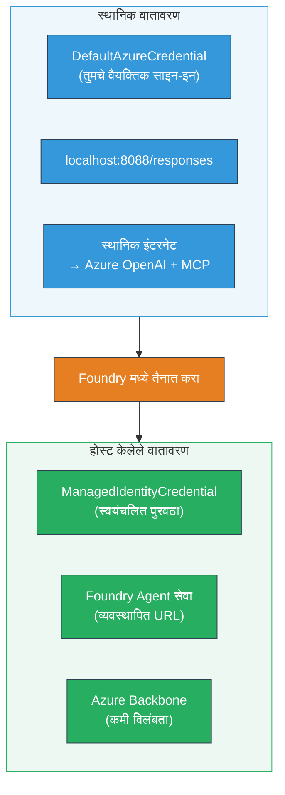

# Module 7 - प्लेग्राउंडमध्ये सत्यापन करा

या मॉड्युलमध्ये, आपण आपल्या परिनियोजित मल्टी-एजंट वर्कफ्लोचे **VS Code** आणि **[Foundry Portal](https://ai.azure.com)** मध्ये चाचणी करता, खात्री करून की एजंट स्थानिक चाचणीप्रमाणेच वागतोय.

---

## तैनाती नंतर का सत्यापित करावे?

आपला मल्टी-एजंट वर्कफ्लो स्थानिकरित्या पूर्णपणे चालला, तर पुन्हा का चाचणी घ्यावी? होस्ट केलेल्या वातावरणात अनेक प्रकारे फरक असतो:


| फरक | स्थानिक | होस्टेड |
|-----------|-------|--------|
| **ओळख** | [`DefaultAzureCredential`](https://learn.microsoft.com/azure/developer/python/sdk/authentication/credential-chains#defaultazurecredential-overview) (आपले वैयक्तिक साइन-इन) | [`ManagedIdentityCredential`](https://learn.microsoft.com/python/api/overview/azure/identity-readme#managed-identity-support) (स्वयंचलित पुरवठा) |
| **एंडपॉइंट** | `http://localhost:8088/responses` | [Foundry Agent Service](https://learn.microsoft.com/azure/foundry/agents/concepts/hosted-agents) एंडपॉइंट (व्यवस्थापित URL) |
| **नेटवर्क** | स्थानिक संगणक → Azure OpenAI + MCP आउटबाउंड | Azure बॅकबोन (सेवांमधील कमी विलंब) |
| **MCP कनेक्टिव्हिटी** | स्थानिक इंटरनेट → `learn.microsoft.com/api/mcp` | कंटेनर आउटबाउंड → `learn.microsoft.com/api/mcp` |

जर कोणतेही वातावरण चल एकदिशात्मकरित्या चुकीचे सेट केले असेल, RBAC वेगळे असेल, किंवा MCP आउटबाउंड ब्लॉक झाले असेल, तर ते येथे पकडले जाईल.

---

## पर्याय A: VS Code प्लेग्राउंडमध्ये चाचणी करा (प्रथम शिफारस केलेला)

[Foundry एक्सटेंशन](https://marketplace.visualstudio.com/items?itemName=TeamsDevApp.vscode-ai-foundry) मध्ये समाकलित प्लेग्राउंड आहे जेणेकरून आपण आपल्या परिनियोजित एजंटशी VS Code सोडले न जाता संवाद साधू शकता.

### पायरी 1: आपला होस्टेड एजंट उघडा

1. VS Code च्या **Activity Bar** (डावे साइडबार) मध्ये **Microsoft Foundry** आयकॉनवर क्लिक करा जेणेकरून Foundry पॅनेल उघडेल.
2. आपल्या जोडलेल्या प्रकल्पाला (उदा., `workshop-agents`) विस्तृत करा.
3. **Hosted Agents (Preview)** विस्तृत करा.
4. आपल्याला आपला एजंट नाव दिसेल (उदा., `resume-job-fit-evaluator`).

### पायरी 2: आवृत्ती निवडा

1. एजंट नावावर क्लिक करून त्याच्या आवृत्त्या विस्तृत करा.
2. आपण ज्या आवृत्तीची तैनाती केली आहे (उदा., `v1`) त्यावर क्लिक करा.
3. एक **तपशील पॅनेल** उघडेल जिथे कंटेनर तपशील दिसतील.
4. स्थिती **Started** किंवा **Running** असल्याची खात्री करा.

### पायरी 3: प्लेग्राउंड उघडा

1. तपशील पॅनेलमध्ये, **Playground** बटणावर क्लिक करा (किंवा आवृत्तीवर उजव्या क्लिक करून → **Open in Playground** निवडा).
2. VS Code टॅबमध्ये एक चॅट इंटरफेस उघडेल.

### पायरी 4: आपल्या स्मोक चाचण्या चालवा

[Module 5](05-test-locally.md) मधील तेच 3 चाचण्या वापरा. प्रत्येक संदेश प्लेग्राउंड इनपुट बॉक्समध्ये टाका आणि **Send** (किंवा **Enter**) दाबा.

#### चाचणी 1 - पूर्ण बायोडेटा + JD (सामान्य प्रवाह)

Module 5, चाचणी 1 मधील पूर्ण बायोडेटा + JD प्रॉम्प्ट पेस्ट करा (Jane Doe + Senior Cloud Engineer at Contoso Ltd).

**अपेक्षित:**
- गणितासह फिट स्कोअर (100-बिंदू प्रमाण)
- जुळलेल्या कौशल्यांचा विभाग
- हरवलेले कौशल्य विभाग
- **प्रत्येक हरवलेल्या कौशल्यासाठी एक गॅप कार्ड** ज्यात Microsoft Learn URL असतील
- शिक्षणाचा रोडमॅप वेळापत्रकासह

#### चाचणी 2 - जलद लघु चाचणी (कमी इनपुट)

```
RESUME: 3 years Python developer, knows Django and PostgreSQL, no cloud experience.

JOB: Cloud DevOps Engineer requiring AWS, Kubernetes, Terraform, CI/CD. 5 years needed.
```

**अपेक्षित:**
- कमी फिट स्कोअर (< 40)
- प्रामाणिक मूल्यांकन व टप्प्याटप्प्याने शिकण्याचा मार्ग
- अनेक गॅप कार्ड्स (AWS, Kubernetes, Terraform, CI/CD, अनुभवातील अंतर)

#### चाचणी 3 - उच्च-फिट उमेदवार

```
RESUME:
10 years Azure Cloud Architect. AZ-305 certified. Expert in AKS, Terraform, Azure DevOps, 
Azure Functions, Helm, Prometheus, Grafana, Python, Go. Led platform team of 8.

JOB:
Senior Cloud Engineer. Required: AKS, Terraform, Azure DevOps, Python. Preferred: Helm, Go.
5+ years experience. AZ-305 preferred.
```

**अपेक्षित:**
- उच्च फिट स्कोअर (≥ 80)
- मुलाखतीस तयार होण्यावर आणि सुलभतेवर लक्ष केंद्रित
- काही किंवा कोणतेही गॅप कार्ड्स नसतील
- तयार करण्यासाठी लहान कालावधी

### पायरी 5: स्थानिक निकालांशी तुलना करा

Module 5 मधून आपले नोट्स किंवा ब्राउजर टॅब उघडा, जिथे आपण स्थानिक प्रतिसाद जतन केले होते. प्रत्येक चाचणीसाठी:

- प्रतिसादाची **रचना सारखी आहे का** (फिट स्कोअर, गॅप कार्ड्स, रोडमॅप)?
- **सोडलेली गुणांकन प्रणाली सारखी आहे का** (100-बिंदू ब्रेअकडाउन)?
- गॅप कार्ड्समध्ये Microsoft Learn URL अजूनही आहेत का?
- **प्रत्येक हरवलेल्या कौशल्यासाठी एक गॅप कार्ड आहे का** (कट केलेले नाही)?

> **लहान शब्दांतील फरक सामान्य आहेत** - मॉडेल अनिश्चित आहे. संरचना, गुणांकन सुसंगतता आणि MCP साधन वापराबद्दल लक्ष ठेवा.

---

## पर्याय B: Foundry पोर्टलमध्ये चाचणी करा

[Foundry पोर्टल](https://ai.azure.com) हे वेब-आधारित प्लेग्राउंड देतो जे संघातील साथीदार किंवा हितधारकांसोबत शेअर करणे सोपे आहे.

### पायरी 1: Foundry पोर्टल उघडा

1. आपला ब्राउजर उघडा आणि [https://ai.azure.com](https://ai.azure.com) येथे जा.
2. ज्या Azure खात्याचा आपण संगणकावर वापर करीत आहात त्याच खात्याने साइन इन करा.

### पायरी 2: आपला प्रकल्प शोधा

1. मुख्य पृष्ठावर डावे साइडबारमध्ये **Recent projects** पहा.
2. आपल्या प्रकल्पाच्या नावावर क्लिक करा (उदा., `workshop-agents`).
3. जर ते दिसत नसेल, तर **All projects** वर क्लिक करा आणि शोधा.

### पायरी 3: आपला परिनियोजित एजंट शोधा

1. प्रकल्पाच्या डाव्या नेव्हिगेशनमध्ये **Build** → **Agents** क्लिक करा (किंवा **Agents** विभाग शोधा).
2. एजंट्सची यादी दिसेल. आपला परिनियोजित एजंट शोधा (उदा., `resume-job-fit-evaluator`).
3. एजंट नावावर क्लिक करून त्याचा तपशील पृष्ठ उघडा.

### पायरी 4: प्लेग्राउंड उघडा

1. एजंट तपशील पृष्ठावर, वरच्या टूलबारमध्ये पाहा.
2. **Open in playground** (किंवा **Try in playground**) क्लिक करा.
3. एक चॅट इंटरफेस उघडेल.

### पायरी 5: समान स्मोक चाचण्या चालवा

वरील VS Code प्लेग्राउंड विभागातील तसंच 3 चाचण्या पुन्हा करा. प्रत्येक प्रतिसाद स्थानिक निकालांशी (Module 5) आणि VS Code प्लेग्राउंड निकालांशी (पर्याय A वरील) तुलना करा.

---

## मल्टी-एजंट संबंधित सत्यापन

मूलभूत अचूकतेशिवाय, खालील मल्टी-एजंट संबंधित वर्तन सत्यापित करा:

### MCP साधन कार्यान्वयन

| तपासणी | कशी सत्यापित करावी | यशस्वी स्थिती |
|-------|------------------|----------------|
| MCP कॉल्स यशस्वी | गॅप कार्ड्समध्ये `learn.microsoft.com` URLs आहेत | वास्तविक URL, फॉलबॅक संदेश नाहीत |
| अनेक MCP कॉल्स | प्रत्येक उच्च/मध्यम प्राधान्य गॅपसाठी संसाधने आहेत | फक्त पहिले गॅप कार्ड नाही |
| MCP फॉलबॅक कार्यरत | URLs अनुपस्थित असल्यास फॉलबॅक टेक्टसाठी तपासा | एजंट तरीही गॅप कार्ड्स तयार करतो (URLs सोबत किंवा शिवाय) |

### एजंट समन्वय

| तपासणी | कशी सत्यापित करावी | यशस्वी स्थिती |
|-------|------------------|----------------|
| सर्व 4 एजंट्सने प्रक्रिया केली | आउटपुटमध्ये फिट स्कोअर आणि गॅप कार्ड्स असावे | गुणांकन MatchingAgent कडून, कार्ड्स GapAnalyzer कडून |
| समांतर फॅन-आऊट | प्रतिसाद वेळ कारणार्ह (< 2 मिनिटे) | जर > 3 मिनिटे असेल, तर समांतर अंमलबजावणी कार्य करत नाही |
| डेटा प्रवाह अखंडता | गॅप कार्ड्समध्ये रिपोर्ट मधील कौशल्यांचा संदर्भ आहे | JD मध्ये नसलेल्या कौशल्याचा भ्रम नाही |

---

## प्रमाणीकरण रबरिक

आपल्या मल्टी-एजंट वर्कफ्लोच्या होस्टेड वर्तनाचा हा रबरिक वापरा:

| # | निकष | यशस्वी स्थिती | पास? |
|---|----------|---------------|-------|
| 1 | **कार्यक्षम अचूकता** | एजंट फिट स्कोअर आणि गॅप विश्लेषणासह बायोडेटा + JD ला प्रतिसाद देतो | |
| 2 | **गुणांकन सुसंगतता** | फिट स्कोअर 100-बिंदू प्रमाणाने गणितासह वापरतो | |
| 3 | **गॅप कार्ड पूर्णता** | प्रत्येक हरवलेल्या कौशल्यासाठी एक कार्ड (कट केलेले किंवा संयुक्त नाही) | |
| 4 | **MCP साधन समाकलन** | गॅप कार्ड्समध्ये वास्तविक Microsoft Learn URL असतात | |
| 5 | **रचनात्मक सुसंगतता** | आउटपुट रचना स्थानिक आणि होस्टेड दोन्ही रनमध्ये जुळते | |
| 6 | **प्रतिक्रिया वेळ** | होस्टेड एजंट पूर्ण मूल्यांकनासाठी 2 मिनिटांत प्रतिसाद देतो | |
| 7 | **त्रुटी नाही** | HTTP 500 त्रुटी, टाइमआऊट किंवा रिकामे प्रतिसाद नाहीत | |

> "पास" म्हणजे सर्व 3 स्मोक चाचण्यांसाठी किमान एका प्लेग्राउंडमध्ये (VS Code किंवा पोर्टल) सर्व 7 निकष पूर्ण झाले आहेत.

---

## प्लेग्राउंड समस्या निवारण

| लक्षण | संभाव्य कारण | दुरुस्ती |
|---------|-------------|-----|
| प्लेग्राउंड लोड होत नाही | कंटेनर स्थिती "Started" नाही | [Module 6](06-deploy-to-foundry.md) मध्ये परत जा, तैनाती स्थिती तपासा. "Pending" असल्यास थांबा |
| एजंट रिकाम्या प्रतिसादात परत येतो | मॉडेल तैनाती नाव जुळत नाही | `agent.yaml` → `environment_variables` → `MODEL_DEPLOYMENT_NAME` आपल्याद्वारे तैनात मॉडेलशी जुळते का तपासा |
| एजंट त्रुटी संदेश दर्शवितो | [RBAC](https://learn.microsoft.com/azure/foundry/concepts/rbac-foundry) परवानगी अभाव | प्रकल्प प्रमाणावर **[Azure AI User](https://aka.ms/foundry-ext-project-role)** नियुक्त करा |
| गॅप कार्ड्समध्ये Microsoft Learn URL नाहीत | MCP आउटबाउंड ब्लॉक किंवा MCP सर्व्हर अनुपलब्ध | कंटेनरला `learn.microsoft.com` वर पोहोचण्याची परवानगी आहे का तपासा. [Module 8](08-troubleshooting.md) पहा |
| फक्त 1 गॅप कार्ड आहे (कट केलेले) | GapAnalyzer निर्देशांमध्ये "CRITICAL" ब्लॉक गहाळ | [Module 3, Step 2.4](03-configure-agents.md) पुनरावलोकन करा |
| फिट स्कोअर स्थानिकपेक्षा खूप वेगळा | भिन्न मॉडेल किंवा निर्देश तैनात | `agent.yaml` मध्ये पर्यावरण चल स्थानिक `.env` शी तुलना करा. आवश्यक असल्यास पुन्हा तैनात करा |
| पोर्टलमध्ये "Agent not found" | तैनाती अजून प्रसारित होत आहे किंवा अयशस्वी | 2 मिनिटे थांबा, रिफ्रेश करा. अद्याप उपलब्ध नसेल तर [Module 6](06-deploy-to-foundry.md) मधून पुन्हा तैनात करा |

---

### चेकपॉईंट

- [ ] VS Code प्लेग्राउंड मध्ये एजंटची चाचणी केली - सर्व 3 स्मोक चाचण्या उत्तीर्ण
- [ ] [Foundry Portal](https://ai.azure.com) प्लेग्राउंड मध्ये एजंटची चाचणी केली - सर्व 3 स्मोक चाचण्या उत्तीर्ण
- [ ] प्रतिसाद स्थानिक चाचणीशी रचनात्मकदृष्ट्या सुसंगत आहेत (फिट स्कोअर, गॅप कार्ड्स, रोडमॅप)
- [ ] Microsoft Learn URL गॅप कार्ड्समध्ये उपलब्ध आहेत (होस्टेड वातावरणात MCP साधन कार्यरत आहे)
- [ ] प्रत्येक हरवलेल्या कौशल्यासाठी एक गॅप कार्ड (काटछाट नाही)
- [ ] चाचणी दरम्यान कोणतीही त्रुटी किंवा टाइमआऊट नाहीत
- [ ] प्रमाणीकरण रबरिक पूर्ण केली (सर्व 7 निकष उत्तीर्ण)

---

**मागील:** [06 - Deploy to Foundry](06-deploy-to-foundry.md) · **पुढील:** [08 - Troubleshooting →](08-troubleshooting.md)

---

<!-- CO-OP TRANSLATOR DISCLAIMER START -->
**अस्वीकरण**:  
हा दस्तऐवज AI अनुवाद सेवा [Co-op Translator](https://github.com/Azure/co-op-translator) वापरून अनुवादित करण्यात आला आहे. आम्ही अचूकतेसाठी प्रयत्नशील असलो तरी, कृपया लक्षात घ्या की स्वयंचलित अनुवादांमध्ये त्रुटी किंवा चुकीची माहिती असू शकते. मूळ दस्तऐवज त्याच्या स्थानिक भाषेमध्ये अधिकारयुक्त स्रोत मानला जावा. महत्त्वाच्या माहिती साठी व्यावसायिक मानवी अनुवादाची शिफारस केली जाते. या अनुवादाच्या वापरामुळे झालेल्या कोणत्याही गैरसमजुतीं किंवा चुकीच्या अर्थसंग्रहांसाठी आम्ही जबाबदार नाही.
<!-- CO-OP TRANSLATOR DISCLAIMER END -->