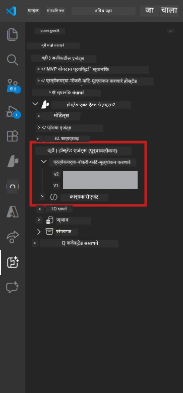

# मॉड्यूल ७ - प्लेग्राउंडमध्ये सत्यापन करा

⏱️ ~१० मिनिटे

या मॉड्यूलमध्ये, तुम्ही तुमचा डिप्लॉय केलेला मल्टी-एजंट वर्कफ्लो VS Code आणि Foundry पोर्टलमध्ये चाचणी करता, हे सुनिश्चित करत की एजंट स्थानिक चाचणीप्रमाणेच कार्य करतो.

---

## डिप्लॉय केल्यानंतर पुन्हा का चाचणी घ्यावी?

होस्टेड वातावरण स्थानिक वातावरणापेक्षा काही महत्त्वाच्या बाबतीत वेगळे आहे:

| | स्थानिक | होस्टेड |
|--|-------|--------|
| **ओळख** | तुमचा वैयक्तिक साइन-इन (`DefaultAzureCredential`) | डिप्लॉयमेंट वेळी ऑटो-प्रोव्हिजन केलेली प्रति-एजंट Entra ओळख |
| **एंडपॉइंट** | `http://localhost:8088/responses` | Foundry Agent Service द्वारे व्यवस्थापित URL |
| **नेटवर्क** | तुमची मशीन → Azure OpenAI + MCP | Azure बॅकबोन (कमी विलंब) |

चुकीचे सेट केलेले पर्यावरणीय चल, RBAC समस्या, किंवा ब्लॉक केलेले MCP बाह्य कॉल इथे प्रथम आढळू शकते.

---

## पर्याय A: VS Code प्लेग्राउंडमध्ये चाचणी करा (पहिले शिफारसीय)

### पाऊल १: तुमच्या होस्टेड एजंटकडे जा

१. **Foundry Toolkit** आयकॉनवर Activity Bar मध्ये क्लिक करा.
२. तुमचा प्रोजेक्ट विस्तृत करा → **Hosted Agents (Preview)** → तुमचा एजंट शोधा.



### पाऊल २: एक आवृत्ती निवडा

१. एजंटवर क्लिक करून त्याच्या आवृत्त्या विस्तृत करा.
२. `v1` वर क्लिक करा → स्थिती **active** आहे याची पुष्टी करा (साइडबार "Running" किंवा "Started" दर्शवू शकतो - दोन्ही एकच तयार स्थिती दर्शवतात).

### पाऊल ३: प्लेग्राउंड उघडा

१. **Playground** क्लिक करा (किंवा आवृत्तीवर राइट-क्लिक करा → **Open in Playground**).
२. एक चॅट विंडो VS Code टॅबमध्ये उघडेल.

### पाऊल ४: तुमचे स्मोक टेस्ट चालवा

[मॉड्यूल 5](05-test-locally.md) मधील तेच ३ चाचण्या वापरा. प्रत्येक संदेश प्लेग्राउंड इनपुट बॉक्समध्ये टाइप करा आणि **Send** (किंवा **Enter**) दाबा.

#### चाचणी 1 - पूर्ण रिज्युमे + JD (मानक प्रवाह)

मॉड्यूल 5, चाचणी 1 मधील पूर्ण रिज्युमे + JD प्रॉम्प्ट पेस्ट करा (Jane Doe + Senior Cloud Engineer at Contoso Ltd).

**अपेक्षित:**
- फिट स्कोअर विथ ब्रेकडाउन मथ (100-पॉइंट स्केल)
- जुळलेल्या कौशल्ये विभाग
- गहाळ कौशल्ये विभाग
- **प्रत्येक गहाळ कौशल्यासाठी एक गॅप कार्ड** ज्यामध्ये Microsoft Learn URL असतात
- शिकण्याचा रोडमॅप आणि वेळापत्रक

#### चाचणी 2 - जलद लहान चाचणी (किमान इनपुट)

```
RESUME: 3 years Python developer, knows Django and PostgreSQL, no cloud experience.

JOB: Cloud DevOps Engineer requiring AWS, Kubernetes, Terraform, CI/CD. 5 years needed.
```

**अपेक्षित:**
- कमी फिट स्कोअर (< 40)
- प्रामाणिक मूल्यमापन आणि टप्प्याटप्प्याने शिकण्याचा मार्ग
- अनेक गॅप कार्ड्स (AWS, Kubernetes, Terraform, CI/CD, अनुभवातील फरक)

#### चाचणी 3 - उच्च फिट करणारा उमेदवार

```
RESUME:
10 years Azure Cloud Architect. AZ-305 certified. Expert in AKS, Terraform, Azure DevOps, 
Azure Functions, Helm, Prometheus, Grafana, Python, Go. Led platform team of 8.

JOB:
Senior Cloud Engineer. Required: AKS, Terraform, Azure DevOps, Python. Preferred: Helm, Go.
5+ years experience. AZ-305 preferred.
```

**अपेक्षित:**
- उच्च फिट स्कोअर (≥ 80)
- मुलाखत तयारी आणि पॉलिशिंगवर लक्ष केंद्रित
- कमी किंवा कोणतेही गॅप कार्ड्स नाहीत
- तयारीसाठी लक्ष केंद्रित केलेला लहान वेळापत्रक

### पाऊल ५: स्थानिक निकालांसह तुलना करा

मॉड्यूल 5 मधून स्थानिक प्रतिक्रिया जिथे तुम्ही जतन केले आहेत ती नोंदी किंवा ब्राउझर टॅब उघडा. प्रत्येक चाचणीसाठी:

- प्रतिक्रिया हा **त्याच रचनात्मक स्वरूपात** आहे का (फिट स्कोअर, गॅप कार्ड्स, रोडमॅप)?
- **त्याच स्कोअरिंग निकषांनुसार** आहे का (100-पॉइंट ब्रेकडाउन)?
- गॅप कार्ड्समध्ये **Microsoft Learn URL** अजूनही आहेत का?
- **प्रत्येक गहाळ कौशल्यासाठी एक गॅप कार्ड** आहे का (कट-ऑफ नाही)?

> **लहान शब्द फरक सामान्य आहेत** - मॉडेल अनिश्चित आहे. रचना, स्कोअरिंग सुसंगतता, आणि MCP साधन वापरावर लक्ष केंद्रित करा.

---

## पर्याय B: Foundry पोर्टलमध्ये चाचणी करा

[Foundry Portal](https://ai.azure.com) हा वेब-आधारित प्लेग्राउंड प्रदान करतो जो सहकारी किंवा भागीदारांसह शेअर करण्यासाठी उपयुक्त आहे.

### पाऊल १: Foundry पोर्टल उघडा

१. तुमचा ब्राउझर उघडा आणि [https://ai.azure.com](https://ai.azure.com) येथे जा.
२. वर्कशॉपमध्ये तुम्ही ज्या Azure खात्याचा वापर करत होतात त्याच खात्याने साइन इन करा.

### पाऊल २: तुमच्या प्रोजेक्टकडे जा

१. मुख्य पृष्ठावर, डाव्या बाजूला **Recent projects** शोधा.
२. तुमच्या प्रोजेक्टच्या नावावर क्लिक करा (उदा., `workshop-agents`).
३. जर ते दिसत नसेल, तर **All projects** क्लिक करून शोधा.

### पाऊल ३: तुमचा डिप्लॉय केलेला एजंट शोधा

१. प्रोजेक्ट डाव्या नेव्हिगेशनमध्ये, **Build** → **Agents** (किंवा **Agents** विभाग शोधा) क्लिक करा.
२. एजंट्सची यादी दिसेल. तुमचा डिप्लॉय केलेला एजंट शोधा (उदा., `resume-job-fit-evaluator`).
३. एजंटच्या नावावर क्लिक करून त्याचे तपशील पृष्ठ उघडा.

### पाऊल ४: प्लेग्राउंड उघडा

१. एजंट तपशील पृष्ठावर, वरच्या टूलबारकडे पाहा.
२. **Open in playground** (किंवा **Try in playground**) क्लिक करा.
३. चॅट इंटरफेस उघडेल.

### पाऊल ५: तेच स्मोक टेस्ट पुन्हा चालवा

वर व्हीएस कोड प्लेग्राउंड विभागातील सर्व ३ टेस्ट पुन्हा करा. प्रत्येक प्रतिसाद स्थानिक निकालांसह (मॉड्यूल 5) आणि VS Code प्लेग्राउंड परिणामांसह (वरील पर्याय A) तुलना करा.

---

## मल्टी-एजंटसाठी विशिष्ट सत्यापन

मूलभूत बरोबरीशिवाय, हे मल्टी-एजंट विशिष्ट वर्तन तपासा:

### MCP टूल कार्यान्वयन

| तपासा | कसे सत्यापित करावे | पास स्थिती |
|-------|---------------|----------------|
| MCP कॉल्स यशस्वी | गॅप कार्ड्समध्ये `learn.microsoft.com` URL असणे | वास्तविक URL, पडताळणी संदेश नाहीत |
| एकाहून अधिक MCP कॉल्स | प्रत्येक उच्च/मध्यम प्राधान्याच्या गॅपसाठी संसाधने आहेत | फक्त पहिला गॅप कार्ड नाही |
| MCP फॉलबॅक कार्यरत | URL हरवल्यास फॉलबॅक मजकूर तपासा | एजंट अद्याप गॅप कार्ड तयार करतो (URL असल्याशिवाय किंवा सोबत) |

### एजंट समन्वय

| तपासा | कसे सत्यापित करावे | पास स्थिती |
|-------|---------------|----------------|
| सर्व ४ एजंट्स चालले | आउटपुटमध्ये फिट स्कोअर आणि गॅप कार्ड्स आहेत | स्कोअर MatchingAgent कडून, कार्ड्स GapAnalyzer कडून |
| अनुक्रमिक कार्यान्वयन | प्रतिसाद वेळ वाजवी आहे (< २ मिनिटे) | जर > ३ मिनिटे, टर्मिनल लॉगमध्ये त्रुटी तपासा |
| डेटा प्रवाह अखंडता | गॅप कार्ड्समध्ये कौशल्ये जुळणी अहवालात दर्शविली आहेत | JD मध्ये नसलेली कौशल्ये नाहीत |

---

## सत्यापन निकष

तुमच्या मल्टी-एजंट वर्कफ्लोच्या होस्टेड वर्तनाचे मूल्यमापन करण्यासाठी हा निकष वापरा:

| # | निकष | पास स्थिती | पास? |
|---|----------|---------------|-------|
| १ | **कार्यात्मक बरोबरी** | एजंट रिज्युमे + JD ला फिट स्कोअर आणि गॅप विश्लेषणासह प्रतिसाद देतो | |
| २ | **स्कोअरिंग सुसंगतता** | फिट स्कोअर 100-पॉइंट स्केलसह ब्रेकडाउन गणित वापरतो | |
| ३ | **गॅप कार्ड पूर्णता** | प्रत्येक गहाळ कौशल्यासाठी एक कार्ड (कट-ऑफ किंवा संमिश्र नाही) | |
| ४ | **MCP टूल समाकलन** | गॅप कार्ड्स मध्ये वास्तविक Microsoft Learn URL असतात | |
| ५ | **रचनात्मक सुसंगतता** | स्थानिक आणि होस्टेड रनमध्ये आउटपुट रचना जुळते | |
| ६ | **प्रतिक्रिया वेळ** | होस्टेड एजंट पूर्ण मूल्यांकनासाठी २ मिनिटांत उत्तर देतो | |
| ७ | **त्रुटी नाहीत** | HTTP 500 त्रुटी, वेळ मर्यादा, किंवा रिक्त प्रतिसाद नाहीत | |

> "पास" म्हणजे ७ पैकी सर्व निकष पूर्ण होणे, आणि ३ स्मोक टेस्टपैकी किमान एका प्लेग्राउंडमध्ये (VS Code किंवा पोर्टल).

---

## प्लेग्राउंड समस्यांचे निराकरण

| लक्षण | शक्य कारण | उपाय |
|---------|-------------|-----|
| प्लेग्राउंड लोड होत नाही | कंटेनर `active` स्थितीत नाही | [मॉड्यूल 6](06-deploy-to-foundry.md) येथे परत जा, डिप्लॉयमेंट स्थिती तपासा. जर `creating` असेल तर थांबा |
| एजंट रिक्त प्रतिसाद देतो | मॉडेल डिप्लॉयमेंट नाव जुळत नाही | `agent.yaml` → `environment_variables` → `AZURE_AI_MODEL_DEPLOYMENT_NAME` तुमच्या डिप्लॉय केलेल्या मॉडेलशी जुळते का तपासा |
| एजंट त्रुटी संदेश देतो | [RBAC](https://learn.microsoft.com/azure/foundry/concepts/rbac-foundry) परवानगी नाही | प्रोजेक्ट श्रेणीत **[Foundry User](https://aka.ms/foundry-ext-project-role)** (पूर्वी Azure AI User) नियुक्त करा |
| गॅप कार्ड्समध्ये Microsoft Learn URL नाहीत | MCP बाह्य कॉल ब्लॉक किंवा MCP सर्व्हर उपलब्ध नाही | कंटेनर `learn.microsoft.com` पोहचू शकतो का तपासा. पहा [मॉड्यूल ८](08-troubleshooting.md) |
| फक्त १ गॅप कार्ड (काटलेले) आहे | GapAnalyzer मध्ये "CRITICAL" ब्लॉक सूचना हरवल्या आहेत | पहा [मॉड्यूल 3, पाऊल 2.4](03-configure-agents.md) |
| फिट स्कोअर स्थानिकांपेक्षा खूप वेगळे आहे | वेगळा मॉडेल किंवा सूचना डिप्लॉय केलेल्या | `agent.yaml` पर्यावरणीय चल स्थानिक `.env` शी तुलना करा. गरज असल्यास पुन्हा डिप्लॉय करा |
| पोर्टलमध्ये "Agent not found" | डिप्लॉयमेंट अजून प्रसारित होत आहे किंवा अयशस्वी झाला | २ मिनिटे थांबा, रिफ्रेश करा. अजूनही नाही? [मॉड्यूल 6](06-deploy-to-foundry.md) मधून पुन्हा डिप्लॉय करा |

---

### चेकपॉईंट

- [ ] एजंट VS Code प्लेग्राउंडमध्ये तपासले - सर्व ३ स्मोक टेस्ट्स पास
- [ ] एजंट [Foundry Portal](https://ai.azure.com) प्लेग्राउंडमध्ये तपासले - सर्व ३ स्मोक टेस्ट्स पास
- [ ] प्रतिक्रिया स्थानिक चाचणीसह रचनात्मकदृष्ट्या सुसंगत (फिट स्कोअर, गॅप कार्ड्स, रोडमॅप)
- [ ] गॅप कार्ड्समध्ये Microsoft Learn URL आहेत (होस्टेड वातावरणात MCP टूल काम करत आहे)
- [ ] प्रत्येक गहाळ कौशल्यासाठी एक गॅप कार्ड (काटछाट नाही)
- [ ] चाचणी दरम्यान त्रुटी किंवा वेळ आऊट नाहीत
- [ ] सत्यापन निकष पूर्ण केला (सर्व ७ निकष पास)

---

**मागील:** [06 - Deploy to Foundry](06-deploy-to-foundry.md) · **पुढील:** [08 - Troubleshooting →](08-troubleshooting.md)

---

<!-- CO-OP TRANSLATOR DISCLAIMER START -->
**अस्वीकरण**:
हा दस्तऐवज AI भाषांतर सेवा [Co-op Translator](https://github.com/Azure/co-op-translator) चा वापर करून अनुवादित केला आहे. जरी आम्ही अचूकतेसाठी प्रयत्न करतो, तरी कृपया लक्षात घ्या की स्वयंचलित भाषांतरांमध्ये त्रुटी किंवा अचूकतेची कमतरता असू शकते. मूळ दस्तऐवज त्याच्या मूळ भाषेत अधिकृत स्रोत मानला पाहिजे. महत्त्वाची माहिती असल्यास, व्यावसायिक मानवी भाषांतराची शिफारस केली जाते. या भाषांतराच्या वापरामुळे उद्भवणाऱ्या कोणत्याही गैरसमज किंवा चुकीच्या अर्थलावणीसाठी आम्ही जबाबदार नाही.
<!-- CO-OP TRANSLATOR DISCLAIMER END -->