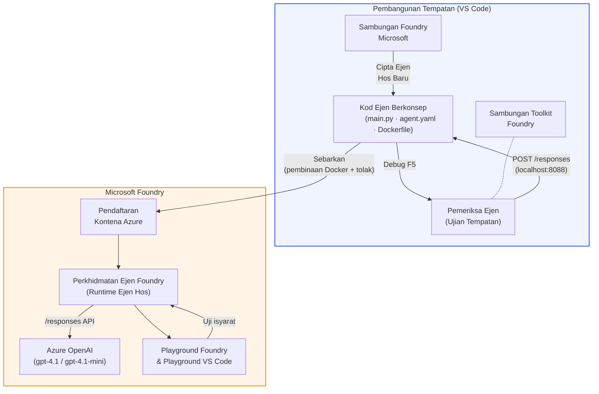

# Foundry Toolkit + Bengkel Ejen Hosted Foundry

[](https://www.python.org/)
[](https://github.com/microsoft/agents)
[](https://learn.microsoft.com/azure/ai-foundry/agents/concepts/hosted-agents/)
[](https://ai.azure.com/)
[](https://learn.microsoft.com/azure/ai-services/openai/)
[](https://learn.microsoft.com/cli/azure/install-azure-cli)
[](https://learn.microsoft.com/azure/developer/azure-developer-cli/install-azd)
[](https://www.docker.com/)
[](https://marketplace.visualstudio.com/items?itemName=ms-windows-ai-studio.windows-ai-studio)
[](LICENSE)

Bina, uji, dan lancarkan ejen AI ke **Microsoft Foundry Agent Service** sebagai **Ejen Hosted** - sepenuhnya dari VS Code menggunakan **luasan Microsoft Foundry** dan **Foundry Toolkit**.

> **Ejen Hosted kini dalam pratonton.** Kawasan yang disokong adalah terhad - lihat [ketersediaan kawasan](https://learn.microsoft.com/azure/foundry/agents/concepts/hosted-agents#region-availability).

> Folder `agent/` dalam setiap makmal adalah **dirangka secara automatik** oleh luasan Foundry - anda kemudian menyesuaikan kod, uji secara tempatan, dan lancarkan.

### 🌐 Sokongan Pelbagai Bahasa

#### Disokong melalui Tindakan GitHub (Automatik & Sentiasa Dikemas Kini)

<!-- CO-OP TRANSLATOR LANGUAGES TABLE START -->
[Arabic](../ar/README.md) | [Bengali](../bn/README.md) | [Bulgarian](../bg/README.md) | [Burmese (Myanmar)](../my/README.md) | [Chinese (Simplified)](../zh-CN/README.md) | [Chinese (Traditional, Hong Kong)](../zh-HK/README.md) | [Chinese (Traditional, Macau)](../zh-MO/README.md) | [Chinese (Traditional, Taiwan)](../zh-TW/README.md) | [Croatian](../hr/README.md) | [Czech](../cs/README.md) | [Danish](../da/README.md) | [Dutch](../nl/README.md) | [Estonian](../et/README.md) | [Finnish](../fi/README.md) | [French](../fr/README.md) | [German](../de/README.md) | [Greek](../el/README.md) | [Hebrew](../he/README.md) | [Hindi](../hi/README.md) | [Hungarian](../hu/README.md) | [Indonesian](../id/README.md) | [Italian](../it/README.md) | [Japanese](../ja/README.md) | [Kannada](../kn/README.md) | [Khmer](../km/README.md) | [Korean](../ko/README.md) | [Lithuanian](../lt/README.md) | [Malay](./README.md) | [Malayalam](../ml/README.md) | [Marathi](../mr/README.md) | [Nepali](../ne/README.md) | [Nigerian Pidgin](../pcm/README.md) | [Norwegian](../no/README.md) | [Persian (Farsi)](../fa/README.md) | [Polish](../pl/README.md) | [Portuguese (Brazil)](../pt-BR/README.md) | [Portuguese (Portugal)](../pt-PT/README.md) | [Punjabi (Gurmukhi)](../pa/README.md) | [Romanian](../ro/README.md) | [Russian](../ru/README.md) | [Serbian (Cyrillic)](../sr/README.md) | [Slovak](../sk/README.md) | [Slovenian](../sl/README.md) | [Spanish](../es/README.md) | [Swahili](../sw/README.md) | [Swedish](../sv/README.md) | [Tagalog (Filipino)](../tl/README.md) | [Tamil](../ta/README.md) | [Telugu](../te/README.md) | [Thai](../th/README.md) | [Turkish](../tr/README.md) | [Ukrainian](../uk/README.md) | [Urdu](../ur/README.md) | [Vietnamese](../vi/README.md)

> **Lebih suka Klon Secara Tempatan?**
>
> Repositori ini merangkumi lebih daripada 50 terjemahan bahasa yang meningkatkan saiz muat turun dengan ketara. Untuk klon tanpa terjemahan, gunakan sparse checkout:
>
> **Bash / macOS / Linux:**
> ```bash
> git clone --filter=blob:none --sparse https://github.com/microsoft-foundry/Foundry_Toolkit_for_VSCode_Lab.git
> cd Foundry_Toolkit_for_VSCode_Lab
> git sparse-checkout set --no-cone '/*' '!translations' '!translated_images'
> ```
>
> **CMD (Windows):**
> ```cmd
> git clone --filter=blob:none --sparse https://github.com/microsoft-foundry/Foundry_Toolkit_for_VSCode_Lab.git
> cd Foundry_Toolkit_for_VSCode_Lab
> git sparse-checkout set --no-cone "/*" "!translations" "!translated_images"
> ```
>
> Ini memberikan anda semua yang anda perlukan untuk menyelesaikan kursus dengan muat turun yang jauh lebih pantas.
<!-- CO-OP TRANSLATOR LANGUAGES TABLE END -->

---

## Seni Bina


**Aliran:** Luasan Foundry menjana rangka kerja ejen → anda sesuaikan kod & arahan → uji secara tempatan dengan Pemeriksa Ejen → lancarkan ke Foundry (imej Docker didorong ke ACR) → sahkan dalam Playground.

---

## Apa yang akan anda bina

| Makmal | Perihalan | Status |
|-----|-------------|--------|
| **Makmal 01 - Ejen Tunggal** | Bina **Ejen "Terangkan Seolah-olah Saya Seorang Eksekutif"**, uji secara tempatan, dan lancarkan ke Foundry | ✅ Tersedia |
| **Makmal 02 - Aliran Kerja Multi-Ejen** | Bina **"Penilai Keserasian Resume → Kerja"** - 4 ejen bekerjasama menilai keserasian resume dan menjana peta jalan pembelajaran | ✅ Tersedia |

---

## Kenali Ejen Eksekutif

Dalam bengkel ini anda akan membina **Ejen "Terangkan Seolah-olah Saya Seorang Eksekutif"** - ejen AI yang mengambil jargon teknikal yang kompleks dan menterjemahkannya menjadi ringkasan tenang yang sesuai untuk bilik mesyuarat. Kerana jujur, tiada siapa dalam C-suite mahu mendengar tentang "keletihan kolam benang yang disebabkan oleh panggilan segerak yang diperkenalkan dalam v3.2."

Saya membina ejen ini selepas terlalu banyak insiden dimana laporan post-mortem saya yang sempurna mendapat maklum balas: *"Jadi... adakah laman web itu turun atau tidak?"*

### Bagaimana ia berfungsi

Anda berikan kemas kini teknikal kepadanya. Ia memuntahkan kembali ringkasan eksekutif - tiga titik peluru, tanpa jargon, tanpa kesilapan susun atur, tanpa rasa cemas yang mendalam. Hanya **apa yang berlaku**, **impak perniagaan**, dan **langkah seterusnya**.

### Lihat ia beraksi

**Anda berkata:**
> "Kelambatan API meningkat disebabkan keletihan kolam benang yang disebabkan oleh panggilan segerak yang diperkenalkan dalam v3.2."

**Ejen menjawab:**

> **Ringkasan Eksekutif:**
> - **Apa yang berlaku:** Selepas keluaran terkini, sistem menjadi perlahan.
> - **Impak perniagaan:** Sesetengah pengguna mengalami kelewatan semasa menggunakan perkhidmatan.
> - **Langkah seterusnya:** Perubahan telah dibatalkan dan pembaikan sedang disediakan sebelum pelancaran semula.

### Kenapa ejen ini?

Ia adalah ejen tujuan tunggal yang sangat mudah - sesuai untuk belajar aliran kerja ejen hosted dari awal hingga akhir tanpa terperangkap dalam rantaian alat yang kompleks. Dan jujur? Setiap pasukan kejuruteraan boleh menggunakan salah satu daripada ini.

---

## Struktur bengkel

```
📂 Foundry_Toolkit_for_VSCode_Lab/
├── 📄 README.md                      ← You are here
├── 📂 ExecutiveAgent/                ← Standalone hosted agent project
│   ├── agent.yaml
│   ├── Dockerfile
│   ├── main.py
│   └── requirements.txt
└── 📂 workshop/
    ├── 📂 lab01-single-agent/        ← Full lab: docs + agent code
    │   ├── README.md                 ← Hands-on lab instructions
    │   ├── 📂 docs/                  ← Step-by-step tutorial modules
    │   │   ├── 00-prerequisites.md
    │   │   ├── 01-install-foundry-toolkit.md
    │   │   ├── 02-create-foundry-project.md
    │   │   ├── 03-create-hosted-agent.md
    │   │   ├── 04-configure-and-code.md
    │   │   ├── 05-test-locally.md
    │   │   ├── 06-deploy-to-foundry.md
    │   │   ├── 07-verify-in-playground.md
    │   │   └── 08-troubleshooting.md
    │   └── 📂 agent/                 ← Reference solution (auto-scaffolded by Foundry extension)
    │       ├── agent.yaml
    │       ├── Dockerfile
    │       ├── main.py
    │       └── requirements.txt
    └── 📂 lab02-multi-agent/         ← Resume → Job Fit Evaluator
        ├── README.md                 ← Hands-on lab instructions (end-to-end)
        ├── 📂 docs/                  ← Step-by-step tutorial modules
        │   ├── 00-prerequisites.md
        │   ├── 01-understand-multi-agent.md
        │   ├── 02-scaffold-multi-agent.md
        │   ├── 03-configure-agents.md
        │   ├── 04-orchestration-patterns.md
        │   ├── 05-test-locally.md
        │   ├── 06-deploy-to-foundry.md
        │   ├── 07-verify-in-playground.md
        │   └── 08-troubleshooting.md
        └── 📂 PersonalCareerCopilot/ ← Reference solution (multi-agent workflow)
            ├── agent.yaml
            ├── Dockerfile
            ├── main.py
            └── requirements.txt
```

> **Catatan:** Folder `agent/` di dalam setiap makmal adalah apa yang dijana oleh **luasan Microsoft Foundry** apabila anda menjalankan `Microsoft Foundry: Create a New Hosted Agent` dari Command Palette. Fail-fail tersebut kemudian disesuaikan dengan arahan, alat, dan konfigurasi ejen anda. Makmal 01 membimbing anda untuk membuatnya dari awal.

---

## Mula

### 1. Klon repositori

```bash
git clone https://github.com/microsoft-foundry/Foundry_Toolkit_for_VSCode_Lab.git
cd Foundry_Toolkit_for_VSCode_Lab
```

### 2. Sediakan persekitaran maya Python

```bash
python -m venv venv
```

Aktifkan:

- **Windows (PowerShell):**
  ```powershell
  .\venv\Scripts\Activate.ps1
  ```
- **macOS / Linux:**
  ```bash
  source venv/bin/activate
  ```

### 3. Pasang kebergantungan

```bash
pip install -r workshop/lab01-single-agent/agent/requirements.txt
```

### 4. Konfigurasi pembolehubah persekitaran

Salin fail `.env` contoh di dalam folder ejen dan isi nilai anda:

```bash
cp workshop/lab01-single-agent/agent/.env.example workshop/lab01-single-agent/agent/.env
```

Edit `workshop/lab01-single-agent/agent/.env`:

```env
AZURE_AI_PROJECT_ENDPOINT=https://<your-account>.services.ai.azure.com/api/projects/<your-project>
MODEL_DEPLOYMENT_NAME=<your-model-deployment-name>
```

### 5. Ikuti makmal bengkel

Setiap makmal berdiri sendiri dengan modul sendiri. Mula dengan **Makmal 01** untuk belajar asas kemudian terus ke **Makmal 02** untuk aliran kerja multi-ejen.

#### Makmal 01 - Ejen Tunggal ([arahan penuh](workshop/lab01-single-agent/README.md))

| # | Modul | Pautan |
|---|--------|------|
| 1 | Baca prasyarat | [00-prerequisites.md](workshop/lab01-single-agent/docs/00-prerequisites.md) |
| 2 | Pasang Foundry Toolkit & luasan Foundry | [01-install-foundry-toolkit.md](workshop/lab01-single-agent/docs/01-install-foundry-toolkit.md) |
| 3 | Buat projek Foundry | [02-create-foundry-project.md](workshop/lab01-single-agent/docs/02-create-foundry-project.md) |
| 4 | Buat ejen hosted | [03-create-hosted-agent.md](workshop/lab01-single-agent/docs/03-create-hosted-agent.md) |
| 5 | Konfigurasi arahan & persekitaran | [04-configure-and-code.md](workshop/lab01-single-agent/docs/04-configure-and-code.md) |
| 6 | Uji secara tempatan | [05-test-locally.md](workshop/lab01-single-agent/docs/05-test-locally.md) |
| 7 | Lancarkan ke Foundry | [06-deploy-to-foundry.md](workshop/lab01-single-agent/docs/06-deploy-to-foundry.md) |
| 8 | Sahkan dalam playground | [07-verify-in-playground.md](workshop/lab01-single-agent/docs/07-verify-in-playground.md) |
| 9 | Penyelesaian masalah | [08-troubleshooting.md](workshop/lab01-single-agent/docs/08-troubleshooting.md) |

#### Makmal 02 - Aliran Kerja Multi-Ejen ([arahan penuh](workshop/lab02-multi-agent/README.md))

| # | Modul | Pautan |
|---|--------|------|
| 1 | Prasyarat (Makmal 02) | [00-prerequisites.md](workshop/lab02-multi-agent/docs/00-prerequisites.md) |
| 2 | Fahami seni bina multi-ejen | [01-understand-multi-agent.md](workshop/lab02-multi-agent/docs/01-understand-multi-agent.md) |
| 3 | Rangka projek multi-ejen | [02-scaffold-multi-agent.md](workshop/lab02-multi-agent/docs/02-scaffold-multi-agent.md) |
| 4 | Konfigurasi ejen & persekitaran | [03-configure-agents.md](workshop/lab02-multi-agent/docs/03-configure-agents.md) |
| 5 | Corak orkestrasi | [04-orchestration-patterns.md](workshop/lab02-multi-agent/docs/04-orchestration-patterns.md) |
| 6 | Uji secara tempatan (multi-ejen) | [05-test-locally.md](workshop/lab02-multi-agent/docs/05-test-locally.md) |
| 7 | Terbitkan ke Foundry | [06-deploy-to-foundry.md](workshop/lab02-multi-agent/docs/06-deploy-to-foundry.md) |
| 8 | Sahkan di taman permainan | [07-verify-in-playground.md](workshop/lab02-multi-agent/docs/07-verify-in-playground.md) |
| 9 | Penyelesaian masalah (multi-ejen) | [08-troubleshooting.md](workshop/lab02-multi-agent/docs/08-troubleshooting.md) |

---

## Penyelenggara

<table>
<tr>
    <td align="center"><a href="https://github.com/ShivamGoyal03">
        <br />
        <sub><b>Shivam Goyal</b></sub>
    </a><br />
    </td>
</tr>
</table>

---

## Kebenaran yang Diperlukan (rujukan pantas)

| Senario | Peranan yang Diperlukan |
|----------|-------------------------|
| Cipta projek Foundry baru | **Pemilik Azure AI** pada sumber Foundry |
| Terbitkan ke projek sedia ada (sumber baru) | **Pemilik Azure AI** + **Penyumbang** pada langganan |
| Terbitkan ke projek yang lengkap konfigurasi | **Pembaca** pada akaun + **Pengguna Azure AI** pada projek |

> **Penting:** Peranan Azure `Pemilik` dan `Penyumbang` hanya termasuk kebenaran *pengurusan*, bukan kebenaran *pembangunan* (tindakan data). Anda memerlukan **Pengguna Azure AI** atau **Pemilik Azure AI** untuk membina dan menerbitkan ejen.

---

## Rujukan

- [Mula Pantas: Terbitkan ejen hos pertama anda (VS Code)](https://learn.microsoft.com/azure/foundry/agents/quickstarts/quickstart-hosted-agent)
- [Apakah itu ejen hos?](https://learn.microsoft.com/azure/foundry/agents/concepts/hosted-agents)
- [Cipta aliran kerja ejen hos dalam VS Code](https://learn.microsoft.com/azure/foundry/agents/how-to/vs-code-agents-workflow-pro-code)
- [Terbitkan ejen hos](https://learn.microsoft.com/azure/foundry/agents/how-to/deploy-hosted-agent)
- [RBAC untuk Microsoft Foundry](https://learn.microsoft.com/azure/foundry/concepts/rbac-foundry)
- [Contoh Ejen Semakan Seni Bina](https://github.com/Azure-Samples/agent-architecture-review-sample) - Ejen hos dunia sebenar dengan alat MCP, rajah Excalidraw, dan penerbitan berganda

---


## Lesen

[MIT](../../LICENSE)

---

<!-- CO-OP TRANSLATOR DISCLAIMER START -->
**Penafian**:  
Dokumen ini telah diterjemahkan menggunakan perkhidmatan terjemahan AI [Co-op Translator](https://github.com/Azure/co-op-translator). Walaupun kami berusaha untuk ketepatan, sila ambil maklum bahawa terjemahan automatik mungkin mengandungi kesilapan atau ketidaktepatan. Dokumen asal dalam bahasa asalnya harus dianggap sebagai sumber yang sahih. Untuk maklumat kritikal, terjemahan profesional oleh manusia adalah disyorkan. Kami tidak bertanggungjawab atas sebarang salah faham atau salah tafsir yang timbul daripada penggunaan terjemahan ini.
<!-- CO-OP TRANSLATOR DISCLAIMER END -->