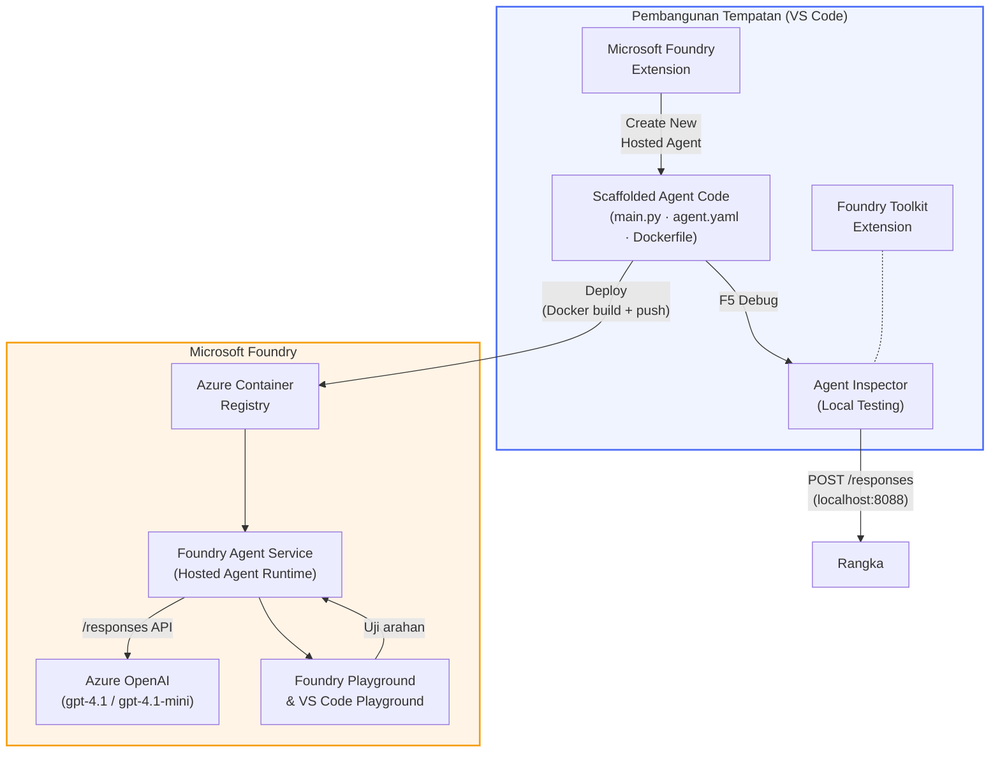

# Bengkel Foundry Toolkit + Agen Hosted Foundry

[](https://www.python.org/)
[](https://github.com/microsoft/agents)
[](https://learn.microsoft.com/azure/foundry/agents/concepts/hosted-agents)
[](https://ai.azure.com/)
[](https://learn.microsoft.com/azure/ai-services/openai/)
[](https://learn.microsoft.com/cli/azure/install-azure-cli)
[](https://learn.microsoft.com/azure/developer/azure-developer-cli/install-azd)
[](https://www.docker.com/)
[](https://marketplace.visualstudio.com/items?itemName=ms-windows-ai-studio.windows-ai-studio)
[](LICENSE)

Bina, uji, dan deploy ejen AI ke **Microsoft Foundry Agent Service** sebagai **Hosted Agents** - sepenuhnya dari VS Code menggunakan **pemanjangan Microsoft Foundry** dan **Foundry Toolkit**.

> **Hosted Agents kini dalam pratonton.** Kawasan yang disokong adalah terhad - lihat [ketersediaan kawasan](https://learn.microsoft.com/azure/foundry/agents/concepts/hosted-agents#region-availability).

> Folder `agent/` dalam setiap makmal **dibina secara automatik** oleh pemanjangan Foundry - anda kemudian menyesuaikan kod, uji secara tempatan, dan deploy.

### 🌐 Sokongan Pelbagai Bahasa

#### Disokong melalui GitHub Action (Automatik & Sentiasa Dikemaskini)

<!-- CO-OP TRANSLATOR LANGUAGES TABLE START -->
[Arabic](../ar/README.md) | [Bengali](../bn/README.md) | [Bulgarian](../bg/README.md) | [Burmese (Myanmar)](../my/README.md) | [Chinese (Simplified)](../zh-CN/README.md) | [Chinese (Traditional, Hong Kong)](../zh-HK/README.md) | [Chinese (Traditional, Macau)](../zh-MO/README.md) | [Chinese (Traditional, Taiwan)](../zh-TW/README.md) | [Croatian](../hr/README.md) | [Czech](../cs/README.md) | [Danish](../da/README.md) | [Dutch](../nl/README.md) | [Estonian](../et/README.md) | [Finnish](../fi/README.md) | [French](../fr/README.md) | [German](../de/README.md) | [Greek](../el/README.md) | [Hebrew](../he/README.md) | [Hindi](../hi/README.md) | [Hungarian](../hu/README.md) | [Indonesian](../id/README.md) | [Italian](../it/README.md) | [Japanese](../ja/README.md) | [Kannada](../kn/README.md) | [Khmer](../km/README.md) | [Korean](../ko/README.md) | [Lithuanian](../lt/README.md) | [Malay](./README.md) | [Malayalam](../ml/README.md) | [Marathi](../mr/README.md) | [Nepali](../ne/README.md) | [Nigerian Pidgin](../pcm/README.md) | [Norwegian](../no/README.md) | [Persian (Farsi)](../fa/README.md) | [Polish](../pl/README.md) | [Portuguese (Brazil)](../pt-BR/README.md) | [Portuguese (Portugal)](../pt-PT/README.md) | [Punjabi (Gurmukhi)](../pa/README.md) | [Romanian](../ro/README.md) | [Russian](../ru/README.md) | [Serbian (Cyrillic)](../sr/README.md) | [Slovak](../sk/README.md) | [Slovenian](../sl/README.md) | [Spanish](../es/README.md) | [Swahili](../sw/README.md) | [Swedish](../sv/README.md) | [Tagalog (Filipino)](../tl/README.md) | [Tamil](../ta/README.md) | [Telugu](../te/README.md) | [Thai](../th/README.md) | [Turkish](../tr/README.md) | [Ukrainian](../uk/README.md) | [Urdu](../ur/README.md) | [Vietnamese](../vi/README.md)

> **Lebih Suka Clone Secara Tempatan?**
>
> Repositori ini mengandungi lebih 50+ terjemahan bahasa yang meningkatkan saiz muat turun secara signifikan. Untuk clone tanpa terjemahan, gunakan sparse checkout:
>
> **Bash / macOS / Linux:**
> ```bash
> git clone --filter=blob:none --sparse https://github.com/microsoft-foundry/Foundry_Toolkit_for_VSCode_Lab.git
> cd Foundry_Toolkit_for_VSCode_Lab
> git sparse-checkout set --no-cone '/*' '!translations' '!translated_images'
> ```
>
> **CMD (Windows):**
> ```cmd
> git clone --filter=blob:none --sparse https://github.com/microsoft-foundry/Foundry_Toolkit_for_VSCode_Lab.git
> cd Foundry_Toolkit_for_VSCode_Lab
> git sparse-checkout set --no-cone "/*" "!translations" "!translated_images"
> ```
>
> Ini memberikan anda segala-galanya yang anda perlukan untuk menyelesaikan kursus dengan muat turun yang jauh lebih pantas.
<!-- CO-OP TRANSLATOR LANGUAGES TABLE END -->

---

## Seni Bina


```mermaid
flowchart TB
    subgraph Local["Pembangunan Tempatan (VS Code)"]
        direction TB
        FE["Microsoft Foundry
        Extension"]
        FoundryToolkit["Foundry Toolkit
        Extension"]
        Scaffold["Scaffolded Agent Code
        (main.py · agent.yaml · Dockerfile)"]
        Inspector["Agent Inspector
        (Local Testing)"]
        FE -- "Create New
        Hosted Agent" --> Scaffold
        Scaffold -- "F5 Debug" --> Inspector
        FoundryToolkit -.- Inspector
    end

    subgraph Cloud["Microsoft Foundry"]
        direction TB
        ACR["Azure Container
        Registry"]
        AgentService["Foundry Agent Service
        (Hosted Agent Runtime)"]
        Model["Azure OpenAI
        (gpt-4.1 / gpt-4.1-mini)"]
        Playground["Foundry Playground
        & VS Code Playground"]
        ACR --> AgentService
        AgentService -- "/responses API" --> Model
        AgentService --> Playground
    end

    Scaffold -- "Deploy
    (Docker build + push)" --> ACR
    Inspector -- "POST /responses
    (localhost:8088)" --> Rangka
    Playground -- "Uji arahan" --> AgentService

    style Local fill:#f0f4ff,stroke:#4a6cf7,stroke-width:2px
    style Cloud fill:#fff4e6,stroke:#f59e0b,stroke-width:2px
```

**Aliran:** Pemanjangan Foundry membina ejen → anda ubah suai kod & arahan → uji secara tempatan menggunakan Agent Inspector → deploy ke Foundry (imej Docker didorong ke ACR) → sahkan di Playground.

---

## Apa yang akan anda bina

| Makmal | Penerangan | Status |
|-----|-------------|--------|
| **Makmal 01 - Ejen Tunggal** | Bina **"Terangkan Seperti Saya Seorang Eksekutif" Ejen**, uji secara tempatan, dan deploy ke Foundry | ✅ Tersedia |
| **Makmal 02 - Aliran Kerja Multi-Ejen** | Bina **"Resume → Penilai Kesesuaian Kerja"** - 4 ejen bekerjasama untuk menilai kesesuaian resume dan menghasilkan peta jalan pembelajaran | ✅ Tersedia |

---

## Kenali Ejen Eksekutif

Dalam bengkel ini anda akan bina **"Terangkan Seperti Saya Seorang Eksekutif" Ejen** - ejen AI yang mengambil jargon teknikal yang rumit dan menterjemahkannya menjadi ringkasan tenang yang bersesuaian untuk bilik lembaga. Sebab jujur, tiada siapa dalam C-suite ingin dengar tentang "keletihan kolam thread yang disebabkan oleh panggilan segerak yang diperkenalkan dalam v3.2."

Saya membina ejen ini selepas terlalu banyak insiden di mana laporan pasca kejadian saya yang sempurna mendapat maklum balas: *"Jadi... adakah laman web down atau tidak?"*

### Bagaimana ia berfungsi

Anda berikan kemas kini teknikal. Ia membalas dengan ringkasan eksekutif - tiga titik peluru, tiada jargon, tiada jejak tumpukan, tiada ketakutan eksistensial. Hanya **apa yang berlaku**, **impak perniagaan**, dan **langkah seterusnya**.

### Lihat ia beraksi

**Anda berkata:**
> "Latensi API meningkat kerana keletihan kolam thread yang disebabkan oleh panggilan segerak yang diperkenalkan dalam v3.2."

**Ejen menjawab:**

> **Ringkasan Eksekutif:**
> - **Apa yang berlaku:** Selepas pelepasan terkini, sistem menjadi perlahan.
> - **Impak perniagaan:** Sesetengah pengguna mengalami kelewatan semasa menggunakan perkhidmatan.
> - **Langkah seterusnya:** Perubahan telah dibatalkan dan pembetulan sedang disediakan sebelum deploy semula.

### Kenapa ejen ini?

Ia ejen yang sangat mudah, berfungsi tunggal - sempurna untuk mempelajari aliran kerja ejen hosted dari awal hingga akhir tanpa terperangkap dalam rantai alat yang rumit. Dan jujur? Setiap pasukan kejuruteraan boleh menggunakan satu daripada ini.

---

## Struktur bengkel

```
📂 Foundry_Toolkit_for_VSCode_Lab/
├── 📄 README.md                      ← You are here
└── 📂 workshop/
    ├── 📂 lab01-single-agent/        ← Full lab: docs + agent code
    │   ├── README.md                 ← Hands-on lab instructions
    │   ├── 📂 docs/                  ← Step-by-step tutorial modules
    │   │   ├── 00-prerequisites.md
    │   │   ├── 01-setup.md
    │   │   ├── 02-create-hosted-agent.md
    │   │   ├── 03-configure-and-code.md
    │   │   ├── 04-test-locally.md
    │   │   ├── 05-deploy-to-foundry.md
    │   │   ├── 06-verify-in-playground.md
    │   │   ├── 07-summary.md
    │   │   └── 08-troubleshooting.md
    │   └── 📂 agent/                 ← Reference solution (auto-scaffolded by Foundry extension)
    │       ├── agent.yaml
    │       ├── Dockerfile
    │       ├── main.py
    │       └── requirements.txt
    └── 📂 lab02-multi-agent/         ← Resume → Job Fit Evaluator
        ├── README.md                 ← Hands-on lab instructions (end-to-end)
        ├── 📂 docs/                  ← Step-by-step tutorial modules
        │   ├── 00-prerequisites.md
        │   ├── 01-understand-multi-agent.md
        │   ├── 02-scaffold-multi-agent.md
        │   ├── 03-configure-agents.md
        │   ├── 04-orchestration-patterns.md
        │   ├── 05-test-locally.md
        │   ├── 06-deploy-to-foundry.md
        │   ├── 07-verify-in-playground.md
        │   └── 08-troubleshooting.md
        └── 📂 PersonalCareerCopilot/ ← Reference solution (multi-agent workflow)
            ├── agent.yaml
            ├── Dockerfile
            ├── main.py
            └── requirements.txt
```

> **Nota:** Folder `agent/` di dalam setiap makmal ialah apa yang dijana oleh **pemanjangan Microsoft Foundry** apabila anda menjalankan `Microsoft Foundry: Create a New Hosted Agent` dari Command Palette. Fail kemudiannya disesuaikan dengan arahan, alat, dan konfigurasi ejen anda. Makmal 01 membimbing anda membina ini dari awal.

---

## Mula

### 1. Clone repositori

```bash
git clone https://github.com/microsoft-foundry/Foundry_Toolkit_for_VSCode_Lab.git
cd Foundry_Toolkit_for_VSCode_Lab
```

### 2. Sediakan persekitaran maya Python

```bash
python -m venv venv
```

Aktifkan:

- **Windows (PowerShell):**
  ```powershell
  .\venv\Scripts\Activate.ps1
  ```
- **macOS / Linux:**
  ```bash
  source venv/bin/activate
  ```

### 3. Pasang kebergantungan

```bash
pip install -r workshop/lab01-single-agent/agent/requirements.txt
```

### 4. Konfigurasikan pembolehubah persekitaran

Salin fail contoh `.env` dalam folder ejen dan isikan nilai anda:

```bash
cp workshop/lab01-single-agent/agent/.env.example workshop/lab01-single-agent/agent/.env
```

Edit `workshop/lab01-single-agent/agent/.env`:

```env
AZURE_AI_PROJECT_ENDPOINT=https://<your-account>.services.ai.azure.com/api/projects/<your-project>
AZURE_AI_MODEL_DEPLOYMENT_NAME=<your-model-deployment-name>
```

### 5. Ikut makmal bengkel

Setiap makmal berdiri sendiri dengan modul sendiri. Mulakan dengan **Makmal 01** untuk belajar asas, kemudian beralih ke **Makmal 02** untuk aliran kerja multi-ejen.

#### Makmal 01 - Ejen Tunggal ([arahan penuh](workshop/lab01-single-agent/README.md))

| # | Modul | Pautan |
|---|--------|------|
| 1 | Baca prasyarat | [00-prerequisites.md](workshop/lab01-single-agent/docs/00-prerequisites.md) |
| 2 | Pasang Foundry Toolkit & pemanjangan Foundry | [01-setup.md](workshop/lab01-single-agent/docs/01-setup.md) |
| 3 | Cipta projek Foundry | [01-setup.md](workshop/lab01-single-agent/docs/01-setup.md) |
| 4 | Cipta agen hosted | [02-create-hosted-agent.md](workshop/lab01-single-agent/docs/02-create-hosted-agent.md) |
| 5 | Konfigurasikan arahan & persekitaran | [03-configure-and-code.md](workshop/lab01-single-agent/docs/03-configure-and-code.md) |
| 6 | Uji secara tempatan | [04-test-locally.md](workshop/lab01-single-agent/docs/04-test-locally.md) |
| 7 | Deploy ke Foundry | [05-deploy-to-foundry.md](workshop/lab01-single-agent/docs/05-deploy-to-foundry.md) |
| 8 | Sahkan di playground | [06-verify-in-playground.md](workshop/lab01-single-agent/docs/06-verify-in-playground.md) |
| 9 | Penyelesaian masalah | [08-troubleshooting.md](workshop/lab01-single-agent/docs/08-troubleshooting.md) |

#### Makmal 02 - Aliran Kerja Multi-Ejen ([arahan penuh](workshop/lab02-multi-agent/README.md))

| # | Modul | Pautan |
|---|--------|------|
| 1 | Prasyarat (Makmal 02) | [00-prerequisites.md](workshop/lab02-multi-agent/docs/00-prerequisites.md) |
| 2 | Fahami seni bina multi-ejen | [01-understand-multi-agent.md](workshop/lab02-multi-agent/docs/01-understand-multi-agent.md) |
| 3 | Bina projek multi-ejen | [02-scaffold-multi-agent.md](workshop/lab02-multi-agent/docs/02-scaffold-multi-agent.md) |
| 4 | Konfigurasikan ejen & persekitaran | [03-configure-agents.md](workshop/lab02-multi-agent/docs/03-configure-agents.md) |
| 5 | Corak orkestrasi | [04-orchestration-patterns.md](workshop/lab02-multi-agent/docs/04-orchestration-patterns.md) |
| 6 | Uji secara tempatan (multi-ejen) | [05-test-locally.md](workshop/lab02-multi-agent/docs/05-test-locally.md) |

| 7 | Deploy ke Foundry | [06-deploy-to-foundry.md](workshop/lab02-multi-agent/docs/06-deploy-to-foundry.md) |
| 8 | Sahkan di playground | [07-verify-in-playground.md](workshop/lab02-multi-agent/docs/07-verify-in-playground.md) |
| 9 | Penyelesaian Masalah (multi-ejen) | [08-troubleshooting.md](workshop/lab02-multi-agent/docs/08-troubleshooting.md) |

---

## Penyelenggara

<table>
<tr>
    <td align="center"><a href="https://github.com/ShivamGoyal03">
        <br />
        <sub><b>Shivam Goyal</b></sub>
    </a><br />
    </td>
</tr>
</table>

---

## Kebenaran yang diperlukan (rujukan pantas)

| Senario | Peranan yang diperlukan |
|----------|---------------|
| Cipta projek Foundry baru | **Azure AI Owner** pada sumber Foundry |
| Deploy ke projek sedia ada (sumber baru) | **Azure AI Owner** + **Contributor** pada langganan |
| Deploy ke projek yang telah dikonfigurasi sepenuhnya | **Reader** pada akaun + **Azure AI User** pada projek |

> **Penting:** Peranan Azure `Owner` dan `Contributor` hanya merangkumi kebenaran *pengurusan*, bukan kebenaran *pembangunan* (tindakan data). Anda memerlukan **Azure AI User** atau **Azure AI Owner** untuk membina dan deploy ejen.

---

## Rujukan

- [Mula cepat: Deploy ejen berhala pertama anda (VS Code)](https://learn.microsoft.com/azure/foundry/agents/quickstarts/quickstart-hosted-agent)
- [Apakah ejen berhala?](https://learn.microsoft.com/azure/foundry/agents/concepts/hosted-agents)
- [Cipta aliran kerja ejen berhala dalam VS Code](https://learn.microsoft.com/azure/foundry/agents/how-to/vs-code-agents-workflow-pro-code)
- [Deploy ejen berhala](https://learn.microsoft.com/azure/foundry/agents/how-to/deploy-hosted-agent)
- [RBAC untuk Microsoft Foundry](https://learn.microsoft.com/azure/foundry/concepts/rbac-foundry)
- [Contoh Ejen Semakan Seni Bina](https://github.com/Azure-Samples/agent-architecture-review-sample) - Ejen berhala dunia sebenar dengan alat MCP, carta Excalidraw, dan gedung deploy dua hala

---


## Lesen

[MIT](../../LICENSE)

---

<!-- CO-OP TRANSLATOR DISCLAIMER START -->
**Penafian**:
Dokumen ini telah diterjemahkan menggunakan perkhidmatan terjemahan AI [Co-op Translator](https://github.com/Azure/co-op-translator). Walaupun kami berusaha untuk ketepatan, sila ambil maklum bahawa terjemahan automatik mungkin mengandungi kesilapan atau ketidaktepatan. Dokumen asal dalam bahasa asalnya harus dianggap sebagai sumber yang sahih. Untuk maklumat penting, terjemahan oleh manusia profesional adalah disyorkan. Kami tidak bertanggungjawab terhadap sebarang salah faham atau salah tafsir yang timbul daripada penggunaan terjemahan ini.
<!-- CO-OP TRANSLATOR DISCLAIMER END -->