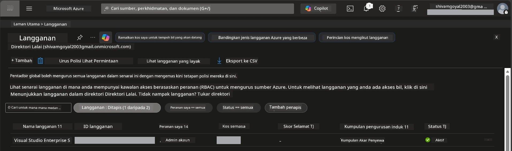

# Modul 0 - Prasyarat

Sebelum memulakan bengkel, sahkan anda mempunyai alat, akses, dan persekitaran berikut yang sedia. Ikuti setiap langkah di bawah - jangan langkau mana-mana langkah.

---

## 1. Akaun & langganan Azure

### 1.1 Cipta atau sahkan langganan Azure anda

1. Buka pelayar dan pergi ke [https://azure.microsoft.com/free/](https://azure.microsoft.com/free/).
2. Jika anda belum mempunyai akaun Azure, klik **Start free** dan ikut aliran pendaftaran. Anda memerlukan akaun Microsoft (atau cipta satu) dan kad kredit untuk pengesahan identiti.
3. Jika anda sudah ada akaun, log masuk di [https://portal.azure.com](https://portal.azure.com).
4. Dalam Portal, klik bilah **Subscriptions** di navigasi kiri (atau cari "Subscriptions" di bar carian atas).
5. Sahkan anda melihat sekurang-kurangnya satu langganan **Active**. Catat **Subscription ID** anda - anda akan memerlukannya kemudian.



### 1.2 Fahami peranan RBAC yang diperlukan

Penerapan [Hosted Agent](https://learn.microsoft.com/azure/foundry/agents/concepts/hosted-agents) memerlukan kebenaran **tindakan data** yang tidak termasuk dalam peranan Azure `Owner` dan `Contributor` standard. Anda memerlukan salah satu [gabungan peranan](https://learn.microsoft.com/azure/foundry/concepts/rbac-foundry#built-in-roles) ini:

| Senario | Peranan yang diperlukan | Tempat menetapkannya |
|----------|-------------------------|----------------------|
| Cipta projek Foundry baru | **Azure AI Owner** pada sumber Foundry | Sumber Foundry dalam Azure Portal |
| Terbitkan ke projek sedia ada (sumber baru) | **Azure AI Owner** + **Contributor** pada langganan | Langganan + sumber Foundry |
| Terbitkan ke projek yang telah dikonfigurasikan sepenuhnya | **Reader** pada akaun + **Azure AI User** pada projek | Akaun + Projek dalam Azure Portal |

> **Perkara utama:** Peranan Azure `Owner` dan `Contributor` hanya meliputi kebenaran *pengurusan* (operasi ARM). Anda memerlukan [**Azure AI User**](https://learn.microsoft.com/azure/foundry/concepts/rbac-foundry#built-in-roles) (atau lebih tinggi) untuk *tindakan data* seperti `agents/write` yang diperlukan untuk mencipta dan menerbitkan agen. Anda akan menetapkan peranan ini dalam [Modul 2](02-create-foundry-project.md).

---

## 2. Pasang alat tempatan

Pasang setiap alat di bawah. Selepas pemasangan, sahkan ia berfungsi dengan menjalankan perintah semakan.

### 2.1 Visual Studio Code

1. Pergi ke [https://code.visualstudio.com/](https://code.visualstudio.com/).
2. Muat turun pemasang untuk OS anda (Windows/macOS/Linux).
3. Jalankan pemasang dengan tetapan lalai.
4. Buka VS Code untuk mengesahkan ia dilancarkan.

### 2.2 Python 3.10+

1. Pergi ke [https://www.python.org/downloads/](https://www.python.org/downloads/).
2. Muat turun Python 3.10 atau lebih baru (3.12+ disyorkan).
3. **Windows:** Semasa pemasangan, tandakan **"Add Python to PATH"** pada skrin pertama.
4. Buka terminal dan sahkan:

   ```powershell
   python --version
   ```

   Output dijangka: `Python 3.10.x` atau lebih tinggi.

### 2.3 Azure CLI

1. Pergi ke [https://learn.microsoft.com/cli/azure/install-azure-cli](https://learn.microsoft.com/cli/azure/install-azure-cli).
2. Ikuti arahan pemasangan untuk OS anda.
3. Sahkan:

   ```powershell
   az --version
   ```

   Dijangka: `azure-cli 2.80.0` atau lebih tinggi.

4. Log masuk:

   ```powershell
   az login
   ```

### 2.4 Azure Developer CLI (azd)

1. Pergi ke [https://learn.microsoft.com/azure/developer/azure-developer-cli/install-azd](https://learn.microsoft.com/azure/developer/azure-developer-cli/install-azd).
2. Ikuti arahan pemasangan untuk OS anda. Di Windows:

   ```powershell
   winget install microsoft.azd
   ```

3. Sahkan:

   ```powershell
   azd version
   ```

   Dijangka: `azd version 1.x.x` atau lebih tinggi.

4. Log masuk:

   ```powershell
   azd auth login
   ```

### 2.5 Docker Desktop (pilihan)

Docker hanya diperlukan jika anda ingin membina dan menguji imej kontena secara tempatan sebelum terbitan. Sambungan Foundry mengendalikan binaan kontena semasa terbitan secara automatik.

1. Pergi ke [https://docs.docker.com/get-docker/](https://docs.docker.com/get-docker/).
2. Muat turun dan pasang Docker Desktop untuk OS anda.
3. **Windows:** Pastikan backend WSL 2 dipilih semasa pemasangan.
4. Mulakan Docker Desktop dan tunggu ikon dalam sistem tray menunjukkan **"Docker Desktop is running"**.
5. Buka terminal dan sahkan:

   ```powershell
   docker info
   ```

   Ini harus mencetak maklumat sistem Docker tanpa ralat. Jika anda lihat `Cannot connect to the Docker daemon`, tunggu beberapa saat lagi supaya Docker benar-benar bermula.

---

## 3. Pasang peluasan VS Code

Anda memerlukan tiga peluasan. Pasang ia **sebelum** bengkel bermula.

### 3.1 Microsoft Foundry untuk VS Code

1. Buka VS Code.
2. Tekan `Ctrl+Shift+X` untuk buka panel Peluasan.
3. Dalam kotak carian, taip **"Microsoft Foundry"**.
4. Cari **Microsoft Foundry for Visual Studio Code** (penerbit: Microsoft, ID: `TeamsDevApp.vscode-ai-foundry`).
5. Klik **Install**.
6. Selepas pemasangan, anda harus melihat ikon **Microsoft Foundry** muncul di Bar Aktiviti (bar sisi kiri).

### 3.2 Foundry Toolkit

1. Dalam panel Peluasan (`Ctrl+Shift+X`), cari **"Foundry Toolkit"**.
2. Cari **Foundry Toolkit** (penerbit: Microsoft, ID: `ms-windows-ai-studio.windows-ai-studio`).
3. Klik **Install**.
4. Ikon **Foundry Toolkit** harus muncul di Bar Aktiviti.

### 3.3 Python

1. Dalam panel Peluasan, cari **"Python"**.
2. Cari **Python** (penerbit: Microsoft, ID: `ms-python.python`).
3. Klik **Install**.

---

## 4. Log masuk ke Azure dari VS Code

[Microsoft Agent Framework](https://learn.microsoft.com/agent-framework/overview/) menggunakan [`DefaultAzureCredential`](https://learn.microsoft.com/azure/developer/python/sdk/authentication/credential-chains#defaultazurecredential-overview) untuk pengesahan. Anda perlu log masuk ke Azure dalam VS Code.

### 4.1 Log masuk melalui VS Code

1. Lihat sudut kiri bawah VS Code dan klik ikon **Accounts** (silhouette orang).
2. Klik **Sign in to use Microsoft Foundry** (atau **Sign in with Azure**).
3. Jendela pelayar terbuka - log masuk dengan akaun Azure yang mempunyai akses ke langganan anda.
4. Kembali ke VS Code. Anda harus melihat nama akaun anda di sebelah kiri bawah.

### 4.2 (Pilihan) Log masuk melalui Azure CLI

Jika anda memasang Azure CLI dan lebih suka pengesahan berasaskan CLI:

```powershell
az login
```

Ini membuka pelayar untuk log masuk. Selepas log masuk, tetapkan langganan yang betul:

```powershell
az account set --subscription "<your-subscription-id>"
```

Sahkan:

```powershell
az account show --query "{name:name, id:id, state:state}" --output table
```

Anda harus melihat nama langganan, ID, dan status = `Enabled`.

### 4.3 (Alternatif) Pengesahan principal servis

Untuk CI/CD atau persekitaran berkongsi, tetapkan pembolehubah persekitaran ini sebaliknya:

```powershell
$env:AZURE_TENANT_ID = "<your-tenant-id>"
$env:AZURE_CLIENT_ID = "<your-client-id>"
$env:AZURE_CLIENT_SECRET = "<your-client-secret>"
```

---

## 5. Had pratonton

Sebelum meneruskan, sedar akan had semasa:

- [**Hosted Agents**](https://learn.microsoft.com/azure/foundry/agents/concepts/hosted-agents) kini dalam **pratonton awam** - tidak disyorkan untuk beban kerja produksi.
- **Wilayah yang disokong adalah terhad** - periksa [ketersediaan wilayah](https://learn.microsoft.com/azure/foundry/agents/concepts/hosted-agents#region-availability) sebelum mencipta sumber. Jika anda memilih wilayah yang tidak disokong, terbitan akan gagal.
- Pakej `azure-ai-agentserver-agentframework` adalah pra-rilis (`1.0.0b16`) - API mungkin berubah.
- Had skala: hosted agents menyokong 0-5 replika (termasuk skala ke sifar).

---

## 6. Senarai semak prabersih

Semak setiap perkara di bawah. Jika mana-mana langkah gagal, kembali dan baiki sebelum meneruskan.

- [ ] VS Code dibuka tanpa ralat
- [ ] Python 3.10+ berada dalam PATH anda (`python --version` cetak `3.10.x` atau lebih tinggi)
- [ ] Azure CLI dipasang (`az --version` cetak `2.80.0` atau lebih tinggi)
- [ ] Azure Developer CLI dipasang (`azd version` cetak maklumat versi)
- [ ] Sambungan Microsoft Foundry dipasang (ikon kelihatan di Bar Aktiviti)
- [ ] Sambungan Foundry Toolkit dipasang (ikon kelihatan di Bar Aktiviti)
- [ ] Sambungan Python dipasang
- [ ] Anda sudah log masuk ke Azure dalam VS Code (semak ikon Accounts, kiri bawah)
- [ ] `az account show` memaparkan langganan anda
- [ ] (Pilihan) Docker Desktop sedang berjalan (`docker info` memaparkan maklumat sistem tanpa ralat)

### Titik Semak

Buka Bar Aktiviti VS Code dan sahkan anda dapat melihat kedua-dua pandangan bar sisi **Foundry Toolkit** dan **Microsoft Foundry**. Klik setiap satu untuk mengesahkan ia dimuat tanpa ralat.

---

**Seterusnya:** [01 - Pasang Foundry Toolkit & Peluasan Foundry →](01-install-foundry-toolkit.md)

---

<!-- CO-OP TRANSLATOR DISCLAIMER START -->
**Penafian**:  
Dokumen ini telah diterjemahkan menggunakan perkhidmatan terjemahan AI [Co-op Translator](https://github.com/Azure/co-op-translator). Walaupun kami berusaha untuk ketepatan, sila ambil maklum bahawa terjemahan automatik mungkin mengandungi kesilapan atau ketidaktepatan. Dokumen asal dalam bahasa asalnya harus dianggap sebagai sumber rasmi. Untuk maklumat yang penting, terjemahan manusia profesional adalah disyorkan. Kami tidak bertanggungjawab terhadap sebarang salah faham atau salah tafsir yang timbul daripada penggunaan terjemahan ini.
<!-- CO-OP TRANSLATOR DISCLAIMER END -->