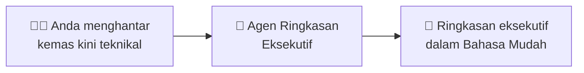

# Modul 0 - Pengenalan

⏱️ ~10 minit

> [!WARNING]
> **Pratonton & Had:** [Ejen Hosted](https://learn.microsoft.com/azure/foundry/agents/concepts/hosted-agents) kini dalam **pratonton awam** - tidak disyorkan untuk beban kerja penghasilan. Sila ambil maklum perkara berikut:
> - **Wilayah yang disokong adalah terhad** - periksa [ketersediaan wilayah](https://learn.microsoft.com/azure/foundry/agents/concepts/hosted-agents#region-availability) sebelum mencipta sumber. Jika anda memilih wilayah yang tidak disokong, penghantaran akan gagal.
> - Pakej `azure-ai-agentserver-agentframework` adalah pra-siaran - API mungkin berubah antara versi.
> - Had skala: ejen hosted menyokong 0–5 replika (termasuk skala ke sifar).
> - Sesetengah ciri yang dipaparkan dalam bengkel ini mungkin berubah apabila perkhidmatan menuju ke GA.

## Apa yang akan anda bina

Dalam bengkel ini, anda akan membina ejen **"Terangkan Seperti Saya Seorang Eksekutif"** - ejen AI hosted yang mengambil kemas kini teknikal yang kompleks dan menulis semula sebagai ringkasan eksekutif dalam bahasa Inggeris mudah.

```mermaid
flowchart LR
    A["🧑‍💻 Anda menghantar\nkemas kini teknikal"] --> B["🤖 Agen Ringkasan\nEksekutif"]
    B --> C["📝 Ringkasan eksekutif\ndalam Bahasa Mudah"]
```

**Ejen menggunakan:**
- **Microsoft Agent Framework** - untuk logik dan struktur ejen
- **Foundry Toolkit untuk VS Code** - untuk menghasilkan rangka, uji secara tempatan, dan hantar
- **Model AI** (contoh, `gpt-4.1-mini/gpt-5-mini`) - untuk menjana ringkasan

Pada akhir makmal ini, anda akan mempunyai ejen yang berfungsi yang boleh anda uji secara tempatan melalui Pemeriksa Ejen, dan jika mahu, hantar ke awan.

---

## Apakah ejen hosted?

**Ejen hosted** adalah ejen AI yang berjalan sebagai perkhidmatan yang diurus dalam Microsoft Foundry. Daripada menguruskan infrastruktur anda sendiri, anda membungkus kod ejen anda dalam kontena dan Foundry yang mengendalikan penskalaan, hosting, dan pendedahan melalui titik akhir HTTP standard.

| Konsep | Apa yang dimaksudkan |
|---------|--------------|
| **Ejen** | Kod Python anda yang menerima mesej pengguna, memanggil model AI, dan mengembalikan respons berstruktur |
| **Hosted** | Foundry menjalankan kontena anda untuk anda - tiada VM, tiada Kubernetes, tiada infrastruktur untuk diuruskan |
| **Protokol Respons** | API HTTP standard (`POST /responses`) yang mana mana pelanggan boleh panggil untuk berinteraksi dengan ejen anda |
| **Pemeriksa Ejen** | UI ujian tempatan (dibina dalam Foundry Toolkit) yang membolehkan anda berbual dengan ejen anda sebelum penghantaran |

Dalam bengkel ini, anda akan bermula dari kosong hingga ejen hosted penuh - atau berhenti pada ujian tempatan jika anda mahu.

---

## Pilih laluan anda

> ⚠️ **Pilih satu laluan sebelum meneruskan.** Pilihan anda menentukan alat mana yang perlu dipasang dan modul mana yang terpakai. Anda boleh bertukar dari Laluan B → Laluan A kemudian jika anda mendapat langganan.

<strong>🅰️ Laluan A - Awan Azure (memerlukan langganan Azure)</strong>

| | Perincian |
|---|---|
| **Siapa ia untuk?** | Anda mempunyai langganan Azure aktif dan boleh mencipta sumber Foundry |
| **Model** | Azure OpenAI melalui Foundry (contoh, `gpt-4.1-mini/gpt-5-mini`) |
| **Modul terlibat** | Semua modul (00–07) |
| **Hantar ke awan?** | ✅ Ya - penghantaran penuh hujung-ke-hujung |

<strong>🅱️ Laluan B - Tempatan / tier percuma (tidak perlu langganan Azure)</strong>

| | Perincian |
|---|---|
| **Siapa ia untuk?** | MVP, pelajar, atau sesiapa tanpa akses Azure |
| **Model** | **Foundry Local** (percuma, berjalan di mesin anda) |
| **Modul terlibat** | Modul 00–04 (langkau penghantaran & pengesahan awan) |
| **Hantar ke awan?** | ❌ Tidak - ujian tempatan sahaja melalui Pemeriksa Ejen |

---

## Semua laluan: Alat yang diperlukan

Pasang setiap alat di bawah. Selepas memasang, sahkan ia berfungsi dengan menjalankan arahan semakan.

| # | Alat | Versi | Pasang | Sahkan (Output Dijangka) |
|---|------|---------|---------|---------------------------|
| 1 | **Visual Studio Code** | Terkini | [code.visualstudio.com](https://code.visualstudio.com/) | Buka tanpa ralat |
| 2 | **Python** | 3.12 atau lebih tinggi| [python.org/downloads](https://www.python.org/downloads/) | `python --version` $\rightarrow$ `Python 3.12.x` |
| 3 | **Foundry Toolkit untuk VS Code** | Terkini | ID Sambungan: `ms-windows-ai-studio.windows-ai-studio` | Ikon Foundry dalam Bar Aktiviti |
| 4 | **Sambungan Python untuk VS Code** | Terkini | ID Sambungan: `ms-python.python` | Dipasang dalam panel Sambungan |

> [!TIP]
> **Petua pemasangan pro:**
> - **Python PATH (Windows):** Sentiasa tandakan **"Add Python to PATH"** pada skrin pertama pemasang Python. Tanpa ini, `python` tidak akan dikenali dalam terminal anda.
> - **Versi Python berganda:** Jika anda mempunyai Python 3.10 dan 3.12 dipasang, gunakan `python3.12 -m venv .venv` untuk memastikan versi yang betul digunakan untuk persekitaran maya anda.
> - **Docker WSL 2 (Windows):** Semasa pemasangan Docker Desktop, pastikan **backend WSL 2** dipilih. Docker dengan Hyper-V lebih perlahan dan mungkin menyebabkan isu dengan pembinaan kontena Foundry.
> - **Docker tidak bermula?** Tunggu 30–60 saat selepas melancarkan Docker Desktop. Jalankan `docker info` - jika anda lihat "Cannot connect to the Docker daemon," Docker masih sedang memulakan.
> - **Sambungan VS Code tidak dimuatkan?** Selepas memasang sambungan, muat semula tetingkap: `Ctrl+Shift+P` → `Developer: Reload Window`.

> **Pengguna Windows:** Tandakan **"Add Python to PATH"** semasa pemasangan Python.

**Seterusnya:** [01 - Setup →](01-setup.md)

---

<!-- CO-OP TRANSLATOR DISCLAIMER START -->
**Penafian**:
Dokumen ini telah diterjemahkan menggunakan perkhidmatan terjemahan AI [Co-op Translator](https://github.com/Azure/co-op-translator). Walaupun kami berusaha untuk ketepatan, sila ambil maklum bahawa terjemahan automatik mungkin mengandungi kesilapan atau ketidaktepatan. Dokumen asal dalam bahasa asalnya harus dianggap sebagai sumber yang sahih. Untuk maklumat penting, terjemahan oleh manusia profesional adalah disyorkan. Kami tidak bertanggungjawab terhadap sebarang salah faham atau salah tafsir yang timbul daripada penggunaan terjemahan ini.
<!-- CO-OP TRANSLATOR DISCLAIMER END -->