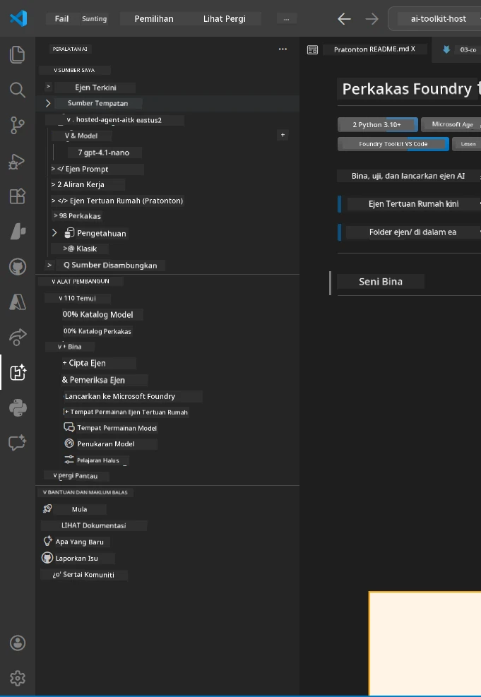
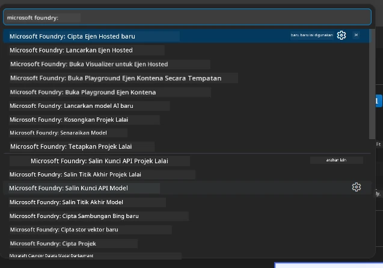

# Modul 1 - Pasang Foundry Toolkit & Sambungan Foundry

Modul ini memandu anda memasang dan mengesahkan dua sambungan utama VS Code untuk bengkel ini. Jika anda sudah memasangnya semasa [Modul 0](00-prerequisites.md), gunakan modul ini untuk mengesahkan ia berfungsi dengan betul.

---

## Langkah 1: Pasang Sambungan Microsoft Foundry

Sambungan **Microsoft Foundry untuk VS Code** adalah alat utama anda untuk mencipta projek Foundry, menggulung model, membina agen yang dihoskan, dan menggulung terus dari VS Code.

1. Buka VS Code.
2. Tekan `Ctrl+Shift+X` untuk membuka panel **Extensions**.
3. Dalam kotak carian di atas, taip: **Microsoft Foundry**
4. Cari hasil bertajuk **Microsoft Foundry for Visual Studio Code**.
   - Penerbit: **Microsoft**
   - ID Sambungan: `TeamsDevApp.vscode-ai-foundry`
5. Klik butang **Install**.
6. Tunggu pemasangan selesai (anda akan melihat penunjuk kemajuan kecil).
7. Selepas pemasangan, lihat **Activity Bar** (bar ikon menegak di sebelah kiri VS Code). Anda harus melihat ikon baru **Microsoft Foundry** (kelihatan seperti berlian/ikon AI).
8. Klik ikon **Microsoft Foundry** untuk membuka paparan bar sisi. Anda harus melihat bahagian untuk:
   - **Resources** (atau Projek)
   - **Agents**
   - **Models**

> **Jika ikon tidak muncul:** Cuba muat semula VS Code (`Ctrl+Shift+P` → `Developer: Reload Window`).

---

## Langkah 2: Pasang Sambungan Foundry Toolkit

Sambungan **Foundry Toolkit** menyediakan [**Agent Inspector**](https://learn.microsoft.com/azure/foundry/agents/how-to/vs-code-agents-workflow-pro-code) - antara muka visual untuk menguji dan menyahpepijat agen secara lokal - selain taman permainan, pengurusan model, dan alat penilaian.

1. Dalam panel Extensions (`Ctrl+Shift+X`), kosongkan kotak carian dan taip: **Foundry Toolkit**
2. Cari **Foundry Toolkit** dalam hasil carian.
   - Penerbit: **Microsoft**
   - ID Sambungan: `ms-windows-ai-studio.windows-ai-studio`
3. Klik **Install**.
4. Selepas pemasangan, ikon **Foundry Toolkit** muncul di Activity Bar (kelihatan seperti ikon robot/cahaya berkilau).
5. Klik ikon **Foundry Toolkit** untuk membuka paparan bar sisinya. Anda harus melihat skrin selamat datang Foundry Toolkit dengan pilihan untuk:
   - **Models**
   - **Playground**
   - **Agents**

---

## Langkah 3: Sahkan kedua-dua sambungan berfungsi

### 3.1 Sahkan Sambungan Microsoft Foundry

1. Klik ikon **Microsoft Foundry** di Activity Bar.
2. Jika anda sudah masuk ke Azure (dari Modul 0), anda harus melihat projek anda disenaraikan di bawah **Resources**.
3. Jika diminta untuk masuk, klik **Sign in** dan ikut aliran pengesahan.
4. Sahkan anda boleh melihat bar sisi tanpa ralat.

### 3.2 Sahkan Sambungan Foundry Toolkit

1. Klik ikon **Foundry Toolkit** di Activity Bar.
2. Sahkan paparan selamat datang atau panel utama dimuat tanpa ralat.
3. Anda belum perlu mengkonfigurasi apa-apa lagi - kita akan gunakan Agent Inspector dalam [Modul 5](05-test-locally.md).

### 3.3 Sahkan melalui Command Palette

1. Tekan `Ctrl+Shift+P` untuk membuka Command Palette.
2. Taip **"Microsoft Foundry"** - anda harus melihat arahan seperti:
   - `Microsoft Foundry: Create a New Hosted Agent`
   - `Microsoft Foundry: Deploy Hosted Agent`
   - `Microsoft Foundry: Open Model Catalog`
3. Tekan `Escape` untuk menutup Command Palette.
4. Buka Command Palette lagi dan taip **"Foundry Toolkit"** - anda harus melihat arahan seperti:
   - `Foundry Toolkit: Open Agent Inspector`

> Jika anda tidak melihat arahan ini, sambungan mungkin tidak dipasang dengan betul. Cuba nyahpasang dan pasang semula.

---

## Apa yang sambungan ini lakukan dalam bengkel ini

| Sambungan | Fungsi | Bila anda akan gunakannya |
|-----------|-------------|-------------------|
| **Microsoft Foundry untuk VS Code** | Cipta projek Foundry, gulung model, **bina [agen dihoskan](https://learn.microsoft.com/azure/foundry/agents/concepts/hosted-agents)** (auto-jana `agent.yaml`, `main.py`, `Dockerfile`, `requirements.txt`), gulung ke [Foundry Agent Service](https://learn.microsoft.com/azure/foundry/agents/overview) | Modul 2, 3, 6, 7 |
| **Foundry Toolkit** | Agent Inspector untuk ujian/penyahpepijatan lokal, UI taman permainan, pengurusan model | Modul 5, 7 |

> **Sambungan Foundry adalah alat paling kritikal dalam bengkel ini.** Ia mengendalikan kitar hayat end-to-end: bina → konfigurasi → gulung → sahkan. Foundry Toolkit melengkapinya dengan menyediakan Agent Inspector visual untuk ujian lokal.

---

### Titik Semak

- [ ] Ikon Microsoft Foundry kelihatan di Activity Bar
- [ ] Klik ikon membuka bar sisi tanpa ralat
- [ ] Ikon Foundry Toolkit kelihatan di Activity Bar
- [ ] Klik ikon membuka bar sisi tanpa ralat
- [ ] `Ctrl+Shift+P` → taip "Microsoft Foundry" menunjukkan arahan tersedia
- [ ] `Ctrl+Shift+P` → taip "Foundry Toolkit" menunjukkan arahan tersedia

---

**Sebelumnya:** [00 - Prasyarat](00-prerequisites.md) · **Seterusnya:** [02 - Cipta Projek Foundry →](02-create-foundry-project.md)

---

<!-- CO-OP TRANSLATOR DISCLAIMER START -->
**Penafian**:  
Dokumen ini telah diterjemahkan menggunakan perkhidmatan terjemahan AI [Co-op Translator](https://github.com/Azure/co-op-translator). Walaupun kami berusaha untuk ketepatan, sila maklum bahawa terjemahan automatik mungkin mengandungi kesilapan atau ketidaktepatan. Dokumen asal dalam bahasa asalnya harus dianggap sebagai sumber yang sahih. Untuk maklumat kritikal, terjemahan manusia profesional disyorkan. Kami tidak bertanggungjawab atas sebarang salah faham atau salah tafsir yang timbul daripada penggunaan terjemahan ini.
<!-- CO-OP TRANSLATOR DISCLAIMER END -->