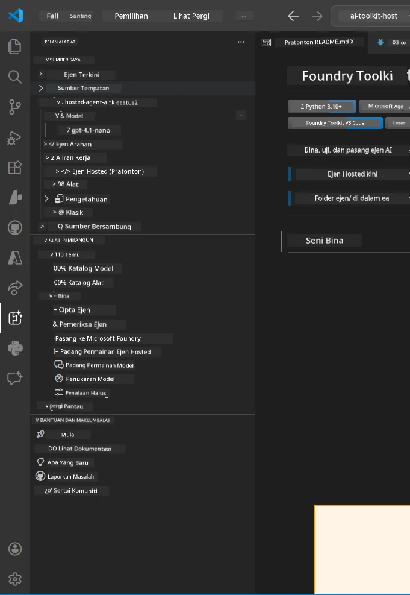
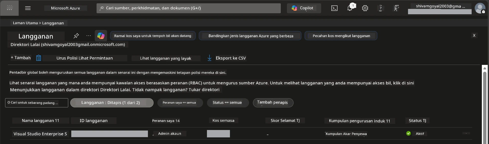
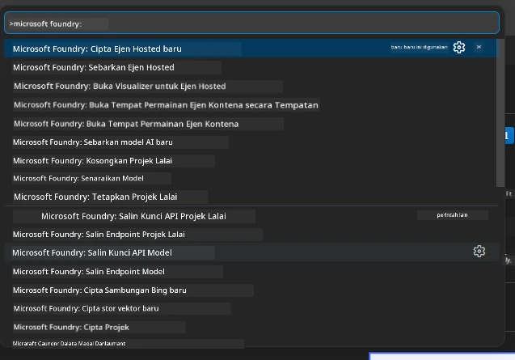
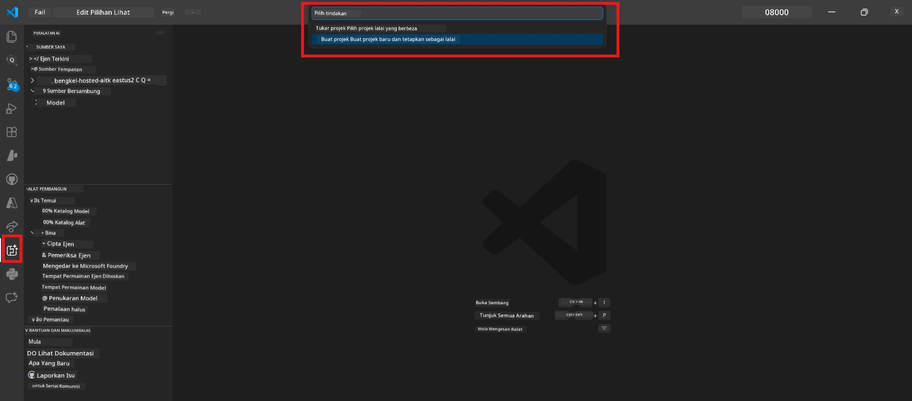
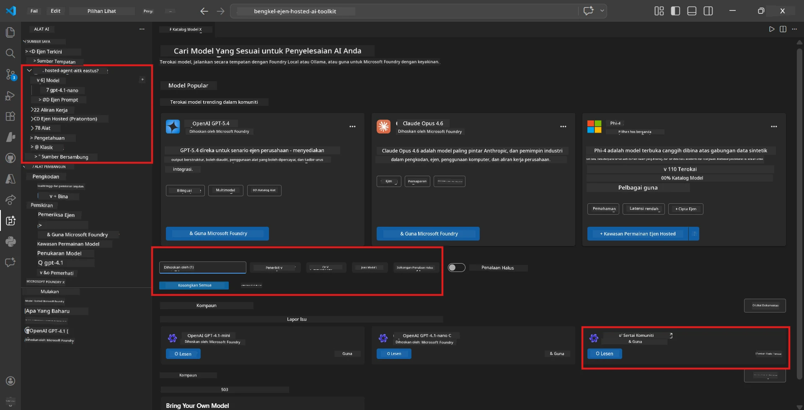
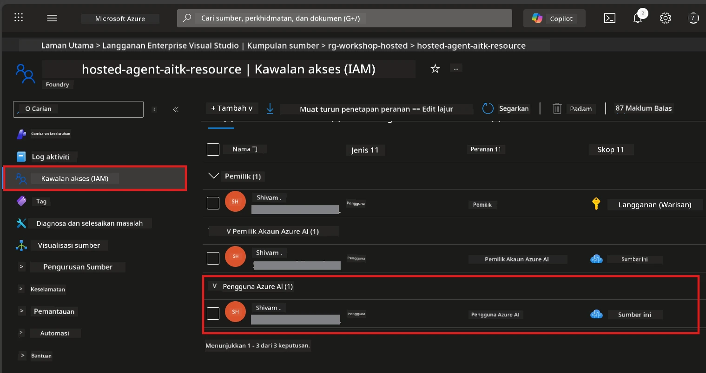

# Persediaan: Sambungan, Projek & Model

⏱️ ~15 minit

Dalam modul ini, anda memasang dan mengesahkan sambungan Foundry Toolkit, mencipta (atau menyambung ke) projek Foundry, dan melaksanakan model yang akan digunakan oleh agen anda.

## Langkah 1: Pasang Foundry Toolkit

**Foundry Toolkit untuk VS Code** adalah sambungan utama untuk bengkel ini. Ia menyediakan penciptaan projek, pelaksanaan model, pembinaan agen, ujian tempatan (Agent Inspector), dan pelaksanaan awan - semua dari VS Code.

1. Buka VS Code kemudian tekan `Ctrl+Shift+X` untuk membuka panel **Sambungan**.
2. Cari **Foundry Toolkit**.
3. Pasang **Foundry Toolkit untuk VS Code** (Penerbit: Microsoft, ID: `ms-windows-ai-studio.windows-ai-studio`).
4. Selepas pemasangan, ikon **Foundry Toolkit** muncul di Bar Aktiviti (bar sisi kiri).

> *Nota: Bar Aktiviti mungkin memaparkan "AI TOOLKIT" dalam versi sambungan yang lebih lama. Fungsinya adalah sama.*



## Langkah 2: Sediakan berdasarkan akses anda

> **Pilih jalan anda:** Kembangkan bahagian di bawah yang sesuai dengan persediaan anda. Anda hanya perlu melengkapkan **satu** jalan.

<details>
<summary><strong>🅰️ Jalan A - Awan Azure (memerlukan langganan Azure)</strong></summary>

### Azure CLI

1. Pasang dari [learn.microsoft.com/cli/azure/install-azure-cli](https://learn.microsoft.com/cli/azure/install-azure-cli).
2. Sahkan: `az --version` (harapkan 2.80.0+).
3. Daftar masuk: `az login`

### Pilihan Pengesahan

[Rangka Kerja Agen Microsoft](https://learn.microsoft.com/agent-framework/overview/) menggunakan [`DefaultAzureCredential`](https://learn.microsoft.com/azure/developer/python/sdk/authentication/credential-chains#defaultazurecredential-overview) yang cuba beberapa kaedah pengesahan secara berturut-turut. Pilih yang sesuai dengan persekitaran anda:

#### Pilihan 1: Akaun VS Code (disyorkan untuk bengkel)
1. Klik ikon **Akaun** (silhouette orang) di sudut kiri bawah VS Code.
2. Pilih **Daftar masuk untuk menggunakan Microsoft Foundry** (atau **Daftar masuk dengan Azure**).
3. Pelayar terbuka - daftar masuk dengan akaun Azure yang mempunyai akses ke langganan anda.
4. Kembali ke VS Code. Anda patut nampak nama akaun anda di sudut kiri bawah.

#### Pilihan 2: Azure CLI
```bash
az login
az account set --subscription "<your-subscription-id>"
```

#### Pilihan 3: Prinsipal Perkhidmatan (Enterprise/CI)
Untuk persekitaran terkunci atau rangka kerja CI/CD, tetapkan pembolehubah persekitaran ini dalam fail `.env` anda:
```env
AZURE_TENANT_ID=<your-tenant-id>
AZURE_CLIENT_ID=<your-client-id>
AZURE_CLIENT_SECRET=<your-client-secret>
```

> **Bagaimana `DefaultAzureCredential` berfungsi:** Ia cuba pembolehubah persekitaran terlebih dahulu, kemudian pengenalan terurus, kemudian daftar masuk VS Code, kemudian Azure CLI - dan menggunakan mana-mana yang berjaya terlebih dahulu. Lihat [dokumen rantai kelayakan](https://learn.microsoft.com/azure/developer/python/sdk/authentication/credential-chains#defaultazurecredential-overview).

### Azure Developer CLI (azd)

1. Pasang: `winget install microsoft.azd` (Windows) atau lihat [dokumen pemasangan](https://learn.microsoft.com/azure/developer/azure-developer-cli/install-azd).
2. Sahkan: `azd version`
3. Daftar masuk: `azd auth login`

### Docker Desktop (pilihan)

Docker hanya diperlukan jika anda mahu membina kontena secara tempatan. Sambungan Foundry mengendalikan binaan secara automatik semasa pelaksanaan.

1. Pasang dari [docs.docker.com/get-docker](https://docs.docker.com/get-docker/).
2. Sahkan: `docker info`

### Langganan Azure & RBAC

1. Daftar masuk di [portal.azure.com](https://portal.azure.com).
2. Pergi ke **Langganan** dan sahkan sekurang-kurangnya satu adalah **Aktif**.
3. Nota **ID Langganan** anda - anda perlukan ini dalam Modul 01.



#### Jadual Senario RBAC

Pelaksanaan [Hosted Agent](https://learn.microsoft.com/azure/foundry/agents/concepts/hosted-agents) memerlukan kebenaran **tindakan data** yang tidak termasuk dalam peranan Azure `Owner` dan `Contributor` biasa. Gunakan jadual di bawah untuk tentukan peranan yang anda perlukan:

| Senario | Peranan diperlukan | Tempat menetapkannya |
|----------|---------------|----------------------|
| Cipta projek Foundry baru | **Azure AI Owner** pada sumber Foundry | Sumber Foundry di Portal Azure |
| Lancarkan ke projek sedia ada (sumber baru) | **Azure AI Owner** + **Contributor** pada langganan | Langganan + sumber Foundry |
| Lancarkan ke projek yang sepenuhnya dikonfigurasikan | **Reader** pada akaun + **Azure AI User** pada projek | Akaun + Projek di Portal Azure |
| Ujian tempatan sahaja (tiada pelaksanaan) | **Azure AI User** pada projek | Projek di Portal Azure |

> **Perkara penting:** Peranan Azure `Owner` dan `Contributor` hanya meliputi kebenaran *pengurusan* (operasi ARM). Anda memerlukan [**Azure AI User**](https://learn.microsoft.com/azure/foundry/concepts/rbac-foundry#built-in-roles) (atau lebih tinggi) untuk *tindakan data* seperti `agents/write` yang diperlukan untuk mencipta dan melaksanakan agen.

## Sambung atau cipta projek Foundry



1. Tekan `Ctrl+Shift+P` → taip **Foundry Toolkit: Create Project** → pilih.
2. Pilih **langganan Azure** anda dari dropdown.
3. Pilih atau cipta **kumpulan sumber** (contoh, `rg-hosted-agents-workshop`).
4. Pilih **rantau** yang menyokong agen dihoskan: `East US`, `West US 2`, atau `Sweden Central`. Lihat [ketersediaan rantau](https://learn.microsoft.com/azure/foundry/agents/concepts/hosted-agents#region-availability).
5. Masukkan nama projek (contoh, `workshop-agents`).
6. Tunggu 2-5 minit untuk penyediaan. Pemberitahuan kemajuan akan muncul di VS Code.
7. Setelah selesai, projek anda muncul di bar sisi **Foundry Toolkit** di bawah **SUMBER SAYA**.



## Laksanakan model & tetapkan RBAC

Agen dihoskan anda memerlukan model AI untuk menjana respons.

#### Matriks Pemilihan Model
Bergantung pada keperluan anda, anda boleh memilih dari tahap model yang berbeza:

| Model | Sesuai untuk | Kos | Nota |
|-------|----------|------|-------|
| `gpt-4.1` | Respons berkualiti tinggi dan berperincian | Tinggi | Keputusan terbaik, disyorkan untuk ujian akhir |
| `gpt-4.1-mini/gpt-5-mini` | Iterasi cepat, kos rendah | Rendah | Sesuai untuk pembangunan bengkel dan ujian pantas |
| `gpt-4.1-nano` | Tugasan ringan | Terendah | Paling jimat kos, tetapi respons lebih mudah |

1. Tekan `Ctrl+Shift+P` → **Foundry Toolkit: Open Model Catalog** (atau klik **Model Catalog** di bar sisi di bawah ALAT PEMBANGUN → Terokai).
2. Cari **gpt-4.1** dalam katalog.
3. Cari **OpenAI GPT-4.1-mini** (atau `gpt-5-mini` untuk kualiti lebih baik) dan klik **Deploy**.



4. Dalam konfigurasi pelaksanaan:
   - **Nama pelaksanaan:** Biarkan lalai atau masukkan nama tersuai. **Ingat nama ini.**
   - **Sasaran:** Pilih **Deploy to Foundry Toolkit** → pilih projek anda.
5. Klik **Deploy** dan tunggu 1–3 minit.

> **Cadangan:** Gunakan `gpt-4.1-mini/gpt-5-mini` untuk bengkel - cepat, mampu milik, dan menghasilkan keputusan baik.

### Catat nilai anda

Selepas pelaksanaan, catat dua nilai ini (anda perlukan dalam Modul 03):

| Nilai | Di mana untuk mencarinya |
|-------|-----------------|
| **Titik hujung projek** | Klik projek anda di bar sisi → paparan terperinci menunjukkan URL (contoh, `https://<account>.services.ai.azure.com/api/projects/<project>`) |
| **Nama pelaksanaan model** | Kembangkan projek → **Models** → nama di sebelah model anda yang dilaksanakan (contoh, `gpt-4.1-mini/gpt-5-mini`) |

### Tetapkan peranan RBAC

> ⚠️ **Ini adalah langkah yang paling sering terlepas.** Tanpa peranan yang betul, pelaksanaan dalam Modul 05 akan gagal.

#### Peranan mana yang saya perlukan?
Bergantung pada senario anda, anda perlukan gabungan peranan berikut:

| Senario | Peranan diperlukan | Tempat menetapkannya |
|----------|---------------|----------------------|
| Cipta projek Foundry baru | **Azure AI Owner** pada sumber Foundry | Sumber Foundry di Portal Azure |
| Lancarkan ke projek sedia ada (sumber baru) | **Azure AI Owner** + **Contributor** pada langganan | Langganan + sumber Foundry |
| Lancarkan ke projek yang sepenuhnya dikonfigurasikan | **Reader** pada akaun + **Azure AI User** pada projek | Akaun + Projek di Portal Azure |

**Perkara penting:** Peranan Azure `Owner` dan `Contributor` hanya meliputi kebenaran *pengurusan*. Anda perlukan **Azure AI User** (atau lebih tinggi) untuk *tindakan data* seperti `agents/write` yang diperlukan untuk mencipta dan melaksanakan agen.

1. Buka [portal.azure.com](https://portal.azure.com).
2. Cari nama **projek Foundry** anda → klik hasil jenis **"Foundry Toolkit project"** (BUKAN akaun induk).
3. Klik **Kawalan akses (IAM)** di navigasi kiri.
4. Klik **+ Tambah** → **Tambah penugasan peranan**.
5. **Tab Peranan:** Cari **Azure AI User**, pilih, klik **Seterusnya**.
6. **Tab Ahli:** Pilih **Pengguna, kumpulan atau prinsipal perkhidmatan** → klik **+ Pilih ahli** → cari dan pilih diri anda → klik **Pilih**.
7. Klik **Semak + tugaskan** → **Semak + tugaskan** sekali lagi.
8. **Tunggu 1–2 minit** untuk penyebaran.

> **Kenapa peranan ini?** Azure `Owner`/`Contributor` hanya memberi kebenaran pengurusan. Peranan **Azure AI User** memberikan tindakan data `agents/write` yang diperlukan untuk mencipta dan melaksanakan agen. Lihat [dokumen RBAC Foundry](https://learn.microsoft.com/azure/foundry/concepts/rbac-foundry#built-in-roles).



</details>

<details>
<summary><strong>🅱️ Jalan B - Lokal / tahap percuma (tidak perlu langganan Azure)</strong></summary>

### Foundry Lokal

Foundry Lokal membolehkan anda menjalankan model AI pada mesin anda sendiri - tiada akaun awan diperlukan. Anda boleh mengakses model Foundry Lokal menggunakan Foundry Toolkit melalui katalog model seperti berikut:

1. Pergi ke sambungan Foundry Toolkit.
2. Dalam navigasi Foundry Toolkit pergi ke **Alat Pembangun** > dan pilih **Katalog Model**
3. Dalam tetingkap baru, pilih **lokal** dari bar navigasi.
4. Skrol ke bawah ke **Phi 4 Mini,** dan klik butang **tambah** sebuah pop up akan muncul menandakan model sedang dimuat turun.
5. Setelah model dimuat turun, anda boleh teruskan ke langkah seterusnya.

</details>

### ✅ Titik semak


- [ ] `Ctrl+Shift+P` → "Foundry Toolkit" menunjukkan perintah yang tersedia
- [ ] Sambungan Foundry Toolkit dipasang dan bar sisi dimuat tanpa ralat
- [ ] VS Code dibuka dan berfungsi dengan betul
- [ ] `python --version` menunjukkan 3.10+
- [ ] Ikon Foundry Toolkit kelihatan di Bar Aktiviti VS Code
- [ ] **Jalan A:** `az login` berjaya, langganan Aktif
- [ ] **Jalan B:** Foundry Lokal berjalan (`foundry local status`)
- [ ] **Jalan A:** Projek Foundry kelihatan di bar sisi, model dilaksanakan, peranan Azure AI User ditetapkan
- [ ] **Jalan B:** Foundry Lokal berjalan dengan model
- [ ] Anda telah mencatat **titik hujung** dan **nama pelaksanaan model** anda


**Sebelum ini:** [00 - Prasyarat](00-prerequisites.md) · **Seterusnya:** [02 - Cipta Agen Di Hoskan →](02-create-hosted-agent.md)

---

<!-- CO-OP TRANSLATOR DISCLAIMER START -->
**Penafian**:
Dokumen ini telah diterjemahkan menggunakan perkhidmatan terjemahan AI [Co-op Translator](https://github.com/Azure/co-op-translator). Walaupun kami berusaha untuk ketepatan, sila ambil maklum bahawa terjemahan automatik mungkin mengandungi kesilapan atau ketidaktepatan. Dokumen asal dalam bahasa asalnya harus dianggap sebagai sumber yang sahih. Untuk maklumat penting, terjemahan oleh manusia profesional adalah disyorkan. Kami tidak bertanggungjawab terhadap sebarang salah faham atau salah tafsir yang timbul daripada penggunaan terjemahan ini.
<!-- CO-OP TRANSLATOR DISCLAIMER END -->