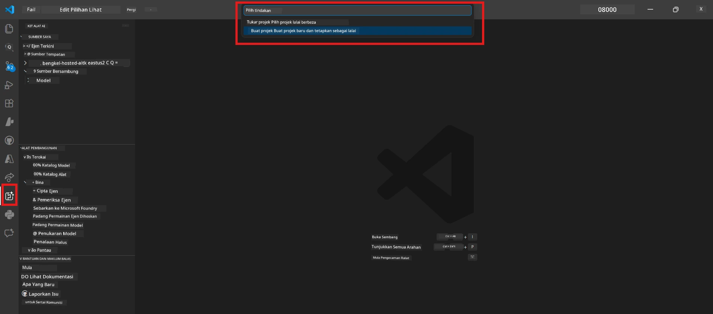
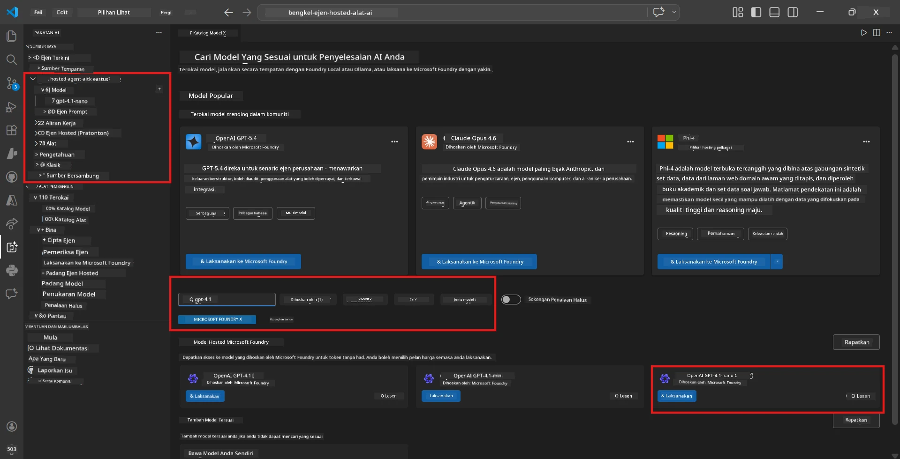
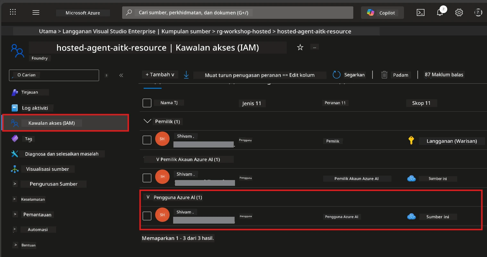

# Modul 2 - Cipta Projek Foundry & Lancarkan Model

Dalam modul ini, anda mencipta (atau memilih) projek Microsoft Foundry dan melancarkan model yang akan digunakan oleh ejen anda. Setiap langkah ditulis dengan terperinci - ikut mengikut urutan.

> Jika anda sudah mempunyai projek Foundry dengan model yang dilancarkan, langkau ke [Modul 3](03-create-hosted-agent.md).

---

## Langkah 1: Cipta projek Foundry dari VS Code

Anda akan menggunakan sambungan Microsoft Foundry untuk mencipta projek tanpa meninggalkan VS Code.

1. Tekan `Ctrl+Shift+P` untuk membuka **Command Palette**.
2. Taip: **Microsoft Foundry: Create Project** dan pilih.
3. Senarai dropdown muncul - pilih **langganan Azure** anda daripada senarai.
4. Anda akan diminta memilih atau mencipta **kumpulan sumber**:
   - Untuk mencipta yang baru: taip nama (contoh, `rg-hosted-agents-workshop`) dan tekan Enter.
   - Untuk menggunakan yang sedia ada: pilih daripadanya dalam dropdown.
5. Pilih **lokasi**. **Penting:** Pilih lokasi yang menyokong ejen dihoskan. Semak [ketersediaan lokasi](https://learn.microsoft.com/azure/foundry/agents/concepts/hosted-agents#region-availability) - pilihan biasa adalah `East US`, `West US 2`, atau `Sweden Central`.
6. Masukkan **nama** bagi projek Foundry (contoh, `workshop-agents`).
7. Tekan Enter dan tunggu sehingga penyediaan selesai.

> **Penyediaan mengambil masa 2-5 minit.** Anda akan melihat pemberitahuan kemajuan di sudut kanan bawah VS Code. Jangan tutup VS Code semasa penyediaan.

8. Apabila selesai, bar sisi **Microsoft Foundry** akan menunjukkan projek baru anda di bawah **Resources**.
9. Klik pada nama projek untuk kembangkan dan sahkan ia menunjukkan bahagian seperti **Models + endpoints** dan **Agents**.



### Alternatif: Cipta melalui Portal Foundry

Jika anda lebih suka menggunakan pelayar:

1. Buka [https://ai.azure.com](https://ai.azure.com) dan log masuk.
2. Klik **Create project** di halaman utama.
3. Masukkan nama projek, pilih langganan, kumpulan sumber, dan lokasi.
4. Klik **Create** dan tunggu penyediaan.
5. Setelah dibuat, kembali ke VS Code - projek sepatutnya muncul dalam bar sisi Foundry selepas segar semula (klik ikon segar).

---

## Langkah 2: Lancarkan model

[Host ejen](https://learn.microsoft.com/azure/foundry/agents/concepts/hosted-agents) anda memerlukan model Azure OpenAI untuk menjana tindak balas. Anda akan [melancarkan satu sekarang](https://learn.microsoft.com/azure/ai-foundry/openai/how-to/create-resource#deploy-a-model).

1. Tekan `Ctrl+Shift+P` untuk membuka **Command Palette**.
2. Taip: **Microsoft Foundry: Open [Model Catalog](https://learn.microsoft.com/azure/ai-foundry/openai/concepts/models)** dan pilih.
3. Paparan Model Catalog dibuka dalam VS Code. Layari atau gunakan bar carian untuk mencari **gpt-4.1**.
4. Klik pada kad model **gpt-4.1** (atau `gpt-4.1-mini` jika anda lebih suka kos lebih rendah).
5. Klik **Deploy**.

  
6. Dalam konfigurasi pelancaran:
   - **Deployment name**: Biarkan yang lalai (contoh, `gpt-4.1`) atau masukkan nama tersendiri. **Ingat nama ini** - anda akan memerlukannya dalam Modul 4.
   - **Target**: Pilih **Deploy to Microsoft Foundry** dan pilih projek yang baru anda cipta.
7. Klik **Deploy** dan tunggu sehingga pelancaran selesai (1-3 minit).

### Memilih model

| Model | Terbaik untuk | Kos | Nota |
|-------|---------------|-----|-------|
| `gpt-4.1` | Tindak balas berkualiti tinggi, bernuansa | Lebih tinggi | Keputusan terbaik, disyorkan untuk ujian akhir |
| `gpt-4.1-mini` | Iterasi pantas, kos lebih rendah | Lebih rendah | Baik untuk pembangunan bengkel dan ujian cepat |
| `gpt-4.1-nano` | Tugasan ringan | Paling rendah | Kos paling efektif tetapi tindak balas lebih ringkas |

> **Cadangan untuk bengkel ini:** Gunakan `gpt-4.1-mini` untuk pembangunan dan ujian. Ia pantas, murah, dan menghasilkan keputusan yang baik untuk latihan.

### Sahkan pelancaran model

1. Dalam bar sisi **Microsoft Foundry**, kembangkan projek anda.
2. Lihat di bawah **Models + endpoints** (atau bahagian serupa).
3. Anda sepatutnya melihat model yang anda lancarkan (contoh, `gpt-4.1-mini`) dengan status **Succeeded** atau **Active**.
4. Klik pada pelancaran model untuk melihat butiran.
5. **Catat** dua nilai ini - anda akan memerlukannya dalam Modul 4:

   | Tetapan | Di mana untuk cari | Contoh nilai |
   |---------|--------------------|--------------|
   | **Project endpoint** | Klik pada nama projek di bar sisi Foundry. URL endpoint dipaparkan dalam pandangan butiran. | `https://<account>.services.ai.azure.com/api/projects/<project>` |
   | **Model deployment name** | Nama yang dipaparkan di sebelah model yang dilancarkan. | `gpt-4.1-mini` |

---

## Langkah 3: Tetapkan peranan RBAC yang diperlukan

Ini adalah **langkah yang paling kerap terlepas**. Tanpa peranan yang betul, pelancaran dalam Modul 6 akan gagal dengan ralat kebenaran.

### 3.1 Tetapkan peranan Azure AI User kepada diri anda

1. Buka pelayar dan lawati [https://portal.azure.com](https://portal.azure.com).
2. Dalam bar carian atas, taip nama **projek Foundry** anda dan klik padanya dalam keputusan pencarian.
   - **Penting:** Navigasi ke sumber **projek** (jenis: "Microsoft Foundry project"), **bukan** akaun induk sumber/hub.
3. Di navigasi kiri projek, klik **Access control (IAM)**.
4. Klik butang **+ Add** di atas → pilih **Add role assignment**.
5. Dalam tab **Role**, cari [**Azure AI User**](https://learn.microsoft.com/azure/foundry/concepts/rbac-foundry#built-in-roles) dan pilih. Klik **Next**.
6. Dalam tab **Members**:
   - Pilih **User, group, or service principal**.
   - Klik **+ Select members**.
   - Cari nama atau emel anda, pilih diri anda, dan klik **Select**.
7. Klik **Review + assign** → kemudian klik sekali lagi untuk sahkan.



### 3.2 (Pilihan) Tetapkan peranan Azure AI Developer

Jika anda perlu mencipta sumber tambahan dalam projek atau mengurus pelancaran secara programatik:

1. Ulang langkah di atas, tetapi pada langkah 5 pilih **Azure AI Developer** sebaliknya.
2. Tetapkan ini pada peringkat **Foundry resource (akaun)**, bukan hanya peringkat projek.

### 3.3 Sahkan penetapan peranan anda

1. Pada halaman **Access control (IAM)** projek, klik tab **Role assignments**.
2. Cari nama anda.
3. Anda harus melihat sekurang-kurangnya **Azure AI User** disenaraikan untuk skop projek.

> **Kenapa ini penting:** Peranan [`Azure AI User`](https://learn.microsoft.com/azure/foundry/concepts/rbac-foundry#built-in-roles) memberikan tindakan data `Microsoft.CognitiveServices/accounts/AIServices/agents/write`. Tanpanya, anda akan melihat ralat ini semasa pelancaran:
>
> ```
> Error: lacks the required data action 
> Microsoft.CognitiveServices/accounts/AIServices/agents/write 
> to perform POST /api/projects/{projectName}/assistants operation.
> ```
>
> Lihat [Modul 8 - Penyelesaian Masalah](08-troubleshooting.md) untuk maklumat lanjut.

---

### Titik Semak

- [ ] Projek Foundry wujud dan boleh dilihat dalam bar sisi Microsoft Foundry di VS Code
- [ ] Sekurang-kurangnya satu model dilancarkan (contoh, `gpt-4.1-mini`) dengan status **Succeeded**
- [ ] Anda mencatat URL **project endpoint** dan **model deployment name**
- [ ] Anda mempunyai peranan **Azure AI User** yang ditetapkan pada peringkat **projek** (sahkan dalam Azure Portal → IAM → Role assignments)
- [ ] Projek berada dalam [lokasi disokong](https://learn.microsoft.com/azure/foundry/agents/concepts/hosted-agents#region-availability) untuk ejen dihoskan

---

**Sebelum ini:** [01 - Pasang Foundry Toolkit](01-install-foundry-toolkit.md) · **Seterusnya:** [03 - Cipta Ejen DiHoskan →](03-create-hosted-agent.md)

---

<!-- CO-OP TRANSLATOR DISCLAIMER START -->
**Penafian**:  
Dokumen ini telah diterjemahkan menggunakan perkhidmatan penterjemahan AI [Co-op Translator](https://github.com/Azure/co-op-translator). Walaupun kami berusaha untuk ketepatan, sila ambil maklum bahawa terjemahan automatik mungkin mengandungi kesilapan atau ketidaktepatan. Dokumen asal dalam bahasa asalnya harus dianggap sebagai sumber yang sahih. Untuk maklumat penting, penterjemahan profesional oleh manusia adalah disyorkan. Kami tidak bertanggungjawab terhadap sebarang salah faham atau salah tafsir yang timbul daripada penggunaan terjemahan ini.
<!-- CO-OP TRANSLATOR DISCLAIMER END -->